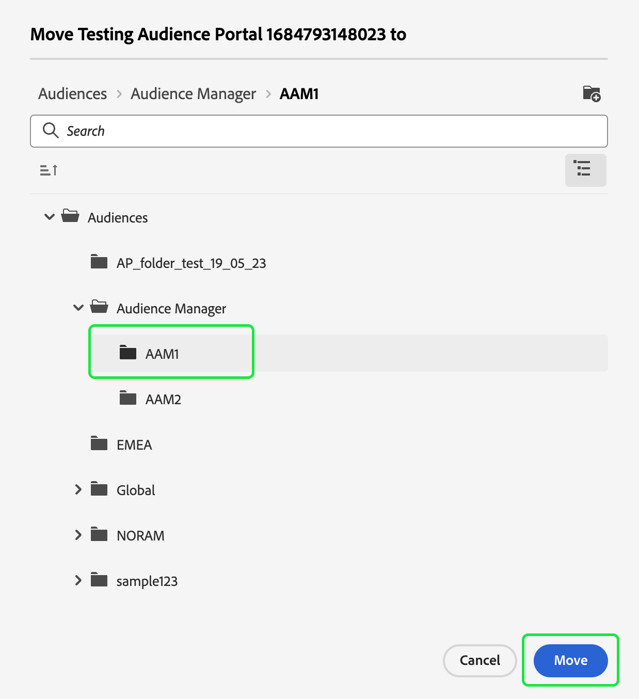
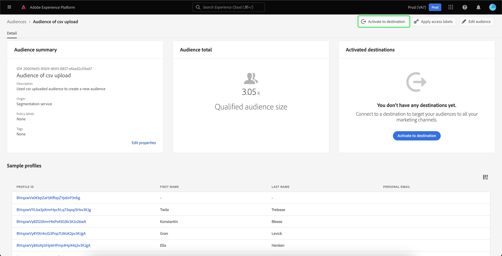

# Audience Portal概述

Audience Portal是Adobe Experience Platform的中央樞紐，可讓您檢視、管理和建立對象。

在Audience Portal中，您可以完成下列工作：

- [檢視對象清單](#audience-list)
   - [對您的對象使用快速動作](#quick-actions)
   - [自訂對象清單中顯示的屬性](#customize)
   - [使用篩選器、資料夾和標籤來組織您的對象](#manage-audiences)
- [檢視有關您對象的詳細資料](#audience-details)
   - [檢視對象的相關摘要](#audience-summary)
- [啟用您的對象以進行排程分段](#scheduled-segmentation)
- [建立對象](#create-audience)
   - [使用區段產生器建立受眾](#segment-builder)
   - [使用對象構成來建立對象](#audience-composition)
- [匯入外部產生的對象](#import-audience)

若要開啟對象入口網站，請選取 **[!UICONTROL 瀏覽]** 區段區段中的標籤。

## 對象清單 {#list}

>[!CONTEXTUALHELP]
>id="platform_segments_browse_churncolumnname"
>title="流失"
>abstract="流失代表和上次執行區段作業時相比，對象內正在變更的設定檔的百分比。"

>[!CONTEXTUALHELP]
>id="platform_segments_browse_evaluationmethodcolumnname"
>title="評估方式"
>abstract="對象的評估方式包括批次、串流和邊緣。"

依預設，Audience Portal會顯示您的組織和沙箱中所有對象的清單，包括設定檔計數、來源、建立日期、上次修改日期、標籤和劃分。

### 快速動作 {#quick-actions}

每個對象旁都會顯示一個省略符號圖示。 選取此專案會顯示對象可用的快速動作清單。 此動作清單會因對象來源而異。

![系統會針對來源為的對象，顯示快速動作清單 [!UICONTROL 對象構成].](../images/ui/audience-portal/browse-audience-composition-details.png)

| 動作 | 來源 | 說明 |
| ------ | ------- | ----------- |
| [!UICONTROL 編輯] | Segmentation Service | 開啟區段產生器以編輯您的對象。 請注意，如果您的對象是透過API建立的，則您會 **非** 能夠使用區段產生器加以編輯。 如需使用「區段產生器」的詳細資訊，請參閱 [區段產生器UI指南](./segment-builder.md). |
| [!UICONTROL 開啟構成] | 對象構成 | 開啟「對象」構成來檢視對象。 如需對象構成的詳細資訊，請參閱 [對象構成UI指南](./audience-composition.md). |
| [!UICONTROL 啟用到目的地] | Segmentation Service | 將對象啟用至目的地。 如需將受眾啟用至目的地的詳細資訊，請參閱 [啟用概述](../../destinations/ui/activation-overview.md). |
| [!UICONTROL 與合作夥伴分享] | 對象構成、自訂上傳、細分服務 | 與其他Platform使用者共用您的對象。 如需有關此功能的詳細資訊，請參閱 [區段比對概觀](./segment-match/overview.md). |
| [!UICONTROL 管理標籤] | 對象構成、自訂上傳、細分服務 | 管理屬於對象的使用者定義標籤。 如需有關此功能的詳細資訊，請參閱以下章節： [篩選和標籤](#manage-audiences). |
| [!UICONTROL 移至資料夾] | 對象構成、自訂上傳、細分服務 | 管理對象所屬的資料夾。 如需有關此功能的詳細資訊，請參閱以下章節： [篩選和標籤](#manage-audiences). |
| [!UICONTROL 複製] | Segmentation Service | 複製選取的對象。 有關此函式的詳細資訊，請參閱 [區段常見問題集](../faq.md#copy). |
| [!UICONTROL 套用存取權標籤] | 對象構成、自訂上傳、細分服務 | 管理屬於對象的存取標籤。 如需存取標籤的詳細資訊，請參閱以下檔案： [管理標籤](../../access-control/abac/ui/labels.md). |
| [!UICONTROL Publish] | 自訂上傳，分段服務 | 發佈選取的對象。 如需有關生命週期狀態管理的詳細資訊，請參閱 [區段常見問答集的生命週期狀態區段](../faq.md#lifecycle-states). |
| [!UICONTROL 停用] | 自訂上傳，分段服務 | 停用選取的對象。 如需有關生命週期狀態管理的詳細資訊，請參閱 [區段常見問答集的生命週期狀態區段](../faq.md#lifecycle-states). |
| [!UICONTROL 刪除] | 對象構成、自訂上傳、細分服務 | 刪除選取的對象。 用於下游目的地或為其他對象相依對象的對象 **無法** 都會被刪除。 如需有關刪除對象的詳細資訊，請參閱 [區段常見問題集](../faq.md#lifecycle-states). |
| [!UICONTROL 新增到封裝] | 對象構成、自訂上傳、細分服務 | 在沙箱之間移動對象。 如需有關此功能的詳細資訊，請參閱 [沙箱工具手冊](../../sandboxes/ui/sandbox-tooling.md). |

>[!IMPORTANT]
>
>在刪除您的對象之前，請確定對象為 **非** 在以帳戶為基礎的對象中作為元件使用，或在Adobe Journey Optimizer中使用。

頁面頂端有選項，可新增所有對象至排程、匯入對象、建立新對象和檢視對象評估的摘要。

切換 **[!UICONTROL 排程所有對象]** 將啟用排程分段。 有關已排程分段的詳細資訊，請參閱 [本使用手冊的已排程分段區段](#scheduled-segmentation).

選取 **[!UICONTROL 匯入對象]** 可讓您匯入外部產生的對象。 若要深入瞭解如何匯入對象，請參閱本節： [在使用手冊中匯入對象](#import-audience).

選取 **[!UICONTROL 建立對象]** 可讓您建立對象。 若要深入瞭解如何建立對象，請閱讀以下章節： [在使用手冊中建立對象](#create-audience).

您可以選取 **[!UICONTROL 評估摘要]** 顯示圓形圖，其中顯示對象評估的摘要。

圓形圖會出現，依對象評估顯示對象劃分。 圖表在中間顯示對象總數，在底部顯示UTC格式的每日批次評估時間。 如果您將滑鼠游標停留在對象的不同部分，它會顯示屬於每個更新頻率型別的對象數量。

### 自訂 {#customize}

您可以選取「 」，將其他欄位新增至Audience Portal . 這些額外的欄位包含生命週期狀態、更新頻率、上次更新者、說明、建立者和存取標籤。

| 欄位 | 說明 |
| ----- | ----------- |
| [!UICONTROL 名稱] | 對象名稱。 |
| [!UICONTROL 設定檔計數] | 符合對象資格的設定檔總數。 |
| [!UICONTROL Origin] | 對象的來源。 這會指出受眾的來源。 可能的值包括細分服務、自訂上傳、對象構成和Audience Manager。 |
| [!UICONTROL 生命週期狀態] | 對象的狀態。 此欄位可能的值包括 `Draft`， `Inactive`、和 `Published`. 有關生命週期狀態的詳細資訊，包括不同狀態的含義以及如何將受眾移動到不同生命週期狀態，請參閱 [區段常見問答集的生命週期狀態區段](../faq.md#lifecycle-status). |
| [!UICONTROL 更新頻率] | 指出對象資料更新頻率的值。 此欄位可能的值包括 [!UICONTROL 批次]， [!UICONTROL 串流]， [!UICONTROL Edge]、和 [!UICONTROL 未排程]. |
| [!UICONTROL 上次更新者] | 上次更新對象的人員名稱。 |
| [!UICONTROL 已建立] | 建立對象的日期和時間(UTC)。 |
| [!UICONTROL 上次更新時間] | 上次更新對象的日期和時間(UTC)。 |
| [!UICONTROL 標記] | 屬於對象的使用者定義標籤。 有關這些標籤的更多資訊可在以下連結中找到： [標籤區段](#tags). |
| [!UICONTROL 說明] | 對象的說明。 |
| [!UICONTROL 建立者] | 建立對象的人員名稱。 |
| [!UICONTROL 存取標籤] | 對象的存取權標籤。 存取標籤可讓您根據套用至該資料的使用原則來分類資料集和欄位。 這些標籤可隨時套用，提供您選擇控管資料方式的靈活性。 如需存取標籤的詳細資訊，請參閱以下檔案： [管理標籤](../../access-control/abac/ui/labels.md). |
| [!UICONTROL 劃分] | 對象的設定檔狀態劃分。 此設定檔狀態劃分的更詳細說明可在下方找到。 |

如果選取劃分，畫面會顯示長條圖，概述屬於下列每個已計算設定檔狀態的設定檔百分比： [!UICONTROL 已實現]， [!UICONTROL 現有]、和 [!UICONTROL 正在退出]. 此外，此劃分會顯示在 [!UICONTROL 瀏覽] 索引標籤是區段定義狀態最精確的劃分。 如果此數字與 [!UICONTROL 概觀] 標籤上，您應該使用編號 [!UICONTROL 瀏覽] 標籤作為正確的資訊來源，因為 [!UICONTROL 概觀] 索引標籤編號每天只會更新一次。

| 狀態 | 說明 |
| ------ | ----------- |
| [!UICONTROL 已實現] | 符合以下條件的設定檔計數： **合格** 用於自上次批次區段作業執行後過去24小時內的區段。 |
| [!UICONTROL 現有] | 設定檔計數，其中 **剩餘** 區段中上次執行批次區段作業以來的24小時內。 |
| [!UICONTROL 正在退出] | 設定檔計數，其中 **已退出** 自上次執行批次區段作業以來的最後24小時內的區段。 |

選取要顯示的欄位後，您也可以重新調整顯示欄的寬度。 您可以拖曳欄之間的區域或選取  要重新調整大小的欄位中，後面接著 **[!UICONTROL 調整欄大小]**.

### 篩選、資料夾和標籤 {#manage-audiences}

若要改善您的工作效率，您可以搜尋現有對象、將使用者定義的標籤新增至對象、將對象放入資料夾，以及篩選顯示的對象。

#### 搜尋 {#search}

您可以使用搜尋最多9種不同語言的現有對象 [!DNL Unified Search].

使用 [!DNL Unified Search]，在反白顯示的搜尋列中新增您要搜尋的詞語。

有關詳細資訊 [!DNL Unified Search]，包括支援的功能，請參閱 [整合式搜尋檔案](https://experienceleague.adobe.com/docs/core-services/interface/services/search-experience-cloud.html).

#### 標記 {#tags}

您可以新增使用者定義的標籤，以更好地說明、尋找和管理您的對象。

若要新增標籤，請選取「 」 **[!UICONTROL 管理標籤]** 標籤對象。

![此 [!UICONTROL 管理標籤] 已針對指定的對象選取按鈕。](../images/ui/audience-portal/browse-manage-tags.png)

此 **[!UICONTROL 管理標籤]** 彈出視窗會出現。 在此彈出視窗中，您可以選取已分類標籤或未分類標籤。

| 標籤型別 | 說明 |
| -------- | ----------- |
| 已分類 | 由貴組織管理員建立及管理的標籤。 |
| 未分類 | 在中建立的標籤 [!UICONTROL 管理標籤] 彈出視窗。 任何人都能建立或管理這些型別的標籤。 |

![此 [!UICONTROL 管理標籤] 彈出視窗。 選擇已分類或未分類的選項會反白顯示。](../images/ui/audience-portal/create-tag.png)

新增您要附加至對象的所有標籤後，選取 **[!UICONTROL 儲存]**.

![在 [!UICONTROL 管理標籤] 彈出視窗，新增的標籤會醒目提示。](../images/ui/audience-portal/created-tags.png)

如需建立和管理標籤的詳細資訊，請參閱 [管理標籤指南](../../administrative-tags/ui/managing-tags.md).

#### 資料夾 {#folders}

您可以將對象放入資料夾中，以改善對象管理。

若要將對象移至資料夾，請選取「 」 **[!UICONTROL 移至資料夾]** 在您想要移動的對象上。

![此 [!UICONTROL 移至資料夾] 按鈕已針對特定對象選取。](../images/ui/audience-portal/browse-move-to-folder.png)

此 **將對象移至資料夾** 彈出視窗會出現。 選取您要移動對象的資料夾，然後選取「 」 **[!UICONTROL 儲存]**.

對象位於資料夾中後，您可以選擇僅顯示屬於特定資料夾的對象。

#### 篩選器 {#filter}

您也可以根據各種設定來篩選對象。

若要篩選可用的對象，請選取 .

將顯示可用篩選器清單。

| 篩選器 | 說明 |
| ------ | ----------- |
| [!UICONTROL Origin] | 可讓您根據對象來源進行篩選。 可用選項包括細分服務、自訂上傳、對象構成和Audience Manager。 |
| [!UICONTROL 具有任何標籤] | 可讓您依標籤篩選。 您可以選取 **[!UICONTROL 具有任何標籤]** 和 **[!UICONTROL 具有所有標籤]**. 時間 **[!UICONTROL 具有任何標籤]** 已選取，則已篩選的對象將包括 **任何** 已新增標籤的URL數量。 時間 **[!UICONTROL 具有所有標籤]** 已選取，則篩選的對象必須包括 **全部** 已新增標籤的URL數量。 |
| [!UICONTROL 生命週期狀態] | 可讓您根據對象的生命週期狀態進行篩選。 可用的選項包括 [!UICONTROL 已刪除]， [!UICONTROL 草稿]， [!UICONTROL 非使用中]、和 [!UICONTROL 已發佈]. |
| [!UICONTROL 更新頻率] | 可讓您根據對象的更新頻率（評估方法）進行篩選。 可用的選項包括 [!UICONTROL 已排程]， [!UICONTROL 連續]、和 [!UICONTROL 隨選]. |
| [!UICONTROL 建立者] | 可讓您根據建立受眾的人員進行篩選。 |
| [!UICONTROL 建立日期] | 可讓您根據對象的建立日期進行篩選。 您可以選取日期範圍，以篩選建立對象的時間。 |
| [!UICONTROL 修改日期] | 可讓您根據對象的上次修改日期進行篩選。 您可以選擇日期範圍，以篩選上次修改對象的時間。 |

#### 大量動作 {#bulk-actions}

此外，您最多可以選取25個不同的對象，並對這些對象執行各種動作。 這些動作包括 [移至資料夾](#folders)， [編輯或套用標籤](#tags)， [套用存取權標籤](../../access-control/abac/ui/labels.md)、和 [刪除](#browse).

將大量動作套用至這些對象時，將會套用下列條件：

- 您 **可以** 從不同頁面選取對象。
- 您 **無法** 刪除用於目的地啟用的對象。
- 如果您選取篩選器，則所選的對象 **將** 重設。

## 客群詳細資料 {#audience-details}

若要檢視特定對象的詳細資訊，請在 **[!UICONTROL 瀏覽]** 標籤。

對象詳細資訊頁面隨即顯示。 頂端則有對象摘要、合格對象人數的相關資訊，以及區段啟用的目的地。

### 客群摘要 {#audience-summary}

此 **[!UICONTROL 對象摘要]** 區段提供屬性的ID、名稱、說明、來源和詳細資訊等資訊。

此外，您可以選擇將對象啟用至目的地、套用存取權標籤或編輯/更新對象。

選取 **[!UICONTROL 啟用到目的地]** 可讓您將對象啟用至目的地。 如需將受眾啟用至目的地的詳細資訊，請參閱 [啟用概述](../../destinations/ui/activation-overview.md).

選取 **[!UICONTROL 套用存取權標籤]** 可讓您管理屬於對象的存取標籤。 如需存取標籤的詳細資訊，請參閱以下檔案： [管理標籤](../../access-control/abac/ui/labels.md).

>[!BEGINTABS]

>[!TAB 對象構成]

![畫面會顯示對象詳細資訊頁面，其中包含 [!UICONTROL 開啟構成] 按鈕反白顯示。](../images/ui/audience-portal/audience-details-open-composition.png)

選取 **[!UICONTROL 開啟構成]** 可讓您在「對象構成」中檢視對象。 如需對象構成的詳細資訊，請參閱 [對象構成UI指南](./audience-composition.md).

>[!TAB 自訂上傳]

![畫面會顯示對象詳細資訊頁面，其中包含 [!UICONTROL 更新對象] 按鈕反白顯示。](../images/ui/audience-portal/audience-details-update-audience.png)

選取 **[!UICONTROL 更新對象]** 可讓您重新上傳外部產生的對象。 如需匯入外部產生對象的詳細資訊，請參閱以下章節： [匯入對象](#import-audience).

>[!TAB 劃分服務]

![畫面會顯示對象詳細資訊頁面，其中包含 [!UICONTROL 編輯對象] 按鈕反白顯示。](../images/ui/audience-portal/audience-details-edit-audience.png)

選取 **[!UICONTROL 編輯對象]** 可讓您在「區段產生器」中編輯對象。 如需有關使用的詳細資訊 [!DNL Segment Builder] 工作區，請閱讀 [[!DNL Segment Builder] 使用手冊](./segment-builder.md).

>[!ENDTABS]

選取 **[!UICONTROL 編輯屬性]** 可讓您編輯對象的基本詳細資訊，例如名稱、說明和標籤。

### 客群總計 {#audience-total}

此 **[!UICONTROL 對象總數]** 區段顯示符合對象資格的設定檔總數。

預估值是透過使用當天樣本資料的樣本大小所產生。 如果您的設定檔存放區中有少於100萬個實體，則會使用完整的資料集；對於100萬到2,000萬個之間的實體，會使用100萬個實體；而對於2,000萬個以上的實體，則會使用全部實體的5%。 如需有關產生預估的詳細資訊，請參閱 [預估產生區段](../tutorials/create-a-segment.md#estimate-and-preview-an-audience) 對象建立教學課程的。

### 已啟用的目的地 {#activated-destinations}

此 **[!UICONTROL 已啟用的目的地]** 區段會顯示此對象啟用的目的地。

>[!NOTE]
>
> 目的地功能適用於 [!DNL Adobe Real-Time Customer Data Platform]，並可讓您將資料匯出至外部平台。 如需有關目的地的詳細資訊，請參閱 [目的地概觀](../../destinations/home.md). 若要瞭解如何對目的地啟用區段，請參閱 [啟用概述](../../destinations/ui/activation-overview.md).

### 設定檔範例 {#profile-samples}

底下是符合區段資格的設定檔樣本，詳細說明包含 [!DNL Profile] ID、名字、姓氏和個人電子郵件。

資料取樣觸發的方式取決於擷取方法。

對於批次擷取，設定檔存放區每15分鐘自動掃描一次，以檢視自上次取樣工作執行以來，是否成功擷取新的批次。 如果是這種情況，隨後會掃描設定檔存放區，以檢視記錄數量是否有至少5%的變更。 如果符合這些條件，則會觸發新的取樣工作。

對於串流擷取，每小時會自動掃描設定檔存放區，以檢視記錄數量是否有至少5%的變更。 如果符合此條件，則會觸發新的取樣工作。

掃描的樣本大小取決於設定檔存放區中的實體總數。 下表顯示這些範例大小：

| 設定檔存放區中的實體 | 抽樣大小 |
| ------------------------- | ----------- |
| 少於100萬 | 完整資料集 |
| 100萬到2000萬 | 100萬 |
| 超過2000萬 | 總數的5% |

有關每個報表套裝的更多詳細資訊 [!DNL Profile] 可透過選擇 [!DNL Profile] ID。 若要深入瞭解設定檔的詳細資訊，請參閱 [[!DNL Real-Time Customer Profile] 使用手冊](../../profile/ui/user-guide.md#profile-detail).

## 已排程的分段 {#scheduled-segmentation}

>[!CONTEXTUALHELP]
>id="platform_segments_browse_addallsegmentstoschedule"
>title="將所有對象新增到排程"
>abstract="啟用以在每日排程更新中包含所有使用批次分段評估的對象。停用以從排程更新中移除所有對象。"

建立對象後，您就可以透過隨選或排程（持續）評估來評估對象。 評估表示移動 [!DNL Real-Time Customer Profile] 資料區段作業，以產生對應的對象。 建立對象後，會儲存並儲存對象，以便使用將其匯出 [!DNL Experience Platform] API。

隨選評估包括使用API來執行評估並視需要建立對象，而排程評估（也稱為「排程分段」）可讓您建立循環排程，以便在特定時間（最多，每天一次）評估對象。

### 啟用排程分段 {#enable-scheduled-segmentation}

使用UI或API可啟用對象以進行排程評估。 在UI中，返回 **[!UICONTROL 瀏覽]** 定位於 **[!UICONTROL 受眾]** 並開啟 **[!UICONTROL 排程所有對象]**. 這會導致根據您的組織設定的排程評估所有對象。

>[!NOTE]
>
>對於最多有五(5)個合併原則的沙箱，可啟用排定的評估。 [!DNL XDM Individual Profile]. 如果貴組織擁有五個以上的合併原則 [!DNL XDM Individual Profile] 在單一沙箱環境中，您將無法使用排程的評估。

目前只能使用API建立排程。 如需使用API建立、編輯及使用排程的詳細步驟，請依照教學課程中的指示評估和存取分段結果，尤其是 [使用API排程的評估](../tutorials/evaluate-a-segment.md#scheduled-evaluation).

## 建立對象 {#create-audience}

您可以選取 **[!UICONTROL 建立對象]** 以建立對象。

此時畫面會顯示彈出視窗，讓您在構成對象或建立規則之間做出選擇。

### 對象構成 {#audience-composition}

選取 **[!UICONTROL 撰寫對象]** 帶您前往「對象構成」。 此工作區提供直覺式控制項，可讓您建立和編輯對象，例如用來代表不同動作的拖放圖磚。 若要深入瞭解如何建立對象，請參閱 [對象組合指南](./audience-composition.md).

### 區段產生器 {#segment-builder}

選取 **[!UICONTROL 建置規則]** 系統會將您導向「區段產生器」。 此工作區提供直覺式控制項來建置和編輯區段定義，例如用來表示資料屬性的拖放圖磚。 若要深入瞭解如何建立區段定義，請參閱 [區段產生器指南](./segment-builder.md)

## 匯入對象 {#import-audience}

>[!IMPORTANT]
>
>若要匯入外部產生的對象，您可以 **必須** 擁有下列許可權： [!UICONTROL 檢視區段]， [!UICONTROL 管理區段]、和 [!UICONTROL 匯入對象]. 如需這些許可權的詳細資訊，請參閱 [存取控制總覽](../../access-control/home.md#permissions).

您可以選取 **[!UICONTROL 匯入對象]** 匯入外部產生的對象。

此 **[!UICONTROL 匯入對象CSV]** 工作流程隨即顯示。 您可以選取要匯入為外部產生對象的CSV檔案。

![在 [!UICONTROL 匯入對象CSV] 工作流程， [!UICONTROL 拖放檔案] 方塊會反白顯示，顯示您可在何處上傳外部產生的對象。](../images/ui/audience-portal/import-audience-csv.png)

>[!NOTE]
>
>外部產生的對象 **必須** 為CSV格式，並擁有 **最大** 共25欄，且小於1GB。

選取要匯入的CSV檔案後，將顯示此外部產生對象的範例資料清單。 確認範例資料正確後，選取「 」 **[!UICONTROL 下一個]**.

此 **[!UICONTROL 對象詳細資料]** 頁面便會顯示。 您可以新增對象的相關資訊，包括其名稱、說明、主要身分和身分名稱空間值。

匯入外部產生的對象時，您必須選取其中一個欄位作為主要身分欄位，並指定名稱空間值。 請注意，其餘所有欄位都將列入考量 **裝載屬性**. 這些屬性會被視為 **非耐用**，因為它們只會為了個人化目的與此對象相關聯，而且 **非** 已連線至設定檔。

![此 [!UICONTROL 對象詳細資料] 頁面隨即顯示。](../images/ui/audience-portal/import-audience-audience-details.png)

您也可以選擇向外部產生的對象新增一些額外詳細資訊，包括提供ID、定義其合併原則或編輯其欄資料型別。

>[!NOTE]
>
>如果您使用自訂外部對象ID，則必須遵循下列准則：
>
> - It **必須** 以字母（a-z或A-Z）、底線(_)或美元符號($)開頭。
> - 所有後續字元都可由英數字元(a-z、A-Z、0-9)、底線(_)或美元符號($)組成。

填寫對象詳細資料後，選擇 **[!UICONTROL 下一個]**.

![此 [!UICONTROL 下一個] 按鈕上會醒目提示 [!UICONTROL 對象詳細資料] 頁面。](../images/ui/audience-portal/import-audience-filled-details.png)

此 **[!UICONTROL 檢閱]** 頁面隨即顯示。 您可以檢閱新匯入的外部產生對象的詳細資料。

![此 [!UICONTROL 檢閱] 頁面隨即顯示，顯示您新匯入外部產生對象的詳細資料。](../images/ui/audience-portal/import-audience-review-details.png)

確認詳細資料正確後，選取「 」 **[!UICONTROL 完成]** 將外部產生的對象匯入Adobe Experience Platform。

>[!IMPORTANT]
>
>依預設，外部產生的對象資料的有效期限為30天。 如果以任何方式更新或修改對象，則會重設資料有效期。
>
>此外，如果您的外部產生的對象包含敏感及/或健康相關資訊，您可以 **必須** 將資料啟用至任何目的地之前，請先套用必要的資料使用標籤。 如需套用資料使用標籤的詳細資訊，請參閱以下檔案： [管理標籤](../../access-control/abac/ui/labels.md).

## 後續步驟

閱讀本概述後，您應該能夠使用對象入口網站，有效管理、建立對象並將對象匯入Adobe Experience Platform。

如需使用Segmentation Service UI的詳細資訊，請參閱 [Segmentation Service UI概述](./overview.md).

若要瞭解有關Audience Portal的常見問題，請閱讀 [常見問題集](../faq.md).
