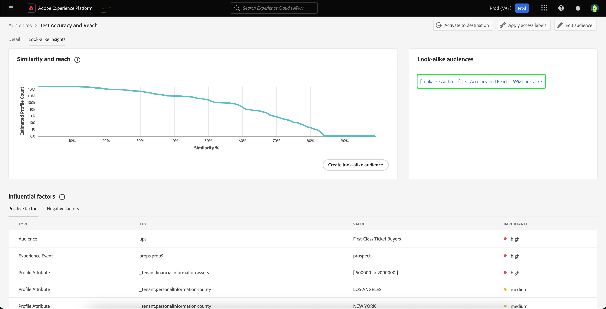

# 相似受眾指南

>[!IMPORTANT]
>
>請注意，相似的見解和相似的對象位於 **可用性限制**.

在Adobe Experience Platform中，相似的受眾會針對您的每個受眾提供智慧型深入分析，運用機器學習式的深入分析，透過您的行銷活動識別及鎖定高價值客戶。

透過相似對象功能，您可以建立範圍擴大的對象，目標是針對類似高績效對象的客戶或類似先前轉換對象的客戶。

## 術語 {#terminology}

開始使用相似對象之前，請務必瞭解下列概念：

- **基礎對象**：基礎對象是您想深入瞭解的對象。 這是相似模型所在的對象 **根據** 開啟。
- **相似模型**：相似模型是機器學習模型，會針對每個合格的基本對象進行訓練，而不需要任何客戶輸入。 每個相似模型都會建立影響因素和相似性圖表。 相似模型可以 **非** 獲得評分。
- **相似的對象**：相似對象是指將具有所選相似度臨界值的相似模型套用至基本對象時，所建立的對象。 您可以使用相同的相似模型，建立多個相似對象。 相似對象即是獲得評分的對象。
- **可定址對象總人數**：可定址對象總人數是過去30天的設定檔總數減去過去30天內的基礎對象母體。 例如，如果客戶在過去30天內有1,000萬個設定檔，而基本對象在過去30天內有1,000,000個設定檔，則總可定址對象人數為9,000,000個設定檔。

## 相似模型詳細資料 {#details}

>[!CONTEXTUALHELP]
>id="platform_audiences_lookAlike_notEligible"
>title="條件不符"
>abstract="此對象目前不符合相似深入分析的條件，因為其擁有的設定檔數量低於訓練所需的最低數量，或是尚未觸發設定檔匯出。"

>[!CONTEXTUALHELP]
>id="platform_audiences_lookAlike_processing"
>title="正在處理"
>abstract="目前正在處理此對象。該模型可能需要長達 24 小時才能完成處理。請稍後再查看。"

>[!CONTEXTUALHELP]
>id="platform_audiences_lookAlike_error"
>title="錯誤"
>abstract="處理此模型時發生錯誤。請刪除並重新建置此模型，或稍後再試一次。"

在Adobe Experience Platform中，相似模型會使用三種不同型別的資料點：

- 過去30天的對象會籍
- 過去30天內已擷取到即時客戶個人檔案中的體驗事件
- 過去30天內已擷取到即時客戶設定檔的設定檔屬性

所有這些資料點都會轉換為索引鍵值配對，並傳入相似模型。 只會保留具有相當大比例設定檔相符的鍵值值組。

此時，相似模型每24小時執行一次，為基本對象建立並重新建立影響因素和相似性圖表。 相似對象的評分也會經常執行。

## 權益 {#entitlements}

下列許可權適用於相似對象的使用：

- Real-Time CDP Prime客戶有權使用 **5** 生產沙箱中的作用中相似對象
- Real-Time CDP Ultimate客戶有權使用 **20** 生產沙箱中的作用中相似對象
- 開發沙箱僅限於 **5** 所有Real-Time CDP客戶的相似受眾

附加元件套件將在稍後推出，將生產沙箱的權利增加每個套件20個相似受眾。

若要確認您是否有相似對象的存取權，請聯絡您的Adobe代表。

## 檢視相似見解 {#view}

相似的深入分析內建有對象詳細資訊頁面。 若要檢視對象的相似見解，請選取「 」 **[!UICONTROL 受眾]** 在左側導覽列中，後面接著 **[!UICONTROL 瀏覽]**，以及您要檢視其深入分析的對象。

對象詳細資訊頁面隨即顯示。 選取 **[!UICONTROL 相似的見解]** 索引標籤來檢視對象相似的深入分析。 此 **[!UICONTROL 相似的見解]** 頁面隨即顯示。 此頁面有三個主要元素 — 相似性和觸及圖、相似對象和影響因素。

### 相似度與觸及 {#similarity-and-reach}

>[!CONTEXTUALHELP]
>id="platform_audiences_lookAlike_similarityAndReach"
>title="相似度與觸及"
>abstract="相似度與觸及圖表會繪製相似對象 (由超過指定相似度分數的設定檔組成) 的預期觸及範圍。您可以將游標停留在圖表中的特定一點上方，以顯示目前醒目標示的點之相似度百分比和預期的設定檔數量。"

相似性和觸及區段會顯示圖表，其中繪製由超過指定相似度分數的設定檔所組成的相似對象預期觸及範圍。 相似度分數代表 **距離** 基礎對象設定檔與相似見解設定檔之間的相似度。

在此圖表上，x軸會測量設定檔與所選對象成員之間的相似度百分比。 相似度分數從0%到100%不等，相似度分數越高，表示個人資料的影響因素值越接近所選對象的成員。

Y軸顯示具有對應於x軸相符值之相似度百分比的設定檔預期計數。 此預期設定檔計數介於0到可定址對象總大小或2,500萬個設定檔之間（以較低者為準）。 此軸是在 **對數刻度** 以改善圖表的可讀性。

請注意，圖表為 **累積** 由右至左。 這表示在圖形的任何點，y軸的值是具有相似性的設定檔數目 **以上** 相似度臨界值。 例如，如果x軸為60%，而y軸為1,000萬，這表示有1,000萬個設定檔與基本受眾的相似性達到或超過60%。

您可以將游標停留在圖表中的特定一點上方，以顯示目前醒目標示的點之相似度百分比和預期的設定檔數量。

### 類似的對象 {#list}

「相似對象」區段會顯示先前針對所選基本對象建立的所有相似對象清單。

### 影響因素 {#influential-factors}

>[!CONTEXTUALHELP]
>id="platform_audiences_lookAlike_influentialFactors"
>title="影響因素"
>abstract="影響因素包括屬性、事件和對象會籍；這些因素是說明設定檔與基礎對象成員之相似度的重要依據。資料使用標籤和原則可用來排除某些資料，使其不被視為相似對象模型中的影響因素。"
>additional-url="https://experienceleague.adobe.com/docs/experience-platform/segmentation/ui/lookalike-audiences.html?lang=zh-Hant#exclude" text="排除資料"

影響因素區段會顯示影響所選基本對象相似模型的前100個因素。 這些影響因子是個人資料屬性、體驗事件和對象會籍，在說明基本對象的相似之處時是最重要的。 瞭解主要影響因素，可讓您針對此對象以及您從中建立的任何相似對象，更妥善地個人化您的行銷內容。 請注意，不會顯示影響相似模型的所有影響因素。

如果是數值型影響因素，鍵值組可能會根據鍵值的不同值數目放入貯體中。 例如，如果您有一個索引鍵， `income`，很可能會有許多不重複值。 因此，索引鍵值配對會放置在看起來可能會像以下的貯體中 `income=[0 -> 30000]`， `income=[30000 -> 50000]`、和 `income=[50000 -> 100000]`.

這些貯體會定期重新計算，以確保資料保持最新。

>[!NOTE]
>
>影響因素按重要性排序，且彼此獨立。

| 欄位 | 說明 |
| ----- | ----------- |
| 類型 | 影響因子衍生自的資料型別。 這可以是設定檔屬性、體驗事件或對象成員資格。 |
| 索引鍵 | 資料欄位的名稱。 對於對象成員資格型別的索引鍵，此值表示 **名稱空間** 資料來源的受眾數量。 可能的值包括 `ups` (Segmentation Service)和 `AO` (Audience Orchestration)。 對於其他型別的索引鍵，此值表示XDM欄位路徑。 例如，如果公司Luma有一個稱為收入的自訂欄位，則鍵值為 `_luma.income` |
| 值 | 該值會依其代表的影響因素而有所不同。 對於設定檔屬性或體驗事件，此欄位代表資料欄位的值或值範圍，其指出與基本對象成員的相似度。 值範圍會以格式寫入 `[A -> B]`，其中 `A` 代表較低範圍，但 `B` 代表較高的範圍。 若為對象會籍，此欄位為對象名稱。 |
| 重要性 | 影響因子的相對重要性層級。 這可以是高、中或低。 |

## 建立相似的受眾 {#create}

>[!IMPORTANT]
>
>您 **無法** 使用相似對象作為其他相似對象的基本對象。 也就是說，您 **無法** 建立鏈結式相似對象。

若要建立相似受眾，您必須選取要為其建立相似受眾基礎的受眾。 若要存取可用對象清單，請選取「 」 **[!UICONTROL 受眾]** 在左側導覽列中，後面接著 **[!UICONTROL 瀏覽]**. 對象清單隨即顯示。 在此頁面中，您可以選取要當作基本對象使用的對象。

在對象詳細資訊頁面上，選取 **[!UICONTROL 建立相似受眾]** 以開始建立相似受眾的程式。

![此 [!UICONTROL 建立相似受眾] 按鈕會醒目提示。](../images/ui/lookalike-audiences/create-look-alike-audience.png)

此 **[!UICONTROL 建立相似的對象]** 彈出視窗會出現。 您可以在此頁面上設定相似對象的相似度百分比。

![此 [!UICONTROL 建立相似的對象] 彈出視窗。](../images/ui/lookalike-audiences/create-audience.png)

您可以透過三種不同方式設定此相似性百分比：

- 移動滑桿以設定相似性百分比
- 在滑桿旁的數字輸入方塊中輸入相似度百分比
- 將滑鼠指標暫留在圖表上，並選取所需的位置以設定相似度百分比

您也可以更新相似對象的相關詳細資訊，包括其名稱和說明。 依預設，系統會根據基本對象名稱及先前指定的相似度百分比，產生相似對象名稱。

![基本資訊會在 [!UICONTROL 建立相似的對象] 彈出視窗。](../images/ui/lookalike-audiences/basic-info.png)

選取 **[!UICONTROL 建立]** ，以完成建立相似受眾的作業。

![「建立」按鈕會醒目提示 [!UICONTROL 建立相似的對象] 彈出視窗。](../images/ui/lookalike-audiences/create-audience.png)

新建立的相似對象可在以下位置存取： **[!UICONTROL 類似的對象]** 部分，也可在對象入口網站和其他下游用途中使用。 請注意，要評分相似對象需要一些時間。 在評分之前，設定檔計數會顯示為0。

## 檢視相似對象詳細資訊 {#view-details}

若要檢視相似對象的詳細資料，請在「 」中選取「 」相似對象 **[!UICONTROL 類似的對象]** 基礎對象的區段。

對象詳細資訊頁面隨即顯示。 如需本頁的詳細資訊，請參閱 [Segmentation Service UI指南的對象詳細資訊區段](./overview.md#audience-details).

## 從相似建模中排除資料欄位 {#exclude}

您可以將相似對象設定為套用相關資料使用標籤和原則，以排除受「資料科學」行銷動作限制的資料欄位。 在訓練相似受眾模型時，以及在從訓練的模型產生相似受眾時，會移除標籤為限制用於資料科學的資料。 

標準「C9」標籤可用於標籤不應用於資料科學的資料，並可透過啟用標準「限制資料科學」原則來強制執行。 您也可以建立其他原則，以限制使用其他標籤（包括敏感標籤）的資料，避免其用於資料科學。 如需管理資料使用原則的詳細資訊，請參閱 [資料使用原則UI指南](../../data-governance/policies/user-guide.md). 如需管理資料使用標籤的詳細資訊，請參閱 [資料使用標籤UI指南](../../data-governance/labels/user-guide.md).

依預設，相似對象的模型化程式將會排除 **任何** 根據貴組織啟用的隱私權原則的欄位、資料集或對象。 如果基本對象沒有合約標籤，則模型流程會排除 **任何** 根據貴組織啟用的隱私權原則的欄位、資料集或對象。

請注意 **您** 負責確保資料（包括敏感資料）標示正確，且資料使用原則已定義並啟用，以符合您營運的法律和法規義務。 您也應該注意，資料欄位或區段會籍屬於 **非** 與通常與敏感或受保護資料型別相關聯的資料欄位直接相關，可能是潛在偏差的來源。 **您** 負責分析您的資料，以識別、標示並將適當的資料使用原則套用至您的資料，包括可能代表敏感或受保護資料型別，且應排除在模型以外的任何資料欄位。

## 後續步驟

閱讀本指南後，您已瞭解如何檢視相似見解，並根據這些見解建立相似受眾。 如需Adobe Experience Platform UI中對象的詳細資訊，請參閱 [Segmentation Service UI指南](./overview.md).
