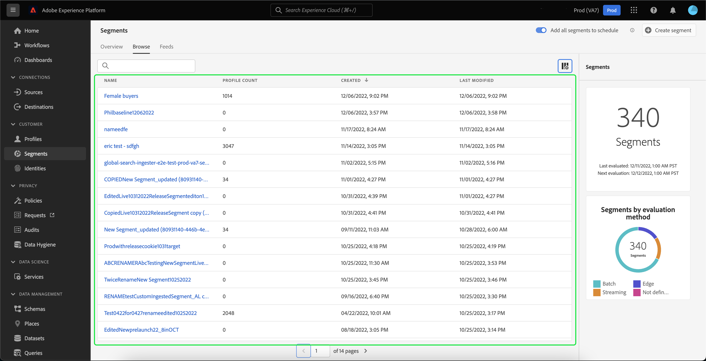

# 區段服務UI指南

[!DNL Adobe Experience Platform Segmentation Service] 提供建立和管理區段定義的使用者介面。

## 快速入門

使用區段定義需要了解 [!DNL Experience Platform] 與區段相關的服務。 閱讀本使用手冊之前，請查閱以下服務的文檔：

- [[!DNL Segmentation Service]](../home.md): [!DNL Segmentation Service] 可讓您將儲存在 [!DNL Experience Platform] 與個人（例如客戶、潛在客戶、使用者或組織）相關而組成的較小群組。
- [[!DNL Real-Time Customer Profile]](../../profile/home.md):根據來自多個來源的匯總資料，提供統一的即時消費者設定檔。
- [[!DNL Adobe Experience Platform Identity Service]](../../identity-service/home.md):借由橋接從擷取至的不同資料來源的身分識別，來建立客戶設定檔 [!DNL Platform].
- [[!DNL Experience Data Model (XDM)]](../../xdm/home.md):標準化框架 [!DNL Platform] 組織客戶體驗資料。 為了最能善用區段，請確定您的資料已根據 [資料模型最佳實務](../../xdm/schema/best-practices.md).

此外，還必須了解本檔案中使用的兩個重要術語，並了解它們之間的差異：
- **區段定義**:用於描述目標受眾的關鍵特徵或行為的規則集。
- **對象**:符合區段定義條件的產生設定檔集。 這可透過Adobe Experience Platform（平台產生的對象）或外部來源（外部產生的對象）建立。

## 總覽

在Experience PlatformUI中，選取 **[!UICONTROL 區段]** 在左側導覽中，開啟 **[!UICONTROL 概述]** 標籤顯示 [!UICONTROL 區段] 控制面板。

>[!NOTE]
>
>如果您的組織剛接觸Platform，且尚未建立作用中的設定檔資料集或合併原則，請 [!UICONTROL 區段] 控制面板未顯示。 反之， [!UICONTROL 概述] 索引標籤會顯示可協助您開始使用區段的連結和檔案。

### [!UICONTROL 區段] 儀表板 {#segments-dashboard}

此 **[!UICONTROL 區段]** 控制面板概述與貴組織的區段資料相關的關鍵量度。

若要進一步了解，請造訪 [區段控制面板指南](../../dashboards/guides/segments.md).

## 瀏覽 {#browse}

>[!CONTEXTUALHELP]
>id="platform_segments_browse_churncolumnname"
>title="流失"
>abstract="流失表示和上次執行區段作業時相比，區段定義內正在變更的設定檔的百分比。"

>[!CONTEXTUALHELP]
>id="platform_segments_browse_evaluationmethodcolumnname"
>title="評估方式"
>abstract="區段的評估方式包括批次、串流和邊緣。"

>[!CONTEXTUALHELP]
>id="platform_segments_browse_addallsegmentstoschedule"
>title="將所有區段新增到排程"
>abstract="啟用以在每日排程更新中包含所有批次評估區段。停用以從排程更新中移除所有區段。"

選取 **[!UICONTROL 瀏覽]** 標籤，查看組織的所有區段定義清單。

此檢視會列出區段定義的相關資訊，包括設定檔計數、建立日期和上次修改日期。

您可以選取 . 這些額外欄位包括劃分、流失率、評估方法和工作ID。

如果選取劃分，顯示的橫條圖會概述屬於下列各種狀態的設定檔百分比： [!UICONTROL 已實現], [!UICONTROL 現有]，和 [!UICONTROL 退出]. 此外， [!UICONTROL 瀏覽] 標籤是區段狀態最準確的劃分。 如果此數字與 [!UICONTROL 概述] 頁簽，您應使用 [!UICONTROL 瀏覽] 標籤作為正確的資訊源，因為 [!UICONTROL 概述] 標籤號每天只更新一次。

| 狀態 | 說明 |
| ------ | ----------- |
| 已實現 | 區段內的新設定檔。 |
| 現有 | 保留在區段內的現有設定檔。 |
| 退出 | 離開區段的現有設定檔。 |

流失率代表與上次執行區段工作相比，在區段定義中變更之設定檔的百分比，而設定檔計數則代表符合區段資格的設定檔總數。

評估方法可以是串流、批次或邊。 資料進入系統時，會持續評估串流區段。 系統會根據設定的排程來評估批次區段。 會即時評估邊緣區段，以利使用相同的頁面和下一頁個人化使用案例。

頁面頂端有選項可新增所有區段至排程和建立新區段。

切換 **[!UICONTROL 新增所有區段至排程]** 會啟用排程的分段。 如需排程分段的詳細資訊，請參閱 [本使用手冊的排程分段區段](#scheduled-segmentation).

選取 **[!UICONTROL 建立區段]** 會帶您前往「區段產生器」。 若要進一步了解建立區段，請參閱 [在使用手冊中建立區段](#create-segment).

右側邊欄包含組織內所有區段的相關資訊，列出區段總數、上次評估日期、下次評估日期，以及按評估方法劃分的區段。

選取區段定義的列可提供區段定義的摘要，包括可編輯或刪除區段、啟動區段至目的地、區段的合格對象、總對象大小的選項，以及區段的名稱、說明、評估方法、建立日期和上次修改日期。

>[!NOTE]
>
> 您會 **not** 能夠刪除目的地啟用中使用的區段。

## 區段定義詳細資料 {#segment-details}

若要查看特定區段定義的詳細資訊，請在 **[!UICONTROL 瀏覽]** 標籤。

區段詳細資料頁面隨即顯示。 頂端是區段定義的摘要、合格對象大小的相關資訊，以及區段已啟動的目的地。

### 區段摘要 {#segment-summary}

此 **[!UICONTROL 區段摘要]** 一節提供ID、名稱、說明和屬性詳細資訊。

此外，您也可以選擇啟用目的地區段或編輯區段。 選取 **[!UICONTROL 啟動至目的地]** 可讓您啟用目的地的區段。 如需將區段啟用至目的地的詳細資訊，請參閱 [啟用概述](../../destinations/ui/activation-overview.md).

選取 **[!UICONTROL 編輯區段]** 會帶你去 [!DNL Segment Builder]. 如需使用的詳細資訊， [!DNL Segment Builder] 工作區，請閱讀 [[!DNL Segment Builder] 使用手冊](./segment-builder.md).

### 區段中的總受眾

此 **[!UICONTROL 區段中的總受眾]** 區段會顯示符合區段資格的設定檔總數。

估計值是使用當天樣本資料的樣本大小產生。 如果您的設定檔存放區中實體少於100萬個，則會使用完整資料集；100萬至2000萬個實體使用100萬個實體；超過2,000萬個實體，佔實體總數的5%。 有關產生區段估計的詳細資訊，請參閱 [估計生成部分](../tutorials/create-a-segment.md#estimate-and-preview-an-audience) 區段建立教學課程中的。

### 已啟動的目的地

此 **[!UICONTROL 已啟動的目的地]** 區段顯示啟用此區段的目的地。

>[!NOTE]
>
> 目的地是 [!DNL Adobe Real-Time Customer Data Platform]，以及可讓您將資料匯出至外部平台。 如需目的地的詳細資訊，請參閱 [目的地概述](../../destinations/home.md). 若要了解如何啟用目的地的區段，請參閱 [啟用概述](../../destinations/ui/activation-overview.md).

### 設定檔範例

底下是符合區段資格的設定檔取樣，其詳細說明資訊包括 [!DNL Profile] ID、名字、姓氏和個人電子郵件。

資料取樣的觸發方式取決於擷取方法。

對於批次內嵌，設定檔存放區會每十五分鐘自動掃描一次，以查看自上次執行取樣工作以來是否已成功內嵌新批次。 如果是，隨後會掃描設定檔存放區，以查看記錄數量是否至少有5%的變更。 如果滿足這些條件，則會觸發新的取樣工作。

若是串流內嵌，系統會每小時自動掃描設定檔存放區，以查看記錄數量是否至少有5%的變更。 若符合此條件，則會觸發新的取樣工作。

掃描的樣本大小取決於設定檔存放區中的整體數量。 下表顯示以下樣本大小：

| 設定檔存放區中的實體 | 樣本大小 |
| ------------------------- | ----------- |
| 不到100萬 | 完整資料集 |
| 1000至2000萬 | 100萬 |
| 2000多萬 | 總共5% |

更詳細的資訊 [!DNL Profile] 可透過選取 [!DNL Profile] ID. 若要進一步了解設定檔的詳細資訊，請參閱 [[!DNL Real-Time Customer Profile] 使用手冊](../../profile/ui/user-guide.md#profile-detail).

## 建立區段 {#create-segment}

選取 **[!UICONTROL 建立區段]** 在右上角開啟 [!DNL Segment Builder] 工作區，您可以開始建立區段定義。

### [!DNL Segment Builder] 工作區

[!DNL Segment Builder] 提供豐富的工作區，可讓您與 [!DNL Profile] 資料元素。 工作區提供建立和編輯規則的直覺式控制項，例如用來表示資料屬性的拖放圖磚。

如需使用的詳細資訊， [!DNL Segment Builder] 工作區，請閱讀 [[!DNL Segment Builder] 使用手冊](./segment-builder.md).

## 排程分段 {#scheduled-segmentation}

建立區段定義後，您就可以依需求或排程（持續）評估來評估它們。 評估手段 [!DNL Real-Time Customer Profile] 資料，以產生對應的受眾。 建立後，會儲存對象，以便透過 [!DNL Experience Platform] API。

隨需評估包括視需要使用API來執行評估並建立受眾，而排程評估（也稱為「已排程區段」）可讓您建立週期性排程，以在特定時間（最多每天一次）評估區段定義。

### 啟用排程的細分 {#enable-scheduled-segmentation}

您可以使用UI或API，為排程評估啟用區段定義。 在UI中，返回 **[!UICONTROL 瀏覽]** 標籤 **[!UICONTROL 區段]** 開啟 **[!UICONTROL 新增所有區段至排程]**. 這會導致根據貴組織設定的排程評估所有區段。

>[!NOTE]
>
>可針對最多五(5)個合併原則的沙箱啟用排程評估 [!DNL XDM Individual Profile]. 如果貴組織有五個以上的合併政策 [!DNL XDM Individual Profile] 在單一沙箱環境中，您將無法使用排程的評估。

目前只能使用API建立排程。 如需使用API建立、編輯及使用排程的詳細步驟，請依照教學課程來評估和存取區段結果，尤其是 [使用API進行排程評估](../tutorials/evaluate-a-segment.md#scheduled-evaluation).

## 對象 {#audiences}

>[!IMPORTANT]
>
>對象功能目前為有限的測試版，並非所有使用者都能使用。 文件和功能可能會有所變更。

選取 **[!UICONTROL 對象]** 索引標籤，查看貴組織的所有對象清單。

依預設，此檢視會列出對象的相關資訊，包括名稱、設定檔計數、來源、建立日期和上次修改日期。

您可以選取  圖示來變更要顯示的欄位。

隨即出現彈出視窗，列出表格中可顯示的所有欄位。

| 欄位 | 說明 |
| ----- | ----------- | 
| [!UICONTROL 名稱] | 對象名稱。 |
| [!UICONTROL 設定檔計數] | 符合對象資格的設定檔總數。 |
| [!UICONTROL Origin] | 對象的來源。 如果此對象是由平台產生，則會有劃分服務的來源。 |
| [!UICONTROL 生命週期狀態] | 對象的狀態。 此欄位的可能值包括 `Draft`, `Published`，和 `Archived`. |
| [!UICONTROL 更新頻率] | 指出受眾資料更新頻率的值。 此欄位的可能值包括 `On Demand`, `Scheduled`，和 `Continuous`. |
| [!UICONTROL 上次更新者] | 上次更新對象的人員名稱。 |
| [!UICONTROL 已建立] | 建立對象的時間和日期。 |
| [!UICONTROL 上次更新時間] | 上次建立對象的時間和日期。 |
| [!UICONTROL 存取標籤] | 對象的存取標籤。 存取標籤可讓您根據套用至該資料的使用原則，對資料集和欄位進行分類。 這些標籤可隨時套用，提供您選擇控管資料的彈性。 欲知訪問標籤的更多資訊，請閱讀 [管理標籤](../../access-control/abac/ui/labels.md). |

您可以選取 **[!UICONTROL 建立對象]** 來建立對象。

此時會出現彈出視窗，讓您在合成對象或建立規則之間進行選擇。

選取 **[!UICONTROL 撰寫對象]** 帶您前往Audience Builder。 若要進一步了解建立對象，請參閱 [Audience Builder指南](./audience-builder.md).

選取 **[!UICONTROL 建置規則]** 帶您前往「區段產生器」。 若要進一步了解建立區段，請參閱 [區段產生器指南](./segment-builder.md)

## 對象詳細資訊 {#audience-details}

若要查看特定對象的詳細資訊，請在 [!UICONTROL 對象] 標籤。

對象詳細資訊頁面隨即顯示。 此頁面的詳細資料會因對象是使用Adobe Experience Platform產生，還是來自外部來源（例如Audience Orchestration）而有所不同。

### 平台產生的受眾

如需Platform產生對象的詳細資訊，請參閱 [區段摘要區段](#segment-summary).

### 外部產生的受眾

對象詳細資訊頁面頂端會顯示對象摘要，以及對象儲存所在之資料集的詳細資訊。

此 **[!UICONTROL 對象摘要]** 一節提供ID、名稱、說明和屬性詳細資訊。

此 **[!UICONTROL 資料集詳細資料]** 一節提供了名稱、說明、表名、源和架構等資訊。 您可以選取 **[!UICONTROL 檢視資料集]** 以查看資料集的詳細資訊。

| 欄位 | 說明 |
| ----- | ----------- |
| [!UICONTROL 名稱] | 資料集的名稱。 |
| [!UICONTROL 說明] | 資料集的說明。 |
| [!UICONTROL 表名] | 資料集的表格名稱。 |
| [!UICONTROL 來源] | 資料集的來源。 對於外部產生的對象，此值將 **結構**. |
| [!UICONTROL 方案] | 資料集對應的XDM結構類型。 |

若要進一步了解資料集，請參閱 [資料集概述](../../catalog/datasets/overview.md).

## 串流細分 {#streaming-segmentation}

串流細分是在 [!DNL Platform] 近乎即時，同時專注於資料豐富度。 透過串流細分，區段資格現在會在資料進入 [!DNL Platform]，可緩解排程及執行分段作業的需求。

如需串流細分的詳細資訊，請參閱 [串流細分使用手冊](./streaming-segmentation.md).

>[!NOTE]
>
>為了讓串流區段正常運作，您需要為組織啟用已排程的區段。 如需啟用排程分段的詳細資訊，請參閱 [本使用手冊中的串流細分區段](#scheduled-segmentation).

## 邊緣分割 {#edge-segmentation}

邊緣分段是即時在邊緣上評估Platform中區段的功能，可啟用相同的頁面和下一頁個人化使用案例。

如需邊緣分段的詳細資訊，請參閱 [邊緣劃分UI指南](./edge-segmentation.md)

## 違反策略

>[!NOTE]
>
>只有當您建立已指派給目的地的區段時，才會套用原則違規。

建立完區段後，Adobe Experience Platform資料控管會分析區段，以確保區段內沒有違反政策的情況。 請參閱 [資料控管概觀](../../data-governance/home.md) 以取得更多資訊。

## 後續步驟和其他資源 {#next-steps}

此 [!DNL Segmentation Service] UI提供豐富的工作流程，可讓您將有價對象與 [!DNL Real-Time Customer Profile] 資料。

若要深入了解 [!DNL Segmentation Service]，請繼續閱讀本檔案。 了解如何使用 [!DNL Segmentation Service] API，請閱讀 [[!DNL Segmentation Service] 開發人員指南](../api/overview.md).
