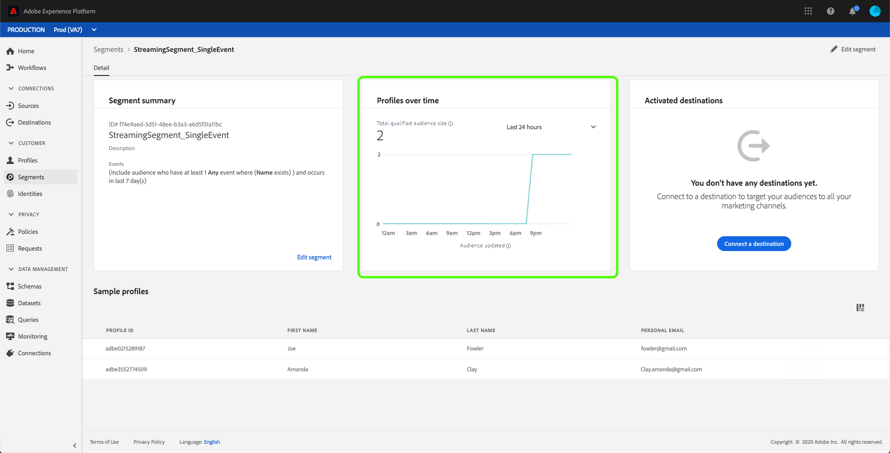

# [!UICONTROL 區段產生器] 使用指南

[!DNL Adobe Experience Platform Segmentation Service] 提供REST風格的API和使用者介面，以從資料建立區段 [!DNL Real-time Customer Profile] 定義。

## 快速入門

使用區段定義需要瞭解區段所涉 [!DNL Experience Platform] 及的各種服務。 閱讀本使用指南之前，請先閱讀下列服務的說明檔案：

- [!DNL Segmentation Service](../home.md): 區段服務可讓您將儲存在與個人( [!DNL Experience Platform] 例如客戶、潛在客戶、使用者或組織)相關的資料分割為小型群組，這些群組具有類似的特性，並會以類似的方式回應行銷策略。
- [!DNL Real-time Customer Profile](../../profile/home.md): 根據來自多個來源的匯整資料，提供統一、即時的消費者個人檔案。
- [!DNL Identity Service](../../identity-service/home.md): 可借 [!DNL Real-time Customer Profile] 由橋接來自不同資料來源的身分識別，並將其收錄至平台。
- [!DNL Experience Data Model (XDM)](../../xdm/home.md): 組織客戶體驗資料 [!DNL Platform] 的標準化架構。

此外，務必瞭解本檔案使用的兩個關鍵詞，並瞭解它們之間的差異：
- **區段定義**: 用於描述目標對象的關鍵特性或行為的規則集。
- **觀眾**: 符合區段定義條件的結果描述檔集。

## 存取區段定義

若要開始在中使用區段定 [!DNL Adobe Experience Platform]義，請按一 **[!UICONTROL 下左側導覽]** 中的區段。 若要查看組織的所有區段定義，請按一下「瀏 *[!UICONTROL 覽]* 」標籤。 此檢視會列出區段定義的相關資訊，包括評估方法、建立日期和上次修改日期。

評估方法可以是流式或批式。 當資料進入系統時，會持續評估串流區段。 批次區段會根據設定的排程進行評估。

批段顯示了附加資訊，同時顯示了批的最後評估日期和下一個評估日期。

按一 **[!UICONTROL 下右上角的]** 「建立區段」會開啟「區段產生器」工作區，您可在其中開始建立區段定義。

## [!UICONTROL 區段產生器] 工作區

[!UICONTROL 區段產生器] (Segment Builder)提供多樣化工作區，可讓您與資料元素 [!DNL Profile] 互動。 工作區提供建立和編輯規則的直覺式控制項，例如用來表示資料屬性的拖放圖格。

## 區段定義構建區塊

區段定義的基本建置區塊是「屬 **[!UICONTROL 性]** 」和 **[!UICONTROL 「事件」]**。 此外，現有「觀眾」中包含的屬性和 **[!UICONTROL 事件]** ，也可當成新定義的元件。

您可在「區段產生器」工作區 *左側的* 「欄位」區段中，看 [!UICONTROL 到這些建置區塊] 。 *[!UICONTROL 欄位]* (Fields)包含每個主要建置區塊的標籤： **[!UICONTROL 屬性]**、 **[!UICONTROL 事件]**&#x200B;和 **[!UICONTROL 觀眾]**。

### 屬性

「屬 **[!UICONTROL 性]** 」(Attributes [!DNL Profile] )頁籤允許您瀏覽屬 [!DNL XDM Individual Profile] 於該類的屬性。 每個檔案夾都可展開以顯示其他屬性，其中每個屬性都是一個方塊，可拖曳至工作區中央的規則產生器畫布上。 本指 [南稍後會詳細討論規則產生器畫布](#rule-builder-canvas) 。

### 事件

「事 **[!UICONTROL 件]** 」索引標籤可讓您根據使用XDM ExperienceEvent資料元素發生的事件或動作來建立觀眾。 您也可以在「事件」標籤上找 **[!UICONTROL 到事件類型]** ，這是常用事件的集合，可讓您更快速地建立區段。

除了能夠瀏覽元素外，您還 [!DNL ExperienceEvent] 可以搜尋事件類型。 事件類型使用與相同的編碼邏 [!DNL ExperienceEvents]輯，而不需要您在類別中搜尋， [!DNL XDM ExperienceEvent] 以尋找正確的事件。 例如，使用搜尋列來搜尋「購物車」會傳回「事件類型」「[!UICONTROL AddCart]」和「[!UICONTROL RemoveCart]」，這兩個動作在建立區段定義時非常常用。

在使用 [Lucene搜尋語法的搜尋列中輸入元件名稱，即可搜尋任何類型的元件](https://docs.microsoft.com/en-us/azure/search/query-lucene-syntax)。 當輸入整個字詞時，搜尋結果開始填入。 例如，若要根據XDM欄位建立規則，請 `ExperienceEvent.commerce.productViews`開始在搜尋欄位中輸入「產品檢視」。 輸入&quot;product&quot;後，搜尋結果就會開始顯示。 每個結果都包括它所屬的對象層次。

>[!NOTE] 您的組織定義的自訂結構欄位可能需要24小時才能顯示，並可用於建立規則。

然後，您可以輕鬆將「事 [!DNL ExperienceEvents] 件類 [!UICONTROL 型] 」拖放至區段定義。

依預設，只會顯示資料儲存區中已填入的架構欄位。 這包括事 [!UICONTROL 件類型]。 如果事 [!UICONTROL 件類型] ，或您只能選擇「[!UICONTROL Any]」作為 [!UICONTROL 事件類型，請按一下]Fields旁的 ******** ShowShow fullDhear XDMSchemaUnderOunderJowChearFields。 再次按一下齒輪表徵圖可返回「 *[!UICONTROL Fields]* 」（欄位）頁籤，您現在應該可以查看多個 [!UICONTROL Event Types] （事件類型）和架構欄位，而不管它們是否包含資料。

### 受眾

「對 **[!UICONTROL 像]** 」索引標籤會列出從外部來源匯入的所有對象，例如Adobe Audience Manager，以及在內部建立的對象 [!DNL Experience Platform]。

在「對 [!UICONTROL 像] 」索引標籤上，您可以將所有可用來源視為資料夾群組。 當您按一下這些檔案夾時，就會看到可用的子檔案夾和對象。 此外，您可以按一下資料夾圖示（如最右側影像所示），以檢視資料夾結構（核取標籤表示您目前所在的資料夾），並按一下樹狀結構中資料夾的名稱，輕鬆地在資料夾間導覽。

您可以將滑鼠指標暫留在ⓘ對象旁，以檢視有關對象的資訊，包括其ID、說明和資料夾階層，以找出對象。

您也可以使用搜 [!UICONTROL 尋列] (使用 [Lucene的搜尋語法)來搜尋「](https://docs.microsoft.com/en-us/azure/search/query-lucene-syntax)觀眾」。 在「對 *[!UICONTROL 像]* 」索引標籤中，選取頂層檔案夾會顯示搜尋列，讓您在該檔案夾內進行搜尋。 只有輸入完整字詞後，搜尋結果才會開始填入。 例如，若要尋找名為 [!UICONTROL 的對象] ，請 `Online Shoppers`開始在搜尋列中輸入「線上」。 在完整輸入&quot;Online&quot;後，會顯示包含&quot;Online&quot;的搜尋結果。

## 規則產生器畫布 {#rule-builder-canvas}

區段定義是用於描述目標對象之主要特性或行為的規則集合。 這些規則是使用「區段產 *[!UICONTROL 生器」中心的規則產生器畫布]*&#x200B;建立的 。

若要將新規則新增至區段定義，請從「欄位」標籤拖曳圖格 ** ，並將其拖曳至規則產生器畫布。 然後，您會根據所新增資料的類型，看到內容特定的選項。 可用的資料類型包括： 字串、日期、 [!DNL ExperienceEvents]事件 [!UICONTROL 類型]和 [!UICONTROL 觀眾]。

### 新增觀眾

您可以從「對象」索引標籤將對象拖放至 *[!UICONTROL 規則產生器畫布上]* ，以參考新區段定義中的對象成員資格。 這可讓您在新區段規則中加入或排除對象成員資格作為屬性。

對於 [!DNL Platform] 使用「區 [!UICONTROL 段產生器」建立的觀眾]，您可以選擇將觀眾轉換為用於該觀眾區段定義的規則集。 此轉換會建立規則邏輯的復本，然後可修改該邏輯，而不會影響原始區段定義。 在將區段定義轉換為規則邏輯之前，請確定您已儲存區段定義的任何最近變更。

>[!NOTE] 從外部來源新增對象時，只會參考對象會籍。 您無法將對象轉換為規則，因此，用於建立原始對象的規則無法在新區段定義中修改。

如果在將觀眾轉換為規則時發生任何衝突， [!UICONTROL 「區段產生器] 」會嘗試將現有選項保留至其最佳能力。

### 程式碼檢視

或者，您也可以檢視在「區段產生器」中建立之規則的程式 [!UICONTROL 碼版本]。 在規則產生器畫布中建立規則後，您可以選取「程式碼檢視」 **** ，將區段視為PQL。

程式碼檢視提供一個按鈕，可讓您複製要用於API呼叫的區段值。 若要取得區段的最新版本，請確定您已儲存區段的最新變更。

## 容器

區段規則依其列出順序進行評估。 容器允許使用巢狀查詢來控制執行順序。

在規則產生器畫布中至少新增一個方塊後，您就可以開始新增容器。 若要建立新容器，請按一下圖格右上角的省略號(...)，然後按一下「新增容 **[!UICONTROL 器」]**。

新容器會以第一個容器的子系出現，但您可以拖曳並移動容器來調整階層。 容器的預設行為是「包[!UICONTROL 含]」提供的屬性、事件或對象。 您可以按一下方塊左上角的「包含」，並選取「排除」，將規則設為符合容器條件的「排除[!UICONTROL 」描述檔]****。

您也可以按一下子容器上的「解除包裝容器」，將子容器擷取並內嵌至父容器。 按一下子容器右上角的省略號(...)以存取此選項。

按一下「解 **[!UICONTROL 除包裝容器]** 」後，子容器即會移除，而標準會內嵌在內。

>[!NOTE] 展開容器時，請小心邏輯是否仍符合所需的區段定義。

## 合併原則

[!DNL Experience Platform] 可讓您從多個來源匯整資料並加以合併，以便瞭解每個客戶的完整視圖。 將這些資料整合在一起時，合併原則是用來 [!DNL Platform] 決定資料的優先順序以及將哪些資料合併以建立描述檔的規則。

您可以選取符合此對象行銷目的的合併原則，或使用由提供的預設合併原則 [!DNL Platform]。 您可以建立組織專屬的多個合併原則，包括建立您自己的預設合併原則。 有關為組織建立合併策略的逐步說明，請參閱有關使用UI使 [用合併策略的教程](../../profile/ui/merge-policies.md)。

要為段定義選擇合併策略，請按一下「 *[!UICONTROL Fields]* 」（欄位）頁籤上的齒輪表徵圖，然後使用「 *[!UICONTROL Merge Policy]」（合併策略）下拉菜單&#x200B;*，選擇要使用的合併策略。

## 區段屬性

建立區段定義時，工作區右側的「區段屬性 ** 」區段會顯示產生區段的估計大小，讓您在建立對象本身之前，視需要調整區段定義。

「區 *[!UICONTROL 段屬性]* 」區段也可讓您指定區段定義的重要資訊，包括 *[!UICONTROL 名稱]**[!UICONTROL 和說明]*。 區段定義名稱用於識別組織所定義的區段，因此應具有描述性、簡明扼要和獨特性。

當您繼續建立區段定義時，您可以選取「檢視設定檔」來檢視對象的編頁 **[!UICONTROL 預覽]**。

>[!NOTE] 觀眾估計是使用當天樣本資料的樣本大小產生。 如果您的描述檔儲存區中有少於100萬個實體，則會使用完整資料集； 100萬到2000萬個單位使用100萬個單位； 超過2000萬個單位，佔全部單位的5%。 有關產生區段估計的詳細資訊，請參閱區 [段建立教學課程的](../tutorials/create-a-segment.md#estimate-and-preview-an-audience) 「估計產生」區段。

## 啟用排程的分段 {#enable-scheduled-segmentation}

建立區段定義後，您就可以透過隨選或排程（持續）評估來評估區段定義。 評估意指透過 [!DNL Real-time Customer Profile] 區段定義來移動資料，以產生對應的觀眾。 建立後，觀眾會儲存並儲存，以便使用API匯出 [!DNL Experience Platform] 觀眾。

隨選評估包括視需要使用API來執行評估並建立觀眾，而排程評估（也稱為「排程區段」）可讓您建立循環性排程，以評估特定時間（最多每天一次）的區段定義。

您可使用UI或API來啟用計畫評估的區段定義。 在UI中，返回「區段」中的「 *[!UICONTROL 瀏覽]* 」標 **[!UICONTROL 簽]** ，並切換「 **[!UICONTROL 評估所有區段」]**。 這會導致根據您組織所設定的排程評估所有區段。

>[!NOTE] 對於最多5(5)個合併策略的沙盒，可啟用計畫評估 [!DNL XDM Individual Profile]。 如果貴組織在單一沙盒環境中有5 [!DNL XDM Individual Profile] 種以上的合併原則，您將無法使用排程的評估。

目前只能使用API建立排程。 有關使用API建立、編輯和使用排程的詳細步驟，請依照教學課程來評估和存取區段結果，尤其是使用API進行排 [程評估的章節](../tutorials/evaluate-a-segment.md#scheduled-evaluation)。

## 串流區段 {#streaming-segmentation}

>[!NOTE] 為了讓串流區段正常運作，客戶需要啟用組織的排程區段。 如需啟用排程分段的詳細資訊，請參 [閱本使用指南的上一節](#enable-scheduled-segmentation)。

如果查詢符合下列任一條件，則會使用串流分段自動評估該查詢：

| 查詢類型 | 詳細資料 | 範例 |
| ---------- | ------- | ------- |
| 傳入點擊 | 任何區段定義，是指沒有時間限制的單一傳入事件。 |  |
| 在相對時間視窗內傳入點擊 | 任何區段定義，是指過去七天內 **的單一傳入事件**。 |  |
| 參照描述檔的傳入點擊 | 任何區段定義，是指單一傳入事件（無時間限制）以及一或多個描述檔屬性。 |  |
| 在相對時間視窗內參照描述檔的傳入點擊 | 任何區段定義，是指過去七天內傳入的單一事件和一或多個描述 **檔屬性**。 |  |
| 參考描述檔的多個事件 | 任何區段定義是指過去24小時內 **的多個事件** ，且（可選）具有一或多個描述檔屬性。 |  |

下節列出區段定義範例，這些範例 **將無法** 針對串流區段啟用。

| 查詢類型 | 詳細資料 |
| ---------- | ------- | 
| 在相對時間視窗內傳入點擊 | 如果區段定義是指非在最 **近** 7天 **時段內的傳入事件**。 例如，在過去 **兩週內**。 |  |
| 參照相對視窗中描述檔的傳入點擊 | 下列選項將不 **支援串流** 區段：<ul><li>非在最 **近** 7天 **時段內傳入的事件**。</li><li>包含區段或特徵 [!DNL Adobe Audience Manager (AAM)] 的區段定義。</li></ul> |  |
| 參考描述檔的多個事件 | 下列選項將不 **支援串流** 區段：<ul><li>在過去24小 **時內** 未發 **生的事件**。</li><li>包含Adobe Audience Manager(AAM)區段或特徵的區段定義。</li></ul> |  |
| 多實體查詢 | 整體而言，串流分段不支 **援多** 實體查詢。 |  |

此外，執行串流區段時，也會套用一些准則：

| 查詢類型 | 准則 |
| ---------- | -------- |
| 單一事件查詢 | 回顧視窗限制為 **七天**。 |
| 具有事件歷史記錄的查詢 | <ul><li>回顧視窗限於一 **天**。</li><li>事件之間必須存 **在嚴格** 的時間順序條件。</li><li>僅允許事件之間的簡單時間順序（前後）。</li><li>無法否 **認個** 別事件。 不過，整個查詢 **可以** 否定。</li></ul> |

### 監控串流區段

建立可串流化的區段後，您可以監控該區段的詳細資料。

具體而言，會顯示 *[!UICONTROL 合格觀眾總數的詳細資]* 訊。 如果作業在過去24小時內執行，則除了新增對象的折線圖外，還會顯示作業的 **[!UICONTROL Total Audience Size]** 。 否則，除了 **[!UICONTROL 視覺化趨勢線外]** ，還會顯示「估計對象大小」。

如需最後區段評估的詳細資訊，請按一下資訊泡泡即可找到。

## DULE策略違規

>[!NOTE] DULE策略違規僅在建立已分配給目標的段時適用。

建立完區段後，會依據區段進行分析，以 [!DNL Data Governance] 確保區段內沒有違反原則的情況。 有關DULE和違反策略的詳細資訊，請參閱數 [據使用標籤概述](../../data-governance/labels/overview.md)。

## 後續步驟

「區段產生器」提供豐富的工作流程，讓您將有價值的受眾與資料隔 [!DNL Real-time Customer Profile] 離。 閱讀本指南後，您現在可以：

- 使用屬性、事件和現有對象的組合來建立區段定義，做為建立區塊。
- 使用規則產生器畫布和容器來控制區段規則的執行順序。
- 檢視您潛在讀者的估計值，讓您視需要調整區段定義。
- 為排程的區段啟用所有區段定義。
- 為串流區段啟用指定的區段定義。

如需使用API的逐步指示，請參 [!DNL Segmentation Service] 閱使用API [!DNL Segmentation Service] 建立 [觀眾區段教學課程](../tutorials/create-a-segment.md) 。