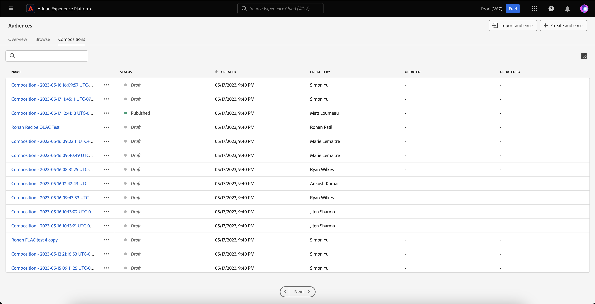

# Segmentation Service UI指南

[!DNL Adobe Experience Platform Segmentation Service]提供使用者介面，用來建立和管理對象和區段定義。

## 快速入門

使用對象和區段定義需要瞭解與細分有關的各種[!DNL Experience Platform]服務。 閱讀本使用手冊前，請先檢閱以下服務的檔案：

- [[!DNL Segmentation Service]](../home.md)： [!DNL Segmentation Service]可讓您將儲存在[!DNL Experience Platform]中與個人（例如客戶、潛在客戶、使用者或組織）相關的資料分割成較小的群組。
- [[!DNL Real-Time Customer Profile]](../../profile/home.md)：根據來自多個來源的彙總資料，提供統一的即時消費者設定檔。
- [[!DNL Adobe Experience Platform Identity Service]](../../identity-service/home.md)：透過從擷取至[!DNL Platform]的不同資料來源橋接身分，以建立客戶設定檔。
- [[!DNL Experience Data Model (XDM)]](../../xdm/home.md)： [!DNL Platform]用來組織客戶體驗資料的標準化架構。 若要充分利用「細分」，請確定您的資料已根據[資料模型最佳實務](../../xdm/schema/best-practices.md)被擷取為設定檔和事件。

您也應該瞭解在本檔案中使用的以下主要辭彙，並瞭解它們之間的差異：

- **對象**：一組具有類似行為和/或特徵的人。 此人員集合可透過Adobe Experience Platform使用區段定義（平台產生的對象）、對象構成產生，或從外部來源（例如自訂上傳） （外部產生的對象）產生。
- **區段定義**： Adobe Experience Platform用來描述目標對象關鍵特性或行為的規則。
- **區段**：將設定檔分隔成對象的動作。

## 概觀

在Experience PlatformUI中，選取左側導覽中的&#x200B;**[!UICONTROL 對象]**&#x200B;以開啟&#x200B;**[!UICONTROL 總覽]**&#x200B;標籤，其中顯示[!UICONTROL 對象]儀表板。

>[!NOTE]
>
>如果您的組織剛開始使用Platform，但尚未建立作用中的設定檔資料集或合併原則，則不會顯示[!UICONTROL 受眾]儀表板。 相反，[!UICONTROL 概觀]索引標籤會顯示連結和檔案，以幫助您開始使用對象。

### [!UICONTROL 對象]儀表板 {#segments-dashboard}

**[!UICONTROL 對象]**&#x200B;儀表板會概述與您組織的對象資料相關的關鍵量度。

若要深入瞭解，請造訪[對象儀表板指南](../../dashboards/guides/audiences.md)。

## 瀏覽 {#browse}

選取&#x200B;**[!UICONTROL 瀏覽]**&#x200B;索引標籤以檢視對象入口網站。 Audience Portal提供屬於您組織和沙箱的所有受眾清單，並包含設定檔計數、來源、建立日期、上次修改日期、標籤和劃分等詳細資訊。

此外，Audience Portal可讓您使用「區段產生器」或「對象構成」建立新對象，以及將外部產生的對象匯入Platform。

如需對象入口網站的詳細資訊，請閱讀[對象入口網站概觀](./audience-portal.md)。

## 構成 {#compositions}

選取&#x200B;**[!UICONTROL 構成]**&#x200B;索引標籤，以檢視透過對象構成為您的組織產生的所有對象清單。

依預設，此檢視會列出對象的相關資訊，包括名稱、狀態、建立日期、建立者、上次更新日期和上次更新者。

每個對象旁都會顯示一個省略符號圖示。 選取此專案會顯示對象可用的快速動作清單。

| 動作 | 說明 |
| ------ | ----------- |
| 複製 | 複製選取的對象。 |
| 管理存取權 | 管理屬於對象的存取標籤。 如需存取標籤的詳細資訊，請閱讀[管理標籤](../../access-control/abac/ui/labels.md)的檔案。 |
| 刪除 | 刪除選取的對象。 不能刪除下游目的地中使用的對象或是其他對象&#x200B;**中的相依對象**。 如需有關刪除對象的詳細資訊，請參閱[區段常見問題集](../faq.md#lifecycle-states)。 |

您可以選取圖示來變更顯示的欄位。

此時會出現一個彈出視窗，其中列出可顯示在表格中的所有欄位。

| 欄位 | 說明 |
| ----- | ----------- | 
| [!UICONTROL 名稱] | 對象名稱。 |
| [!UICONTROL 狀態] | 對象的狀態。 此欄位可能的值包括`Draft`、`Inactive`和`Published`。 |
| [!UICONTROL 已建立] | 建立對象的時間和日期。 |
| [!UICONTROL 建立者：] | 建立對象的人員名稱。 |
| [!UICONTROL 已更新] | 上次更新對象的時間和日期。 |
| [!UICONTROL 更新者] | 上次更新對象的人員名稱。 |

若要檢視對象的構成方式，請在「[!UICONTROL 對象]」標籤中選取對象名稱。

將會顯示「對象構成」頁面，其中包含構成對象的建置區塊。 如需如何使用對象構成的詳細資訊，請參閱[對象構成UI指南](./audience-composition.md)。

## 聯合客群組成 {#fac}

除了受眾構成和區段定義之外，您還可以使用Adobe同盟受眾構成，從企業資料集建立新受眾，而無需複製基礎資料並將這些受眾儲存於Adobe Experience Platform受眾入口網站。 您也可以利用從企業資料倉儲已同盟的構成對象資料，讓Adobe Experience Platform中的現有對象更為豐富。 請閱讀[同盟對象構成](https://experienceleague.adobe.com/en/docs/federated-audience-composition/using/home)的指南。

## 串流區段 {#streaming-segmentation}

串流區段是近乎即時對[!DNL Platform]執行區段的能力，同時著重於資料豐富度。 有了串流區段，現在當資料進入[!DNL Platform]時，區段的資格就會發生，而不需要排程和執行區段工作。

如需串流區段的詳細資訊，請參閱[串流區段使用手冊](./streaming-segmentation.md)。

>[!NOTE]
>
>為了讓串流細分發揮作用，您需要為組織啟用已排程的分段。 如需啟用排程細分的詳細資訊，請參閱本使用手冊中的[串流細分割槽段](#scheduled-segmentation)。

## 邊緣分段 {#edge-segmentation}

Edge區段能夠在邊緣即時評估Platform中的受眾，啟用相同頁面和下一頁個人化使用案例。

您可以在[邊緣細分UI指南](./edge-segmentation.md)中找到邊緣細分的詳細資訊

## 原則違規

>[!NOTE]
>
>原則違規僅適用於建立已指派給目的地的對象。

在您建立完對象後，Adobe Experience Platform資料控管將會分析對象，以確保對象內沒有原則違規。 如需詳細資訊，請參閱[資料控管概觀](../../data-governance/home.md)。

## 後續步驟和其他資源 {#next-steps}

[!DNL Segmentation Service] UI提供豐富的工作流程，可讓您從[!DNL Real-Time Customer Profile]資料建立可行銷的對象。

若要深入瞭解[!DNL Segmentation Service]，請繼續閱讀此檔案。 若要瞭解如何使用[!DNL Segmentation Service] API，請閱讀[[!DNL Segmentation Service] 開發人員指南](../api/overview.md)。
