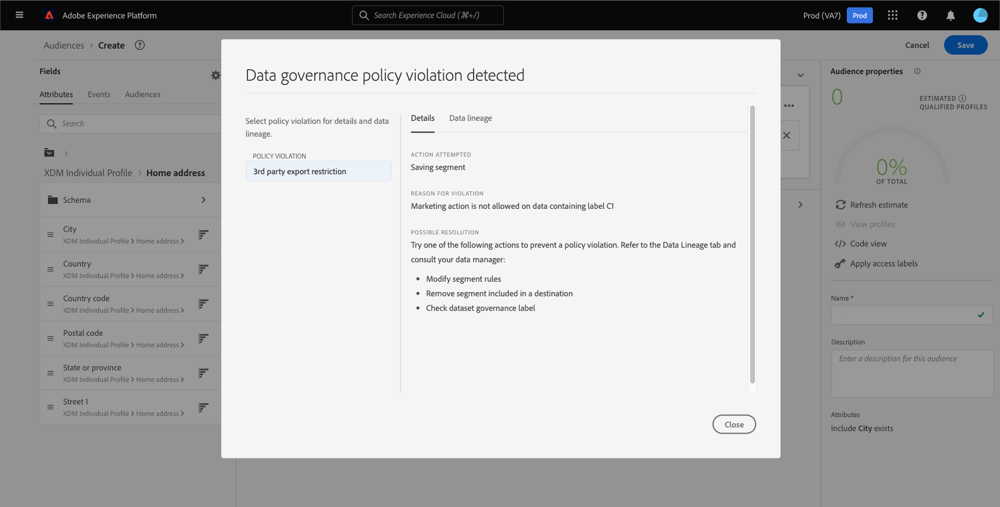

# Segmentation Service UI指南

[!DNL Adobe Experience Platform Segmentation Service] 提供使用者介面，用於建立和管理對象和區段定義。

## 快速入門

使用對象和區段定義需要瞭解各種 [!DNL Experience Platform] 與細分有關的服務。 閱讀本使用手冊前，請先檢閱下列服務的檔案：

- [[!DNL Segmentation Service]](../home.md)： [!DNL Segmentation Service] 可讓您對儲存在中的資料進行分段 [!DNL Experience Platform] 和歸入較小群組的個人（例如客戶、潛在客戶、使用者或組織）相關的資訊。
- [[!DNL Real-Time Customer Profile]](../../profile/home.md)：根據來自多個來源的彙總資料，提供統一的即時消費者設定檔。
- [[!DNL Adobe Experience Platform Identity Service]](../../identity-service/home.md)：透過橋接從不同的資料來源擷取的身分來建立客戶設定檔 [!DNL Platform].
- [[!DNL Experience Data Model (XDM)]](../../xdm/home.md)：作為依據的標準化架構 [!DNL Platform] 組織客戶體驗資料。 為了充分利用「分段」，請確保您的資料已根據 [資料模型化的最佳實務](../../xdm/schema/best-practices.md).

您也應該瞭解在本檔案中使用的兩個關鍵辭彙，並瞭解它們之間的差異：

- **對象**：一組具有類似行為和/或特徵的人。 此人員集合可由Adobe Experience Platform使用區段定義或對象組合（平台產生的對象）產生，或由外部來源（例如自訂上傳）（外部產生的對象）產生。
- **區段定義**：Adobe Experience Platform用來描述目標對象之關鍵特性或行為的規則。
- **區段**：將設定檔分隔為對象的行為。

## 概觀

在Experience PlatformUI中，選取 **[!UICONTROL 受眾]** 在左側導覽以開啟 **[!UICONTROL 概觀]** 標籤顯示 [!UICONTROL 受眾] 儀表板。

>[!NOTE]
>
>如果您的組織剛開始使用Platform，但尚未建立作用中的設定檔資料集或合併原則，請 [!UICONTROL 受眾] 儀表板不可見。 取而代之的是 [!UICONTROL 概觀] 索引標籤會顯示連結和檔案，以幫助您開始使用對象。

### [!UICONTROL 受眾] 儀表板 {#segments-dashboard}

此 **[!UICONTROL 受眾]** 控制面板會概述與貴組織受眾資料相關的關鍵量度。

若要進一步瞭解，請造訪 [受眾控制面板指南](../../dashboards/guides/audiences.md).

## 瀏覽 {#browse}

>[!CONTEXTUALHELP]
>id="platform_segments_browse_churncolumnname"
>title="流失"
>abstract="流失率代表與上次執行區段作業相比，對象內發生變更的設定檔百分比。"

>[!CONTEXTUALHELP]
>id="platform_segments_browse_evaluationmethodcolumnname"
>title="評估方式"
>abstract="對象的評估方法包括批次、串流和邊緣。"

>[!CONTEXTUALHELP]
>id="platform_segments_browse_addallsegmentstoschedule"
>title="新增所有對象至排程"
>abstract="啟用後可在每日排程更新中包含所有使用批次細分評估的對象。 停用以從排程更新中移除所有對象。"

選取 **[!UICONTROL 瀏覽]** 索引標籤檢視貴組織的所有對象清單。

此檢視會列出對象的相關資訊，包括設定檔計數、來源、建立日期、上次修改日期、標籤和劃分。

您可以透過選取「 」，將其他欄位新增到此顯示 . 這些額外的欄位包括生命週期狀態、更新頻率、上次更新者、說明、建立者和存取權標籤。

| 欄位 | 說明 |
| ----- | ----------- |
| [!UICONTROL 名稱] | 對象名稱。 |
| [!UICONTROL 設定檔計數] | 符合對象資格的設定檔總數。 |
| [!UICONTROL Origin] | 對象的來源。 這會指出受眾的來源。 可能的值包括細分服務、自訂上傳、對象構成和Audience Manager。 |
| [!UICONTROL 已建立] | 建立對象的日期和時間(UTC)。 |
| [!UICONTROL 上次更新時間] | 上次更新對象的日期和時間(UTC)。 |
| [!UICONTROL 標記] | 屬於對象的使用者定義標籤。 有關這些標籤的更多資訊可在以下連結中找到： [標籤上的區段](#tags). |
| [!UICONTROL 劃分] | 對象的設定檔狀態劃分。 此設定檔狀態劃分的更詳細描述可在下方找到。 |
| [!UICONTROL 生命週期狀態] | 對象的狀態。 此欄位可能的值包括 `Draft`， `Published`、和 `Archived`. |
| [!UICONTROL 更新頻率] | 指出對象資料更新頻率的值。 此欄位可能的值包括 `On Demand`， `Scheduled`、和 `Continuous`. |
| [!UICONTROL 上次更新者] | 上次更新對象的人員名稱。 |
| [!UICONTROL 說明] | 對象的說明。 |
| [!UICONTROL 建立者] | 建立對象的人員名稱。 |
| [!UICONTROL 存取標籤] | 對象的存取權標籤。 存取標籤可讓您根據套用至該資料的使用原則來分類資料集和欄位。 這些標籤可隨時套用，提供您選擇控管資料方式的靈活性。 如需存取標籤的詳細資訊，請參閱以下檔案： [管理標籤](../../access-control/abac/ui/labels.md). |

如果選取劃分，畫面會顯示長條圖，概述屬於下列每個已計算設定檔狀態的設定檔百分比： [!UICONTROL 已實現]， [!UICONTROL 現有]、和 [!UICONTROL 正在退出]. 此外，劃分會顯示在 [!UICONTROL 瀏覽] 索引標籤是區段定義狀態最準確的劃分。 如果此數字與 [!UICONTROL 概觀] 標籤上，您應該使用位於 [!UICONTROL 瀏覽] 標籤作為正確的資訊來源，因為 [!UICONTROL 概觀] 索引標籤編號每天僅更新一次。

| 狀態 | 說明 |
| ------ | ----------- |
| [!UICONTROL 已實現] | 符合以下條件的設定檔計數： **合格** 用於自上次批次區段作業執行以來過去24小時內的區段。 |
| [!UICONTROL 現有] | 設定檔計數，其中 **剩餘** 區段中上次執行批次區段作業後過去24小時的資料。 |
| [!UICONTROL 正在退出] | 設定檔計數，其中 **已退出** 自上次執行批次區段作業以來過去24小時的區段。 |

每個對象旁都會顯示一個省略符號圖示。 選取此專案會顯示對象可用的快速動作清單。 此動作清單會因對象來源而異。

![系統會針對來源為的對象，顯示快速動作清單 [!UICONTROL 對象構成].](../images/ui/overview/browse-audience-composition-details.png)

| 動作 | 來源 | 說明 |
| ------ | ------- | ----------- |
| 編輯 | Segmentation Service | 可讓您開啟「區段產生器」來編輯您的對象。 如需使用「區段產生器」的詳細資訊，請參閱 [區段產生器UI指南](./segment-builder.md). |
| 開啟構成 | 對象構成 | 可讓您開啟對象構成來檢視您的對象。 如需對象構成的詳細資訊，請閱讀 [對象組合UI指南](./audience-composition.md). |
| 啟用到目的地 | Segmentation Service | 可讓您將對象啟用至目的地。 如需將受眾啟用至目的地的詳細資訊，請參閱 [啟用概述](../../destinations/ui/activation-overview.md). |
| 與合作夥伴分享 | 對象構成、自訂上傳、細分服務 | 可讓您與其他Platform使用者共用您的對象。 如需有關此功能的詳細資訊，請閱讀 [區段比對概觀](./segment-match/overview.md). |
| 管理標籤 | 對象構成、自訂上傳、細分服務 | 可讓您管理屬於對象的使用者定義標籤。 如需有關此功能的詳細資訊，請閱讀以下章節： [篩選和標籤](#manage-audiences). |
| 移至資料夾 | 對象構成、自訂上傳、細分服務 | 可讓您管理對象屬於哪個資料夾。 如需有關此功能的詳細資訊，請閱讀以下章節： [篩選和標籤](#manage-audiences). |
| 複製 | 對象構成、自訂上傳、細分服務 | 複製選取的對象。 |
| 套用存取權標籤 | 對象構成、自訂上傳、細分服務 | 可讓您管理屬於對象的存取標籤。 如需存取標籤的詳細資訊，請參閱以下檔案： [管理標籤](../../access-control/abac/ui/labels.md). |
| 封存 | 自訂上傳 | 封存選取的對象。 |
| 刪除 | 對象構成、自訂上傳、細分服務 | 刪除選取的對象。 |

頁面頂端有選項，可新增所有對象至排程、匯入對象和建立新對象。

切換 **[!UICONTROL 排程所有對象]** 將啟用排程分段。 如需排程分段的詳細資訊，請參閱 [本使用手冊的已排程區段章節](#scheduled-segmentation).

選取 **[!UICONTROL 匯入對象]** 可讓您匯入外部產生的對象。 若要瞭解匯入對象的詳細資訊，請閱讀以下章節： [匯入使用手冊中的對象](#import-audience).

選取 **[!UICONTROL 建立對象]** 可讓您建立對象。 若要進一步瞭解如何建立對象，請閱讀以下章節： [在使用手冊中建立對象](#create-audience).

>[!NOTE]
>
> 您會 **not** 能夠刪除用於目的地啟用的對象。

### 篩選和標籤 {#manage-audiences}

若要改善您的工作效率，您可以搜尋現有對象、將使用者定義的標籤新增至對象、將對象放入資料夾，以及篩選顯示的對象。

**搜尋** {#search}

您最多可以使用9種不同的語言搜尋現有對象 [!DNL Unified Search].

使用 [!DNL Unified Search]，在反白顯示的搜尋列中新增您要搜尋的字詞。

如需有關的詳細資訊 [!DNL Unified Search]，包括支援的功能，請閱讀 [整合式搜尋檔案](https://experienceleague.adobe.com/docs/core-services/interface/services/search-experience-cloud.html).

**標籤** {#tags}

您可以新增使用者定義的標籤，以更好地說明、尋找和管理您的對象。

若要新增標籤，請選取「 」 **[!UICONTROL 管理標籤]** 標籤的對象。

![此 [!UICONTROL 管理標籤] 已針對指定的對象選取按鈕。](../images/ui/overview/browse-manage-tags.png)

此 **[!UICONTROL 管理標籤]** 彈出視窗隨即顯示。 在此彈出視窗中，您可以選取已分類的標籤或未分類的標籤。

| 標籤型別 | 說明 |
| -------- | ----------- |
| 已分類 | 由貴組織的管理員建立及管理的標籤。 |
| 未分類 | 在中建立的標籤 [!UICONTROL 管理標籤] 彈出視窗。 任何人都能建立或管理這些型別的標籤。 |

![此 [!UICONTROL 管理標籤] 彈出視窗隨即顯示。 選擇已分類或未分類的選項會反白顯示。](../images/ui/overview/create-tag.png)

新增您要附加至對象的所有標籤後，選取 **[!UICONTROL 儲存]**.

![於 [!UICONTROL 管理標籤] 彈出視窗，會醒目顯示新增的標籤。](../images/ui/overview/created-tags.png)

如需建立和管理標籤的詳細資訊，請參閱 [管理標籤指南](../../administrative-tags/ui/managing-tags.md).

**資料夾** {#folders}

您可以將受眾放在資料夾中，以改善受眾管理。

若要將對象移至資料夾，請選取「 」 **[!UICONTROL 移至資料夾]** 在您想要移動的對象上。

![此 [!UICONTROL 移至資料夾] 按鈕已針對特定對象選取。](../images/ui/overview/browse-move-to-folder.png)

此 **將對象移至資料夾** 彈出視窗隨即顯示。 選取您要移動對象的資料夾，然後選取「 」 **[!UICONTROL 儲存]**.

對象位於資料夾中後，您可以選擇僅顯示屬於特定資料夾的對象。

**篩選** {#filter}

您也可以根據各種設定來篩選對象。

若要篩選可用的對象，請選取 .

將顯示可用篩選器清單。

| 篩選 | 說明 |
| ------ | ----------- |
| [!UICONTROL Origin] | 可讓您根據對象來源進行篩選。 可用選項包括細分服務、自訂上傳、對象構成和Audience Manager。 |
| [!UICONTROL 具有任何標籤] | 可讓您依標籤篩選。 您可以選取 **[!UICONTROL 具有任何標籤]** 和 **[!UICONTROL 具有所有標籤]**. 時間 **[!UICONTROL 具有任何標籤]** 已選取，則篩選的對象將包括 **任何** 標籤的URL編號。 時間 **[!UICONTROL 具有所有標籤]** 已選取，則篩選的對象必須包括 **全部** 標籤的URL編號。 |
| [!UICONTROL 生命週期狀態] | 可讓您根據對象的生命週期狀態進行篩選。 可用選項包括 [!UICONTROL 作用中]， [!UICONTROL 已封存]， [!UICONTROL 已刪除]， [!UICONTROL 草稿]， [!UICONTROL 非使用中]、和 [!UICONTROL 已發佈]. |
| [!UICONTROL 更新頻率] | 可讓您根據對象的更新頻率進行篩選。 可用選項包括 [!UICONTROL 已排程]， [!UICONTROL 連續]、和 [!UICONTROL 隨選]. |
| [!UICONTROL 建立者] | 可讓您根據建立受眾的人員進行篩選。 |
| [!UICONTROL 建立日期] | 可讓您根據對象的建立日期進行篩選。 您可以選擇建立受眾時篩選的日期範圍。 |
| [!UICONTROL 修改日期] | 可讓您根據對象的上次修改日期進行篩選。 您可以選取日期範圍，以篩選上次修改對象的時間。 |

### 對象詳細資料 {#audience-details}

若要檢視特定對象的詳細資訊，請在 **[!UICONTROL 瀏覽]** 標籤。

對象詳細資訊頁面隨即顯示。 上方提供對象摘要、合格對象人數的相關資訊，以及區段啟用的目的地。

**對象摘要** {#segment-summary}

此 **[!UICONTROL 對象摘要]** 區段提供屬性的ID、名稱、說明、來源和詳細資訊等資訊。

此外，您可以選擇將對象啟用至目的地、套用存取權標籤或編輯/更新對象。

選取 **[!UICONTROL 啟用到目的地]** 可讓您將對象啟用至目的地。 如需將受眾啟用至目的地的詳細資訊，請參閱 [啟用概述](../../destinations/ui/activation-overview.md).

選取 **[!UICONTROL 套用存取權標籤]** 可讓您管理屬於對象的存取標籤。 如需存取標籤的詳細資訊，請參閱以下檔案： [管理標籤](../../access-control/abac/ui/labels.md).

>[!BEGINTABS]

>[!TAB 對象構成]

![接著會顯示對象詳細資訊頁面，其中包含 [!UICONTROL 開啟構成] 按鈕反白顯示。](../images/ui/overview/audience-details-open-composition.png)

選取 **[!UICONTROL 開啟構成]** 可讓您在「對象構成」中檢視對象。 如需對象構成的詳細資訊，請參閱 [對象組合UI指南](./audience-composition.md).

>[!TAB 自訂上傳]

![接著會顯示對象詳細資訊頁面，其中包含 [!UICONTROL 更新對象] 按鈕反白顯示。](../images/ui/overview/audience-details-update-audience.png)

選取 **[!UICONTROL 更新對象]** 可讓您重新上傳外部產生的對象。 如需匯入外部產生對象的詳細資訊，請參閱以下章節： [匯入對象](#import-audience).

>[!TAB 劃分服務]

![接著會顯示對象詳細資訊頁面，其中包含 [!UICONTROL 編輯對象] 按鈕反白顯示。](../images/ui/overview/audience-details-edit-audience.png)

選取 **[!UICONTROL 編輯對象]** 可讓您在「區段產生器」中編輯對象。 如需有關使用的詳細資訊，請參閱 [!DNL Segment Builder] 工作區，請閱讀 [[!DNL Segment Builder] 使用手冊](./segment-builder.md).

>[!ENDTABS]

選取 **[!UICONTROL 編輯屬性]** 可讓您編輯對象的基本詳細資訊，例如名稱、說明和標籤。

**對象總數** {#audience-total}

此 **[!UICONTROL 對象總數]** 區段顯示符合對象資格的設定檔總數。

會使用當天樣本資料的樣本大小來產生預估。 如果您的個人資料存放區中的實體少於100萬個，則會使用完整的資料集；對於100萬到2,000萬個之間的實體，會使用100萬個實體；而對於2,000萬個以上的實體，則會使用全部實體的5%。 如需有關產生預估的詳細資訊，請參閱 [預估產生區段](../tutorials/create-a-segment.md#estimate-and-preview-an-audience) 對象建立教學課程的內容。

**啟用的目的地** {#activated-destinations}

此 **[!UICONTROL 啟用的目的地]** 區段會顯示此對象啟用的目的地。

>[!NOTE]
>
> Destinations是提供的功能 [!DNL Adobe Real-Time Customer Data Platform]，並可讓您將資料匯出至外部平台。 如需有關目的地的詳細資訊，請閱讀 [目的地概觀](../../destinations/home.md). 若要瞭解如何對目的地啟用區段，請參閱 [啟用概述](../../destinations/ui/activation-overview.md).

**設定檔範例** {#profile-samples}

底下是符合區段資格的設定檔取樣，詳細說明包含 [!DNL Profile] ID、名字、姓氏和個人電子郵件。

資料取樣觸發的方式取決於擷取方法。

對於批次擷取，設定檔存放區會每十五分鐘自動掃描一次，以檢視自上次取樣工作執行以來，是否成功擷取新批次。 如果是這種情況，隨後會掃描設定檔存放區，以檢視記錄數量是否有至少5%的變更。 如果符合這些條件，則會觸發新的取樣工作。

對於串流擷取，每小時會自動掃描設定檔存放區，以檢視記錄數量是否有至少5%的變更。 如果符合此條件，則會觸發新的取樣工作。

掃描的樣本大小取決於設定檔存放區中的實體總數。 這些範例大小如下表所示：

| 設定檔存放區中的實體 | 樣本大小 |
| ------------------------- | ----------- |
| 少於100萬 | 完整資料集 |
| 1到2000萬 | 100萬 |
| 超過2,000萬 | 佔總數的5% |

關於每個專案的更多詳細資訊 [!DNL Profile] 可以透過選擇 [!DNL Profile] ID。 若要進一步瞭解設定檔的詳細資訊，請閱讀 [[!DNL Real-Time Customer Profile] 使用手冊](../../profile/ui/user-guide.md#profile-detail).

### 建立對象 {#create-audience}

您可以選取 **[!UICONTROL 建立對象]** 以建立對象。

此時會出現彈出視窗，讓您在構成對象或建立規則之間做出選擇。

**對象構成** {#audience-composition}

選取 **[!UICONTROL 撰寫對象]** 帶您前往「對象構成」。 此工作區提供直覺式控制項，可讓您建立及編輯對象，例如用來代表不同動作的拖放圖磚。 若要進一步瞭解如何建立對象，請參閱 [對象組合指南](./audience-composition.md).

**區段產生器** {#segment-builder}

選取 **[!UICONTROL 建置規則]** 帶您前往區段產生器。 此工作區提供直覺式控制項，可讓您建立及編輯區段定義，例如用來表示資料屬性的拖放圖磚。 若要深入瞭解如何建立區段定義，請參閱 [區段產生器指南](./segment-builder.md)

### 匯入對象 {#import-audience}

您可以選取 **[!UICONTROL 匯入對象]** 匯入外部產生的對象。

此 **[!UICONTROL 匯入對象CSV]** 工作流程隨即顯示。 您可以選取要匯入為外部產生對象的CSV檔案。

![在 [!UICONTROL 匯入對象CSV] 工作流程， [!UICONTROL 拖放檔案] 方塊會反白顯示，顯示您可在何處上傳外部產生的對象。](../images/ui/overview/import-audience-csv.png)

>[!NOTE]
>
>外部產生的對象 **必須** 為CSV格式，擁有 **最大值** 共11欄，且小於1GB。

選取要匯入的CSV檔案後，會顯示此外部產生對象的範例資料清單。 確認範例資料正確後，選取 **[!UICONTROL 下一個]**.

此 **[!UICONTROL 對象詳細資料]** 頁面便會顯示。 您可以新增對象的相關資訊，包括其名稱、說明、主要身分和身分名稱空間值。

![此 [!UICONTROL 對象詳細資料] 頁面隨即顯示。](../images/ui/overview/import-audience-audience-details.png)

填入對象詳細資料後，選取 **[!UICONTROL 下一個]**.

![此 [!UICONTROL 下一個] 按鈕會醒目提示於 [!UICONTROL 對象詳細資料] 頁面。](../images/ui/overview/import-audience-filled-details.png)

此 **[!UICONTROL 檢閱]** 頁面隨即顯示。 您可以檢閱新匯入的外部產生對象的詳細資料。

![此 [!UICONTROL 檢閱] 頁面隨即顯示，顯示您新匯入外部產生對象的詳細資料。](../images/ui/overview/import-audience-review-details.png)

確認詳細資料正確後，選取「 」 **[!UICONTROL 完成]** 將外部產生的對象匯入Adobe Experience Platform。

## 已排程分段 {#scheduled-segmentation}

建立對象後，您就可以透過隨選或排程（持續）評估來評估對象。 評估表示移動 [!DNL Real-Time Customer Profile] 資料區段工作，以產生對應的對象。 建立受眾後，系統會儲存並儲存受眾，以便使用將其匯出 [!DNL Experience Platform] API。

隨選評估涉及使用API來執行評估並視需要建立對象，而排程評估（也稱為「已排程分段」）可讓您建立循環排程，以便在特定時間（最多，每天一次）評估對象。

### 啟用排程分段 {#enable-scheduled-segmentation}

使用UI或API可讓您的對象進行排程評估。 在UI中，返回 **[!UICONTROL 瀏覽]** 定位於 **[!UICONTROL 受眾]** 並開啟 **[!UICONTROL 排程所有對象]**. 這會導致根據您的組織設定的排程評估所有對象。

>[!NOTE]
>
>對於最多有五(5)個合併原則的沙箱，可啟用排程評估 [!DNL XDM Individual Profile]. 如果貴組織有五個以上的合併原則 [!DNL XDM Individual Profile] 在單一沙箱環境中，您將無法使用排程的評估。

排程目前只能使用API建立。 如需使用API建立、編輯及使用排程的詳細步驟，請依照評估及存取區段結果的教學課程，尤其是 [使用API排程的評估](../tutorials/evaluate-a-segment.md#scheduled-evaluation).

## 組合 {#compositions}

選取 **[!UICONTROL 組合]** 標籤來檢視透過對象構成為您的組織產生的所有對象清單。

依預設，此檢視會列出對象的相關資訊，包括名稱、狀態、建立日期、建立者、上次更新日期和上次更新者。

您可以選取  圖示來變更要顯示的欄位。

此時會出現一個彈出視窗，其中列出可顯示在表格中的所有欄位。

| 欄位 | 說明 |
| ----- | ----------- | 
| [!UICONTROL 名稱] | 對象名稱。 |
| [!UICONTROL 狀態] | 對象的狀態。 此欄位可能的值包括 `Draft`， `Published`、和 `Archived`. |
| [!UICONTROL 已建立] | 建立受眾的時間和日期。 |
| [!UICONTROL 建立者] | 建立對象的人員名稱。 |
| [!UICONTROL 已更新] | 上次更新對象的時間和日期。 |
| [!UICONTROL 更新者] | 上次更新對象的人員名稱。 |

若要檢視對象的構成方式，請在「 」中選取對象名稱 [!UICONTROL 受眾] 標籤。

將會顯示「對象構成」頁面，其中包含構成對象的建置區塊。 如需如何使用對象構成的詳細資訊，請參閱 [對象組合UI指南](./audience-composition.md).

## 串流區段 {#streaming-segmentation}

串流細分是執行細分的能力 [!DNL Platform] 近乎即時，同時專注於資料豐富度。 有了串流區段，現在只要資料進入下列位置，即可取得區段的資格 [!DNL Platform]，減少排程和執行分段工作的需求。

如需串流區段的詳細資訊，請參閱 [串流細分使用手冊](./streaming-segmentation.md).

>[!NOTE]
>
>為了讓串流細分發揮作用，您需要為組織啟用排程分段。 如需啟用已排程分段的詳細資訊，請參閱 [本使用手冊中的串流細分割槽段](#scheduled-segmentation).

## 邊緣細分 {#edge-segmentation}

Edge區段能在Platform邊緣即時評估對象，啟用相同頁面和下一頁個人化使用案例。

有關邊緣細分的更多資訊可在以下網址找到： [edge segmentation UI指南](./edge-segmentation.md)

## 原則違規

>[!NOTE]
>
>原則違規僅適用於建立已指派至目的地的對象。

建立完對象後，Adobe Experience Platform資料控管將會分析對象，以確保對象內沒有違反原則的情況。 請參閱 [資料控管概觀](../../data-governance/home.md) 以取得詳細資訊。

## 後續步驟和其他資源 {#next-steps}

此 [!DNL Segmentation Service] UI提供豐富的工作流程，可讓您從以下專案建立可行銷的對象 [!DNL Real-Time Customer Profile] 資料。

若要深入瞭解 [!DNL Segmentation Service]，請繼續閱讀檔案。 若要瞭解如何使用 [!DNL Segmentation Service] API，請閱讀 [[!DNL Segmentation Service] 開發人員指南](../api/overview.md).
