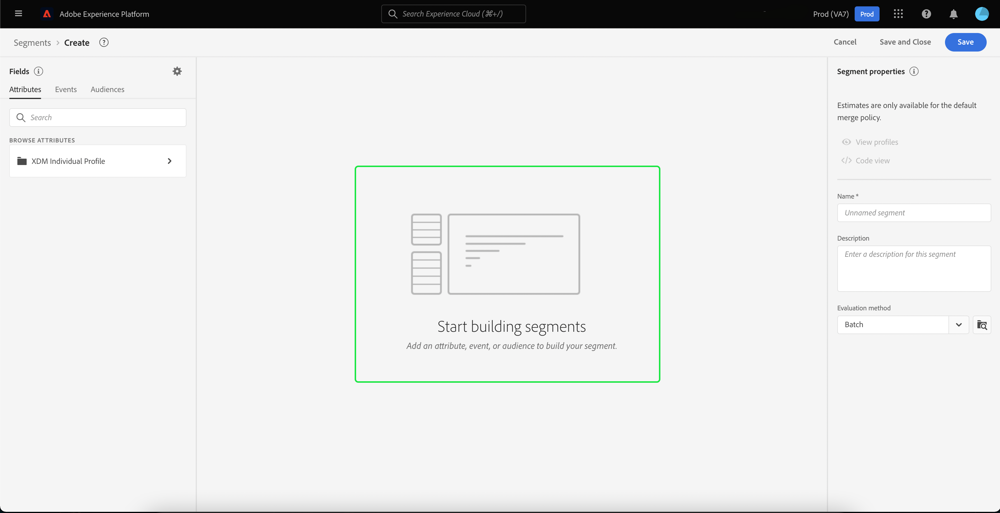
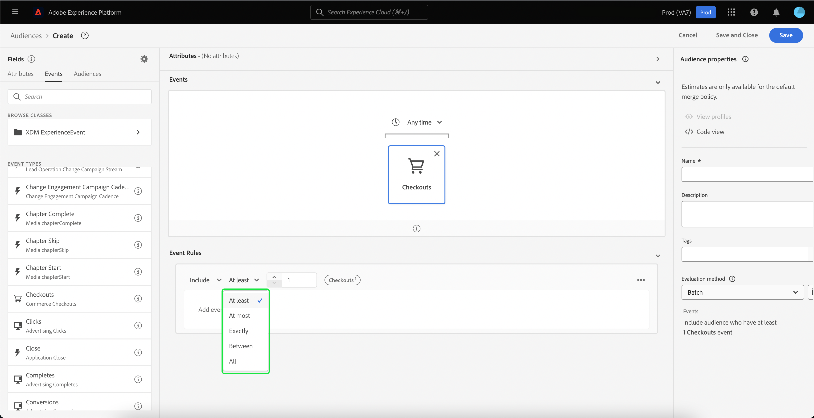
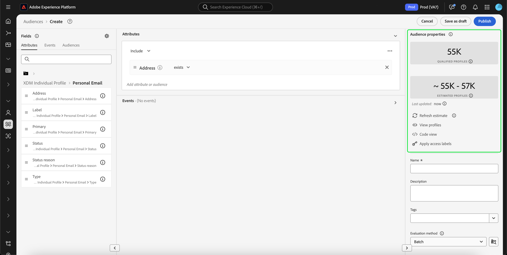

# [!DNL Segment Builder] UI指南

[!DNL Segment Builder] 提供豐富的工作區，可讓您與 [!DNL Profile] 資料元素。 工作區提供建立和編輯規則的直覺式控制項，例如用來表示資料屬性的拖放圖磚。

## 區段定義建置區塊 {#building-blocks}

>[!CONTEXTUALHELP]
>id="platform_segments_createsegment_segmentbuilder_fields"
>title="欄位"
>abstract="組成區段的三個欄位類型為屬性、事件和對象。 屬性可讓您使用屬於XDM個別設定檔類別的設定檔屬性、事件可讓您根據使用XDM ExperienceEvent資料元素所發生的動作或事件建立對象，而對象則可讓您使用外部來源匯入的對象。"

區段定義的基本組成要素為屬性和事件。 此外，現有對象中包含的屬性和事件也可作為新定義的元件。

您可以在 **[!UICONTROL 欄位]** 區段 [!DNL Segment Builder] 工作區。 **[!UICONTROL 欄位]** 包含每個主要建置區塊的索引標籤：&quot;[!UICONTROL 屬性]&quot;, &quot;[!UICONTROL 事件]&quot;和&quot;[!UICONTROL 對象]」。

### 屬性

此 **[!UICONTROL 屬性]** 索引標籤可讓您瀏覽 [!DNL Profile] 屬於的屬性 [!DNL XDM Individual Profile] 類別。 每個資料夾都可展開，以顯示其他屬性，其中每個屬性都是一個圖磚，可拖曳至工作區中央的規則產生器畫布上。 此 [規則產生器畫布](#rule-builder-canvas) 在本指南的稍後部分會詳細說明。

### 活動

此 **[!UICONTROL 事件]** 標籤可讓您根據使用 [!DNL XDM ExperienceEvent] 資料元素。 您也可以在 **[!UICONTROL 事件]** 索引標籤，此為常用事件的集合，可讓您更快速建立區段。

除了能夠瀏覽 [!DNL ExperienceEvent] 元素，您也可以搜尋事件類型。 事件類型使用與相同的編碼邏輯 [!DNL ExperienceEvents]，而無須透過 [!DNL XDM ExperienceEvent] 類別，尋找正確的事件。 例如，使用搜尋列來搜尋「購物車」時，會傳回「事件類型」[!UICONTROL AddCart]&quot;和&quot;[!UICONTROL RemoveCart]「 」，這是建立區段定義時最常用的兩個購物車動作。

您可以在搜尋列中輸入元件名稱，以搜尋任何類型的元件，搜尋列會使用 [Lucene的搜索語法](https://docs.microsoft.com/en-us/azure/search/query-lucene-syntax). 在輸入整個字詞時，搜尋結果會開始填入。 例如，若要根據XDM欄位建立規則 `ExperienceEvent.commerce.productViews`，開始在搜尋欄位中輸入「產品檢視」。 輸入&quot;product&quot;一字後，搜尋結果就會開始顯示。 每個結果都包含其所屬的物件階層。

>[!NOTE]
>
>貴組織定義的自訂結構欄位可能需要最多24小時才會顯示，並可在建立規則時使用。

然後，您可以輕鬆拖放 [!DNL ExperienceEvents] 和[!UICONTROL 事件類型]」填入區段定義中。

依預設，只會顯示資料存放區中填入的結構欄位。 這包括「[!UICONTROL 事件類型]」。 若[!UICONTROL 事件類型]&quot;清單不可見，或者您只能選擇&quot;[!UICONTROL 任何]&quot;作為&quot;[!UICONTROL 事件類型]」，選擇 **齒輪表徵圖** 下一頁 **[!UICONTROL 欄位]**，然後選取 **[!UICONTROL 顯示完整的XDM架構]** 在 **[!UICONTROL 可用欄位]**. 選取 **齒輪表徵圖** 返回 **[!UICONTROL 欄位]** 頁簽，您現在應該可以檢視多個「[!UICONTROL 事件類型]「 」和綱要欄位，無論其是否包含資料。

#### Adobe Analytics報表套裝資料集

您可以使用單一或多個Adobe Analytics報表套裝的資料做為區段內的事件。

使用單一Analytics報表套裝的資料時，Platform會自動將描述元和好記名稱新增至eVar，以便在中尋找這些欄位 [!DNL Segment Builder].

使用來自多個Analytics報表套裝的資料時，平台 **不能** 自動將描述元或好記名稱新增至eVar。 因此，您必須先對應至XDM欄位，才能使用Analytics報表套裝的資料。 如需將Analytics變數對應至XDM的詳細資訊，請參閱 [Adobe Analytics來源連線指南](../../sources/tutorials/ui/create/adobe-applications/analytics.md#mapping).

例如，假設您有兩個報表套裝，且變數如下：

| 欄位 | 報表套裝結構A | 報表套裝結構B |
| ----- | --------------------- | --------------------- |
| eVar1 | 反向連結網域 | 登入Y/N |
| eVar2 | 頁面名稱 | 會員忠誠度ID |
| eVar3 | URL | 頁面名稱 |
| eVar4 | 搜尋詞 | 產品名稱 |
| event1 | 點擊次數 | 頁面檢視 |
| event2 | 頁面檢視 | 購物車新增 |
| event3 | 購物車新增 | 結帳 |
| event4 | 購買 | 購買 |

在此情況下，您可以使用下列結構來對應兩個報表套裝：

>[!NOTE]
>
>一般eVar值仍會填入，您應 **not** 在區段定義中使用它們（如果可能），因為值可能具有與其報表中原本不同的意義。

報表套裝完成對應後，您就可以在與設定檔相關的工作流程和區段中使用這些新對應的欄位。

| 情境 | 聯合結構體驗 | 區段通用變數 | 區段對應變數 |
| -------- | ----------------------- | ----------------------------- | ---------------------------- |
| 單一報表套裝 | 易記名稱描述符隨通用變數一起包含。   **範例：** 頁面名稱(eVar2) | <ul><li>包含通用變數的友好名稱描述符</li><li>查詢使用特定資料集的資料，因為這是唯一一個</li></ul> | 查詢可使用Adobe Analytics資料和潛在的其他來源。 |
| 多報表套裝 | 一般變數不包含好記的名稱描述元。   **範例：** eVar2 | <ul><li>任何包含多個描述元的欄位都會顯示為一般。 這表示UI中沒有好記的名稱。</li><li>查詢可以使用包含eVar的任何資料集的資料，這可能導致混合或錯誤的結果。</li></ul> | 查詢會使用多個資料集的正確合併結果。 |

### 對象

此 **[!UICONTROL 對象]** 索引標籤會列出從外部來源(例如Adobe Audience Manager)匯入的所有對象，以及在中建立的對象 [!DNL Experience Platform].

在 **[!UICONTROL 對象]** 標籤中，您可以將所有可用源作為一組資料夾來查看。 選取資料夾時，可以看到可用的子資料夾和對象。 此外，您可以選取資料夾圖示（如最右側影像所示）以檢視資料夾結構（勾選記號表示您目前所在的資料夾），並透過選取樹狀結構中資料夾的名稱來輕鬆導覽資料夾。

您可以將游標暫留在對象ⓘ旁的上方，以檢視對象的相關資訊，包括其ID、說明，以及資料夾階層，以便找出對象。

您也可以使用搜尋列來搜尋對象，這會利用 [Lucene的搜索語法](https://docs.microsoft.com/en-us/azure/search/query-lucene-syntax). 在 **[!UICONTROL 對象]** 頁簽，則選擇頂層資料夾會顯示搜索欄，從而允許您在該資料夾中進行搜索。 只有輸入完整的字詞後，搜尋結果才會開始填入。 例如，若要尋找名為 `Online Shoppers`，開始在搜尋列中輸入「線上」。 完整輸入「Online」後，將顯示包含「Online」字的搜索結果。

## 規則產生器畫布 {#rule-builder-canvas}

區段定義是一組規則，用於描述目標對象的關鍵特徵或行為。 這些規則是使用位於 [!DNL Segment Builder].

若要將新規則新增至區段定義，請從 **[!UICONTROL 欄位]** 標籤，並將其拖曳至規則產生器畫布。 接著，系統會根據要新增的資料類型，為您顯示內容特定選項。 可用的資料類型包括：字串，日期， [!DNL ExperienceEvents], &quot;[!UICONTROL 事件類型]「和對象。

>[!IMPORTANT]
>
>Adobe Experience Platform的最新變更已更新 `OR` 和 `AND` 事件之間的邏輯運算子。 這些更新不會影響現有區段。 但是，對現有區段和新區段建立的所有後續更新都將受到這些變更的影響。 請閱讀 [時間常數更新](./segment-refactoring.md) 以取得更多資訊。

為屬性選取值時，您會看到屬性可以是的列舉值清單。

如果從列舉清單中選取值，則會以實體邊框框列出值。 不過，對於使用 `meta:enum` （可變）列號，您也可以選取 **not** 從列清單中。 如果您建立自己的值，則會以虛線邊框列出值，並發出警告，指出此值不在列舉清單中。

### 新增對象

您可以從 **[!UICONTROL 對象]** 標籤至規則產生器畫布上，以參考新區段定義中的對象成員資格。 這可讓您在新區段規則中，將對象成員資格納入或排除為屬性。

針對 [!DNL Platform] 使用 [!DNL Segment Builder]，您可以選擇將對象轉換為該對象在區段定義中使用的規則集。 此轉換會製作規則邏輯的復本，然後可在不影響原始區段定義的情況下加以修改。 將區段定義轉換為規則邏輯之前，請確定您已儲存區段定義的近期變更。

>[!NOTE]
>
>從外部來源新增對象時，只會參考對象成員資格。 您無法將對象轉換為規則，因此，用於建立原始對象的規則無法在新區段定義中修改。

如果對象轉換為規則時發生任何衝突， [!DNL Segment Builder] 會盡量保留現有選項。

### 程式碼檢視

或者，您也可以檢視中建立之規則的程式碼版本，該規則以 [!DNL Segment Builder]. 在規則產生器畫布中建立規則後，您就可以選取 **[!UICONTROL 程式碼檢視]** 將區段顯示為PQL。

程式碼檢視提供一個按鈕，可讓您複製要在API呼叫中使用的區段值。 若要取得最新版區段，請確定您已儲存區段的最新變更。

### 聚合函式

中的匯總 [!DNL Segment Builder] 是對資料類型為數字（雙倍或整數）的一組XDM屬性的計算。 「區段產生器」中支援的四個匯總函式為SUM、AVERAGE、MIN和MAX。

若要建立匯總函式，請從左側邊欄選取事件，然後將其插入 [!UICONTROL 事件] 容器。

將事件放入「事件」容器中後，選取點圖示(...)，接著 **[!UICONTROL 匯總]**.

現在已新增匯總。 您現在可以選取匯總函式、選擇要匯總的屬性、相等函式以及值。 在以下範例中，此區段會限定任何購買值總和大於$100的設定檔，即使每次個別購買小於$100亦然。

### 計數函式 {#count-functions}

區段產生器中的計數函式可用來尋找指定的事件並計算完成的次數。 「區段產生器」中支援的計數函式為「至少」、「最多」、「精確」、「介於」和「全部」。

若要建立計數函式，請從左側邊欄選取事件，並將其插入 [!UICONTROL 事件] 容器。

將事件放入「事件」容器中後，請選取 [!UICONTROL 至少1] 按鈕。

現在已新增計數函式。 您現在可以選取計數函式和函式的值。 以下範例將包含至少點擊一次的事件。

## 容器

區段規則的評估順序為。 容器可透過使用巢狀查詢來控制執行順序。

在您將至少一個圖磚新增至規則產生器畫布後，就可以開始新增容器。 若要建立新容器，請選取圖磚右上角的點(...)，然後選取 **[!UICONTROL 新增容器]**.

新容器顯示為第一個容器的子容器，但您可以拖曳和移動容器來調整階層。 容器的預設行為為「[!UICONTROL 包括]「提供的屬性、事件或對象。 您可以將規則設為「[!UICONTROL 排除]」符合容器條件的設定檔，請選取 **[!UICONTROL 包括]** ，然後選取「[!UICONTROL 排除]」。

您也可以選取子容器上的「取消包裝容器」，以內嵌方式擷取子容器並新增至父容器。 選取子容器右上角的點(...)以存取此選項。

選取 **[!UICONTROL 取消包裝容器]** 子容器即會移除，條件會內嵌顯示。

>[!NOTE]
>
>展開容器時，請留意邏輯是否仍符合所需的區段定義。

## 合併策略

[!DNL Experience Platform] 可讓您從多個來源匯整資料，並加以結合，以便查看每個客戶的完整檢視。 將這些資料放在一起時，合併策略是 [!DNL Platform] 用來決定資料的優先順序，以及將結合哪些資料以建立設定檔。

您可以選取符合您針對此對象之行銷目的的合併原則，或使用 [!DNL Platform]. 您可以建立組織特有的多個合併原則，包括建立自己的預設合併原則。 如需為貴組織建立合併原則的逐步指示，請先閱讀 [合併策略概述](../../profile/merge-policies/overview.md).

若要為區段定義選取合併原則，請選取 **[!UICONTROL 欄位]** 標籤，然後使用 **[!UICONTROL 合併策略]** 下拉式功能表，選取您要使用的合併原則。

## 區段屬性 {#segment-properties}

>[!CONTEXTUALHELP]
>id="platform_segments_createsegment_segmentbuilder_segmentproperties"
>title="區段屬性"
>abstract="區段屬性區段會顯示所產生區段的預估大小，顯示與設定檔總數比較的合格設定檔數。 這可讓您在建立對象本身之前，視需要調整區段定義。"

>[!CONTEXTUALHELP]
>id="platform_segments_createsegment_segmentbuilder_refreshestimate"
>title="更新估計"
>abstract="您可以重新整理區段的估計值，立即預覽有多少個設定檔符合建議的區段。 觀眾預估是使用當天範例資料的樣本大小產生。"
>additional-url="https://experienceleague.adobe.com/docs/experience-platform/segmentation/tutorials/create-a-segment.html?lang=en#estimate-and-preview-an-audience" text="預估和預覽受眾"

建立區段定義時， **[!UICONTROL 區段屬性]** 工作區右側的區段會顯示所產生區段的預估大小，讓您在建立對象本身之前，可視需要調整區段定義。

此 **[!UICONTROL 區段屬性]** 區段也可讓您指定區段定義的重要資訊，包括名稱、說明和評估類型。 區段定義名稱是用來在組織定義的區段中識別區段，因此應具有描述性、簡潔明瞭且獨特。

當您繼續建立區段定義時，可以透過選取 **[!UICONTROL 檢視設定檔]**.

>[!NOTE]
>
>觀眾預估是使用當天範例資料的樣本大小產生。 如果您的設定檔存放區中實體少於100萬個，則會使用完整資料集；100萬至2000萬個實體使用100萬個實體；超過2,000萬個實體，佔實體總數的5%。 有關產生區段估計的詳細資訊，請參閱 [估計生成部分](../tutorials/create-a-segment.md#estimate-and-preview-an-audience) 區段建立教學課程中的。

您也可以選取評估方法。 如果您知道要使用哪種評估方法，可以使用下拉清單選擇所需的評估方法。 如果您想要知道此區段符合的評估類型，可以選取瀏覽圖示  ，查看可用區段評估方法的清單。

此 [!UICONTROL 評價方法資格] 彈出視窗隨即出現。 此彈出視窗會顯示可用的評估方法，包括批次、串流和邊緣。 彈出式視窗會顯示哪些評估方法符合資格和不符合資格。 視您在區段定義中使用的參數而定，它可能不符合特定評估方法的資格。 有關每種評估方法要求的詳細資訊，請閱讀 [串流細分](./streaming-segmentation.md#query-types) 或 [邊緣分割](./edge-segmentation.md#query-types) 概述。

如果您選擇了無效的評估方法，系統將提示您更改段定義規則或更改評估方法。

有關不同區段定義評估方法的詳細資訊，請參閱 [細分概述](../home.md#evaluate-segments).

## 後續步驟 {#next-steps}

區段產生器提供豐富的工作流程，讓您將有價對象與 [!DNL Real-Time Customer Profile] 資料。 閱讀本指南後，您現在應該能夠：

- 使用屬性、事件和現有對象的組合作為建置區塊，建立區段定義。
- 使用規則產生器畫布和容器來控制執行區段規則的順序。
- 檢視潛在對象的預估值，以便您視需要調整區段定義。
- 啟用排程分段的所有區段定義。
- 為串流細分啟用指定的區段定義。

若要深入了解 [!DNL Segmentation Service]，請繼續閱讀本檔案，並觀看相關影片以補充您的學習內容。 若要進一步了解 [!DNL Segmentation Service] UI，請閱讀 [[!DNL Segmentation Service] 使用手冊](./overview.md)
