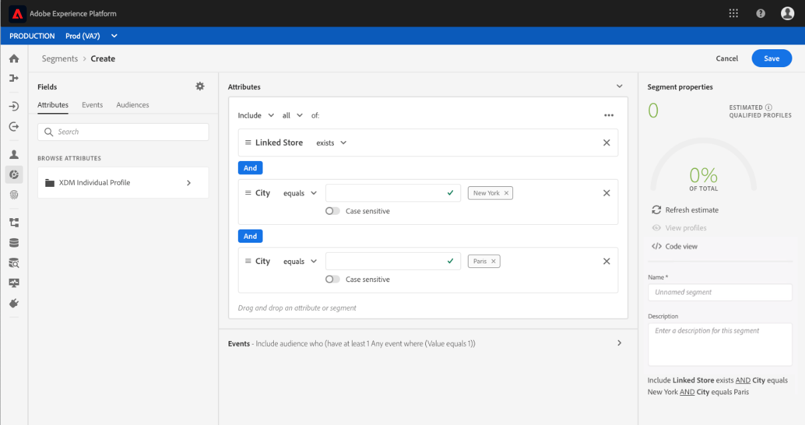

# [!DNL Segment Builder] UI指南

[!DNL Segment Builder] 提供多樣化工作區，讓您與資料元素 [!DNL Profile] 互動。工作區提供建立和編輯規則的直覺式控制項，例如用來表示資料屬性的拖放圖格。

## 區段定義構建區塊

區段定義的基本建置區塊是屬性和事件。 此外，現有觀眾中所包含的屬性和事件也可以當做新定義的元件使用。

您可以在[!DNL Segment Builder]工作區左側的&#x200B;**[!UICONTROL Fields]**&#x200B;區段中看到這些構建塊。 **[!UICONTROL Fields]** 包含每個主要構建塊的標籤：&quot;[!UICONTROL Attributes]&quot;、[!UICONTROL Events]&quot;和&quot;[!UICONTROL Audiences]&quot;。

### 屬性

**[!UICONTROL Attributes]**&#x200B;頁籤允許您瀏覽屬於[!DNL XDM Individual Profile]類的[!DNL Profile]屬性。 每個檔案夾都可展開以顯示其他屬性，其中每個屬性都是一個方塊，可拖曳至工作區中央的規則產生器畫布上。 本指南稍後會詳細討論[規則產生器畫布](#rule-builder-canvas)。

### 事件

**[!UICONTROL Events]**&#x200B;標籤可讓您根據使用[!DNL XDM ExperienceEvent]資料元素發生的事件或動作來建立對象。 您也可以在&#x200B;**[!UICONTROL Events]**&#x200B;標籤上找到事件類型，這是常用事件的集合，可讓您更快速地建立區段。

除了能夠瀏覽[!DNL ExperienceEvent]元素之外，您還可以搜尋事件類型。 事件類型使用與[!DNL ExperienceEvents]相同的編碼邏輯，而不需要您透過[!DNL XDM ExperienceEvent]類別搜尋，以尋找正確的事件。 例如，使用搜尋列來搜尋「購物車」會傳回「事件類型」「[!UICONTROL AddCart]」和「[!UICONTROL RemoveCart]」，這兩個動作是建立區段定義時最常用的兩種購物車動作。

您可在搜尋列中輸入其名稱來搜尋任何類型的元件，搜尋列使用[Lucene的搜尋語法](https://docs.microsoft.com/en-us/azure/search/query-lucene-syntax)。 當輸入整個字詞時，搜尋結果開始填入。 例如，若要根據XDM欄位`ExperienceEvent.commerce.productViews`建立規則，請開始在搜尋欄位中輸入「產品檢視」。 輸入&quot;product&quot;後，搜尋結果就會開始顯示。 每個結果都包括它所屬的對象層次。

>[!NOTE]
>
>您的組織定義的自訂結構欄位可能需要24小時才能顯示，並可用於建立規則。

然後，您可以輕鬆將[!DNL ExperienceEvents]和&quot;[!UICONTROL Event Types]&quot;拖放至區段定義中。

依預設，只會顯示資料儲存區中已填入的架構欄位。 其中包括 &quot;[!UICONTROL Event Types]&quot;. 如果「[!UICONTROL Event Types]」清單不可見，或者您只能選擇「[!UICONTROL Any]」作為「[!UICONTROL Event Type]」，請選擇&#x200B;**[!UICONTROL Fields]**&#x200B;旁邊的&#x200B;**齒輪表徵圖**，然後選擇&#x200B;**[!UICONTROL Available Fields]**&#x200B;下的&#x200B;**[!UICONTROL Show full XDM schema]**。 再次選擇&#x200B;**齒輪表徵圖**&#x200B;以返回&#x200B;**[!UICONTROL Fields]**&#x200B;頁籤，您現在應該可以查看多個&quot;[!UICONTROL Event Types]&quot;和模式欄位，無論這些欄位是否包含資料。

### 受眾

**[!UICONTROL Audiences]**&#x200B;標籤會列出從外部來源匯入的所有對象，例如Adobe Audience Manager，以及在[!DNL Experience Platform]中建立的對象。

在&#x200B;**[!UICONTROL Audiences]**&#x200B;標籤中，您可以將所有可用來源視為資料夾群組。 當您選取資料夾時，可檢視可用的子資料夾和對象。 此外，您可以選取資料夾圖示（如最右側的影像所示），以檢視資料夾結構（核取標籤表示您目前所在的資料夾），並透過選取樹狀結構中資料夾的名稱，輕鬆地在資料夾間導覽。

您可以將滑鼠指標暫留在ⓘ對象旁，以檢視有關對象的資訊，包括其ID、說明和資料夾階層，以找出對象。

您也可以使用搜尋列來搜尋對象，搜尋列使用[Lucene的搜尋語法](https://docs.microsoft.com/en-us/azure/search/query-lucene-syntax)。 在&#x200B;**[!UICONTROL Audiences]**&#x200B;標籤上，選擇頂層資料夾會顯示搜索欄，允許您在該資料夾中進行搜索。 只有輸入完整字詞後，搜尋結果才會開始填入。 例如，若要尋找名為`Online Shoppers`的對象，請開始在搜尋列中輸入&quot;Online&quot;。 在完整輸入&quot;Online&quot;後，會顯示包含&quot;Online&quot;的搜尋結果。

## 規則產生器畫布{#rule-builder-canvas}

區段定義是用於描述目標對象之主要特性或行為的規則集合。 這些規則是使用位於[!DNL Segment Builder]中心的規則產生器畫布來建立。

若要將新規則新增至區段定義，請從&#x200B;**[!UICONTROL Fields]**&#x200B;標籤拖曳圖格至規則產生器畫布。 然後，您會根據所新增資料的類型，看到內容特定的選項。 可用的資料類型包括：字串、日期、[!DNL ExperienceEvents]、&quot;[!UICONTROL Event Types]&quot;和觀眾。

>[!IMPORTANT]
>
>對Adobe Experience Platform的最新更改已更新了事件之間`OR`和`AND`邏輯運算子的用法。 這些更新不會影響現有區段。 不過，現有區段和建立新區段的所有後續更新都會受到這些變更的影響。 請閱讀[時間常數update](./segment-refactoring.md)以取得詳細資訊。

### 新增觀眾

您可以從&#x200B;**[!UICONTROL Audience]**&#x200B;標籤將對象拖放至規則產生器畫布，以參考新區段定義中的對象成員資格。 這可讓您在新區段規則中加入或排除對象成員資格作為屬性。

對於使用[!DNL Segment Builder]建立的[!DNL Platform]對象，您可以選擇將對象轉換為該對象的區段定義中使用的規則集。 此轉換會建立規則邏輯的復本，然後可修改該邏輯，而不會影響原始區段定義。 在將區段定義轉換為規則邏輯之前，請確定您已儲存區段定義的任何最近變更。

>[!NOTE]
>
>從外部來源新增對象時，只會參考對象會籍。 您無法將對象轉換為規則，因此，用於建立原始對象的規則無法在新區段定義中修改。

如果在將觀眾轉換為規則時發生任何衝突，[!DNL Segment Builder]會嘗試將現有選項保留為其最佳功能。

### 程式碼檢視

或者，您也可以檢視在[!DNL Segment Builder]中建立之規則的程式碼版本。 在規則產生器畫布中建立規則後，您可以選取&#x200B;**[!UICONTROL Code view]**&#x200B;將區段視為PQL。

程式碼檢視提供一個按鈕，可讓您複製要用於API呼叫的區段值。 若要取得區段的最新版本，請確定您已儲存區段的最新變更。

### 聚集函式

[!DNL Segment Builder]中的聚合是對一組XDM屬性的計算，其資料類型是數字（雙倍或整數）。 「區段產生器」中支援的四個匯總函式為SUM、AVERAGE、MIN和MAX。

若要建立匯總函式，請從左側欄選取事件，並將它插入[!UICONTROL Events]容器。

將事件放入「事件」容器後，選取省略號圖示(...)，後面接著&#x200B;**[!UICONTROL Aggregate]**。

現在添加了聚合。 您現在可以選擇聚集函式、選擇要聚集的屬性、等式函式以及值。 對於下列範例，此區段將符合任何已購買值總和大於$100的描述檔，即使個別購買小於$100亦然。

### 計數函式

「區段產生器」中的計數功能可用來尋找指定的事件並計算它們完成的次數。 「區段產生器」中支援的計數功能有「至少」、「最多」、「完全」、「介於」和「全部」。

若要建立計數函式，請從左側欄選取事件，並將其插入[!UICONTROL Events]容器。

將事件放入「事件」容器後，請選取[!UICONTROL At least 1]按鈕。

現在已新增count函式。 您現在可以選取count函式和函式的值。 以下範例將包含任何至少有一次點按的事件。

## 容器

區段規則依其列出順序進行評估。 容器允許使用巢狀查詢來控制執行順序。

在規則產生器畫布中至少新增一個方塊後，您就可以開始新增容器。 若要建立新容器，請選取圖格右上角的橢圓(...)，然後選取&#x200B;**[!UICONTROL Add container]**。

新容器會以第一個容器的子系出現，但您可以拖曳並移動容器來調整階層。 容器的預設行為是「[!UICONTROL Include]」提供的屬性、事件或對象。 您可以在方塊的左上角選取&#x200B;**[!UICONTROL Include]**&#x200B;並選取「[!UICONTROL Exclude]」，將規則設定為符合容器條件的「[!UICONTROL Exclude]」描述檔。

子容器也可以透過選取子容器上的「解除包裝容器」，以內嵌方式擷取並新增至父容器。 選取子容器右上角的省略號(...)以存取此選項。

選擇&#x200B;**[!UICONTROL Unwrap container]**&#x200B;後，子容器即被移除，標準會內嵌顯示。

>[!NOTE]
>
>展開容器時，請小心邏輯是否仍符合所需的區段定義。

## 合併原則

[!DNL Experience Platform] 可讓您從多個來源匯整資料並加以合併，以便瞭解每個客戶的完整視圖。合併策略是[!DNL Platform]用於確定資料的優先順序以及將哪些資料合併以建立配置檔案的規則，將這些資料合併在一起。

您可以選取符合此對象行銷目的的合併原則，或使用[!DNL Platform]提供的預設合併原則。 您可以建立組織專屬的多個合併原則，包括建立您自己的預設合併原則。 有關為組織建立合併策略的逐步說明，請參閱有關使用UI](../../profile/ui/merge-policies.md)使用合併策略的[教程。

要為段定義選擇合併策略，請在&#x200B;**[!UICONTROL Fields]**&#x200B;頁籤上選擇齒輪表徵圖，然後使用&#x200B;**[!UICONTROL Merge Policy]**&#x200B;下拉菜單來選擇要使用的合併策略。

## 區段屬性

建立區段定義時，工作區右側的&#x200B;**[!UICONTROL Segment Properties]**&#x200B;區段會顯示產生區段的預估大小，讓您在建立觀眾本身之前，視需要調整區段定義。

**[!UICONTROL Segment Properties]**&#x200B;區段也可以指定區段定義的重要資訊，包括其名稱和說明。 區段定義名稱用於識別組織所定義的區段，因此應具有描述性、簡明扼要和獨特性。

當您繼續建立區段定義時，您可以選取&#x200B;**[!UICONTROL View Profiles]**&#x200B;來檢視對象的編頁預覽。

>[!NOTE]
>
>觀眾估計是使用當天樣本資料的樣本大小產生。 如果您的描述檔儲存區中有少於100萬個實體，則會使用完整資料集；100萬到2000萬個單位使用100萬個單位；超過2000萬個單位，佔全部單位的5%。 有關產生區段估計的更多資訊，請參閱區段建立教學課程的[估計產生區段](../tutorials/create-a-segment.md#estimate-and-preview-an-audience)。

## 下一步 {#next-steps}

「區段產生器」提供豐富的工作流程，讓您將有價對象與[!DNL Real-time Customer Profile]資料隔離。 閱讀本指南後，您現在可以：

- 使用屬性、事件和現有對象的組合來建立區段定義，做為建立區塊。
- 使用規則產生器畫布和容器來控制區段規則的執行順序。
- 檢視您潛在讀者的估計值，讓您視需要調整區段定義。
- 為排程的區段啟用所有區段定義。
- 為串流區段啟用指定的區段定義。

若要進一步瞭解[!DNL Segmentation Service]，請繼續閱讀檔案並觀賞相關影片以補充您的學習。 若要進一步瞭解[!DNL Segmentation Service] UI的其他部分，請閱讀[[!DNL Segmentation Service] 使用指南](./overview.md)
