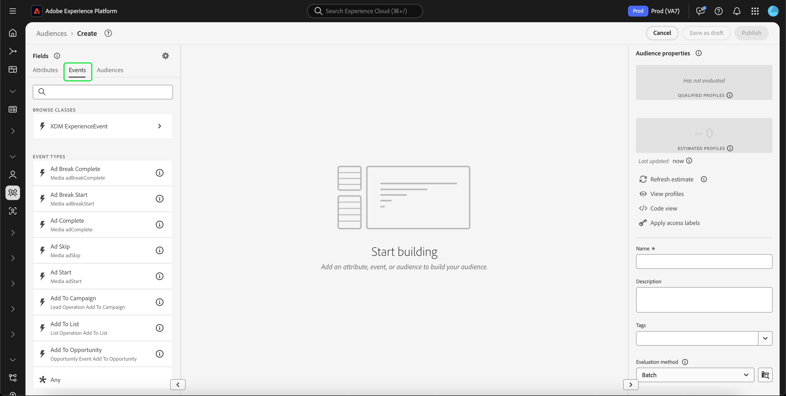
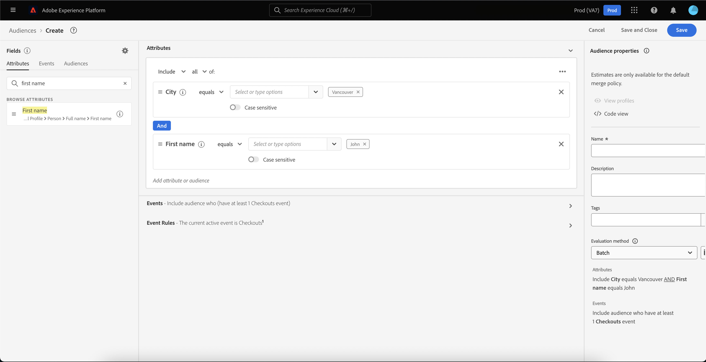

# [!DNL Segment Builder] UI指南

>[!NOTE]
>
>本指南說明如何透過建立受眾 **區段定義** 使用區段產生器。 若要瞭解如何使用對象構成來建立對象，請參閱 [對象構成UI指南](./audience-composition.md).

[!DNL Segment Builder] 提供豐富的工作區，讓您與互動 [!DNL Profile] 資料元素。 工作區提供用於建置和編輯規則的直覺式控制項，例如用來表示資料屬性的拖放圖磚。

## 區段定義建置區塊 {#building-blocks}

>[!CONTEXTUALHELP]
>id="platform_segments_createsegment_segmentbuilder_fields"
>title="欄位"
>abstract="構成區段定義的三種欄位型別為屬性、事件和受眾。 屬性可讓您使用屬於XDM Individual Profile類別的設定檔屬性，事件可讓您根據使用XDM ExperienceEvent資料元素發生的動作或事件來建立對象，而對象則可讓您使用從外部來源匯入的對象。"

區段定義的基本建置區塊是屬性和事件。 此外，現有對象中包含的屬性和事件可作為新定義的元件。

您可在下列欄位中看到這些建置區塊： **[!UICONTROL 欄位]** 左側部分 [!DNL Segment Builder] 工作區。 **[!UICONTROL 欄位]** 包含每個主要建置區塊的標籤： 」[!UICONTROL 屬性]「， 」[!UICONTROL 活動]「」和「[!UICONTROL 受眾]「。

### 屬性

此 **[!UICONTROL 屬性]** 標籤可讓您瀏覽 [!DNL Profile] 屬於 [!DNL XDM Individual Profile] 類別。 每個資料夾都可以展開以顯示其他屬性，其中每個屬性都是一個可拖曳至工作區中央規則產生器畫布的圖磚。 此 [規則產生器畫布](#rule-builder-canvas) 本指南的稍後章節將更詳細地討論。

### 活動

此 **[!UICONTROL 活動]** 索引標籤可讓您根據使用發生的事件或動作建立對象 [!DNL XDM ExperienceEvent] 資料元素。 您也可以在以下網址找到事件型別： **[!UICONTROL 活動]** 索引標籤是常用事件的集合，可讓您更快速地建立區段定義。

除了能夠瀏覽 [!DNL ExperienceEvent] 元素中，您也可以搜尋事件型別。 事件型別使用的編碼邏輯與相同 [!DNL ExperienceEvents]，不需您逐一搜尋 [!DNL XDM ExperienceEvent] 尋找正確事件的類別。 例如，使用搜尋列搜尋「cart」會傳回事件型別[!UICONTROL AddCart]「和」[!UICONTROL RemoveCart]「」，這是建立區段定義時最常用的兩個購物車動作。

任何型別的元件都可透過在搜尋列中輸入名稱來搜尋，該搜尋列使用 [Lucene的搜尋語法](https://docs.microsoft.com/en-us/azure/search/query-lucene-syntax). 輸入整個字詞時，搜尋結果會開始填入。 例如，根據XDM欄位建置規則 `ExperienceEvent.commerce.productViews`，開始在搜尋欄位中輸入「產品檢視」。 輸入「product」一詞後，搜尋結果就會開始出現。 每個結果都包含其所屬的物件階層。

>[!NOTE]
>
>貴組織定義的自訂結構欄位最多可能需要24小時的時間才會顯示，並且可在建置規則中使用。

然後您就可以輕鬆拖放 [!DNL ExperienceEvents] 和&quot;[!UICONTROL 事件型別]」放入您的區段定義中。

依預設，只會顯示資料存放區中填入的結構欄位。 其中包括&quot;[!UICONTROL 事件型別]「。 若此&quot;[!UICONTROL 事件型別]「清單不可見，或您只能選擇」[!UICONTROL 任何]&quot;作為&quot;[!UICONTROL 事件型別]&quot;，選擇 **齒輪圖示** 旁邊 **[!UICONTROL 欄位]**，然後選取 **[!UICONTROL 顯示完整XDM結構描述]** 在 **[!UICONTROL 可用欄位]**. 選取 **齒輪圖示** 再次返回至 **[!UICONTROL 欄位]** 標籤，您現在應該能夠檢視多個&quot;[!UICONTROL 事件型別]」和結構描述欄位，無論它們是否包含資料。

#### Adobe Analytics報表套裝資料集

您可以將單一或多個Adobe Analytics報表套裝的資料當成區段內的事件使用。

使用單一Analytics報告套裝的資料時，Platform會自動新增描述項和易記名稱至eVar，以便更輕鬆地在其中尋找這些欄位 [!DNL Segment Builder].

使用來自多個Analytics報表套裝的資料時， Platform **無法** 自動將描述項或易記名稱新增至eVar。 因此，您必須先對應至XDM欄位，才能使用Analytics報表套裝的資料。 有關將Analytics變數對應至XDM的詳細資訊，請參閱 [Adobe Analytics來源連線指南](../../sources/tutorials/ui/create/adobe-applications/analytics.md#mapping).

例如，假設您有兩個報表套裝包含以下變數：

| 欄位 | 報表套裝結構描述A | 報告套裝結構描述B |
| ----- | --------------------- | --------------------- |
| EVAR1 | 反向連結網域 | 登入Y/N |
| EVAR2 | 頁面名稱 | 會員忠誠度ID |
| EVAR3 | URL | 頁面名稱 |
| EVAR4 | 搜尋字詞 | 產品名稱 |
| event1 | 點按 | 頁面檢視 |
| event2 | 頁面檢視 | 購物車新增 |
| event3 | 購物車新增 | 結帳次數 |
| event4 | 購買次數 | 購買次數 |

在此情況下，您可以使用以下結構描述對應這兩個報表套裝：

>[!NOTE]
>
>雖然一般eVar值仍會填入，但您應： **非** 在區段定義中使用這些值（如有可能），因為這些值的意義可能和值原先在報表中的意義不同。

報告套裝對應後，您即可在設定檔相關工作流程和區段中使用這些新對應的欄位。

| 情境 | 聯合結構描述體驗 | 分段通用變數 | 分段對應變數 |
| -------- | ----------------------- | ----------------------------- | ---------------------------- |
| 單一報告套裝 | 泛型變數中包含易記名稱描述項。   **範例：** 頁面名稱(eVar2) | <ul><li>泛型變數中包含的易記名稱描述項</li><li>查詢使用來自特定資料集的資料，因為這是唯一使用資料</li></ul> | 查詢可以使用Adobe Analytics資料，也可能使用其他來源。 |
| 多報表套裝 | 泛型變數未包含任何易記名稱描述元。   **範例：** EVAR2 | <ul><li>任何具有多個描述元的欄位都會顯示為一般。 這表示UI中未出現任何好記的名稱。</li><li>查詢可以使用任何包含eVar的資料集中的資料，這可能會導致混合或不正確的結果。</li></ul> | 查詢會正確使用來自多個資料集的合併結果。 |

### 對象

>[!NOTE]
>
>對於在Platform內建立的對象，僅限具有 **相同** 將會顯示合併原則。

此 **[!UICONTROL 受眾]** 索引標籤會列出從外部來源(例如Adobe Audience Manager或Customer Journey Analytics)匯入的所有對象，以及在中建立的對象 [!DNL Experience Platform].

在 **[!UICONTROL 受眾]** 索引標籤中，您可以將所有可用的來源視為一組資料夾。 選取資料夾時，可以看到可用的子資料夾和對象。 此外，您可以選取資料夾圖示（如最右邊影像所示）來檢視資料夾結構（核取記號代表您目前所在的資料夾），並藉由選取樹狀結構中資料夾的名稱，輕鬆導覽至資料夾。

您可以將滑鼠停留在對象旁的ⓘ結上，即可檢視對象的相關資訊，包括其ID、說明，以及用來尋找對象的資料夾階層。

您也可以使用搜尋列來搜尋對象，此搜尋列會利用 [Lucene的搜尋語法](https://docs.microsoft.com/en-us/azure/search/query-lucene-syntax). 在 **[!UICONTROL 受眾]** 標籤，選取頂層資料夾會出現搜尋列，讓您在該資料夾中搜尋。 搜尋結果只會在輸入整個字詞後開始填入。 例如，若要尋找對象，命名為 `Online Shoppers`，開始在搜尋列中輸入「線上」。 輸入「線上」一詞後，包含「線上」一詞的搜尋結果就會出現。

## 規則產生器畫布 {#rule-builder-canvas}

區段定義是規則的集合，用來描述目標對象的主要特性或行為。 這些規則是使用規則產生器畫布建立的，位於的中心 [!DNL Segment Builder].

若要將新規則新增至區段定義，請從下列位置拖曳圖磚： **[!UICONTROL 欄位]** 標籤，並將它拖放到規則產生器畫布上。 接著，會根據要新增的資料型別，為您顯示內容專屬選項。 可用的資料型別包括：字串、日期、 [!DNL ExperienceEvents]， &quot;[!UICONTROL 事件型別]「」和受眾。

>[!IMPORTANT]
>
>Adobe Experience Platform的最新變更已更新的 `OR` 和 `AND` 事件之間的邏輯運運算元。 這些更新不會影響現有的區段定義。 然而，現有區段定義和新建立區段定義的所有後續更新都將受這些變更影響。 請閱讀 [時間常數更新](./segment-refactoring.md) 以取得詳細資訊。

選取屬性的值時，您會看到屬性可以成為的列舉值清單。

如果從此列舉清單中選取值，該值將以實線框線列出。 但是，對於使用的欄位 `meta:enum` （柔性）列舉，您也可以選取一個值 **非** 從列舉清單中。 如果您建立自己的值，則會以虛線框線標示出來，並警告您該值不在列舉清單中。

如果您要建立多個值，可以使用大量上傳一次新增所有值。 選取  以顯示 **[!UICONTROL 大量新增值]** 彈出視窗。

在 **[!UICONTROL 大量新增值]** 彈出視窗，您可以上傳CSV或TSV檔案。

或者，您也可以手動新增逗號分隔值。

請注意，最多允許250個值。 如果超過此數量，則必須先移除一些值，才能新增更多值。

### 新增對象

您可以從「 」拖放對象 **[!UICONTROL 對象]** 定位至規則產生器畫布，以參照新區段定義中的對象成員資格。 這可讓您在新的區段定義規則中，以屬性的形式包含或排除對象成員資格。

的 [!DNL Platform] 使用建立的對象 [!DNL Segment Builder]，您可以選擇將對象轉換為該對象區段定義中所使用的規則集。 此轉換會建立規則邏輯的副本，之後可加以修改而不會影響原始區段定義。 在將區段定義轉換為規則邏輯之前，請確定您已儲存對區段定義所做的任何最近變更。

>[!NOTE]
>
>從外部來源新增對象時，只會參考對象成員資格。 您無法將對象轉換為規則，因此在新的區段定義中無法修改用來建立原始對象的規則。

如果將對象轉換為規則時發生任何衝突， [!DNL Segment Builder] 將嘗試儘可能保留現有選項。

### 程式碼檢視

或者，您也可以檢視在中建立的規則之程式碼型版本。 [!DNL Segment Builder]. 在規則產生器畫布中建立規則後，您可以選取 **[!UICONTROL 程式碼檢視]** 以PQL形式檢視您的區段定義。

程式碼檢視提供按鈕，可讓您複製區段定義的值，以用於API呼叫。 若要取得最新版本的區段定義，請確定您已儲存對區段定義進行的最新變更。

### 聚合函式

中的彙總 [!DNL Segment Builder] 是一組XDM屬性的計算，其資料型別是數字（雙精度或整數）。 區段產生器中支援的四個彙總函式為SUM、AVERAGE、MIN和MAX。

若要建立彙總函式，請從左側邊欄選取事件，然後將其插入至 [!UICONTROL 活動] 容器。

將事件置於「事件」容器內後，選取省略符號圖示(...)，然後選取 **[!UICONTROL 彙總]**.

現在已新增彙總。 您現在可以選取彙總函式、選擇要彙總的屬性、相等函式以及值。 在以下範例中，即使每次購買少於$100，此區段定義仍會限定購買值總和大於$100的任何設定檔。

### 計數函式 {#count-functions}

區段產生器中的計數函式用於尋找指定事件並計算其完成次數。 「區段產生器」中支援的計數函式為「最少」、「最多」、「完全符合」、「介於」和「全部」。

若要建立計數函式，請從左側邊欄選取事件，然後將其插入至 [!UICONTROL 活動] 容器。

將事件放入事件容器後，選取 [!UICONTROL 至少1] 按鈕。

現在已新增計數函式。 您現在可以選取計數函式及函式值。 以下範例將包含具有至少一次點按的任何事件。

## 容器

區段規則會依照其列出順序進行評估。 容器可讓您透過使用巢狀查詢來控制執行順序。

將至少一個圖磚新增至規則產生器畫布後，您就可以開始新增容器。 若要建立新容器，請選取圖磚右上角的省略符號(...)，然後選取 **[!UICONTROL 新增容器]**.

新容器會顯示為第一個容器的子系，但您可以拖曳並移動容器來調整階層。 容器的預設行為是&quot;[!UICONTROL 包含]」屬性、事件或提供的對象。 您可以將規則設為&quot;[!UICONTROL 排除]「 」設定檔只要選取 **[!UICONTROL 包含]** 圖磚左上角並選取「[!UICONTROL 排除]「。

您也可以擷取子容器，並在內嵌新增至父容器中，方法是選取子容器上的「解除容器包裝」。 選取子容器右上角的省略符號(...)以存取此選項。

一旦您選取 **[!UICONTROL 解除容器包裝]** 子容器會被移除，而條件會顯示為內嵌。

>[!NOTE]
>
>展開容器時，請留意邏輯是否持續符合所需的區段定義。

## 合併原則

>[!CONTEXTUALHELP]
>id="platform_segmentation_createSegment_segmentBuilder_mergePolicies"
>title="合併原則"
>abstract="合併原則可讓您合併不同的資料集，以形成您的設定檔。 Platform已提供預設合併原則，或者您可以在設定檔中建立新的預設合併原則。 為此對象選擇符合您行銷目的的合併原則。"

[!DNL Experience Platform] 可讓您將來自多個來源的資料彙集在一起，並將其合併，以便檢視每個個別客戶的完整檢視。 彙總此資料時，合併原則即為 [!DNL Platform] 會使用來決定資料的優先順序，以及將合併哪些資料以建立設定檔。

您可以針對此對象選取符合行銷目的的合併原則，或使用所提供的預設合併原則。 [!DNL Platform]. 您可以建立組織專屬的多個合併原則，包括建立您自己的預設合併原則。 如需為貴組織建立合併原則的逐步指示，請先閱讀 [合併原則概觀](../../profile/merge-policies/overview.md).

若要選取區段定義的合併原則，請選取 **[!UICONTROL 欄位]** 標籤，然後使用 **[!UICONTROL 合併原則]** 下拉式功能表以選取您要使用的合併原則。

## 區段定義屬性 {#segment-properties}

>[!CONTEXTUALHELP]
>id="platform_segments_createsegment_segmentbuilder_segmentproperties"
>title="區段定義屬性"
>abstract="區段定義屬性區段會顯示結果區段定義的大小預估值，顯示合格的設定檔數與設定檔總數的比較。 這可讓您在建立受眾本身之前，視需要調整區段定義。"

>[!CONTEXTUALHELP]
>id="platform_segments_createsegment_segmentbuilder_refreshestimate"
>title="重新整理預估值"
>abstract="您可以重新整理區段定義的預估值，以立即預覽有多少設定檔符合建議的區段定義。 使用當天樣本資料的樣本大小會產生對象預估。"
>additional-url="https://experienceleague.adobe.com/docs/experience-platform/segmentation/tutorials/create-a-segment.html#estimate-and-preview-an-audience" text="預估和預覽對象"

建立區段定義時， **[!UICONTROL 對象屬性]** 工作區右側的區段會顯示結果區段定義的預估大小，讓您在建立受眾本身之前根據需要調整區段定義。

**[!UICONTROL 合格的設定檔]** 表示 **實際** 符合區段定義規則的設定檔數。 此數字會在區段評估工作執行後，每24小時更新一次。

合格設定檔的時間戳記表示最近 **批次** 區段評估工作和 **非** 針對使用串流或邊緣區段評估的區段定義而顯示。 如果您編輯區段定義，則在下次執行區段評估工作之前，合格設定檔的數量將保持不變。

**[!UICONTROL 預估的設定檔]** 表示 **近似值** 根據的設定檔數 **範例工作**. 新增規則或條件並選取後，您會看到此值的更新版本 **[!UICONTROL 重新整理預估值]**. 選取資訊泡泡可提供錯誤臨界值和最近的範例作業時間。

此 **[!UICONTROL 對象屬性]** 區段也是您指定區段定義之重要資訊的位置，包括其名稱、說明和評估型別。 區段定義名稱是用來在組織所定義的區段定義中識別您的區段定義，因此應該是描述性、簡潔且唯一的。

在繼續建立區段定義時，您可以選取「 」，檢視對象的編頁預覽 **[!UICONTROL 檢視設定檔]**.

>[!NOTE]
>
>使用當天樣本資料的樣本大小會產生對象預估。 如果您的設定檔存放區中有少於100萬個實體，則會使用完整的資料集；對於100萬到2,000萬個之間的實體，會使用100萬個實體；而對於2,000萬個以上的實體，則會使用全部實體的5%。
>
>此外，此估計值是根據上次執行設定檔範例工作的時間。 這表示如果您使用相對日期函式，例如&quot;Today&quot;或&quot;This week&quot;，估計將會根據最後一個設定檔範例工作執行時間進行計算。 例如，如果今天是1月24日，而最後一個設定檔範例工作是在1月22日執行，則「昨天」相對日期函式將以1月21日為基礎，而不是1月23日。
>
>如需為區段定義產生預估的相關資訊，請參閱 [預估產生區段](../tutorials/create-a-segment.md#estimate-and-preview-an-audience) 區段定義建立教學課程的內容。

您也可以選取評估方法。 如果您知道要使用的評估方法，可以使用下拉式清單選取所需的評估方法。 如果您想瞭解此區段定義符合哪些評估型別，可以選取瀏覽圖示  檢視可用區段定義評估方法的清單。

此 [!UICONTROL 評估方法資格] 彈出視窗會出現。 此彈出視窗會顯示可用的評估方法，包括批次、串流和邊緣。 彈出視窗會顯示哪些評估方法符合資格和不符合資格。 根據您在區段定義中使用的引數，它可能不符合某些評估方法的資格。 如需每種評估方法需求的詳細資訊，請參閱 [串流細分](./streaming-segmentation.md#query-types) 或 [邊緣細分](./edge-segmentation.md#query-types) 概述。

完成建立區段定義後，您也可以變更區段定義的評估方法。 如果您將評估方法從「邊緣」或「串流」變更為「批次」，您將 **非** 能夠將其變更回Edge或Streaming。 評估方法的變更將會 **僅限** 一旦您選取「 」，就會生效 **[!UICONTROL 儲存]** 在彈出視窗中。 取消對話方塊將會 **維護** 原始評估方法。

如果選取無效的評估方法，系統會提示您變更區段定義規則或變更評估方法。

如需不同區段定義評估方法的詳細資訊，請參閱 [分段總覽](../home.md#evaluate-segments).

## 後續步驟 {#next-steps}

區段產生器提供豐富的工作流程，可讓您從以下專案隔離可行銷對象： [!DNL Real-Time Customer Profile] 資料。 閱讀本指南後，您現在應該能夠：

- 使用屬性、事件和現有對象的組合作為建置區塊來建立區段定義。
- 使用規則產生器畫布和容器可控制區段規則的執行順序。
- 檢視潛在對象的預估值，讓您視需要調整區段定義。
- 啟用已排程區段的所有區段定義。
- 啟用串流區段的指定區段定義。

若要深入瞭解 [!DNL Segmentation Service]，請繼續閱讀檔案，並觀看相關影片以補充您的學習。 若要進一步瞭解 [!DNL Segmentation Service] UI，請閱讀 [[!DNL Segmentation Service] 使用手冊](./overview.md)
