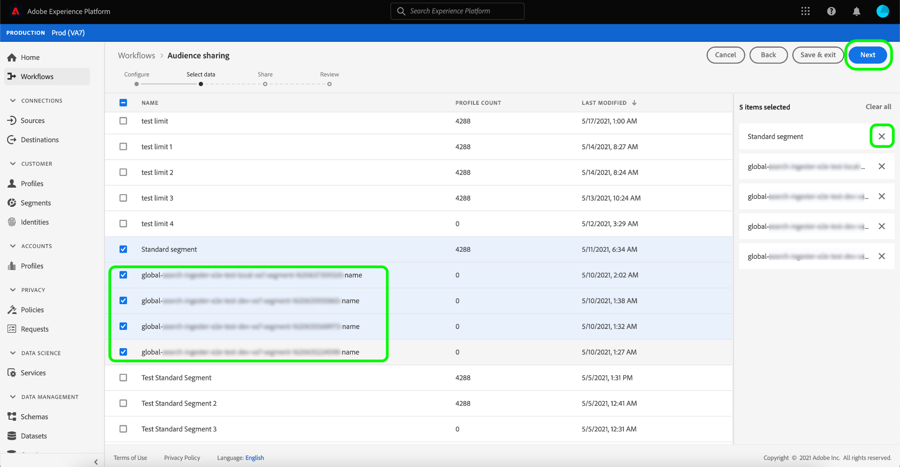

# [!DNL Segment Match] 概觀

Adobe Experience Platform區段比對是一項區段共用服務，可讓兩位或以上的Platform使用者以安全、受規管且有利於隱私權的方式交換區段資料。 [!DNL Segment Match]使用Platform隱私權標準和個人識別碼，例如雜湊電子郵件、雜湊電話號碼以及裝置識別碼，例如IDFA和GAID。

透過[!DNL Segment Match]，您可以：

* 管理身分重疊程式。
* 檢視預先共用預估。
* 套用資料使用標籤以控制資料是否可與合作夥伴共用。
* 在發佈摘要後維護共用的對象生命週期管理，並透過新增、刪除和取消共用的功能繼續動態資料交換。

[!DNL Segment Match]使用身分重疊程式，確保區段共用是以安全且以隱私權為中心的方式完成。 **重疊的身分**&#x200B;是在您的區段和您選取的合作夥伴區段中都有相符的身分。 在傳送者與接收者之間共用區段之前，身分重疊程式會檢查名稱空間中是否有重疊，以及傳送者與接收者之間的同意檢查。 必須傳遞兩個重疊檢查才能共用區段。

下列章節提供有關[!DNL Segment Match]的詳細資訊，包括設定及其端對端工作流程的詳細資訊。

## 設定

以下各節概述如何設定及設定[!DNL Segment Match]：

### 設定身分資料和名稱空間 {#namespaces}

開始使用[!DNL Segment Match]的第一步是確定您正在擷取支援的身分識別名稱空間的資料。

身分識別名稱空間是[Adobe Experience Platform Identity Service](../../../identity-service/home.md)的元件。 每個客戶身分都包含一個關聯的名稱空間，用於指出身分的上下文。 例如，名稱空間可以將「name@email.com」的值區分為電子郵件地址，或將「443522」區分為數值CRM ID。

完整身分包含ID值和名稱空間。 跨設定檔片段比對記錄資料時（例如[!DNL Real-Time Customer Profile]合併設定檔資料時），身分值和名稱空間必須相符。

在[!DNL Segment Match]的內容中，共用資料時會在重疊程式中使用名稱空間。

支援的名稱空間清單如下：

| 命名空間 | 說明 |
| --------- | ----------- |
| 電子郵件 (SHA256，小寫) | 預先雜湊電子郵件地址的名稱空間。 使用SHA256雜湊之前，此名稱空間中提供的值會轉換為小寫。 在電子郵件地址標準化之前，需要修剪前置和結尾空格。 無法回溯變更此設定。 Platform提供兩種支援資料收集雜湊的方法，透過[`setCustomerIDs`](https://experienceleague.adobe.com/docs/id-service/using/reference/hashing-support.html#hashing-support)和透過[資料準備](../../../data-prep/functions.md#hashing)。 |
| 電話(SHA256_E.164) | 代表需要使用SHA256和E.164格式雜湊的原始電話號碼的名稱空間。 |
| ECID | 代表Experience CloudID (ECID)值的名稱空間。 此名稱空間也可以以下列别名表示：「Adobe Marketing Cloud ID」、「Adobe Experience Cloud ID」、「Adobe Experience Platform ID」。 如需詳細資訊，請參閱[ECID總覽](../../../identity-service/features/ecid.md)。 |
| Apple IDFA （廣告商的ID） | 代表廣告商Apple ID的名稱空間。 如需詳細資訊，請參閱下列有關[興趣型廣告](https://support.apple.com/en-us/HT202074)的檔案。 |
| Google 廣告 ID | 代表Google Advertising ID的名稱空間。 如需詳細資訊，請參閱[Google Advertising ID](https://support.google.com/googleplay/android-developer/answer/6048248?hl=en)上的下列檔案。 |

### 設定同意設定

您必須提供同意設定，並將其預設值設定為`opt-in`或`opt-out`以進行同意檢查。

選擇加入和選擇退出同意檢查會決定您預設是否可以在同意下操作，以共用使用者資料。 如果同意設定預設設為`opt-out`，則除非使用者明確選擇退出，否則可以共用使用者資料。 如果預設值設為`opt-in`，則無法共用使用者資料，除非使用者明確選擇加入。

[!DNL Segment Match]的預設同意設定設為`opt-out`。 若要對您的資料強制執行選擇加入模式，請傳送電子郵件要求給您的Adobe帳戶團隊。

如需有關用來設定資料共用同意值的`share`屬性的詳細資訊，請參閱下列有關[隱私權與同意欄位群組](../../../xdm/field-groups/profile/consents.md)的檔案。 如需用於擷取消費者同意收集及使用隱私、個人化和行銷偏好設定相關資料的特定欄位群組資訊，請參閱下列[隱私同意、Personalization和行銷偏好設定GitHub範例](https://github.com/adobe/xdm/blob/master/docs/reference/datatypes/consent/consent-preferences.schema.md)。

### 設定資料使用標籤

您必須建立的最後一個先決條件是設定新的資料使用標籤，以防止資料共用。 透過資料使用標籤，您可以管理哪些資料允許透過[!DNL Segment Match]共用。

資料使用情況標籤可讓您根據套用至該資料的使用原則來分類資料集和欄位。 標籤可隨時套用，提供您選擇控管資料方式的靈活性。 最佳實務建議在資料內嵌至Experience Platform後，或資料可在Platform中使用時，立即加上標籤。

[!DNL Segment Match]使用C11標籤，這是[!DNL Segment Match]專屬的合約標籤，您可以手動新增到任何資料集或屬性，以確保這些資料集或屬性不會從[!DNL Segment Match]合作夥伴共用程式中排除。 C11標籤表示不應在[!DNL Segment Match]處理程式中使用的資料。 在您決定要從[!DNL Segment Match]排除的資料集和/或欄位並相應地新增C11標籤後，[!DNL Segment Match]工作流程會自動強制該標籤。 [!DNL Segment Match]會自動啟用[!UICONTROL 限制資料共用]核心原則。 如需如何將資料使用標籤套用至資料集的特定指示，請參閱有關[在UI](../../../data-governance/labels/user-guide.md)中管理資料使用標籤的教學課程。

如需資料使用標籤及其定義的清單，請參閱[資料使用標籤字彙表](../../../data-governance/labels/reference.md)。 如需資料使用原則的相關資訊，請參閱[資料使用原則概觀](../../../data-governance/policies/overview.md)。

### 瞭解[!DNL Segment Match]許可權

有兩個許可權與[!DNL Segment Match]相關聯：

| 權限 | 說明 |
| --- | --- |
| 管理對象共用連線 | 此許可權可讓您完成夥伴交握程式，該程式會連線兩個組織以啟用[!DNL Segment Match]流程。 |
| 管理對象共用 | 此許可權可讓您建立、編輯及發佈作用中合作夥伴（由具有&#x200B;**[!UICONTROL 對象共用連線]**&#x200B;存取權的管理員使用者所連線的合作夥伴）的摘要（用於[!DNL Segment Match]的資料套件）。 |

如需存取控制和許可權的詳細資訊，請參閱[存取控制總覽](../../../access-control/home.md)。

## [!DNL Segment Match]端對端工作流程

一旦您設定好身分資料和名稱空間、同意設定及資料使用標籤，您就可以開始使用[!DNL Segment Match]及其功能。

### 管理合作夥伴

在Platform UI中，從左側導覽選取&#x200B;**[!UICONTROL 區段]**，然後從頂端標題選取&#x200B;**[!UICONTROL 摘要]**。

[!UICONTROL 摘要]頁面包含從合作夥伴收到的摘要清單以及您已共用的摘要。 若要檢視現有夥伴的清單或與新夥伴建立連線，請選取&#x200B;**[!UICONTROL 管理夥伴]**。

兩個合作夥伴之間的連線是「雙向交握」，可作為使用者在沙箱層級將其Platform組織連結在一起的自助方法。 必須有連線，才能通知Platform已建立合約，且Platform可協助您與合作夥伴共用服務。

>[!NOTE]
>
>您與合作夥伴之間的「雙向握手」純屬連線。 在此過程中不會交換任何資料。

您可以在[!UICONTROL 管理合作夥伴]畫面的主要介面中檢視與現有合作夥伴的連線清單。 右邊欄是[!UICONTROL 共用設定]面板，它提供您產生新[!UICONTROL 連線ID]的選項，以及輸入方塊，您可以在其中輸入合作夥伴的[!UICONTROL 連線ID]。

若要建立新的[!UICONTROL 連線ID]，請在[!UICONTROL 共用設定]下選取&#x200B;**[!UICONTROL 重新產生]**，然後選取新產生的ID旁邊的復製圖示。

若要使用夥伴的[!UICONTROL 連線ID]來連線夥伴，請在[!UICONTROL 連線夥伴]下的輸入方塊中輸入其唯一的ID值，然後選取&#x200B;**[!UICONTROL 要求]**。

### 建立摘要 {#create-feed}

>[!CONTEXTUALHELP]
>id="platform_segment_match_marketing"
>title="受限制的行銷使用案例"
>abstract="受限制的行銷使用案例有助於為您的合作夥伴提供指引，以確保根據您的資料控管限制正確使用共用的區段。"
>text="Learn more in documentation"

**摘要**&#x200B;是一組資料（區段）、如何公開或使用該資料的規則，以及決定如何將您的資料與合作夥伴的資料比對的設定。 摘要可以獨立管理，並可透過[!DNL Segment Match]與其他Platform使用者交換。

若要建立新的摘要，請從[!UICONTROL 摘要]儀表板選取&#x200B;**[!UICONTROL 建立摘要]**。

摘要的基本設定包括關於行銷使用案例和身分設定的名稱、說明和設定。 提供摘要的名稱和說明，然後套用您要將資料排除的行銷使用案例。 您可以從清單中選取多個使用案例，包括：

* [!UICONTROL Analytics]
* [!UICONTROL 與PII結合]
* [!UICONTROL 跨網站目標定位]
* [!UICONTROL 資料科學]
* [!UICONTROL 電子郵件目標定位]
* [!UICONTROL 匯出至第三方]
* [!UICONTROL 站上廣告]
* [!UICONTROL 現場個人化]
* [!UICONTROL 區段相符]
* [!UICONTROL 單一身分個人化]

最後，請為您的摘要選取適當的身分名稱空間。 如需[!DNL Segment Match]支援的特定名稱空間的相關資訊，請參閱[身分資料和名稱空間表格](#namespaces)。 完成後，選取&#x200B;**[!UICONTROL 下一步]**。

建立摘要的設定後，從第一方區段清單中選取要共用的區段。 您可以從清單中選取多個區段，也可以使用右欄來管理所選區段的清單。 完成後，請選取&#x200B;**[!UICONTROL 下一步]**。

「[!UICONTROL 共用]」頁面隨即顯示，提供您介面以選取要與其共用摘要的合作夥伴。 在此步驟中，您也可以檢視預先共用重疊預估報表，並檢視您與合作夥伴之間依名稱空間區分的重疊身分數目，以及同意共用資料的重疊身分數目。

選取&#x200B;**[!UICONTROL 依區段分析]**&#x200B;以檢視預估報表。

重疊預估報表可讓您在共用摘要之前，針對每個合作夥伴和每個區段管理重疊和同意檢查。

| 量度 | 說明 |
| ------- | ----------- |
| 經同意的預估身分 | 符合為貴組織設定的同意要求的重疊身分總數。 |
| 預估的重疊身分 | 符合所選區段資格且與所選合作夥伴相符的身分數量。 這些身分會依名稱空間顯示，不代表個別設定檔身分。 重疊的預估值是以輪廓草繪為基礎的。 |

完成後，選取&#x200B;**[!UICONTROL 關閉]**。

選取合作夥伴並檢視重疊預估報告後，選取[下一步] **[!UICONTROL 以繼續。]**

[!UICONTROL 檢閱]步驟隨即顯示，可讓您在分享和發佈新摘要之前先檢閱摘要。 此步驟包含您套用之身分設定的詳細資訊，以及您選取的行銷使用案例、區段和合作夥伴的相關資訊。

選取&#x200B;**[!UICONTROL 完成]**&#x200B;以繼續。

### 更新摘要

若要新增或移除區段，請從[!UICONTROL 摘要]頁面選取&#x200B;**[!UICONTROL 建立摘要]**，然後選取&#x200B;**[!UICONTROL 現有摘要]**。 在出現的現有摘要清單中，選取您要更新的摘要，然後選取&#x200B;**[!UICONTROL 下一步]**。

區段清單隨即顯示。 您可以在此處將新區段新增至摘要，並使用滑鼠右欄移除不再需要的任何區段。 在您管理完摘要中的區段後，請選取「**[!UICONTROL 下一步]**」，然後依照上述步驟完成更新的摘要。

>[!NOTE]
>
>當您從共用摘要新增或移除區段時，接收合作夥伴必須透過重新啟用其接收摘要清單中的[!DNL Profile]切換來確認變更。

### 接受傳入摘要

若要檢視傳入摘要，請從[!UICONTROL 摘要]頁面的標頭中選取&#x200B;**[!UICONTROL 已接收]**，然後從清單中選取您要檢視的摘要。 若要接受摘要，請選取設定檔&#x200B;]**的**[!UICONTROL &#x200B;啟用，並等待一段時間讓狀態從[!UICONTROL 擱置中]更新為[!UICONTROL 已啟用]。

接受共用摘要後，您就可以開始使用共用資料來建立新區段。

## 後續步驟

閱讀本檔案後，您已瞭解[!DNL Segment Match]、其功能及其端對端工作流程。 若要深入瞭解其他Platform服務，請參閱下列檔案：

* [[!DNL Segmentation Service]](../../home.md)
* [[!DNL Identity Service]](../../../identity-service/home.md)
* [[!DNL Real-Time Customer Profile] 概觀](../../../profile/home.md)
