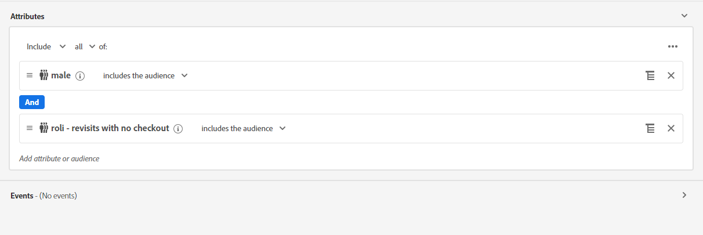
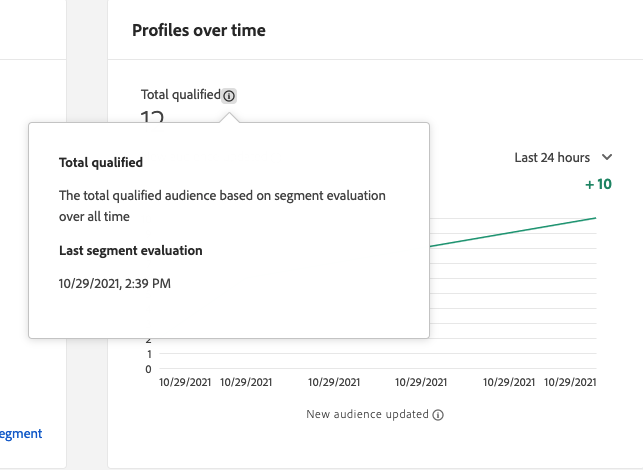

# 串流細分

>[!NOTE]
>
>下列檔案說明如何使用UI使用串流分段。 如需使用API的串流分段的相關資訊，請參閱 [串流劃分API指南](../api/streaming-segmentation.md).

在 [!DNL Adobe Experience Platform] 可讓客戶以近乎即時的方式執行細分，同時專注於資料豐富性。 透過串流細分，區段資格現在會在串流資料進入 [!DNL Platform]，可緩解排程及執行分段作業的需求。 透過此功能，現在當資料傳入時，即可評估大部分的區段規則 [!DNL Platform]，這表示區段成員資格會保持最新，而不會執行已排程的分段工作。

>[!NOTE]
>
>串流分段適用於使用串流來源擷取的所有資料。 使用批次型來源擷取的資料將於每晚評估，即使符合串流分段的資格亦然。
>
>此外，如果使用串流分段評估的區段是基於使用批次分段評估的另一個區段，則在理想成員和實際成員之間可能會漂移。 例如，如果區段A以區段B為基礎，且使用批次分段評估區段B，由於區段B僅每24小時更新一次，因此區段A會從實際資料進一步移動，直到與區段B更新重新同步為止。

## 串流區段查詢類型 {#query-types}

>[!NOTE]
>
>為了讓串流區段正常運作，您需要為組織啟用已排程的區段。 如需啟用排程分段的詳細資訊，請參閱 [區段使用手冊中的串流區段區段](./overview.md#scheduled-segmentation).

如果查詢符合下列任一條件，系統就會使用串流細分自動評估該查詢：

| 查詢類型 | 詳細資訊 | 範例 |
| ---------- | ------- | ------- |
| 單一事件 | 任何區段定義，是指沒有時間限制的單一傳入事件。 |  |
| 相對時間範圍內的單一事件 | 任何指單一傳入事件的區段定義。 |  |
| 具有時間窗口的單個事件 | 任何區段定義，指的是具有時間視窗的單一傳入事件。 |  |
| 僅限設定檔 | 只參考設定檔屬性的任何區段定義。 |  |
| 具有設定檔屬性的單一事件 | 任何區段定義，是指沒有時間限制的單一傳入事件，以及一或多個設定檔屬性。 **注意：** 事件發生時會立即評估查詢。 但是，若是設定檔事件，則必須等待24小時才能納入。 |  |
| 相對時間窗口內具有配置檔案屬性的單個事件 | 任何區段定義，指的是單一傳入事件和一或多個設定檔屬性。 |  |
| 區段 | 包含一或多個批次或串流區段的任何區段定義。 **注意：** 如果使用區段，將會發生設定檔取消資格 **每24小時**. |  |
| 具有設定檔屬性的多個事件 | 任何參照多個事件的區段定義 **過去24小時內** 和（可選）有一或多個設定檔屬性。 |  |

區段定義將 **not** 可在下列情況下啟用串流分段：

- 區段定義包含Adobe Audience Manager(AAM)區段或特徵。
- 區段定義包括多個實體（多實體查詢）。
- 區段定義包含單一事件和 `inSegment` 事件。
   - 不過，若 `inSegment` 事件僅限設定檔，區段定義 **will** 啟用串流細分功能。

請注意，執行串流細分時，會套用下列准則：

| 查詢類型 | 指引 |
| ---------- | -------- |
| 單一事件查詢 | 回顧期間沒有限制。 |
| 具有事件歷史記錄的查詢 | <ul><li>回顧期間限制為 **一天**.</li><li>嚴格的時間排序條件 **必須** 存在於事件之間。</li><li>支援具有至少一個否定事件的查詢。 不過，整個事件 **不能** 是否定。</li></ul> |

如果修改區段定義，使其不再符合串流分段的條件，區段定義會自動從「串流」切換為「批次」。

此外，區段取消資格與區段資格類似，會即時發生。 因此，如果對象不再符合區段的資格，將會立即無資格。 例如，如果區段定義要求輸入「過去三小時內購買紅色鞋子的所有使用者」，三小時後，最初符合區段定義資格的所有設定檔都將不符合條件。

## 串流細分區段詳細資料

建立啟用串流的區段後，您可以檢視該區段的詳細資訊。

具體而言， **[!UICONTROL 合格總計]** 此時會顯示量度，根據此區段的批次和串流評估，顯示合格對象的總數。

下方的折線圖顯示過去24小時內，使用串流評估方法更新的新受眾數量。 下拉式清單可以調整為顯示過去24小時、上週或過去30天。 此 **[!UICONTROL 已更新新受眾]** 量度是根據所選時間範圍內的受眾大小變更，經串流細分評估。 此量度不包含每日區段批次評估的合格對象總數。

>[!NOTE]
>
>如果區段從沒有狀態變成已實現，或從退出變成已實現，則會視為合格。 如果區段從「已實現」變為「退出」，或從「現有」變為「退出」，則會視為無資格。
>
>有關這些狀態的詳細資訊，請參閱 [細分概述](./overview.md#browse).

選取旁邊的資訊泡泡，即可找到有關上次區段評估的其他資訊 **[!UICONTROL 合格總計]**.

如需區段定義的詳細資訊，請參閱 [區段定義詳細資料](#segment-details).

## 後續步驟

本使用手冊說明啟用串流的區段定義如何在Adobe Experience Platform上運作，以及如何監控啟用串流的區段。

若要進一步了解如何使用Adobe Experience Platform使用者介面，請閱讀 [區段使用手冊](./overview.md).

## 附錄

下節列出關於串流細分的常見問題：

### 串流細分「取消資格」是否也會即時發生？

在大多數情況下，串流細分取消資格會即時發生。 不過，使用區段的串流區段確實如此 **not** 即時取消資格，而是在24小時後取消資格。

### 串流細分有哪些適用的資料？

串流分段適用於使用串流來源擷取的所有資料。 使用批次型來源擷取的區段，即使符合串流分段的資格，也會在每晚評估。 時間戳記早於24小時的串流到系統的事件，將在後續的批處理作業中處理。

### 區段如何定義為批次或串流區段？

區段的定義是根據查詢類型和事件歷史記錄持續時間的組合而進行批次或串流區段。 若需評估為串流區段的區段清單，請參閱 [流式細分查詢類型節](#query-types).

請注意，如果區段包含 **both** an `inSegment` 運算式和直接的單事件鏈，無法符合串流分段的資格。 如果您想要讓此區段符合串流分段的資格，請將直接單事件鏈設為自己的區段。

### 為何「總合格」區段的數量持續增加，而「最近X天」底下的數量在區段詳細資料區段內維持為零？

合格區段總數會從每日劃分工作中提取，包括同時符合批次和串流區段資格的對象。 批次和串流區段都會顯示此值。

「最近X天」下的數字 **僅限** 包括符合串流細分資格的對象，以及 **僅限** 如果您已將資料串流至系統，且計入該串流定義，則會增加。 此值為 **僅限** 顯示於串流區段。 因此，此值 **5月** 對於批次區段，顯示為0。

因此，如果您看到「最近X天」底下的數字為零，而折線圖也報告為零，則您有 **not** 將符合該區段資格的任何設定檔串流至系統。

### 區段可用需要多久時間？

最多需要1小時的時間，區段才可供使用。