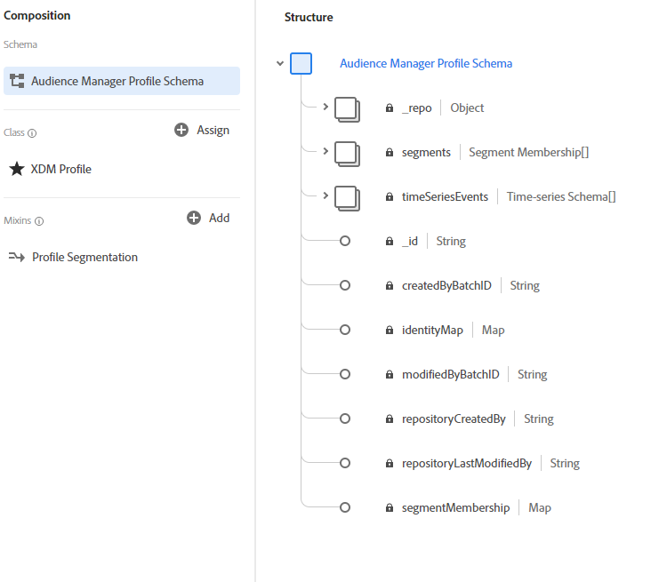

# Audience Manager來源

Adobe Audience Manager來源會串流在Adobe Audience Manager中收集的第一方資料，以在Adobe Experience Platform中啟用。 Audience Manager來源會擷取兩種型別的資料至Platform：

- **即時資料：** 在Audience Manager的資料收集伺服器上即時擷取的資料。 此資料會用於Audience Manager以填入規則型特徵，並會在最短延遲時間內出現在Platform中。
- **設定檔資料：** Audience Manager會使用即時和已上線的資料來衍生客戶設定檔。 這些設定檔用於在區段實現時填入身分圖表和特徵。

Audience Manager來源將這些資料型別對應至體驗資料模型(XDM)結構描述，然後傳送至Platform。 即時資料會以XDM ExperienceEvent資料傳送，而設定檔資料會以XDM個別設定檔資料傳送。

如需詳細資訊，請閱讀以下指南： [在使用者介面中建立Audience Manager來源連線](../../tutorials/ui/create/adobe-applications/audience-manager.md).

## 什麼是Experience Data Model (XDM)？

XDM是公開記錄的規格，提供標準化架構，平台可依據此架構組織客戶體驗資料。

遵循XDM標準可統一整合客戶體驗資料，讓您更輕鬆地提供資料和收集資訊。

如需如何在Experience Platform中使用XDM的詳細資訊，請閱讀 [XDM系統總覽](../../../xdm/home.md). 若要深入瞭解設定檔和事件之間XDM結構描述的結構，請閱讀 [結構描述組合基本概念](../../../xdm/schema/composition.md).

## XDM結構描述範例

以下範例為對應至Platform中XDM ExperienceEvent和XDM Individual Profile的Audience Manager結構。

### ExperienceEvent — 適用於即時資料和已上線的資料

### XDM個人設定檔 — 適用於設定檔資料

如需欄位如何從Audience Manager對應至XDM的詳細資訊，請閱讀以下檔案： [Audience Manager對應欄位](./mapping/audience-manager.md).

## 平台上的資料管理

### 資料集

資料集是資料集合的儲存和管理結構，通常是表格，包含結構（欄）和欄位（列），並可透過資料連線使用。 Audience Manager資料包含即時資料、傳入資料和設定檔資料。 若要尋找Audience Manager資料集，請使用UI中的搜尋函式，並針對每種資料型別提供命名慣例。

設定檔的Audience Manager資料集預設為停用，使用者可以根據自己的使用案例啟用或停用資料集。 不建議停用用於設定檔中區段成員資格的資料集。

>[!NOTE]
>
>AAM Real-time是唯一前往資料湖的資料集。 所有其他的Audience Manager資料集都會移至 [!DNL Profile]，如果已啟用 [!DNL Profile]. 如果它們未啟用 [!DNL Profile]，則不會收到任何資料，且會顯示為空白。

| 資料集名稱 | 說明 | 類別 |
| --- | --- | --- |
| AAM Real-time | 此資料集包含直接點選Audience ManagerDCS端點所收集的資料，以及Audience Manager設定檔的身分對應。 將此資料集保留為設定檔擷取啟用。 | 體驗事件 |
| AAM即時設定檔更新 | 此資料集可讓您即時鎖定Audience Manager特徵和區段。 其中包括Edge區域路由、特徵和區段會籍的相關資訊。 將此資料集保留為設定檔擷取啟用。 資料在資料集中不會顯示為批次。 您可以啟用 **[!UICONTROL 設定檔]** 切換，以直接將資料內嵌至設定檔。 | 記錄 |
| AAM裝置資料 | 具有ECID的裝置資料以及在Audience Manager中彙總的對應區段實現。 資料在資料集中不會顯示為批次。 您可以啟用 **[!UICONTROL 設定檔]** 切換，以直接將資料內嵌至設定檔。 | 記錄 |
| AAM裝置設定檔資料 | 用於Audience Manager聯結器診斷。 資料在資料集中不會顯示為批次。 您可以啟用 **[!UICONTROL 設定檔]** 切換，以直接將資料內嵌至設定檔。 | 記錄 |
| AAM已驗證的設定檔 | 此資料集包含Audience Manager已驗證的設定檔。 資料在資料集中不會顯示為批次。 您可以啟用 **[!UICONTROL 設定檔]** 切換，以直接將資料內嵌至設定檔。 | 記錄 |
| AAM已驗證的設定檔中繼資料 | 用於Audience Manager聯結器診斷。 資料在資料集中不會顯示為批次。 您可以啟用 **[!UICONTROL 設定檔]** 切換，以直接將資料內嵌至設定檔。 | 記錄 |
| AAM裝置資料回填 | 資料集，避免傳入過去的裝置資料。 這包含Audience Manager中彙總的ECID和對應區段實現。 資料在資料集中不會顯示為批次。 您可以啟用 **[!UICONTROL 設定檔]** 切換以直接將資料內嵌至設定檔。 | 記錄 |
| AAM已驗證的設定檔回填 | 資料集，避免傳入過去的已驗證資料。 這包含Audience Manager驗證的設定檔。 資料在資料集中不會顯示為批次。 您可以啟用 **[!UICONTROL 設定檔]** 切換以直接將資料內嵌至設定檔。 | 記錄 |

### 連線

Adobe Audience Manager會在「目錄：Audience Manager連線」中建立一個連線。 目錄是Adobe Experience Platform中資料位置和譜系的記錄系統。 連線是目錄物件，是客戶特定的聯結器例項。 請閱讀 [目錄服務概觀](../../../catalog/home.md) 有關目錄、連線和聯結器的詳細資訊。

### 區段母體對設定檔的影響

當您首次將Audience Manager區段傳送至Platform時，區段母體大小會直接影響設定檔編號。 這表示選取所有區段可能會導致設定檔使用量超過您的授權使用量權利。 Platform也會將新資料與設定檔擷取的歷史資料區分開來。 具有100個第一方身分的區段將建立100個設定檔。 不過，如果該區段的母體數量提高至150且已內嵌至Platform，則設定檔的數量只會增加50，因為只有50個新設定檔。

您也可以透過檢視帳戶可用的設定檔使用方式， [授權使用情況儀表板](../../../dashboards/guides/license-usage.md).

## 在Platform上Audience Manager資料的預期延遲為何？

| Audience Manager資料 | 類型 | 延遲性 | 附註 |
| --- | --- | --- | --- |
| 即時資料 | 活動 | &lt;25 分鐘 | 從Audience Manager邊緣節點擷取到出現在Data Lake中的時間。 |
| 即時資料 | 設定檔更新 | &lt;10 分鐘 | 登入即時客戶個人檔案的時間。 |
| 即時和已上線的資料 | 設定檔更新 | 24到36小時 | 從透過DCS/PCS Edge資料及已上線資料擷取、處理至使用者設定檔，然後出現在即時客戶設定檔中的時間。 目前，此資料不會直接進入資料湖。 可以為Audience Manager設定檔資料集啟用設定檔切換，以將此資料直接擷取到即時客戶設定檔中。 |
