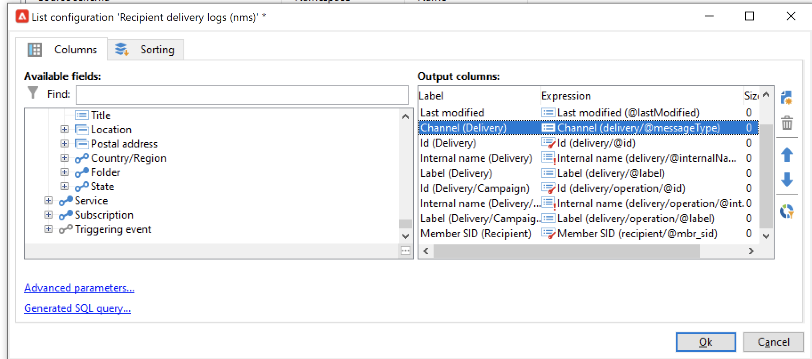

# Adobe Campaign Managed Cloud Services

Adobe Experience Platform可讓您從外部來源擷取資料，同時使用Platform服務來建構、加標籤及增強傳入資料。 您可以從多種來源(如Adobe應用程式、雲儲存、資料庫等)內嵌資料。

Adobe Campaign Managed Cloud Services提供Managed Services平台，可設計跨管道客戶體驗，並提供視覺化行銷活動策劃、即時互動管理和跨管道執行的環境。 造訪 [Adobe Campaign v8檔案](https://experienceleague.adobe.com/docs/campaign/campaign-v8/campaign-home.html?lang=en) 以取得更多資訊。

Adobe Campaign Managed Cloud Services來源可讓您將Adobe Campaign v8傳送記錄和追蹤記錄資料帶入Adobe Experience Platform。

## 先決條件

您必須先完成下列必要條件，才能建立來源連線以將Campaign v8Experience Platform:

* [使用Adobe Campaign用戶端主控台設定您的事件記錄匯入](#view-delivery-and-tracking-log-data)
* [建立XDM ExperienceEvent結構](#create-a-schema)
* [建立資料集](#create-a-dataset)

### 檢視傳送和追蹤記錄檔資料 {#view-delivery-and-tracking-log-data}

>[!IMPORTANT]
>
>您必須擁有Adobe Campaign v8用戶端主控台的存取權，才能在Campaign中檢視您的記錄檔資料。 造訪 [Campaign v8檔案](https://experienceleague.adobe.com/docs/campaign/campaign-v8/deploy/connect.html?lang=en) 以了解如何下載和安裝用戶端主控台。

透過用戶端主控台登入您的Campaign v8執行個體。 在 [!DNL Explorer] 索引標籤，選取 [!DNL Administration] 然後選取 [!DNL Configuration]. 下一步，選擇 [!DNL Data schemas] 然後套用 `broadLog` 篩選名稱或標籤。 在顯示的清單中，選擇名稱為的收件者傳送記錄來源架構 `broadLogRcp`.

下一步，選取 **資料** 標籤。

在資料面板中按一下滑鼠右鍵/按鍵，開啟內容功能表。 從此處，選擇 **配置清單……**

此時會出現清單設定視窗，提供您一個介面，可在其中新增任何所需欄位至預先存在的清單，以在資料面板中檢視資料。

現在，您可以檢視收件者傳送記錄檔，包括上一步中新增的設定欄位。

>[!TIP]
>
>您可以重複相同步驟，但篩選 `tracking` 來檢視追蹤記錄資料。

### 建立方案 {#create-a-schema}

接下來，為傳送記錄檔和追蹤記錄檔建立XDM ExperienceEvent結構。 您必須將「促銷活動傳送記錄」欄位群組套用至您的傳送記錄結構，並將「促銷活動追蹤記錄」欄位群組套用至您的追蹤記錄結構。 您也必須定義 `externalID` 欄位作為架構的主要身分。

>[!NOTE]
>
>您的XDM ExperienceEvent結構必須啟用設定檔，才能將Campaign資料內嵌至 [!DNL Real-Time Customer Profile].

如需如何建立結構的詳細指示，請參閱 [在UI中建立XDM結構](../../../xdm/tutorials/create-schema-ui.md).

### 建立資料集 {#create-a-dataset}

最後，您必須為結構建立資料集。 如需如何建立資料集的詳細指示，請參閱 [在UI中建立資料集](../../../catalog/datasets/user-guide.md).

## 使用Platform UI建立Adobe Campaign Managed Cloud Services來源連線

現在您已在Campaign用戶端主控台中存取資料記錄、建立結構和資料集，您可以繼續建立來源連線，將您的Campaign Managed Services資料帶入Platform。

如需如何將Campaign v8傳送記錄和追蹤記錄資料帶入Experience Platform的詳細指示，請參閱 [在UI中建立Campeg Managed Services源連接](../../tutorials/ui/create/adobe-applications/campaign.md).
