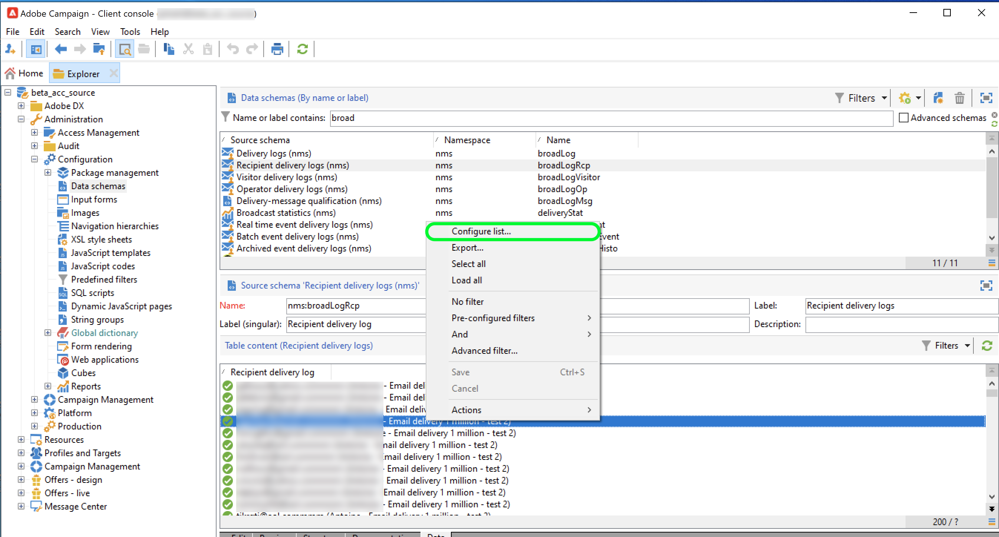

# Adobe Campaign Managed Cloud Services

Adobe Experience Platform允許從外部源接收資料，同時讓您能夠使用平台服務構建、標籤和增強傳入資料。 您可以從多種源(如Adobe應用程式、基於雲的儲存、資料庫和許多其他源)接收資料。

Adobe Campaign Managed Cloud Services公司為設計跨渠道客戶體驗提供了Managed Services平台，並為可視的市場活動協調、即時交互管理和跨渠道執行提供了環境。 訪問 [Adobe Campaignv8文檔](https://experienceleague.adobe.com/docs/campaign/campaign-v8/campaign-home.html?lang=en) 的子菜單。

Adobe Campaign Managed Cloud Services源允許您將Adobe Campaignv8交付日誌和跟蹤日誌資料帶到Adobe Experience Platform。

## 先決條件

在建立源連接以將市場活動v8Experience Platform之前，必須先完成以下先決條件：

* [使用Adobe Campaign客戶端控制台設定事件日誌導入](#view-delivery-and-tracking-log-data)
* [建立XDM ExperienceEvent架構](#create-a-schema)
* [建立資料集](#create-a-dataset)

### 查看交付和跟蹤日誌資料 {#view-delivery-and-tracking-log-data}

>[!IMPORTANT]
>
>您必須具有訪問Adobe Campaignv8客戶端控制台的權限，才能查看市場活動中的日誌資料。 訪問 [市場活動v8文檔](https://experienceleague.adobe.com/docs/campaign/campaign-v8/deploy/connect.html?lang=en) 有關如何下載和安裝客戶端控制台的資訊。

通過客戶端控制台登錄到Campaign v8實例。 在 [!DNL Explorer] 頁籤 [!DNL Administration] ，然後選擇 [!DNL Configuration]。 下一步，選擇 [!DNL Data schemas] 然後應用 `broadLog` 名稱或標籤的篩選器。 在顯示的清單中，選擇名稱為的收件人傳遞日誌源架構 `broadLogRcp`。

接下來，選擇 **資料** 頁籤。

在資料面板中按一下右鍵/擊鍵以開啟上下文菜單。 從此處，選擇 **配置清單……**

此時將出現清單配置窗口，為您提供一個介面，您可以在其中將任何所需欄位添加到預先存在的清單中，以查看資料面板中的資料。

現在，您可以查看您的收件人交付日誌，包括上一步中添加的配置欄位。

>[!TIP]
>
>可以重複相同的步驟，但篩選 `tracking` 查看跟蹤日誌資料。

### 建立方案 {#create-a-schema}

接下來，為交付日誌和跟蹤日誌建立XDM ExperienceEvent架構。 您必須將「市場活動交付日誌」欄位組應用於您的交付日誌架構，將「市場活動跟蹤日誌」欄位組應用於跟蹤日誌架構。 您還必須定義 `externalID` 欄位作為架構的主標識。

>[!NOTE]
>
>您的XDM ExperienceEvent架構必須啟用配置檔案才能將市場活動資料接收到 [!DNL Real-Time Customer Profile]。

有關如何建立架構的詳細說明，請閱讀上的指南 [在UI中建立XDM架構](../../../xdm/tutorials/create-schema-ui.md)。

### 建立資料集 {#create-a-dataset}

最後，必須為架構建立資料集。 有關如何建立資料集的詳細說明，請閱讀上的指南 [在UI中建立資料集](../../../catalog/datasets/user-guide.md)。

## 使用平台UI建立Adobe Campaign Managed Cloud Services源連接

現在，您已在市場活動客戶端控制台中訪問了資料日誌，建立了模式和資料集，現在可以繼續建立源連接以將市場活動Managed Services資料帶到平台。

有關如何將市場活動v8交付日誌和跟蹤日誌資料帶到體驗平台的詳細說明，請閱讀上的指南 [在UI中建立AmpetedManaged Services源連接](../../tutorials/ui/create/adobe-applications/campaign.md)。
