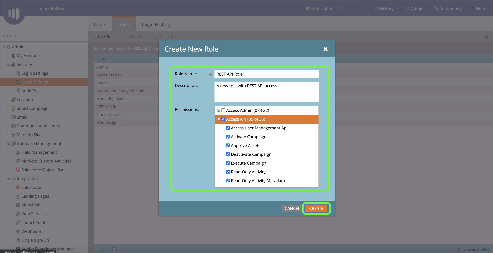

# 驗證您的 [!DNL Marketo Engage] 源連接器

在建立 [!DNL Marketo Engage] (以下簡稱：[!DNL Marketo]&quot;)源連接器，必須先通過 [!DNL Marketo] 介面，以及檢索Munchkin ID、客戶端ID和客戶端密碼的值。

以下文檔提供了如何獲取身份驗證憑據以建立 [!DNL Marketo] 源連接器。

## 設定新角色

獲取身份驗證憑據的第一步是通過 [[!DNL Marketo]](https://app-sjint.marketo.com/#MM0A1) 。

登錄到 [!DNL Marketo] 選擇 **[!DNL Admin]** 按鈕。

的 *[!DNL Users & Role]s* 頁面包含有關用戶、角色和登錄歷史記錄的資訊。 要建立新角色，請選擇 **[!DNL Roles]** 從頂部標題中選擇 **[!DNL New Role]**。

隨即顯示「**[!DNL Create New Role]**」對話框。提供名稱和說明，然後選擇要為此角色授予的權限。 權限僅限於特定工作區，用戶只能在他們具有權限的工作區中執行操作。

選擇要授予的權限後，選擇 **[!DNL Create]**。

建立角色時，可以管理API上的受限權限 [!DNL Marketo]。 您不必選擇「訪問API」，而是可以通過選擇以下權限來提供具有最低訪問級別的角色：

* [!DNL Read-Only Activity]
* [!DNL Read-Only Assets]
* [!DNL Read-Only Campaign]
* [!DNL Read-Only Company]
* [!DNL Read-Only Custom Object]
* [!DNL Read-Only Custom Object Type]
* [!DNL Read-Only Named Account]
* [!DNL Read-Only Named Account List]
* [!DNL Read-Only Opportunity]
* [!DNL Read-Only Person]
* [!DNL Read-Only Sales Person]

## 設定新用戶

與角色類似，您可以從 **[!DNL Users & Roles]** 的子菜單。 的 **[!DNL Users]** 頁面提供當前在Marketo設定的活動用戶清單。 選擇 **[!DNL Invite New User]** 設定新用戶。

出現「Popover（跨距）」對話框菜單。 提供您的電子郵件、名、姓和原因的相應資訊。 在此步驟中，您還可以為您邀請的新用戶帳戶的訪問設定到期日期。 完成後，選擇 **[!DNL Next]**。

>[!IMPORTANT]
>
>設定新用戶時，必須將訪問權限分配給嚴格專用於您正在建立的自定義服務的用戶。

在 **[!DNL Permissions]** 步驟，然後選擇 **[!DNL API Only]** 複選框，以向新用戶提供API角色。 選擇 **[!DNL Next]** 繼續。

要完成該流程，請選擇 **[!DNL Send]**。

## 設定自定義服務

建立新用戶後，可以設定自定義服務以檢索新憑據。 從管理頁中，選擇 **[!DNL LaunchPoint]**。

的 **[!DNL Installed services]** 包含現有服務的清單，要建立新的自定義服務，請選擇 **[!DNL New]** ，然後選擇 **[!DNL New Service]**。

為新服務提供描述性顯示名稱，然後選擇 **[!DNL Custom]** 從 **[!DNL Service]** 下拉菜單。 提供適當的說明，然後從中選擇要預配的用戶 **[!DNL API Only User]** 下拉菜單。 填寫完必要的詳細資訊後，選擇 **[!DNL Create]** 建立新自定義服務。

## 獲取客戶端ID和客戶端機密

建立新的自定義服務後，您現在可以檢索客戶端ID和客戶端密碼的值。 從 **[!DNL Installed Services]** 菜單，找到要訪問的自定義服務，然後選擇 **[!DNL View Details]**。

將出現一個對話框，其中包含您的客戶端ID和客戶端機密。

## 獲取你的Munchkin ID

必須完成最後一步才能驗證 [!DNL Marketo] 源連接器用於檢索Munchkin ID。 從管理頁中，選擇 **[!DNL Munchkin]** 下 **[!DNL Integration]** 的子菜單。

的 *[!DNL Munchkin]* 的子菜單。

與客戶端ID和客戶端機密相結合，您可以使用Munchkin ID配置新帳戶， [新建 [!DNL Marketo] 源連接](../../../tutorials/ui/create/adobe-applications/marketo.md) Experience Platform。
