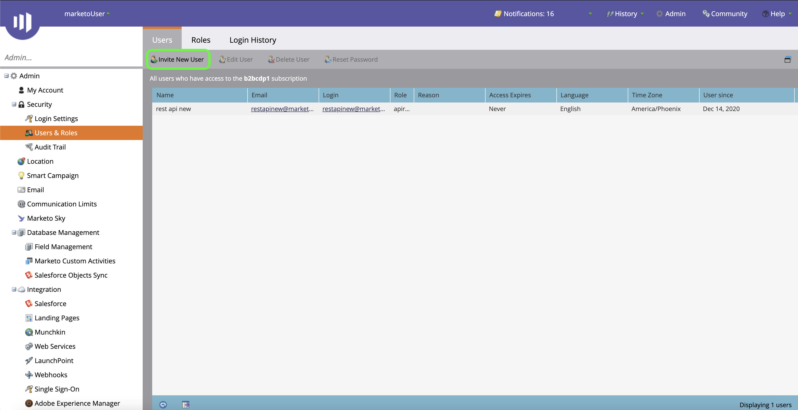

# 驗證您的[!DNL Marketo Engage]來源聯結器

建立[!DNL Marketo Engage] （以下稱為「[!DNL Marketo]」）來源聯結器之前，您必須先透過[!DNL Marketo]介面設定自訂服務，以及擷取Munchkin ID、使用者端ID和使用者端密碼的值。

以下檔案提供如何取得驗證認證以建立[!DNL Marketo]來源聯結器的步驟。

## 設定新角色

取得驗證認證的第一步，是透過[[!DNL Marketo]](https://app-sjint.marketo.com/#MM0A1)介面設定新角色。

登入[!DNL Marketo]並從上方導覽列中選取&#x200B;**[!DNL Admin]**。

新角色的

*[!DNL Users & Role]s*&#x200B;頁面包含使用者、角色和登入歷程記錄的相關資訊。 若要建立新角色，請從頂端標題選取&#x200B;**[!DNL Roles]**，然後選取&#x200B;**[!DNL New Role]**。

**[!DNL Create New Role]**&#x200B;對話方塊就會顯示。 提供名稱和說明，然後選取您要授予此角色的許可權。 許可權僅限特定工作區使用，使用者只能在擁有許可權的工作區中執行動作。

選取要授與的許可權後，請選取&#x200B;**[!DNL Create]**。

使用[!DNL Marketo]建立角色時，您可以管理API上受限制的許可權。 您不必選取「存取API」，而是可以選取下列許可權，以最低的存取層級為角色提供存取權：

* [!DNL Read-Only Activity]
* [!DNL Read-Only Assets]
* [!DNL Read-Only Campaign]
* [!DNL Read-Only Company]
* [!DNL Read-Only Custom Object]
* [!DNL Read-Only Custom Object Type]
* [!DNL Read-Only Named Account]
* [!DNL Read-Only Named Account List]
* [!DNL Read-Only Opportunity]
* [!DNL Read-Only Person]
* [!DNL Read-Only Sales Person]

## 設定新使用者

與角色類似，您可以從&#x200B;**[!DNL Users & Roles]**&#x200B;頁面設定新使用者。 **[!DNL Users]**&#x200B;頁面提供目前在Marketo中布建的使用中使用者清單。 選取&#x200B;**[!DNL Invite New User]**&#x200B;以布建新使用者。

彈出對話方塊選單出現。 為您的電子郵件、名字、姓氏和原因提供適當的資訊。 在此步驟中，您也可以針對您邀請的新使用者帳戶建立存取權的到期日。 完成後，選取&#x200B;**[!DNL Next]**。

>[!IMPORTANT]
>
>設定新使用者時，您必須將存取權指派給嚴格依照您正在建立的自訂服務專屬的使用者。

在&#x200B;**[!DNL Permissions]**&#x200B;步驟中選取適當的欄位，然後選取&#x200B;**[!DNL API Only]**&#x200B;核取方塊以提供API角色給新使用者。 選取&#x200B;**[!DNL Next]**&#x200B;以繼續。

若要完成程式，請選取&#x200B;**[!DNL Send]**。

## 設定自訂服務

建立新使用者後，您可以設定自訂服務以擷取新的認證。 從管理頁面中，選取&#x200B;**[!DNL LaunchPoint]**。

**[!DNL Installed services]**&#x200B;頁面包含現有服務的清單，若要建立新的自訂服務，請選取&#x200B;**[!DNL New]**，然後選取&#x200B;**[!DNL New Service]**。

提供您的新服務描述性顯示名稱，然後從&#x200B;**[!DNL Service]**&#x200B;下拉式功能表中選取&#x200B;**[!DNL Custom]**。 提供適當的說明，然後從&#x200B;**[!DNL API Only User]**&#x200B;下拉式功能表中選取您要布建的使用者。 填寫完必要的詳細資料後，請選取&#x200B;**[!DNL Create]**&#x200B;以建立新的自訂服務。

## 取得您的使用者端ID和使用者端密碼

建立新的自訂服務後，您現在可以擷取使用者端ID和使用者端密碼的值。 從&#x200B;**[!DNL Installed Services]**&#x200B;功能表，找出您要存取的自訂服務，然後選取&#x200B;**[!DNL View Details]**。

隨即顯示一個對話方塊，其中包含您的使用者端ID和使用者端密碼。

## 取得您的Munchkin ID

要驗證[!DNL Marketo]來源聯結器，您必須完成的最後一個步驟是擷取您的Munchkin ID。 從管理頁面，選取「**[!DNL Integration]**」面板下的「**[!DNL Munchkin]**」。

*[!DNL Munchkin]*&#x200B;頁面隨即顯示，您的唯一Munchkin ID會列在面板頂端。

結合您的使用者端ID和使用者端密碼，您可以使用您的Munchkin ID來設定新帳戶，並在Experience Platform上[建立新的 [!DNL Marketo] 來源連線](../../../tutorials/ui/create/adobe-applications/marketo.md)。
