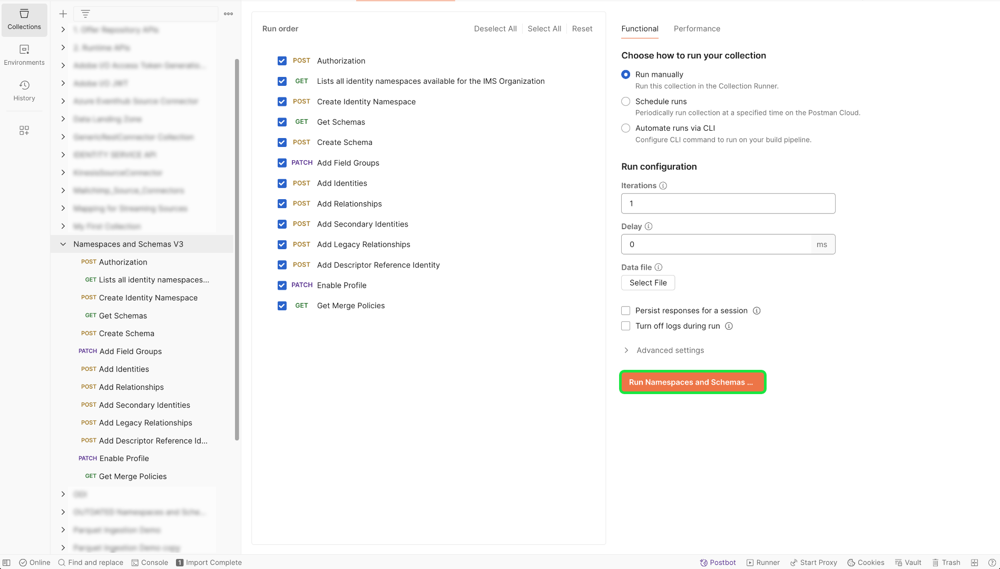

# B2B名稱空間和結構描述

>[!AVAILABILITY]
>
>您必須擁有[Adobe Real-time Customer Data Platform B2B edition](../../../../rtcdp/b2b-overview.md)的存取權，您的B2B結構描述才能在[即時客戶設定檔](../../../../profile/home.md)中符合資格。

>[!NOTE]
>
>您可以在Adobe Experience Platform UI中使用範本，快速建立B2B和B2C資料的資產。 如需詳細資訊，請閱讀[在Platform UI](../../../tutorials/ui/templates.md)中使用範本的指南。

請閱讀本檔案，瞭解與B2B來源搭配使用的名稱空間和結構描述的基礎設定。 本檔案也提供設定Postman自動化公用程式（產生B2B名稱空間和結構描述所需）的相關詳細資訊。

## 設定B2B名稱空間和結構描述自動產生公用程式

>[!IMPORTANT]
>
>已棄用服務帳戶(JWT)憑證。 您必須確保在2025年1月27日之前將應用程式或整合移轉至新的OAuth伺服器對伺服器認證。 請閱讀下列檔案，瞭解有關[如何將JWT認證移轉至OAuth伺服器對伺服器認證](https://developer.adobe.com/developer-console/docs/guides/authentication/ServerToServerAuthentication/migration/)的詳細步驟。

請參閱下列檔案，瞭解如何設定您的[!DNL Postman]環境以支援B2B名稱空間和結構描述自動產生公用程式的先決條件資訊。

- 您可以從此[GitHub存放庫](https://github.com/adobe/experience-platform-postman-samples/tree/master/Postman%20Collections/CDP%20Namespaces%20and%20Schemas%20Utility)下載名稱空間和結構描述自動產生公用程式集合和環境。
- 如需有關使用Platform API的詳細資訊，包括如何收集必要標題的值以及讀取範例API呼叫，請參閱[Platform API快速入門](../../../../landing/api-guide.md)的指南。
- 如需如何產生Platform API認證的詳細資訊，請參閱有關[驗證和存取Experience PlatformAPI](../../../../landing/api-authentication.md)的教學課程。
- 如需如何設定Platform API [!DNL Postman]的相關資訊，請參閱[設定開發人員主控台和 [!DNL Postman]](../../../../landing/postman.md)上的教學課程。

透過平台開發人員主控台和[!DNL Postman]設定，您現在可以開始將適當的環境值套用至您的[!DNL Postman]環境。

下表包含範例值，以及有關填入[!DNL Postman]環境的其他資訊：

| 變數 | 說明 | 範例 |
| --- | --- | --- |
| `CLIENT_SECRET` | 用來產生`{ACCESS_TOKEN}`的唯一識別碼。 如需如何擷取`{CLIENT_SECRET}`的詳細資訊，請參閱[驗證及存取Experience PlatformAPI](../../../../landing/api-authentication.md)的教學課程。 | `{CLIENT_SECRET}` |
| `API_KEY` | 用於驗證對Experience Platform API的呼叫的唯一識別碼。 如需如何擷取`{API_KEY}`的詳細資訊，請參閱[驗證及存取Experience PlatformAPI](../../../../landing/api-authentication.md)的教學課程。 | `c8d9a2f5c1e03789bd22e8efdd1bdc1b` |
| `ACCESS_TOKEN` | 完成對Experience Platform API的呼叫所需的授權權杖。 如需如何擷取`{ACCESS_TOKEN}`的詳細資訊，請參閱[驗證及存取Experience PlatformAPI](../../../../landing/api-authentication.md)的教學課程。 | `Bearer {ACCESS_TOKEN}` |
| `META_SCOPE` | 關於[!DNL Marketo]，此值是固定的，並且一律設定為： `ent_dataservices_sdk`。 | `ent_dataservices_sdk` |
| `CONTAINER_ID` | `global`容器儲存所有標準Adobe和Experience Platform合作夥伴提供的類別、結構描述欄位群組、資料型別和結構描述。 關於[!DNL Marketo]，此值是固定的，且一律設為`global`。 | `global` |
| `TECHNICAL_ACCOUNT_ID` | 用來整合至Adobe I/O的認證。 | `D42AEVJZTTJC6LZADUBVPA15@techacct.adobe.com` |
| `IMS` | Identity Management系統(IMS)提供驗證Adobe服務的架構。 關於[!DNL Marketo]，此值是固定的，且一律設為： `ims-na1.adobelogin.com`。 | `ims-na1.adobelogin.com` |
| `IMS_ORG` | 企業實體，可以擁有或授權產品及服務並允許存取其成員。 如需如何擷取`{ORG_ID}`資訊的說明，請參閱[設定開發人員主控台和 [!DNL Postman]](../../../../landing/postman.md)的教學課程。 | `ABCEH0D9KX6A7WA7ATQE0TE@adobeOrg` |
| `SANDBOX_NAME` | 您正在使用的虛擬沙箱分割的名稱。 | `prod` |
| `TENANT_ID` | ID，用來確保您建立的資源已正確命名且包含在您的組織內。 | `b2bcdpproductiontest` |
| `PLATFORM_URL` | 您對其進行API呼叫的URL端點。 此值是固定的，且一律設為： `http://platform.adobe.io/`。 | `http://platform.adobe.io/` |

{style="table-layout:auto"}

### 執行指令碼

設定好[!DNL Postman]集合和環境後，您現在可以透過[!DNL Postman]介面執行指令碼。

在[!DNL Postman]介面中，選取自動產生器公用程式的根資料夾，然後從頂端標題選取&#x200B;**[!DNL Run]**。

![Postman UI中名稱空間和結構描述產生器的根資料夾。 上方功能表列中的[執行]會反白顯示。](../images/marketo/root_folder.png)

[!DNL Runner]介面出現。 從這裡，確定已選取所有核取方塊，然後選取&#x200B;**[!DNL Run Namespaces and Schemas Autogeneration Utility]**。

成功的請求會建立B2B所需的名稱空間和結構描述。

## B2B名稱空間

身分識別名稱空間是[[!DNL Identity Service]](../../../../identity-service/home.md)的元件，用來區分身分識別的內容。 完整身分包含身分值和名稱空間。 如需詳細資訊，請閱讀[名稱空間概觀](../../../../identity-service/features/namespaces.md)。

B2B名稱空間會用於實體的主要身分識別中。

下表包含有關B2B名稱空間的基礎設定的資訊。

>[!NOTE]
>
>請向左/向右捲動以檢視表格的完整內容。

| 顯示名稱 | 身分識別符號 | 身分型別 |
| --- | --- | --- |
| B2B人員 | `b2b_person` | `CROSS_DEVICE` |
| B2B 帳戶 | `b2b_account` | `B2B_ACCOUNT` |
| B2B 機會 | `b2b_opportunity` | `B2B_OPPORTUNITY` |
| B2B機會個人關係 | `b2b_opportunity_person_relation` | `B2B_OPPORTUNITY_PERSON` |
| B2B 行銷活動 | `b2b_campaign` | `B2B_CAMPAIGN` |
| B2B 行銷活動會員 | `b2b_campaign_member` | `B2B_CAMPAIGN_MEMBER` |
| B2B 行銷清單 | `b2b_marketing_list` | `B2B_MARKETING_LIST` |
| B2B 行銷清單成員 | `b2b_marketing_list_member` | `B2B_MARKETING_LIST_MEMBER` |
| B2B帳戶個人關係 | `b2b_account_person_relation` | `B2B_ACCOUNT_PERSON` |

{style="table-layout:auto"}

## B2B結構描述

Experience Platform使用結構描述，以一致且可重複使用的方式說明資料結構。 藉由定義跨系統的一致資料，將更容易保留意義，進而從資料中獲得價值。

在將資料擷取到Platform之前，必須組成結構描述資料的結構並對可包含在每個欄位中的資料型別提供限制。 結構描述包含一個基底類別和零個或多個結構描述欄位群組。

如需結構描述組合模型的詳細資訊，包括設計原則和最佳實務，請參閱結構描述組合的[基本概念](../../../../xdm/schema/composition.md)。

下表包含有關B2B結構描述的基礎設定的資訊。

>[!NOTE]
>
>請向左/向右捲動以檢視表格的完整內容。

| 方案名稱 | 基底類別 | 欄位群組 | 結構描述中的[!DNL Profile] | 主要身分識別 | 主要身分命名空間 | 次要身分 | 次要身分名稱空間 | 關係 | 附註 |
| --- | --- | --- | --- | --- | --- | --- | --- | --- | --- |
| B2B 帳戶 | [XDM商業帳戶](../../../../xdm/classes/b2b/business-account.md) | XDM 商業帳戶細節 | 啟用 | 基底類別中的`accountKey.sourceKey` | B2B 帳戶 | 基底類別中的`extSourceSystemAudit.externalKey.sourceKey` | B2B 帳戶 | <ul><li>XDM商業帳戶詳細資料欄位群組中的`accountParentKey.sourceKey`</li><li>目的地屬性： `/accountKey/sourceKey`</li><li>型別：一對一</li><li>參考結構描述：B2B帳戶</li><li>名稱空間： B2B帳戶</li></ul> |
| B2B人員 | [XDM 個別輪廓](../../../../xdm/classes/individual-profile.md) | <ul><li>XDM 商業人士細節</li><li>XDM 商業人士要素</li><li>IdentityMap</li><li>同意和偏好設定詳細資料</li></ul> | 啟用 | XDM商業人士詳細資料欄位群組中的`b2b.personKey.sourceKey` | B2B人員 | <ol><li>`extSourceSystemAudit.externalKey.sourceKey`個XDM商業人士詳細資料欄位群組</li><li>`workEmail.address`個XDM商業人士詳細資料欄位群組</ol></li> | <ol><li>B2B人員</li><li>電子郵件</li></ol> | <ul><li>`personComponents.sourceAccountKey.sourceKey`個XDM商業人士元件欄位群組</li><li>型別：多對一</li><li>參考結構描述：B2B帳戶</li><li>名稱空間： B2B帳戶</li><li>目的地屬性： accountKey.sourceKey</li><li>來自目前結構描述的關係名稱：帳戶</li><li>來自參照結構描述的關係名稱：人員</li></ul> |
| B2B 機會 | [XDM商機](../../../../xdm/classes/b2b/business-opportunity.md) | XDM 商業機會詳細資訊 | 啟用 | 基底類別中的`opportunityKey.sourceKey` | B2B 機會 | 基底類別中的`extSourceSystemAudit.externalKey.sourceKey` | B2B 機會 | <ul><li>基底類別中的`accountKey.sourceKey`</li><li>型別：多對一</li><li>參考結構描述：B2B帳戶</li><li>名稱空間： B2B帳戶</li><li>目的地屬性： `accountKey.sourceKey`</li><li>來自目前結構描述的關係名稱：帳戶</li><li>參考結構描述中的關係名稱：機會</li></ul> |
| B2B機會個人關係 | [XDM商業機會個人關係](../../../../xdm/classes/b2b/business-opportunity-person-relation.md) | None | 啟用 | 基底類別中的`opportunityPersonKey.sourceKey` | B2B機會個人關係 | 基底類別中的`extSourceSystemAudit.externalKey.sourceKey` | B2B機會個人關係 | **第一關聯性**<ul><li>基底類別中的`personKey.sourceKey`</li><li>型別：多對一</li><li>參考結構描述：B2B人員</li><li>名稱空間： B2B人員</li><li>目的地屬性： b2b.personKey.sourceKey</li><li>來自目前結構描述的關係名稱： Person</li><li>參考結構描述中的關係名稱：機會</li></ul>**第二個關聯性**<ul><li>基底類別中的`opportunityKey.sourceKey`</li><li>型別：多對一</li><li>參考結構描述：B2B機會 </li><li>名稱空間： B2B機會 </li><li>目的地屬性： `opportunityKey.sourceKey`</li><li>來自目前結構描述的關係名稱：機會</li><li>來自參照結構描述的關係名稱：人員</li></ul> |
| B2B 行銷活動 | [XDM商業活動](../../../../xdm/classes/b2b/business-campaign.md) | XDM 商業促銷活動細節 | 啟用 | 基底類別中的`campaignKey.sourceKey` | B2B 行銷活動 | 基底類別中的`extSourceSystemAudit.externalKey.sourceKey` | B2B 行銷活動 |
| B2B 行銷活動會員 | [XDM商業活動會員](../../../../xdm/classes/b2b/business-campaign-members.md) | XDM 商業活動會員細節 | 啟用 | 基底類別中的`ccampaignMemberKey.sourceKey` | B2B 行銷活動會員 | 基底類別中的`extSourceSystemAudit.externalKey.sourceKey` | B2B 行銷活動會員 | **第一關聯性**<ul><li>基底類別中的`personKey.sourceKey`</li><li>型別：多對一</li><li>參考結構描述：B2B人員</li><li>名稱空間： B2B人員</li><li>目的地屬性： `b2b.personKey.sourceKey`</li><li>來自目前結構描述的關係名稱： Person</li><li>來自參考結構描述的關係名稱：行銷活動</li></ul>**第二個關聯性**<ul><li>基底類別中的`campaignKey.sourceKey`</li><li>型別：多對一</li><li>參考結構描述：B2B行銷活動</li><li>名稱空間： B2B行銷活動</li><li>目的地屬性： `campaignKey.sourceKey`</li><li>來自目前結構的關係名稱：行銷活動</li><li>來自參照結構描述的關係名稱：人員</li></ul> |
| B2B 行銷清單 | [XDM業務行銷清單](../../../../xdm/classes/b2b/business-marketing-list.md) | None | 啟用 | 基底類別中的`marketingListKey.sourceKey` | B2B 行銷清單 | None | None | None | 靜態清單未從[!DNL Salesforce]同步，因此沒有次要識別碼。 |
| B2B 行銷清單成員 | [XDM業務行銷清單成員](../../../../xdm/classes/b2b/business-marketing-list-members.md) | None | 啟用 | 基底類別中的`marketingListMemberKey.sourceKey` | B2B 行銷清單成員 | None | None | **第一關聯性**<ul><li>基底類別中的`PersonKey.sourceKey`</li><li>型別：多對一</li><li>參考結構描述：B2B人員</li><li>名稱空間： B2B人員</li><li>目的地屬性： `b2b.personKey.sourceKey`</li><li>來自目前結構描述的關係名稱： Person</li><li>來自參考結構描述的關係名稱：行銷清單</li></ul>**第二個關聯性**<ul><li>基底類別中的`marketingListKey.sourceKey`</li><li>型別：多對一</li><li>參考結構描述：B2B行銷清單</li><li>名稱空間： B2B行銷清單</li><li>目的地屬性： `marketingListKey.sourceKey`</li><li>來自目前結構的關係名稱：行銷清單</li><li>來自參照結構描述的關係名稱：人員</li></ul> | 靜態清單成員未從[!DNL Salesforce]同步，因此沒有次要身分。 |
| B2B活動 | [XDM ExperienceEvent](../../../../xdm/classes/experienceevent.md) | <ul><li>造訪網頁</li><li>新的潛在客戶</li><li>轉換潛在客戶</li><li>新增至清單</li><li>從清單移除</li><li>新增至機會</li><li>從機會移除</li><li>表格已填寫</li><li>連結點擊次數</li><li>電子郵件已發送</li><li>電子郵件已開啟</li><li>電子郵件已點選</li><li>電子郵件已退回</li><li>電子郵件已退回 (軟彈)</li><li>電子郵件已取消</li><li>評分已改變</li><li>機會已更新</li><li>促銷活動進度變更中的狀態</li><li>個人識別碼</li><li>Marketo網頁URL</li><li>有趣的時刻</li><li>調用 Webhook</li><li>變更促銷活動步調</li><li>收入階段已變更</li><li>合併潛在客戶</li><li>電子郵件已傳送</li><li>變更促銷活動串流</li><li>新增至行銷活動</li></ul> | 啟用 | `personKey.sourceKey`個人識別碼欄位群組 | B2B人員 | None | None | **第一關聯性**<ul><li>`listOperations.listKey.sourceKey`欄位</li><li>型別：一對一</li><li>參考結構描述：B2B行銷清單</li><li>名稱空間： B2B行銷清單</li></ul>**第二個關聯性**<ul><li>`opportunityEvent.opportunityKey.sourceKey`欄位</li><li>型別：一對一</li><li>參考結構描述：B2B機會</li><li>名稱空間： B2B機會</li></ul>**第三關聯性**<ul><li>`leadOperation.campaignProgression.campaignKey.sourceKey`欄位</li><li>型別：一對一</li><li>參考結構描述：B2B行銷活動</li><li>名稱空間： B2B行銷活動</li></ul> | `ExperienceEvent`與實體不同。 體驗事件的身分識別是執行活動的人員。 |
| B2B帳戶個人關係 | [XDM商業帳戶個人關係](../../../../xdm/classes/b2b/business-account-person-relation.md) | 身分對應 | 啟用 | 基底類別中的`accountPersonKey.sourceKey` | B2B帳戶個人關係 | None | None | **第一關聯性**<ul><li>基底類別中的`personKey.sourceKey`</li><li>型別：多對一</li><li>參考結構描述：B2B人員</li><li>名稱空間： B2B人員</li><li>目的地屬性： `b2b.personKey.SourceKey`</li><li>來自目前結構描述的關係名稱：人員</li><li>來自參照結構描述的關係名稱：帳戶</li></ul>**第二個關聯性**<ul><li>基底類別中的`accountKey.sourceKey`</li><li>型別：多對一</li><li>參考結構描述：B2B帳戶</li><li>名稱空間： B2B帳戶</li><li>目的地屬性： `accountKey.sourceKey`</li><li>來自目前結構描述的關係名稱：帳戶</li><li>來自參照結構描述的關係名稱：人員</li></ul> |

{style="table-layout:auto"}

## 後續步驟

若要瞭解如何將您的[!DNL Marketo]資料連線到Platform，請參閱有關在UI中建立Marketo來源聯結器的教學課程。
