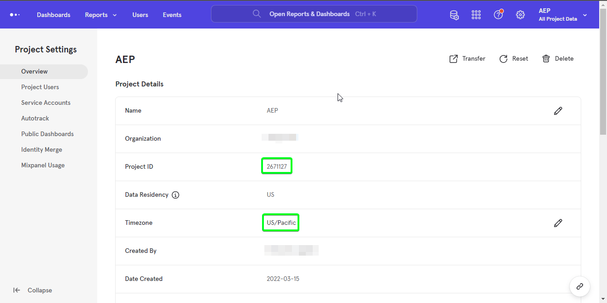
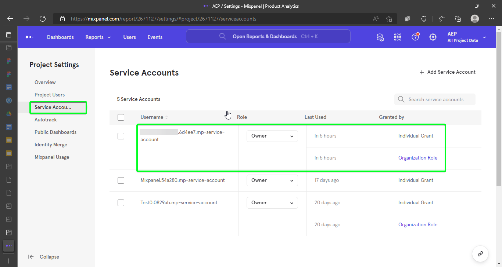

# [!DNL Mixpanel]

Adobe Experience Platform可讓您從外部來源擷取資料，同時使用Experience Platform服務來建構、加標籤及增強傳入資料。 您可以從多種來源(例如Adobe應用程式、雲端儲存、資料庫和許多其他來源)內嵌資料。

Experience Platform支援從協力廠商分析應用程式擷取資料。 對分析提供者的支援包括[!DNL Mixpanel]。

[[!DNL Mixpanel]](https://www.mixpanel.com)是一種產品分析工具，可讓您擷取使用者與數位產品互動的相關資料。 Mixpanel可讓您使用簡單的互動式報表來分析此產品資料，讓您只需按幾下即可查詢和視覺化資料。

來源會利用[Mixpanel Event Export API > Download](https://developer.mixpanel.com/reference/raw-event-export)，在接收並儲存在[!DNL Mixpanel]中的事件資料時，以及所有事件屬性（包括`distinct_id`）和將事件傳送至Experience Platform的確切時間戳記時，下載該資料。 Mixpanel使用持有人權杖作為驗證機制，與Mixpanel事件匯出API通訊。

## IP位址允許清單

使用來源聯結器之前，必須將IP位址清單新增至允許清單。 未能將您區域特定的IP位址新增到允許清單可能會導致使用來源時的錯誤或效能不佳。 如需詳細資訊，請參閱[IP位址允許清單](../../ip-address-allow-list.md)頁面。

## 驗證您的[!DNL Mixpanel]帳戶

本節概述驗證您的帳戶並將您的[!DNL Mixpanel]資料帶到Experience Platform所需完成的先決條件步驟。

若要建立[!DNL Mixpanel]來源連線和資料流，您必須先擁有有效的[!DNL Mixpanel]帳戶。 如果您沒有有效的[!DNL Mixpanel]帳戶，請參閱[Mixpanel登入](https://mixpanel.com/register/)頁面來建立您的帳戶。

當您成功建立[!DNL Mixpanel]帳戶後，請導覽至[!DNL Mixpanel] UI之[!DNL Project Seettings]頁面中的[!DNL Project Details]索引標籤，以擷取您的專案ID並設定您的時區。

接下來，導覽至[!DNL Mixpanel] UI中[!DNL Project Settings]頁面的[!DNL Service Accounts]索引標籤，以擷取您的服務帳戶認證。

>[!TIP]
>
>如需最佳實務，請選取[未過期](https://developer.mixpanel.com/reference/service-accounts#service-account-expiration)的服務帳戶。

最後，建立[!DNL Mixpanel Event Export API]所需的Experience Platform [結構描述](../../../xdm/schema/composition.md)。 如需結構描述所需對應的詳細資訊，請參閱[在UI](../../tutorials/ui/create/analytics/mixpanel.md#additional-resources)中建立 [!DNL Mixpanel] 來源連線的指南。

## 使用API連線[!DNL Mixpanel]至Experience Platform

以下檔案提供如何使用API或使用者介面將[!DNL Mixpanel]連線至Experience Platform的資訊：

* [使用Flow Service API為 [!DNL Mixpanel] 建立來源連線和資料流](../../tutorials/api/create/analytics/mixpanel.md)

## 使用UI連線[!DNL Mixpanel]至Experience Platform

* [在使用者介面中建立 [!DNL Mixpanel] 來源連線](../../tutorials/ui/create/analytics/mixpanel.md)
* [在UI中建立客戶成功來源連線的資料流](../../tutorials/ui/dataflow/analytics.md)
