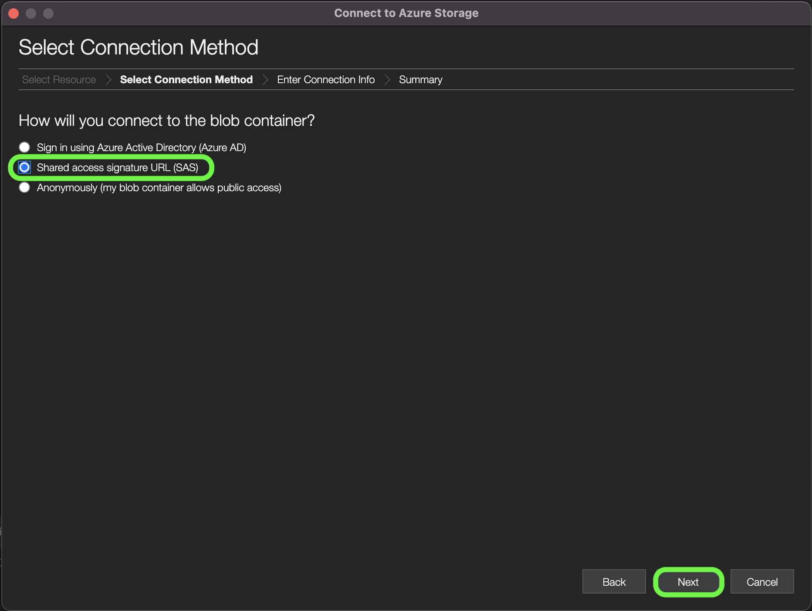
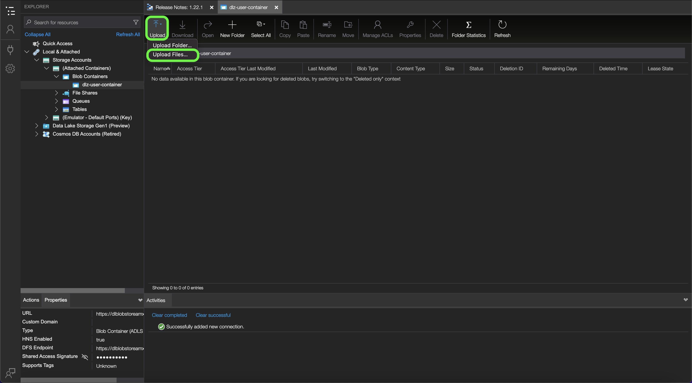

# [!DNL Data Landing Zone]

>[!IMPORTANT]
>
>此頁面特定於Experience Platform中的[!DNL Data Landing Zone] *來源*&#x200B;聯結器。 如需有關連線至[!DNL Data Landing Zone] *目的地*&#x200B;聯結器的資訊，請參閱[[!DNL Data Landing Zone] 目的地檔案頁面](/help/destinations/catalog/cloud-storage/data-landing-zone.md)。

[!DNL Data Landing Zone]是Adobe Experience Platform布建的[!DNL Azure Blob]儲存體介面，可授予您存取安全、雲端式的檔案儲存設施，以將檔案帶入Experience Platform。 您有權存取每個沙箱一個[!DNL Data Landing Zone]容器，而且所有容器的資料量總計以您的Experience Platform產品和服務授權所提供的資料量為限。 Experience Platform的所有客戶都已為每個沙箱布建一個[!DNL Data Landing Zone]容器。 您可以透過[!DNL Azure Storage Explorer]或命令列介面讀取及寫入檔案至容器。

[!DNL Data Landing Zone]支援SAS式驗證，其資料受到標準[!DNL Azure Blob]存放裝置安全機制的保護。 SAS式驗證可讓您透過公用網際網路連線，安全地存取[!DNL Data Landing Zone]容器。 您不需要變更網路即可存取[!DNL Data Landing Zone]容器，這表示您不需要為網路設定任何允許清單或跨區域設定。 Experience Platform對上傳至[!DNL Data Landing Zone]容器的所有檔案和資料夾強制實施嚴格的七天到期時間。 所有檔案和資料夾都會在七天後刪除。

## 在Azure上設定Experience Platform的[!DNL Data Landing Zone]來源 {#azure}

請依照下列步驟，瞭解如何在Azure上為Experience Platform設定[!DNL Data Landing Zone]帳戶。

>[!NOTE]
>
>如果您想要從[!DNL Azure Data Factory]存取[!DNL Data Landing Zone]，則必須使用Experience Platform提供的[SAS認證](../../tutorials/ui/create/cloud-storage/data-landing-zone.md#retrieve-your-data-landing-zone-credentials)為[!DNL Data Landing Zone]建立連結的服務。 建立連結的服務後，您就可以選取容器路徑（而非預設的根路徑）來探索[!DNL Data Landing Zone]。

### 檔案和目錄的命名限制

以下是您在命名雲端儲存空間檔案或目錄時必須考慮的限制清單。

- 目錄和檔案元件名稱不能超過255個字元。
- 目錄和檔案名稱不能以正斜線(`/`)結尾。 如果提供，則會自動移除。
- 必須正確逸出下列保留的URL字元： `! ' ( ) ; @ & = + $ , % # [ ]`
- 不允許下列字元： `" \ / : | < > * ?`。
- 不允許非法URL路徑字元。 類似`\uE000`的程式碼點雖然在NTFS檔案名稱中有效，但不是有效的Unicode字元。 此外，不允許使用某些ASCII或Unicode字元，例如控制字元（例如`0x00`到`0x1F`、`\u0081`等）。 如需HTTP/1.1中Unicode字串的規則，請參閱[RFC 2616，第2.2節：基本規則](https://www.ietf.org/rfc/rfc2616.txt)和[RFC 3987](https://www.ietf.org/rfc/rfc3987.txt)。
- 不允許下列檔案名稱： LPT1、LPT2、LPT3、LPT4、LPT5、LPT6、LPT7、LPT8、LPT9、COM1、COM2、COM3、COM4、COM5、COM6、COM7、COM8、COM9、PRN、AUX、NUL、CON、CLOCK$、點字元(.)和兩個點字元(..)。

### 管理資料登陸區域的內容{#manage-the-contents-of-your-data-landing-zone}

您可以使用[[!DNL Azure Storage Explorer]](https://azure.microsoft.com/en-us/features/storage-explorer/)來管理[!DNL Data Landing Zone]容器的內容。

在[!DNL Azure Storage Explorer] UI中，選取左側導覽中的連線圖示。 **選取資源**&#x200B;視窗會出現，提供您連線的選項。 選取&#x200B;**[!DNL Blob container]**&#x200B;以連線至[!DNL Data Landing Zone]。


接著，選取&#x200B;**共用存取簽章URL (SAS)**&#x200B;作為您的連線方法，然後選取&#x200B;**下一步**。



選取您的連線方法後，您必須接著提供與[!DNL Data Landing Zone]容器相對應的&#x200B;**顯示名稱**&#x200B;和&#x200B;**[!DNL Blob]容器SAS URL**。

>[!TIP]
>
>您可以從Experience Platform UI中的來源目錄擷取您的[!DNL Data Landing Zone]認證。

提供您的[!DNL Data Landing Zone] SAS URL，然後選取&#x200B;**下一步**


「**摘要**」視窗會出現，提供您設定的總覽，包括[!DNL Blob]端點與許可權的相關資訊。 準備就緒後，選取&#x200B;**連線**。


成功連線會以您的[!DNL Data Landing Zone]容器更新您的[!DNL Azure Storage Explorer] UI。


在您的[!DNL Data Landing Zone]容器連線至[!DNL Azure Storage Explorer]後，您現在可以開始將檔案上傳至[!DNL Data Landing Zone]容器。 若要上傳，請選取&#x200B;**上傳**，然後選取&#x200B;**上傳檔案**。



選取要上傳的檔案後，您必須識別要上傳的[!DNL Blob]型別，以及您想要的目的地目錄。 完成後，選取&#x200B;**上傳**。

| [!DNL Blob]型別 | 說明 |
| --- | --- |
| 封鎖[!DNL Blob] | 區塊[!DNL Blobs]已最佳化，以有效率的方式上傳大量資料。 區塊[!DNL Blobs]是[!DNL Data Landing Zone]的預設選項。 |
| 附加[!DNL Blob] | 已針對在檔案結尾附加資料最佳化[!DNL Blobs]。 |


### 使用命令列介面上傳檔案至您的[!DNL Data Landing Zone]

您也可以使用裝置的命令列介面，並存取上傳檔案至[!DNL Data Landing Zone]。

### 使用Bash上傳檔案

下列範例使用Bash和cURL，透過[!DNL Azure Blob Storage] REST API將檔案上傳至[!DNL Data Landing Zone]：

```shell
# Set Azure Blob-related settings
DATE_NOW=$(date -Ru | sed 's/\+0000/GMT/')
AZ_VERSION="2018-03-28"
AZ_BLOB_URL="<URL TO BLOB ACCOUNT>"
AZ_BLOB_CONTAINER="<BLOB CONTAINER NAME>"
AZ_BLOB_TARGET="${AZ_BLOB_URL}/${AZ_BLOB_CONTAINER}"
AZ_SAS_TOKEN="<SAS TOKEN, STARTING WITH ? AND ENDING WITH %3D>"

# Path to the file we wish to upload
FILE_PATH="</PATH/TO/FILE>"
FILE_NAME=$(basename "$FILE_PATH")

# Execute HTTP PUT to upload file (remove '-v' flag to suppress verbose output)
curl -v -X PUT \
   -H "Content-Type: application/octet-stream" \
   -H "x-ms-date: ${DATE_NOW}" \
   -H "x-ms-version: ${AZ_VERSION}" \
   -H "x-ms-blob-type: BlockBlob" \
   --data-binary "@${FILE_PATH}" "${AZ_BLOB_TARGET}/${FILE_NAME}${AZ_SAS_TOKEN}"
```

### 使用Python上傳檔案

下列範例使用[!DNL Microsoft's] Python v12 SDK將檔案上傳至[!DNL Data Landing Zone]：

>[!TIP]
>
>雖然下列範例使用完整SAS URI連線至[!DNL Azure Blob]容器，但您可以使用其他方法和作業來進行驗證。 如需詳細資訊，請參閱Python v12 SDK[&#128279;](https://docs.microsoft.com/en-us/azure/storage/blobs/storage-quickstart-blobs-python)上的此[!DNL Microsoft] 檔案。

```py
import os
from azure.storage.blob import ContainerClient

try:
    # Set Azure Blob-related settings
    sasUri = "<SAS URI>"
    srcFilePath = "<FULL PATH TO FILE>" 
    srcFileName = os.path.basename(srcFilePath)

    # Connect to container using SAS URI
    containerClient = ContainerClient.from_container_url(sasUri)

    # Upload file to Data Landing Zone with overwrite enabled
    with open(srcFilePath, "rb") as fileToUpload:
        containerClient.upload_blob(srcFileName, fileToUpload, overwrite=True)

except Exception as ex:
    print("Exception: " + ex.strerror)
```

### 使用[!DNL AzCopy]上傳檔案

下列範例使用[!DNL Microsoft's] [!DNL AzCopy]公用程式將檔案上傳至[!DNL Data Landing Zone]：

>[!TIP]
>
>雖然下列範例是使用`copy`命令，但您可以使用[!DNL AzCopy]使用其他命令和選項將檔案上傳至[!DNL Data Landing Zone]。 如需詳細資訊，請參閱此[[!DNL Microsoft AzCopy] 檔案](https://docs.microsoft.com/en-us/azure/storage/common/storage-ref-azcopy?toc=/azure/storage/blobs/toc.json)。

```bat
set sasUri=<FULL SAS URI, PROPERLY ESCAPED>
set srcFilePath=<PATH TO LOCAL FILE(S); WORKS WITH WILDCARD PATTERNS>

azcopy copy "%srcFilePath%" "%sasUri%" --overwrite=true --recursive=true
```

## 在Amazon Web Services上設定Experience Platform的[!DNL Data Landing Zone]來源 {#aws}

>[!AVAILABILITY]
>
>本節適用於在Amazon Web Services (AWS)上執行的Experience Platform實作。 目前有限數量的客戶可使用在AWS上執行的Experience Platform 。 若要進一步瞭解支援的Experience Platform基礎結構，請參閱[Experience Platform多雲端總覽](https://experienceleague.adobe.com/zh-hant/docs/experience-platform/landing/multi-cloud)。

請依照下列步驟，瞭解如何在Amazon Web Services (AWS)上為Experience Platform設定[!DNL Data Landing Zone]帳戶。

### AWS上連線的IP位址允許清單

您必須先將地區特定的IP位址新增至允許清單，才能將您的來源連線到AWS上的Experience Platform。 如需詳細資訊，請參閱[允許清單IP位址以連線至AWS](../../ip-address-allow-list.md)上的Experience Platform的指南。

### 設定AWS CLI並執行作業

- 閱讀[安裝或更新至最新版AWS CLI](https://docs.aws.amazon.com/cli/latest/userguide/getting-started-install.html)的指南。

### 使用臨時憑證設定AWS CLI

使用AWS `configure`命令以存取金鑰和工作階段權杖來設定您的CLI。

```shell
aws configure
```

出現提示時，輸入下列值：

- AWS存取金鑰識別碼： `{YOUR_ACCESS_KEY_ID}`
- AWS秘密存取金鑰： `{YOUR_SECRET_ACCESS_KEY}`
- 預設區域名稱： `{YOUR_REGION}` （例如，`us-west-2`）
- 預設輸出格式： `json`

接下來，設定工作階段權杖：

```shell
aws configure set aws_session_token your-session-token
```

### 處理[!DNL Amazon S3]上的檔案

>[!BEGINTABS]

>[!TAB 將檔案上傳至Amazon S3]

範本：

```shell
aws s3 cp local-file-path s3://bucketName/dlzFolder/remote-file-Name
```

範例：

```shell
aws s3 cp example.txt s3://bucketName/dlzFolder/example.txt
```


>[!TAB 從Amazon S3下載檔案]

範本：

```shell
aws s3 cp s3://bucketName/dlzFolder/remote-file local-file-path
```

範例：

```shell
aws s3 cp s3://bucketName/dlzFolder/example.txt example.txt
```

>[!ENDTABS]

### 使用您的[!DNL Data Landing Zone]認證登入AWS Console

#### 擷取您的認證

首先，您必須取得下列內容：

- `awsAccessKeyId`
- `awsSecretAccessKey`
- `awsSessionToken`

#### 產生登入權杖

接下來，使用擷取的認證，建立工作階段並使用AWS Federation端點產生登入權杖：

```py
import json
import requests
 
# Example DLZ response with credentials
response_json = '''{
    "credentials": {
        "awsAccessKeyId": "your-access-key",
        "awsSecretAccessKey": "your-secret-key",
        "awsSessionToken": "your-session-token"
    }
}'''
 
# Parse credentials
response_data = json.loads(response_json)
aws_access_key_id = response_data['credentials']['awsAccessKeyId']
aws_secret_access_key = response_data['credentials']['awsSecretAccessKey']
aws_session_token = response_data['credentials']['awsSessionToken']
 
# Create session dictionary
session = {
    'sessionId': aws_access_key_id,
    'sessionKey': aws_secret_access_key,
    'sessionToken': aws_session_token
}
 
# Generate the sign-in token
signin_token_url = "https://signin.aws.amazon.com/federation"
signin_token_payload = {
    "Action": "getSigninToken",
    "Session": json.dumps(session)
}
signin_token_response = requests.post(signin_token_url, data=signin_token_payload)
signin_token = signin_token_response.json()['SigninToken']
```

#### 建構AWS主控台登入URL

取得登入權杖後，您就可以建置URL，將您登入AWS主控台，並直接指向所需的[!DNL Amazon S3]貯體。

```py
from urllib.parse import quote
 
# Define the S3 bucket and folder path you want to access
bucket_name = "your-bucket-name"
bucket_path = "your-bucket-folder"
 
# Construct the destination URL
destination_url = f"https://s3.console.aws.amazon.com/s3/buckets/{bucket_name}?prefix={bucket_path}/&tab=objects"
 
# Create the final sign-in URL
signin_url = f"https://signin.aws.amazon.com/federation?Action=login&Issuer=YourAppName&Destination={quote(destination_url)}&SigninToken={signin_token}"
 
print(f"Sign-in URL: {signin_url}")
```

#### 存取AWS Console

最後，導覽至產生的URL，以使用您的[!DNL Data Landing Zone]認證直接登入AWS Console，進而存取[!DNL Amazon S3]貯體中的特定資料夾。 登入URL會直接將您帶往該資料夾，確保您只會看見和管理允許的資料。

## 將[!DNL Data Landing Zone]連線至Experience Platform

>[!IMPORTANT]
>
>- 若要連線到來源，您需要&#x200B;**[!UICONTROL 檢視來源]**&#x200B;和&#x200B;**[!UICONTROL 管理來源]**&#x200B;存取控制許可權。 如需詳細資訊，請閱讀[存取控制總覽](../../../access-control/home.md)，或連絡您的產品管理員以取得必要的許可權。
>
>- 使用[!DNL Data Landing Zone]連線至Experience Platform時，目前不支援私人連結。 唯一支援的存取方法是[這裡](#manage-the-contents-of-your-data-landing-zone)列出的方法。

以下檔案提供如何使用API或使用者介面將資料從您的[!DNL Data Landing Zone]容器帶入Adobe Experience Platform的資訊。

### 使用API

- [使用流程服務API建立 [!DNL Data Landing Zone] 來源連線](../../tutorials/api/create/cloud-storage/data-landing-zone.md)
- [使用流量服務API為雲端儲存空間來源建立資料流](../../tutorials/api/collect/cloud-storage.md)

### 使用UI

- [使用UI連線 [!DNL Data Landing Zone] 至Experience Platform](../../tutorials/ui/create/cloud-storage/data-landing-zone.md)
- [在UI中為雲端儲存空間連線建立資料流](../../tutorials/ui/dataflow/batch/cloud-storage.md)

