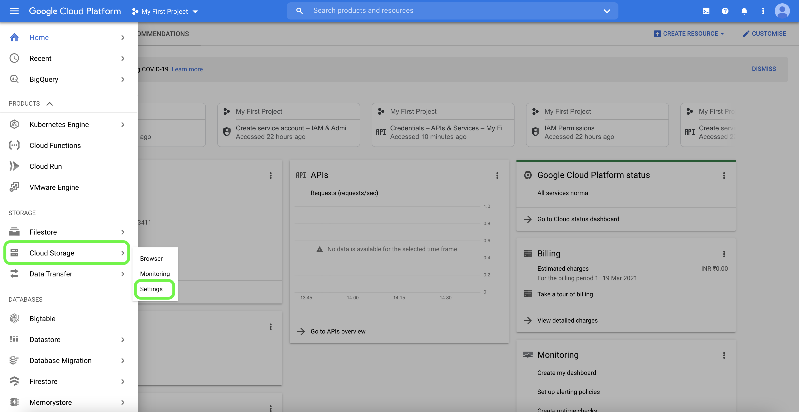

# Google雲儲存介面

Adobe Experience Platform提供本地連接，如AWS, [!DNL Google Cloud Platform], [!DNL Azure]，允許您從這些系統中獲取資料。

雲儲存源可以將您自己的資料帶入平台，而無需下載、格式化或上載。 所攝取的資料可以格式化為符合體驗資料模型(XDM)的JSON或Parfect，或以分隔格式。 流程的每個步驟都整合到源工作流中。 平台允許您從 [!DNL Google Cloud Storage] 批處理。

## IP地址允許清單

在使用源連接器之前，必須將IP地址清單添加到允許清單。 如果無法將特定於區域的IP地址添加到允許清單，則在使用源時可能會導致錯誤或效能不佳。 查看 [IP地址允許清單](../../ip-address-allow-list.md) 的子菜單。

## 連接您的 [!DNL Google Cloud Storage] 帳戶

為了連接到平台，您必須首先為 [!DNL Google Cloud Storage] 帳戶。 要訪問互操作性設定，請開啟 [!DNL Google Cloud Platform] 選擇 **[!UICONTROL 設定]** 從 **[!UICONTROL 雲儲存]** 的子菜單。

<!--  -->

的 **[!UICONTROL 設定]** 的子菜單。 從這裡，您可以看到 [!DNL Google] 項目ID和有關您的 [!DNL Google Cloud Storage] 帳戶。 要訪問互操作性設定，請選擇 **[!UICONTROL 互操作性]** 的下界。

<!--  -->

的 **[!UICONTROL 互操作性]** 頁面包含有關驗證、訪問密鑰和與服務帳戶關聯的預設項目的資訊。 要為服務帳戶生成新的訪問密鑰ID和密鑰訪問密鑰，請選擇 **[!UICONTROL 為服務帳戶建立密鑰]**。

<!--  -->

您可以使用新生成的訪問密鑰ID和密鑰訪問密鑰來連接 [!DNL Google Cloud Storage] 帳戶到平台。

有關詳細資訊，請閱讀上的指南 [建立和管理服務帳戶密鑰](https://cloud.google.com/iam/docs/creating-managing-service-account-keys) 從 [!DNL Google Cloud] 文檔。

## 檔案和目錄的命名約束

以下是命名雲儲存檔案或目錄時必須考慮的約束條件清單。

- 目錄和檔案元件名稱不能超過255個字元。
- 目錄和檔案名不能以正斜槓結尾(`/`)。 如果提供，將自動刪除。
- 必須正確轉義以下保留URL字元： `! ' ( ) ; @ & = + $ , % # [ ]`
- 不允許使用以下字元： `" \ / : | < > * ?`。
- 不允許使用非法的URL路徑字元。 代碼點類似 `\uE000`，但在NTFS檔案名中有效，則不是有效的Unicode字元。 此外，也不允許使用某些ASCII或Unicode字元，如控制字元（0x00到0x1F、\u0081等）。 有關HTTP/1.1中Unicode字串的規則，請參見 [RFC 2616，第2.2節：基本規則](https://www.ietf.org/rfc/rfc2616.txt) 和 [RFC 3987](https://www.ietf.org/rfc/rfc3987.txt)。
- 不允許使用下列檔案名：LPT1、LPT2、LPT3、LPT4、LPT5、LPT6、LPT7、LPT8、LPT9、COM1、COM2、COM3、COM4、COM5、COM6、COM7、COM9、COM9prn、AUX、NUL、CON、CLOCK$、點字元(.)和兩個點字元(..)。

## 連接 [!DNL Google Cloud Storage] 到平台

以下文檔提供了有關如何連接的資訊 [!DNL Google Cloud Storage] 到使用API或用戶介面的平台：

### 使用API

- [使用流服務API建立Google雲儲存基連接](../../tutorials/api/create/cloud-storage/google.md)
- [使用流服務API瀏覽雲儲存源的資料結構和內容](../../tutorials/api/explore/cloud-storage.md)
- [使用流服務API為雲儲存源建立資料流](../../tutorials/api/collect/cloud-storage.md)

### 使用UI

- [在UI中建立Google雲儲存源連接](../../tutorials/ui/create/cloud-storage/google-cloud-storage.md)
- [在UI中為雲儲存連接建立資料流](../../tutorials/ui/dataflow/batch/cloud-storage.md)
