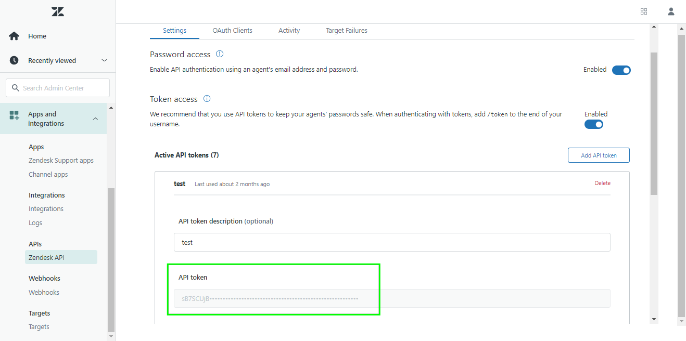

# (Beta) [!DNL Zendesk]

>[!NOTE]
>
>的 [!DNL Zendesk] 源為beta。 查看 [源概述](../../home.md#terms-and-conditions) 的子菜單。

Adobe Experience Platform允許從外部源接收資料，同時讓您能夠使用平台服務構建、標籤和增強傳入資料。 您可以從多種源(如Adobe應用程式、基於雲的儲存、資料庫和許多其他源)接收資料。

Experience Platform支援從第三方客戶成功應用程式接收資料。 對客戶成功提供商的支援包括 [!DNL Zendesk]。

這個Adobe Experience Platform [來源](https://experienceleague.adobe.com/docs/experience-platform/sources/home.html?lang=zh-Hant) 利用 [Zendesk搜索API >導出搜索結果](https://developer.zendesk.com/api-reference/ticketing/ticket-management/search/#export-search-results) 將用戶資訊從Zendesk返回到Experience Platform，以便進一步處理。

## IP地址允許清單

在使用源連接器之前，必須將IP地址清單添加到允許清單。 如果無法將特定於區域的IP地址添加到允許清單，則在使用源時可能會導致錯誤或效能不佳。 查看 [IP地址允許清單](../../ip-address-allow-list.md) 的子菜單。

## 驗證您的 [!DNL Zendesk] 帳戶

[!DNL Zendesk] 使用承載令牌作為與通信的驗證機制 [!DNL Zendesk] API。

本節概述了為驗證您的 [!DNL Zendesk] 帳戶。

* 驗證您 [!DNL Zendesk] 帳戶是確保 [!DNL Zendesk] 支援帳戶。 如果你還沒看到 [[!DNL Zendesk] 註冊頁](https://www.zendesk.com/register/) 註冊並建立Zendesk帳戶。
* 成功註冊後，導航至 [[!DNL Zendesk] 網站](https://www.zendesk.com/login/) 提供 **子域**。
* 下一步，選擇 **[!DNL Settings]** > **[!DNL Apps and Integrations]** > **[!DNL Zendesk API]**。
* 最後，從 **[!DNL API token]** 的子菜單。

查看 [[!DNL Zendesk documentation on subdomains]](https://support.zendesk.com/hc/en-us/articles/4409381383578-Where-can-I-find-my-Zendesk-subdomain-) 獲取有關如何檢索子域的資訊。 有關生成API令牌的資訊，請參見 [[!DNL Zendesk] 生成新API令牌的指南](https://support.zendesk.com/hc/en-us/articles/4408889192858-Generating-a-new-API-token)。

以下文檔提供了有關如何連接的資訊 [!DNL Zendesk] 到使用API或用戶介面的平台：

## 連接 [!DNL Zendesk] 到使用API的平台

* [建立源連接和資料流 [!DNL Zendesk] 使用流服務API](../../tutorials/api/create/customer-success/zendesk.md)

## 連接 [!DNL Zendesk] 到使用UI的平台

* [建立 [!DNL Zendesk ]UI中的源連接](../../tutorials/ui/create/customer-success/zendesk.md)
* [在UI中為客戶成功源連接建立資料流](../../tutorials/ui/dataflow/customer-success.md)
