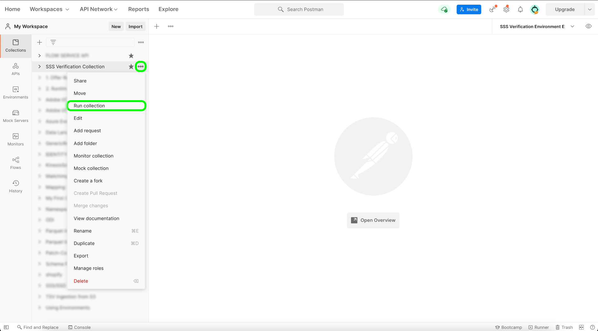

# 提交您的來源

使用自助式來源（批次SDK）將新來源整合到Adobe Experience Platform的最後一步是測試來源以進行驗證。 一旦成功，您就可以連絡您的Adobe代表來提交新的來源。

以下檔案提供如何使用測試和偵錯來源的步驟 [[!DNL Flow Service] API](https://www.adobe.io/experience-platform-apis/references/flow-service/).

## 快速入門

* 如需如何成功呼叫Platform API的詳細資訊，請參閱以下指南中的 [Platform API快速入門](../../../landing/api-guide.md).
* 如需如何為Platform API產生認證的詳細資訊，請參閱以下教學課程： [驗證和存取Experience PlatformAPI](../../../landing/api-authentication.md).
* 如需如何設定的詳細資訊 [!DNL Postman] 若為Platform API，請參閱以下教學課程： [設定開發人員控制檯和 [!DNL Postman]](../../../landing/postman.md).
* 為協助您的測試和偵錯程式，請下載 [在此提供自助來源驗證收集與環境](../assets/sdk-verification.zip) 並依照下列步驟進行。

## 測試您的來源

若要測試您的來源，您必須執行 [自助來源驗證收集與環境](../assets/sdk-verification.zip) 於 [!DNL Postman] 同時提供與您的來源相關的適當環境變數。

若要開始測試，您必須先設定集合和環境 [!DNL Postman]. 接下來，指定您要測試的連線規格ID。

### 指定 `authSpecName`

輸入連線規格ID後，您必須指定 `authSpecName` 用於基礎連線的屬性。 根據您的選擇，這可能是 `OAuth 2 Refresh Code` 或  `Basic Authentication`. 一旦您指定 `authSpecName`，您隨後必須在您的環境中包含其所需的認證。 例如，如果您指定 `authSpecName` 作為 `OAuth 2 Refresh Code`，則您必須提供OAuth 2的必要認證，包括 `host` 和 `accessToken`.

### 指定 `sourceSpec`

在新增驗證規格引數後，您必須接著從來源規格中新增必要屬性。 您可在以下位置找到所需屬性： `sourceSpec.spec.properties`. 若為 [!DNL MailChimp Members] 以下範例中，唯一需要的屬性是 `listId`，這表示 `listId` 而且它是與您的對應的識別碼值 [!DNL Postman] 環境。

```json
"spec": {
  "$schema": "http://json-schema.org/draft-07/schema#",
  "type": "object",
  "description": "Define user input parameters to fetch resource values.",
  "properties": {
    "listId": {
      "type": "string",
      "description": "listId for which members need to fetch."
    }
  }
}
```

提供驗證和來源規格引數後，您就可以開始填入其餘的環境變數，請參閱下表以取得參考：

>[!NOTE]
>
>以下所有範例變數都是您必須更新的預留位置值，以下除外 `flowSpecificationId` 和 `targetConnectionSpecId`，為固定值。

| 參數 | 說明 | 範例 |
| --- | --- | --- |
| `x-api-key` | 用於驗證Experience Platform API呼叫的唯一識別碼。 請參閱教學課程，位置如下： [驗證和存取Experience PlatformAPI](../../../landing/api-authentication.md) 以取得如何擷取 `x-api-key`. | `c8d9a2f5c1e03789bd22e8efdd1bdc1b` |
| `x-gw-ims-org-id` | 企業實體，可以擁有或授權產品及服務，並允許存取其成員。 請參閱教學課程，位置如下： [設定開發人員控制檯和 [!DNL Postman]](../../../landing/postman.md) 以取得如何擷取 `x-gw-ims-org-id` 資訊。 | `ABCEH0D9KX6A7WA7ATQE0TE@adobeOrg` |
| `authorizationToken` | 完成對Experience Platform API的呼叫所需的授權權杖。 請參閱教學課程，位置如下： [驗證和存取Experience PlatformAPI](../../../landing/api-authentication.md) 以取得如何擷取 `authorizationToken`. | `Bearer authorizationToken` |
| `schemaId` | 為了在Platform中使用來源資料，必須建立目標結構描述，以根據您的需求來建構來源資料。 如需建立目標XDM結構的詳細步驟，請參閱以下教學課程： [使用API建立結構描述](../../../xdm/api/schemas.md). | `https://ns.adobe.com/{TENANT_ID}.schemas.0ef4ce0d390f0809fad490802f53d30b` |
| `schemaVersion` | 與您的結構描述對應的唯一版本。 | `application/vnd.adobe.xed-full-notext+json; version=1` |
| `schemaAltId` | 此 `meta:altId` 此引數會與  `schemaId` 建立新結構描述時。 | `_{TENANT_ID}.schemas.0ef4ce0d390f0809fad490802f53d30b` |
| `dataSetId` | 如需建立目標資料集的詳細步驟，請參閱以下教學課程： [使用API建立資料集](../../../catalog/api/create-dataset.md). | `5f3c3cedb2805c194ff0b69a` |
| `mappings` | 對應集可用來定義來源結構描述中的資料如何對應到目的地結構描述。 如需如何建立對應的詳細步驟，請參閱以下教學課程： [使用API建立對應集](../../../data-prep/api/mapping-set.md). | `[{"destinationXdmPath":"person.name.firstName","sourceAttribute":"email.email_id","identity":false,"version":0},{"destinationXdmPath":"person.name.lastName","sourceAttribute":"email.activity.action","identity":false,"version":0}]` |
| `mappingId` | 與對應集對應的唯一ID。 | `bf5286a9c1ad4266baca76ba3adc9366` |
| `connectionSpecId` | 與您的來源對應的連線規格ID。 這是您產生的ID [建立新的連線規格](./create.md). | `2e8580db-6489-4726-96de-e33f5f60295f` |
| `flowSpecificationId` | 的流程規格ID `RestStorageToAEP`. **此為固定值**. | `6499120c-0b15-42dc-936e-847ea3c24d72` |
| `targetConnectionSpecId` | 擷取資料所在的資料湖的目標連線ID。 **此為固定值**. | `c604ff05-7f1a-43c0-8e18-33bf874cb11c` |
| `verifyWatTimeInSecond` | 檢查流程執行的完成時要遵循的指定時間間隔。 | `40` |
| `startTime` | 為資料流指定的開始時間。 開始時間的格式必須是unix時間。 | `1597784298` |

提供所有環境變數後，您就可以使用 [!DNL Postman] 介面。 在 [!DNL Postman] 介面，選取省略符號(**...**)旁邊 [!DNL Sources SSSs Verification Collection] 然後選取 **執行集合**.



此 [!DNL Runner] 介面會出現，讓您設定資料流的執行順序。 選取 **執行SSS驗證集合** 以執行集合。

>[!NOTE]
>
>您可以停用 **刪除流量** 如果您偏好使用Platform UI中的來源監控儀表板，請參閱執行訂單檢查清單。 不過，測試完成後，您必須確保刪除測試流程。


## 提交您的來源

當您的來源能夠完成整個工作流程後，您可以繼續聯絡您的Adobe代表並提交您的來源以進行整合。
