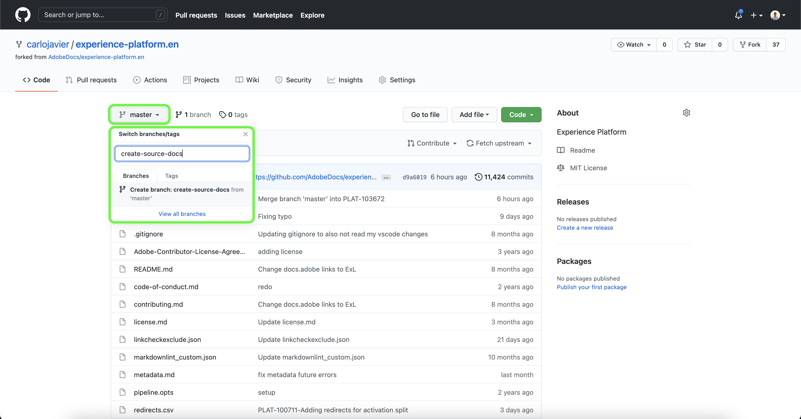

# 使用GitHub Web介面建立源文檔頁

本文檔提供了如何使用GitHub Web介面編寫文檔和提交拉入請求(PR)的步驟。

>[!TIP]
>
>以下來自Adobe幫助指南的文檔可用於進一步支援您的文檔流程： <ul><li>[安裝Git和Markdown創作工具](https://experienceleague.adobe.com/docs/contributor/contributor-guide/setup/install-tools.html?lang=en)</li><li>[在本機設定供文件使用的 Git 存放庫](https://experienceleague.adobe.com/docs/contributor/contributor-guide/setup/local-repo.html?lang=en)</li><li>[適用於重大變更的 GitHub 貢獻工作流程](https://experienceleague.adobe.com/docs/contributor/contributor-guide/setup/full-workflow.html?lang=en)</li></ul>

## 設定GitHub環境

設定GitHub環境的第一步是導航到 [Adobe Experience PlatformGitHub儲存庫](https://github.com/AdobeDocs/experience-platform.en)。

下一步，選擇 **叉**。

完成分叉後，選擇 **主** 並在出現的下拉菜單中輸入新分支的名稱。 確保為分支提供描述性名稱，因為此名稱將用於包含您的工作，然後選擇 **建立分支**。

在已分類儲存庫的GitHub資料夾結構中，導航到 [`experience-platform.en/help/sources/tutorials/api/create/`](https://github.com/AdobeDocs/experience-platform.en/tree/main/help/sources/tutorials/api/create) 然後從清單中為源選擇相應的類別。 例如，如果要為新CRM源建立文檔，請選擇 **crm**。

>[!TIP]
>
>如果要為UI建立文檔，請導航至 [`experience-platform.en/help/sources/tutorials/ui/create/`](https://github.com/AdobeDocs/experience-platform.en/tree/main/help/sources/tutorials/ui/create) 並為源選擇相應的類別。 要添加影像，請導航至 [`experience-platform.en/help/sources/images/tutorials/create/sdk`](https://github.com/AdobeDocs/experience-platform.en/tree/main/help/sources/images/tutorials/create) 然後將螢幕截圖添加到 `sdk` 的子菜單。

將顯示現有CRM源的資料夾。 要為新源添加文檔，請選擇 **添加檔案** ，然後選擇 **建立新檔案** 的下界。

命名源檔案 `YOURSOURCE.md` 其中YOURSOURCE是平台中源的名稱。 例如，如果您的公司是ACME CRM，則您的檔案名應為 `acme-crm.md`。

## 為來源編寫文檔頁面

要開始記錄新源，請貼上 [源文檔模板](./template.md) 到GitHub網站編輯器。 您也可以下載模板 [這裡](../assets/api-template.zip)。

將模板複製到GitHub Web編輯器介面後，請按照模板上概述的說明進行操作，並編輯包含源相關資訊的值。

完成後，提交分支中的檔案。

## 提交文檔以供審閱

提交檔案後，您可以開啟拉入請求(PR)，將工作分支合併到Adobe文檔儲存庫的主分支中。 確保已選擇您正在處理的分支，然後選擇 **比較和拉入請求**。

確保基本分支和比較分支正確。 向PR添加註釋，描述更新，然後選擇 **建立拉入請求**。 這將開啟一個PR，將工作的工作分支合併到Adobe儲存庫的主分支中。

>[!TIP]
>
>離開 **允許維護人員編輯** 複選框，以確保Adobe文檔團隊可以編輯PR。

此時，將出現一條通知，提示您簽署Adobe參與者許可協定(CLA)。 這是必須的步驟。 簽署CLA後，刷新PR頁並提交拉入請求。

您可以通過檢查https://github.com/AdobeDocs/experience-platform.en中的拉請求頁籤來確認已提交拉請求。

