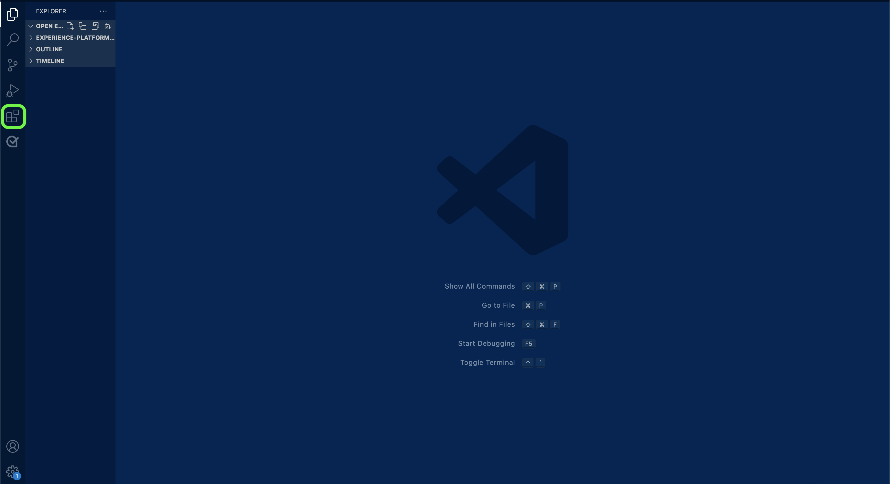

# 在本機環境中使用文字編輯器建立來原始檔頁面

本檔案提供相關步驟，說明如何使用本機環境編寫來原始檔並提交提取請求(PR)。

>[!TIP]
>
>Adobe的投稿指南中的下列檔案可用來進一步支援您的說明檔案程式： <ul><li>[安裝Git與Markdown編寫工具](https://experienceleague.adobe.com/docs/contributor/contributor-guide/setup/install-tools.html)</li><li>[在本機設定檔案的Git存放庫](https://experienceleague.adobe.com/docs/contributor/contributor-guide/setup/local-repo.html)</li><li>[重大變更的GitHub貢獻工作流程](https://experienceleague.adobe.com/docs/contributor/contributor-guide/setup/full-workflow.html)</li></ul>

## 先決條件

下列教學課程需要您在本機電腦上安裝GitHub Desktop。 如果您沒有GitHub Desktop，您可以在[這裡](https://desktop.github.com/)下載應用程式。

## 連線至GitHub並設定您的本機編寫環境

設定本機編寫環境的第一個步驟是導覽至[Adobe Experience Platform GitHub存放庫](https://github.com/AdobeDocs/experience-platform.en)。

在Experience Platform GitHub存放庫的首頁上，選取&#x200B;**Fork**。

若要將存放庫複製到本機電腦，請選取&#x200B;**代碼**。 從出現的下拉式功能表中，選取&#x200B;**HTTPS**，然後選取&#x200B;**使用GitHub Desktop開啟**。

>[!TIP]
>
>如需詳細資訊，請參閱有關[在本機設定檔案](https://experienceleague.adobe.com/docs/contributor/contributor-guide/setup/local-repo.html#create-a-local-clone-of-the-repository)的Git存放庫的教學課程。

接下來，請稍等片刻，讓GitHub Desktop複製`experience-platform.en`存放庫。

復製程式完成後，請前往GitHub Desktop建立新分支。 從頂端導覽中選取&#x200B;**主版**，然後選取&#x200B;**新增分支**

在出現的彈出視窗面板中，輸入分支的描述性名稱，然後選取&#x200B;**建立分支**。

接著，選取&#x200B;**發佈分支**。

## 為您的來源編寫檔案頁面

將存放庫複製到本機電腦，並建立新分支後，您現在可以透過您選擇的[文字編輯器](https://experienceleague.adobe.com/docs/contributor/contributor-guide/setup/install-tools.html#understand-markdown-editors)，開始為您的新來源編寫檔案頁面。

Adobe建議您使用[Visual Studio Code](https://code.visualstudio.com/)，並安裝Adobe Markdown Authoring擴充功能。 若要安裝擴充功能，請啟動Visual Studio Code，然後從左側導覽區中選取&#x200B;**擴充功能**&#x200B;索引標籤。

接著，在搜尋列中輸入`Adobe Markdown Authoring`，然後從顯示的頁面中選取&#x200B;**安裝**。

在本機電腦準備就緒的情況下，下載[來原始檔範本](../assets/api-template.zip)，並將檔案解壓縮至`experience-platform.en/help/sources/tutorials/api/create/...`，其中的[`...`]代表您選擇的類別。 例如，如果您要建立資料庫來源，請選取資料庫資料夾。

最後，請依照範本上概述的指示，使用與來源相關的相關資訊來編輯範本。

## 提交您的檔案以供檢閱

若要建立提取請求(PR)並提交檔案以供檢閱，請先將您的工作儲存在[!DNL Visual Studio Code] （或您選擇的文字編輯器）中。 接下來，使用GitHub Desktop，輸入認可訊息並選取&#x200B;**認可以建立 — source-documentation**。

接著，選取&#x200B;**推播來源**，將您的工作上傳至遠端分支。

若要建立提取請求，請選取&#x200B;**建立提取請求**。

請確認基礎分支和比較分支正確無誤。 將說明您更新的附註新增至PR，然後選取&#x200B;**建立提取請求**。 這會開啟PR，將您工作的工作分支合併至Adobe存放庫的主分支。

>[!TIP]
>
>保留&#x200B;**允許維護者進行編輯**&#x200B;核取方塊為已選取狀態，以確保Adobe檔案團隊可對PR進行編輯。

您可以檢查https://github.com/AdobeDocs/experience-platform.en中的「提取請求」標籤，確認提取請求已提交。

