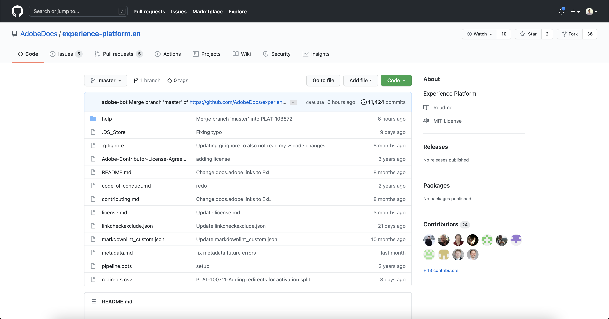

# 在本機環境中使用文字編輯器來建立來源檔案頁面

本檔案提供如何使用本機環境來編寫來源檔案及提交提取請求(PR)的步驟。

>[!TIP]
>
>以下是Adobe貢獻指南中的檔案，可進一步支援您的說明檔案程式： <ul><li>[安裝Git與Markdown編寫工具](https://experienceleague.adobe.com/docs/contributor/contributor-guide/setup/install-tools.html?lang=en)</li><li>[在本機設定供文件使用的 Git 存放庫](https://experienceleague.adobe.com/docs/contributor/contributor-guide/setup/local-repo.html?lang=en)</li><li>[適用於重大變更的 GitHub 貢獻工作流程](https://experienceleague.adobe.com/docs/contributor/contributor-guide/setup/full-workflow.html?lang=en)</li></ul>

## 先決條件

若要使用本機電腦安裝GitHub Desktop，以下教學課程需先完成。 若您沒有GitHub Desktop，則可下載應用程式 [此處](https://desktop.github.com/).

## 連線至GitHub並設定本機製作環境

設定本機製作環境的第一步，就是導覽至 [Adobe Experience Platform GitHub存放庫](https://github.com/AdobeDocs/experience-platform.en).

在Platform GitHub存放庫的首頁面上，選取 **分支**.

要將儲存庫克隆到本地電腦，請選擇 **程式碼**. 從顯示的下拉式功能表中，選取 **HTTPS** 然後，選取 **使用GitHub案頭開啟**.

>[!TIP]
>
>如需詳細資訊，請參閱 [在本機設定檔案的Git存放庫](https://experienceleague.adobe.com/docs/contributor/contributor-guide/setup/local-repo.html?lang=en#create-a-local-clone-of-the-repository).

接下來，請讓GitHub Desktop複製 `experience-platform.en` 存放庫。

復製程式完成後，請前往GitHub Desktop建立新分支。 選擇 **主版** 從頂端導覽列中，然後選取 **新分支**

在顯示的彈出式面板中，輸入分支的描述性名稱，然後選取 **建立分支**.

下一步，選擇 **發佈分支**.

## 編寫來源的檔案頁面

存放庫複製至本機電腦並建立新分支後，您現在可以透過 [您選擇的文字編輯器](https://experienceleague.adobe.com/docs/contributor/contributor-guide/setup/install-tools.html?lang=en#understand-markdown-editors).

Adobe建議您使用 [Visual Studio代碼](https://code.visualstudio.com/) 以及安裝AdobeMarkdown Authoring擴充功能。 若要安裝擴充功能，請啟動Visual Studio Code，然後選取 **擴充功能** 標籤。

下一步，輸入 `Adobe Markdown Authoring` 進入搜尋列，然後選取 **安裝** 從顯示的頁面。

當您的本機電腦準備就緒後，請下載 [來源檔案範本](../assets/api-template.zip) 並將檔案解壓到 `experience-platform.en/help/sources/tutorials/api/create/...` with [`...`] 代表您所選擇的類別。 例如，如果要建立資料庫源，請選擇資料庫資料夾。

最後，請依照範本上概述的指示，並使用與來源相關的資訊編輯範本。

## 提交您的檔案以供審核

若要建立提取請求(PR)並提交檔案以供審核，請先將您的工作儲存在 [!DNL Visual Studio Code] （或您選擇的文字編輯器）。 接下來，使用GitHub Desktop ，輸入提交訊息並選取 **提交至create-source-documentation**.

下一步，選擇 **推播來源** 將您的工作上傳至遠端分支。

若要建立提取請求，請選取 **建立提取請求**.

確保基分支和比較分支正確。 新增附註至PR，說明您的更新，然後選取 **建立提取請求**. 這會開啟PR，將工作分支合併至Adobe存放庫的主分支。

>[!TIP]
>
>保留 **允許維護者編輯** 核取方塊已選取，以確保Adobe檔案團隊可以編輯PR。

您可以檢查https://github.com/AdobeDocs/experience-platform.en中的提取請求索引標籤，以確認提取請求已提交。

