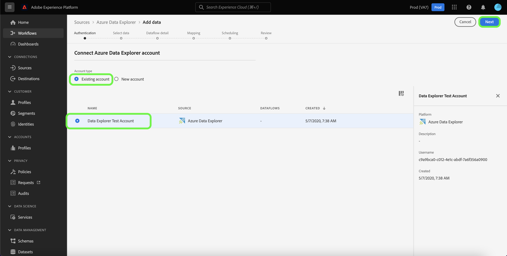

# 建立 *源* UI中的源連接

*在完成此模板時，替換或刪除斜體中的所有段落（從此段開始）。*

*首先更新頁面頂部的元資料（標題和說明）。 請忽略此頁上UICONTROL的所有實例。 這是一個標籤，它幫助我們的機器翻譯流程將頁面正確翻譯成我們支援的多種語言。 在您提交文檔後，我們將向其添加標籤。*

本教程提供建立 *源* 使用平台用戶介面的源連接器。

## 總覽

*提供您公司的簡短概述，包括它為客戶提供的價值。 包括指向產品文檔首頁的連結，以供進一步閱讀。*

>[!IMPORTANT]
>
>此文檔頁面由 *源* 團隊。 如有任何查詢或更新請求，請直接聯繫他們，地址為： *插入連結或電子郵件地址，可以在其中獲取更新*。

## 先決條件

*在本節中添加有關客戶在開始在Adobe Experience Platform用戶介面中設定源之前需要瞭解的任何資訊。 這可以是：*

* *需要添加到允許清單*
* *電子郵件散列要求*
* *任何有關您的帳戶的詳細資訊*
* *如何獲取連接到平台的身份驗證憑據*

### 收集所需憑據

為了連接 *源* 到平台，必須提供以下連接屬性的值：

| 憑據 | 說明 | 範例 |
| --- | --- | --- |
| *憑據* | *請在此處為源的身份驗證憑據添加簡短說明* | *請在此處添加源的身份驗證憑據示例* |
| *憑證* | *請在此處為源的身份驗證憑據添加簡短說明* | *請在此處添加源的身份驗證憑據示例* |
| *證書三* | *請在此處為源的身份驗證憑據添加簡短說明* | *請在此處添加源的身份驗證憑據示例* |

有關這些憑據的詳細資訊，請參見 *源* 驗證文檔。 *請在此處添加平台驗證文檔的連結*。

## 連接 *源* 帳戶

在平台UI中，選擇 **[!UICONTROL 源]** 從左導航欄訪問 [!UICONTROL 源] 工作區。 的 [!UICONTROL 目錄] 螢幕顯示可建立帳戶的各種源。

可以從螢幕左側的目錄中選擇相應的類別。 或者，您可以使用搜索選項找到要使用的特定源。

在 *您的來源類別* 類別，選擇 *源*，然後選擇 **[!UICONTROL 添加資料]**。

>[!TIP]
>
>下面使用的螢幕截圖是示例。 建立文檔時，請用實際來源的螢幕截圖替換影像。 可以使用相同的標籤上圖案和顏色以及相同的檔案名。 請確保您的螢幕快照捕獲整個平台UI螢幕。 有關如何上載螢幕截圖的資訊，請參閱上 [提交文檔以供審閱](./github.md)。

的 **[!UICONTROL 連接YOURSOURCE帳戶]** 的子菜單。 在此頁上，您可以使用新憑據或現有憑據。

### 現有帳戶

要使用現有帳戶，請選擇 *源* 要使用建立新資料流的帳戶，然後選擇 **[!UICONTROL 下一個]** 繼續。

### 新帳戶

如果要建立新帳戶，請選擇 **[!UICONTROL 新帳戶]**，然後提供名稱、可選說明和您的憑據。 完成後，選擇 **[!UICONTROL 連接到源]** 然後再給新連接建立一段時間。

## 後續步驟

*用於建立資料流的剩餘步驟的工作流被模組化。 如果您希望就您的來源進行任何特定的呼叫，請參閱下面的其他資源部分。*

按照本教程，您已建立到 *源* 帳戶。 現在，您可以繼續下一個教程， [配置資料流以將資料引入平台](https://experienceleague.adobe.com/docs/experience-platform/sources/ui-tutorials/dataflow/crm.html)。

## 其他資源

*這是一個可選部分，您可以在其中提供指向產品文檔或任何其他步驟的進一步連結、螢幕截圖和您認為對客戶成功非常重要的細微差別。 您可以使用此部分來添加有關源的整個工作流的資訊或提示，特別是當最終用戶可能遇到特定的「gotchas」時。*
