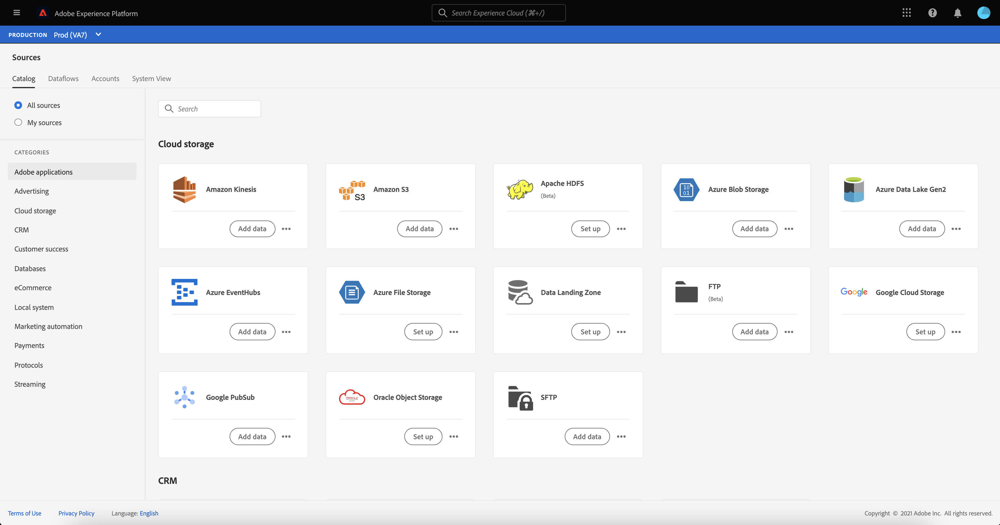

# 自助來源（批次SDK）概觀

Adobe Experience Platform自助來源（批次SDK）是一個架構，可讓您使用 [[!DNL Flow Service] API](https://www.adobe.io/experience-platform-apis/references/flow-service/). 自助來源（批次SDK）提供一組設定API，可建置您自己的來源，並將批次資料帶入Experience Platform。

使用自助來源（批次SDK），您可以：

* 使用配置新源並將新源整合到Experience Platform目錄 [!DNL Flow Service] API。
* 定義源的規範，包括與支援的驗證類型以及如何獲取資源資料相關的資訊。
* 為新來源建立面向使用者的檔案。

自助來源檔案提供設定、測試和發行REST API型來源與Experience Platform整合的指示，並讓您的來源成為不斷增長之來源目錄的一部分。

## 了解來源

Experience Platform可以內嵌來自外部來源的資料，同時允許您使用Experience Platform服務來建構、加標籤及增強該資料。 您可以內嵌來自各種來源的資料，例如Adobe應用程式、雲端儲存、協力廠商軟體和您的CRM系統。

有關源的詳細資訊，以及要查看當前支援的Experience Platform上的不同源的清單，請參見 [來源概觀](../home.md).

## 建立來源

透過自助來源，您可以整合自己的REST API型來源，並將資料Experience Platform為 [!DNL Flow Service]. 通過建立、配置和提交新的連接規範，可以將源整合到Experience Platform源目錄 [!DNL Flow Service] API。

請參閱 [建立新的連接規範](./api/api-overview.md) 以了解如何將新源整合到Experience Platform。

## 記錄您的來源

建立來源後，請參閱 [檔案指南](./documentation/doc-overview.md) 有關如何通過以下方式記錄源的說明： [!DNL GitHub] 網頁介面或透過您自己的文字編輯器。

## 高級流程

在Experience Platform中配置源的逐步過程如下：

* 閱讀 [自助來源（批次SDK）API指南](./api/api-overview.md).
   * 閱讀 [快速入門手冊](./api/getting-started.md).
   * 請依照 [建立新的連接規範](./api/create.md).
   * 請依照 [更新連接規範](./api/update-connection-specs.md).
   * 請依照 [將新連接規範ID添加到流規範](./api/update-flow-specs.md)
   * [提交新源](./api/submit.md).
* 要更好地了解連接規範的結構和屬性，請閱讀 [自助來源的設定選項（批次SDK）](./config/config.md).
   * 閱讀指南 [配置驗證規範](./config/authspec.md) 以便更好地了解可用於源的不同身份驗證類型。
   * 閱讀指南 [配置源規範](./config/sourcespec.md) 以取得可針對來源設定的不同分頁類型、排程格式和自訂結構的相關資訊。
   * 閱讀指南 [配置瀏覽規範](./config/explorespec.md) ，以了解如何定義探索和檢查源中包含的對象所需的參數。
* 要開始記錄源，請閱讀 [自助源建立文檔概述](./documentation/doc-overview.md)
   * 您可以使用 [來源API檔案範本](./documentation/template.md) 來建構API檔案。
   * 您可以使用 [來源UI檔案範本](./documentation/ui-template.md) 來建構您的UI檔案。
   * 請參閱 [使用GitHub網頁介面](./documentation/github.md) 以了解如何使用GitHub建立檔案的步驟。
   * 請參閱 [使用文字編輯器](./documentation/text-editor.md) 以了解如何使用本機電腦建立檔案的步驟。
