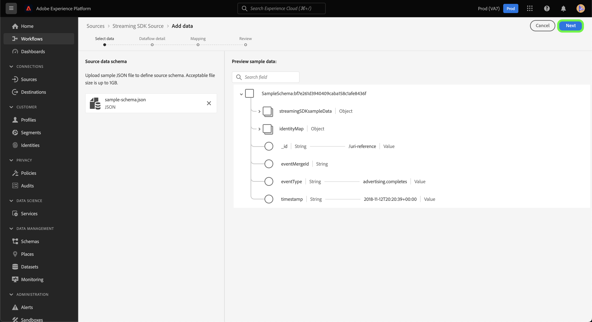

# 建立來源連線和資料流以進行串流 *YOURSOURCE* 使用UI的資料

*瀏覽此範本時，請取代或刪除所有斜體段落（從此段落開始）。*

*首先在頁面頂端更新中繼資料（標題和說明）。 請忽略此頁面上的所有UICONTROL執行個體。 此標籤可協助我們的機器翻譯程式將頁面正確翻譯為我們支援的多種語言。 我們會在您提交檔案後，將標籤新增至檔案。*

本教學課程提供建立 *YOURSOURCE* 使用Platform使用者介面的來源聯結器。

## 總覽

*提供貴公司的簡短概觀，包括其對客戶的價值。 加入產品檔案首頁的連結，以供進一步閱讀。*

>[!IMPORTANT]
>
>此檔案頁面是由 *YOURSOURCE* 團隊。 如有任何查詢或更新請求，請直接聯絡他們： *插入連結或電子郵件地址，您可在這裡取得更新*.

## 先決條件

*在本節中新增客戶在Adobe Experience Platform使用者介面中開始設定來源之前需要注意的任何相關資訊。 這可能與以下內容有關：*

* *需要新增至允許清單*
* *電子郵件雜湊的需求*
* *任何您這邊的帳戶細節*
* *如何取得驗證認證以連線至您的平台*

### 收集必要的認證

為了連線 *YOURSOURCE* 至Platform，您必須提供下列連線屬性的值：

| 認證 | 說明 | 範例 |
| --- | --- | --- |
| *認證一* | *請在此新增來源驗證認證的簡短說明* | *請在此新增您來源的驗證認證範例* |
| *認證二* | *請在此新增來源驗證認證的簡短說明* | *請在此新增您來源的驗證認證範例* |
| *認證三* | *請在此新增來源驗證認證的簡短說明* | *請在此新增您來源的驗證認證範例* |

如需這些認證的詳細資訊，請參閱 *YOURSOURCE* 驗證檔案。 *請在這裡新增您平台驗證檔案的連結*.

### 整合 *YOURSOURCE* 使用您的webhook

*串流SDK需要您的來源能夠支援Webhook，才能與Experience Platform通訊。 在本節中，您必須提供使用者必須遵循的步驟，才能將YOURSOURCE與webhook整合。*

## 連線您的 *YOURSOURCE* 帳戶

在Platform UI中選取 **[!UICONTROL 來源]** 以存取 [!UICONTROL 來源] 工作區。 此 [!UICONTROL 目錄] 畫面會顯示您可以用來建立帳戶的各種來源。

您可以從畫面左側的目錄中選取適當的類別。 或者，您也可以使用搜尋選項來尋找您要使用的特定來源。

在 **串流** 類別，選取 *YOURSOURCE*，然後選取 **[!UICONTROL 新增資料]**.

>[!TIP]
>
>以下使用的熒幕擷圖為範例。 建立檔案時，請以實際來源的熒幕擷取畫面取代影像。 您可以使用相同的標籤圖樣和顏色，以及相同的檔案名稱。 請確定您的熒幕擷圖擷取了整個Platform UI畫面。 如需如何上傳熒幕擷圖的詳細資訊，請參閱以下指南中的 [提交您的檔案以供檢閱](../documentation/github.md).

## 選擇資料

此 **[!UICONTROL 選取資料]** 步驟隨即顯示，提供介面供您選取要帶至Platform的資料。

* 介面的左側是瀏覽器，可讓您檢視帳戶內的可用資料流；
* 介面的右側部分可讓您預覽來自JSON檔案的最多100列資料。

選取 **[!UICONTROL 上傳檔案]** 以從您的本機系統上傳JSON檔案。 或者，您也可以將要上傳的JSON檔案拖放至 [!UICONTROL 拖放檔案] 面板。

上傳檔案後，預覽介面會更新，以顯示您上傳的結構描述預覽。 預覽介面可讓您檢查檔案的內容和結構。 您也可以使用 [!UICONTROL 搜尋欄位] 用於從結構描述中存取特定專案的公用程式。

完成後，選取 **[!UICONTROL 下一個]**.

## 資料流詳細資訊

此 **資料流詳細資料** 步驟隨即顯示，為您提供使用現有資料集或為資料流建立新資料集的選項，以及提供資料流名稱和說明的機會。 在此步驟中，您還可以配置設定檔擷取、錯誤診斷、部分擷取和警示的設定。

完成後，選取 **[!UICONTROL 下一個]**.

## 映射

此 [!UICONTROL 對應] 步驟隨即顯示，為您提供介面，用於將來源結構描述中的來源欄位對應到目標結構描述中適當的目標XDM欄位。

Platform會根據您選取的目標結構描述或資料集，為自動對應的欄位提供智慧型建議。 您可以手動調整對應規則以符合您的使用案例。 您可以視需要選擇直接對應欄位，或使用資料準備函式來轉換來源資料，以衍生計算值或計算值。 如需使用對應程式介面和計算欄位的完整步驟，請參閱 [資料準備UI指南](https://experienceleague.adobe.com/docs/experience-platform/data-prep/ui/mapping.html).

成功對應來源資料後，請選取 **[!UICONTROL 下一個]**.

## 請檢閱

此 **[!UICONTROL 檢閱]** 步驟隨即顯示，可讓您在建立新資料流之前對其進行檢閱。 詳細資料會分組到以下類別中：

* **[!UICONTROL 連線]**：顯示來源型別、所選來源檔案的相關路徑，以及該來源檔案中的欄數。
* **[!UICONTROL 指派資料集和對應欄位]**：顯示要將來源資料擷取到哪個資料集中，包括資料集所堅持的結構描述。

檢閱資料流後，請按一下 **[!UICONTROL 完成]** 並留出一些時間來建立資料流。

## 取得您的串流端點URL

建立串流資料流後，您現在可以擷取串流端點URL。 此端點將用於訂閱您的webhook，允許您的串流來源與Experience Platform通訊。

若要擷取您的串流端點，請前往 [!UICONTROL 資料流活動] 您剛建立之資料流的頁面，並從底部複製端點 [!UICONTROL 屬性] 面板。

## 後續步驟

*建立資料流之剩餘步驟的工作流程會模組化。 如果您想針對來源提出任何特定的號召，請參閱以下的其他資源區段。*

依照本教學課程，您已建立與的連線， *YOURSOURCE* 帳戶。 您現在可以繼續下一節教學課程和 [設定資料流以將資料匯入Platform](https://experienceleague.adobe.com/docs/experience-platform/sources/ui-tutorials/dataflow/crm.html).

## 其他資源

*這是一個選用的章節，您可以在此提供產品檔案的進一步連結，或任何其他您視為對客戶成功很重要的步驟、熒幕擷取畫面和細微差別。 您可以使用此區段來新增有關您來源的整個工作流程的資訊或提示，尤其是如果有一般使用者可能會遇到的特定「疑問」時。*
