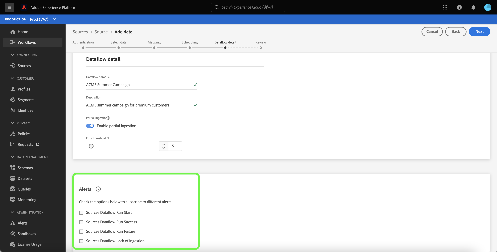
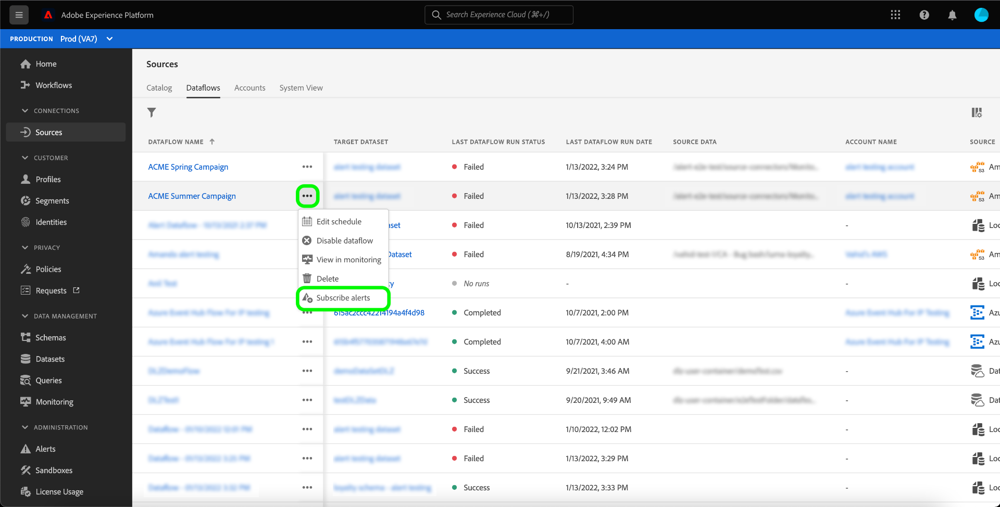

# 在UI中訂閱源資料流的警報

Adobe Experience Platform可讓您訂閱Adobe Experience Platform活動的事件型警報。 警報減少或消除輪詢 [[!DNL Observability Insights] API](../../../observability/api/overview.md) 為了檢查作業是否已完成、是否已到達工作流中的某個里程碑，或是否發生任何錯誤。

建立資料流時，您可以訂閱警報，以接收有關流運行狀態、成功或失敗的警報消息。

本文檔提供如何訂閱接收源資料流的警報消息的步驟。

## 快速入門

本檔案需要妥善了解下列Adobe Experience Platform元件：

* [來源](../../home.md): [!DNL Experience Platform] 可讓您從各種來源擷取資料，同時使用來建構、加標籤及增強傳入資料 [!DNL Platform] 服務。
* [可觀察性](../../../observability/home.md): [!DNL Observability Insights] 可讓您透過使用統計量度和事件通知來監控Platform活動。
   * [警報](../../../observability/alerts/overview.md):當您的Platform作業達到特定條件集時（例如，當系統違反臨界值時，可能會發生問題）,Platform會將警報訊息傳送給組織中已訂閱的任何使用者。

## 在UI中訂閱警報 {#subscribe-sources-alerts}

>[!CONTEXTUALHELP]
>id="platform_sources_alerts_subscribe"
>title="訂閱源警報"
>abstract="警報允許您根據源資料流的狀態接收通知。 如果資料流已啟動、成功、失敗或未內嵌任何資料，則可以設定警報通知來獲取更新。"
>text="Learn more in documentation"

>[!IMPORTANT]
>
>您必須為Platform帳戶啟用電子郵件的即時通知，才能接收資料流的電子郵件型警報通知。

您可以在 [!UICONTROL 資料流詳細資訊] 來源工作區中來源工作流程的步驟。

源資料流的可用警報包括：

| 警報 | 說明 |
| --- | --- |
| 源資料流運行開始 | 此警報會在源資料流啟動時向您發送消息。 |
| 源資料流運行成功 | 當來源的資料成功內嵌至Platform時，此警報會傳送訊息給您。 |
| 源資料流運行失敗 | 如果資料流中發生錯誤，此警報會向您發送消息。 |
| ~~源資料流缺少內嵌~~ | ~~如果擷取延遲超過七小時，且未將任何資料擷取至Platform，此警報會傳送訊息給您。~~  **注意：** 您將不再收到警報，因為此警報已淘汰。 |

選取您要訂閱的警報，然後選取 **[!UICONTROL 下一個]** 來檢查並完成資料流。

有關在UI中建立源資料流的詳細步驟，請參閱以下指南：

* [Advertising](./dataflow/advertising.md)
* [雲端儲存空間](./dataflow/batch/cloud-storage.md)
* [CRM](./dataflow/crm.md)
* [資料庫](./dataflow/databases.md)
* [電子商務](./dataflow/ecommerce.md)
* [本機檔案](./create/local-system/local-file-upload.md)
* [行銷自動化](./dataflow/marketing-automation.md)
* [付款](./dataflow/payments.md)
* [通訊協定](./dataflow/protocols.md)

## 接收警報

資料流運行後，您可以通過UI或電子郵件接收警報。

### 在UI中

警報在UI中會以Platform UI頂端標題中的通知圖示表示。 選擇通知表徵圖以查看有關資料流的特定警報消息。

此時將顯示通知面板，其中顯示您建立的資料流狀態更新清單。

您可以將滑鼠移到警報消息上，將它們標籤為已讀，也可以選擇時鐘錶徵圖來設定資料流狀態的將來提醒。

選擇警報消息以查看資料流的特定資訊。

此 [!UICONTROL 資料流運行概述] 頁。 螢幕的上半部顯示了資料流的概述，包括有關其屬性、相應資料流運行ID和高級錯誤摘要的資訊。

頁面的下半部顯示任何 [!UICONTROL 資料流運行錯誤] 資料流運行階段期間發生的錯誤。 從這裡，您可以預覽錯誤診斷或使用 [[!DNL Data Access] API](https://www.adobe.io/experience-platform-apis/references/data-access/) 下載與資料流對應的錯誤診斷或檔案清單。

有關處理資料流錯誤的詳細資訊，請參閱 [監視UI中的源資料流](../../../dataflows/ui/monitor-sources.md).

### 依電子郵件

資料流的警報也通過電子郵件傳送給您。 在電子郵件正文中選擇資料流名稱，以查看有關資料流的詳細資訊。

與UI警報類似， [!UICONTROL 資料流運行概述] 頁面，提供您一個介面來調查與資料流關聯的任何錯誤。

## 訂閱和取消訂閱警報

您可以在 [!UICONTROL 資料流] 頁面。 從清單中找出您建立的資料流，然後選取點(`...`)，查看選項的下拉式功能表。 下一步，選擇 **[!UICONTROL 訂閱警報]** 修改資料流的警報設定。

此時將出現一個彈出窗口，提供源警報清單。 選擇要訂閱或取消選擇要取消訂閱的警報的任何警報。 完成後，請選取 **[!UICONTROL 儲存]**.

## 後續步驟

本文檔提供了有關如何訂閱源資料流上下文內警報的逐步指南。 如需詳細資訊，請參閱 [警報UI指南](../../../observability/alerts/ui.md).