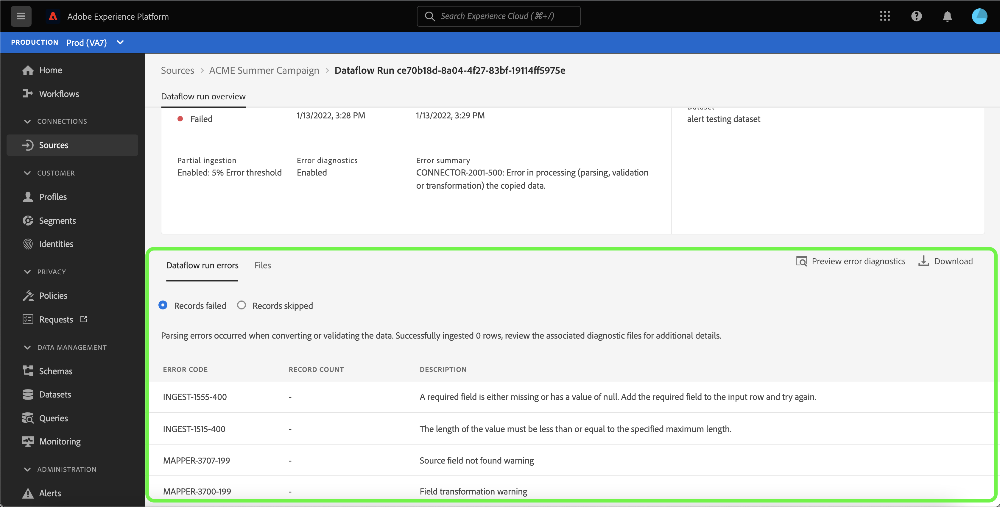

# 訂閱UI中來源資料流程的警報

Adobe Experience Platform可讓您訂閱有關Adobe Experience Platform活動的事件型警報。 警示可減少或消除輪詢[[!DNL Observability Insights] API](../../../observability/api/overview.md)的需求，以檢查工作是否已完成、工作流程中是否已達到特定里程碑，或是否已發生任何錯誤。

建立資料流時，您可以訂閱警示以接收有關資料流執行狀態、成功或失敗的警示訊息。

本檔案提供如何訂閱來源資料流接收警報訊息的步驟。

## 快速入門

參閱本檔案前，請先實際瞭解下列Adobe Experience Platform元件：

* [來源](../../home.md)： [!DNL Experience Platform]允許從各種來源擷取資料，同時讓您能夠使用[!DNL Platform]服務來建構、加標籤以及增強傳入的資料。
* [可觀察性](../../../observability/home.md)： [!DNL Observability Insights]可讓您透過使用統計量度和事件通知來監視Platform活動。
   * [警示](../../../observability/alerts/overview.md)：當您的Platform作業達到特定條件集時（例如系統違反臨界值時會發生潛在問題），Platform可以將警示訊息傳送給貴組織中訂閱這些訊息的任何使用者。

## 訂閱 UI 中的警示 {#subscribe-sources-alerts}

>[!CONTEXTUALHELP]
>id="platform_sources_alerts_subscribe"
>title="訂閱來源警示"
>abstract="警示可讓您根據來源資料流的狀態接收通知。如果資料流已啟動、成功、失敗或未擷取任何資料，您可以設定警示通知以獲取更新。"
>text="Learn more in documentation"

>[!IMPORTANT]
>
>您必須為您的Platform帳戶啟用即時電子郵件通知，才能接收資料流程的電子郵件式警報通知。

您可以在來源工作區中來源工作流程的[!UICONTROL 資料流詳細資料]步驟期間，為資料流啟用警示。

來源資料流程的可用警報包括：

>[!NOTE]
>
>警示目前不支援串流來源。 您只能訂閱批次來源的警示通知。

| 警示 | 說明 |
| --- | --- |
| 來源資料流執行開始 | 此警報會在您的來源資料流啟動時傳送訊息給您。 |
| 來源資料流執行成功 | 當來源中的資料成功擷取到Platform時，此警報會傳送訊息給您。 |
| 來源資料流執行失敗 | 如果您的資料流發生錯誤，此警報會傳送訊息給您。 |

選取您要訂閱的警示，然後選取&#x200B;**[!UICONTROL 下一步]**&#x200B;以檢視並完成您的資料流。

如需在UI中建立來源資料流的詳細步驟，請參閱下列指南：

* [Advertising](./dataflow/advertising.md)
* [雲端儲存空間](./dataflow/batch/cloud-storage.md)
* [CRM](./dataflow/crm.md)
* [資料庫](./dataflow/databases.md)
* [電子商務](./dataflow/ecommerce.md)
* [本機檔案](./create/local-system/local-file-upload.md)
* [行銷自動化](./dataflow/marketing-automation.md)
* [付款](./dataflow/payments.md)
* [通訊協定](./dataflow/protocols.md)

## 接收警示

資料流執行後，您可以透過UI或電子郵件接收警報。

### 在UI中

警報會在UI中以Platform UI頂端標題中的通知圖示表示。 選取通知圖示以檢視有關資料流的特定警報訊息。

此時會顯示通知面板，其中顯示您所建立之資料流上的狀態更新清單。

您可以將滑鼠指標暫留在警示訊息上，以將其標示為已讀取，也可以選取時鐘圖示來設定未來對資料流狀態的提醒。

選取警示訊息，以檢視資料流的特定資訊。

[!UICONTROL 資料流執行總覽]頁面隨即顯示。 畫面的上半部會顯示資料流程的概觀，包括其屬性的相關資訊、對應的資料流程執行ID和高階錯誤摘要。

頁面下半部顯示在資料流執行階段期間發生的任何[!UICONTROL 資料流執行錯誤]。 從這裡，您可以預覽錯誤診斷，或使用[[!DNL Data Access] API](https://www.adobe.io/experience-platform-apis/references/data-access/)下載與您的資料流對應的錯誤診斷或檔案資訊清單。

如需有關處理資料流錯誤的詳細資訊，請參閱[在UI](../../../dataflows/ui/monitor-sources.md)中監視來源資料流的指南。

### 透過電子郵件

您的資料流警示也會透過電子郵件傳送給您。 選取電子郵件內文中的資料流名稱，以檢視資料流的詳細資訊。

類似於UI警示，[!UICONTROL 資料流執行總覽]頁面會出現，為您提供介面以調查與資料流關聯的任何錯誤。

## 訂閱和取消訂閱警示

您可以為[!UICONTROL 資料流]頁面中的現有資料流訂閱更多警報或取消訂閱已建立的警報。 找出您從清單建立的資料流，然後選取省略符號(`...`)，以檢視選項的下拉式功能表。 接著，選取&#x200B;**[!UICONTROL 訂閱警示]**&#x200B;以修改資料流程的警示設定。

隨即出現快顯視窗，為您提供來源警示清單。 選取您要訂閱的警示，或取消選取您要取消訂閱的警示。 完成後，選取&#x200B;**[!UICONTROL 儲存]**。

## 後續步驟

本檔案逐步說明如何訂閱來源資料流的內容感知警報。 如需詳細資訊，請參閱[警示使用者介面指南](../../../observability/alerts/ui.md)。