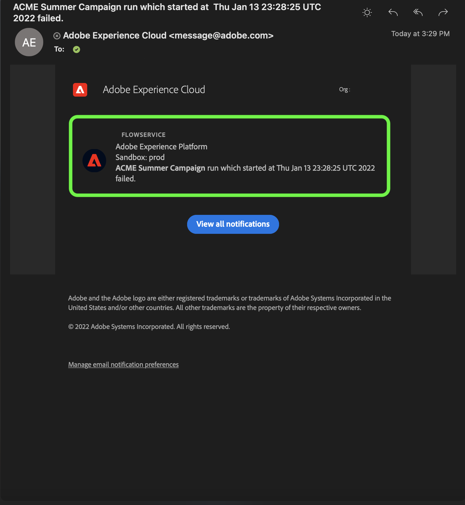

# 訂閱UI中源資料流的警報

>[!NOTE]
>
>非生產沙箱中不支援警報。 為了訂閱警報，必須確保正在使用生產沙箱。

Adobe Experience Platform允許您訂閱有關Adobe Experience Platform活動的基於事件的警報。 警報減少或消除輪詢 [[!DNL Observability Insights] API](../../../observability/api/overview.md) 以檢查作業是否已完成、是否已達到工作流中的某個里程碑，或是否發生任何錯誤。

在建立資料流以接收有關流運行狀態、成功或失敗的警報消息時，可以訂閱警報。

本文檔提供了如何訂閱源資料流的警報消息的步驟。

## 快速入門

本檔案要求對Adobe Experience Platform的下列構成部分有工作上的理解：

* [源](../../home.md): [!DNL Experience Platform] 允許從各種源接收資料，同時讓您能夠使用 [!DNL Platform] 服務。
* [可觀測性](../../../observability/home.md): [!DNL Observability Insights] 允許您通過使用統計度量和事件通知來監視平台活動。
   * [警報](../../../observability/alerts/overview.md):當平台操作中達到某組條件時（例如當系統超過閾值時可能出現的問題），平台可以向組織中已訂閱這些條件的任何用戶發送警報消息。

## 訂閱UI中的警報 {#subscribe-sources-alerts}

>[!CONTEXTUALHELP]
>id="platform_sources_alerts_subscribe"
>title="訂閱來源警示"
>abstract="警示可讓您根據來源資料流的狀態接收通知。如果資料流已啟動、成功、失敗或未擷取任何資料，您可以設定警示通知以獲取更新。"
>text="Learn more in documentation"

>[!IMPORTANT]
>
>您必須為平台帳戶啟用電子郵件即時通知才能接收資料流基於電子郵件的警報通知。

您可以在 [!UICONTROL 資料流詳細資訊] 源工作區中的源工作流步驟。

源資料流的可用警報包括：

| 警報 | 說明 |
| --- | --- |
| 源資料流運行啟動 | 當源資料流啟動時，此警報會向您發送消息。 |
| 源資料流運行成功 | 當源資料成功接收到平台時，此警報會向您發送消息。 |
| 源資料流運行失敗 | 如果資料流中出現錯誤，此警報會向您發送消息。 |
| ~~源資料流缺少攝取~~ | ~~如果接收延遲超過七小時且未向平台接收任何資料，則此警報會向您發送消息。~~  **注：** 您將不再接收警報，因為此警報已被棄用。 |

選擇要訂閱的警報，然後選擇 **[!UICONTROL 下一個]** 查看並完成資料流。

有關在UI中建立源資料流的詳細步驟，請參閱以下指南：

* [Advertising](./dataflow/advertising.md)
* [雲儲存](./dataflow/batch/cloud-storage.md)
* [CRM](./dataflow/crm.md)
* [資料庫](./dataflow/databases.md)
* [電子商務](./dataflow/ecommerce.md)
* [本地檔案](./create/local-system/local-file-upload.md)
* [營銷自動化](./dataflow/marketing-automation.md)
* [付款](./dataflow/payments.md)
* [協定](./dataflow/protocols.md)

## 接收警報

資料流運行後，您可以通過UI或電子郵件接收警報。

### 在UI中

警報在UI中由平台UI頂部標題中的通知表徵圖表示。 選擇通知表徵圖以查看有關資料流的特定警報消息。

此時將顯示通知面板，其中顯示您建立的資料流上的狀態更新清單。

您可以懸停在警報消息上，將其標籤為已讀，也可以選擇時鐘錶徵圖以設定將來有關資料流狀態的提醒。

選擇警報消息以查看有關資料流的特定資訊。

的 [!UICONTROL 資料流運行概述] 的子菜單。 螢幕的上半部分顯示有關資料流的概述，包括有關其屬性、相應資料流運行ID和高級錯誤摘要的資訊。

頁面的下半部分顯示任何 [!UICONTROL 資料流運行錯誤] 在資料流運行階段出現。 在此處，您可以預覽錯誤診斷或使用 [[!DNL Data Access] API](https://www.adobe.io/experience-platform-apis/references/data-access/) 下載錯誤診斷或與資料流對應的檔案清單。

有關處理資料流錯誤的詳細資訊，請參見上的指南 [監視UI中的源資料流](../../../dataflows/ui/monitor-sources.md)。

### 通過電子郵件

您的資料流警報也通過電子郵件發送給您。 選擇電子郵件正文中的資料流名稱，以查看有關資料流的詳細資訊。

與UI警報類似， [!UICONTROL 資料流運行概述] 的子菜單。

## 訂閱和取消訂閱警報

您可以訂閱更多警報或取消訂閱中現有資料流的已建立警報 [!UICONTROL 資料流] 的子菜單。 從清單中查找您建立的資料流，然後選擇橢圓(`...`)以查看選項的下拉菜單。 下一步，選擇 **[!UICONTROL 訂閱警報]** 修改資料流的警報設定。

此時將出現一個彈出窗口，為您提供源警報清單。 選擇要訂閱的警報或取消選擇要取消訂閱的警報。 完成後，選擇 **[!UICONTROL 保存]**。

## 後續步驟

本文檔提供了有關如何訂閱源資料流的上下文警報的逐步指南。 有關詳細資訊，請參見 [警報UI指南](../../../observability/alerts/ui.md)。