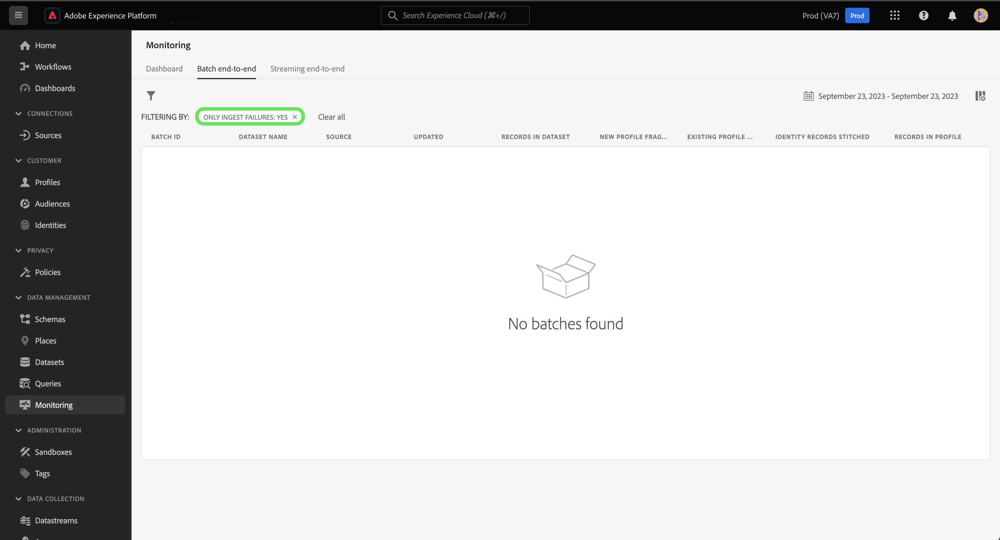

# 在UI中建立Adobe Analytics來源連線

本教學課程提供在UI中建立Adobe Analytics來源連線的步驟，以便將Adobe Analytics報表套裝資料匯入Adobe Experience Platform。

## 快速入門

本教學課程需要您實際瞭解下列Experience Platform元件：

* [Experience Data Model (XDM)系統](../../../../../xdm/home.md)：Experience Platform組織客戶體驗資料的標準化架構。
* [即時客戶個人檔案](../../../../../profile/home.md)：根據來自多個來源的彙總資料，提供統一的即時消費者個人檔案。
* [沙箱](../../../../../sandboxes/home.md)：Experience Platform提供的虛擬沙箱可將單一Platform執行個體分割成個別的虛擬環境，以利開發及改進數位體驗應用程式。

### 重要術語

請務必瞭解本檔案中使用的下列重要用語：

* **標準屬性**：標準屬性是Adobe預先定義的任何屬性。 它們對於所有客戶都包含相同涵義，並且可在 [!DNL Analytics] 來源資料和 [!DNL Analytics] 結構描述欄位群組。
* **自訂屬性**：自訂屬性是中自訂變數階層內的任何屬性 [!DNL Analytics]. 自訂屬性用於Adobe Analytics實作，將特定資訊擷取至報表套裝，各報表套裝的屬性使用方式可能有所不同。 自訂屬性包括eVar、prop和清單。 請參閱下列內容 [[!DNL Analytics] 有關轉換變數的檔案](https://experienceleague.adobe.com/docs/analytics/admin/admin-tools/conversion-variables/conversion-var-admin.html?lang=en) 以取得有關eVar的詳細資訊。
* **自訂欄位群組中的任何屬性**：源自客戶建立的欄位群組的屬性都是使用者定義的，不屬於標準或自訂屬性。
* **易記名稱**：好記名稱是使用者提供的標籤，適用於中的自訂變數。 [!DNL Analytics] 實作。 請參閱下列內容 [[!DNL Analytics] 有關轉換變數的檔案](https://experienceleague.adobe.com/docs/analytics/admin/admin-tools/conversion-variables/conversion-var-admin.html?lang=en) 以取得易記名稱的詳細資訊。

## 建立與Adobe Analytics的來源連線

>[!NOTE]
>
>在生產沙箱中建立Analytics來源資料流時，會建立兩個資料流：
>
>* 此資料流會將13個月的歷史報表套裝資料回填至Data Lake。 此資料流會在回填完成時結束。
>* 將即時資料傳送至資料湖和的資料流流程。 [!DNL Real-Time Customer Profile]. 此資料流會持續執行。

在Platform UI中選取 **[!UICONTROL 來源]** 從左側導覽存取 [!UICONTROL 來源] 工作區。 此 [!UICONTROL 目錄] 畫面會顯示各種來源，供您建立帳戶。

您可以從熒幕左側的目錄中選取適當的類別。 您也可以使用搜尋列來縮小顯示的來源。

在 **[!UICONTROL Adobe應用程式]** 類別，選取 **[!UICONTROL Adobe Analytics]** 然後選取 **[!UICONTROL 新增資料]**.

### 選擇資料

>[!IMPORTANT]
>
>畫面上列出的報表套裝可能來自不同區域。 您有責任瞭解您資料的限制與義務，以及如何在Adobe Experience Platform中跨區域使用該資料。 請確定貴公司允許這樣做。

此 **[!UICONTROL Analytics來源新增資料]** 步驟提供您以下清單 [!DNL Analytics] 用於建立來源連線的報表套裝資料。

報表套裝是資料容器，會構成下列專案的基礎 [!DNL Analytics] 報告。 一個組織可以有許多報表套裝，每個報表套裝都包含不同的資料集。

您可以從任何區域擷取報告套裝（美國、英國或新加坡），前提是這些報告套裝對應至與在中建立來源連線的Experience Platform沙箱例項相同的組織。 報告套裝只能使用單一作用中資料流擷取。 已在您使用的沙箱或其他沙箱中擷取無法選取的報表套裝。

可以建立多個繫結連線，將多個報告套裝帶入同一個沙箱。 如果報表套裝中變數（例如eVar或事件）有不同的結構描述，則應將其對應至自訂欄位群組中的特定欄位，並使用避免資料衝突 [資料準備](../../../../../data-prep/ui/mapping.md). 報告套裝只能新增至單一沙箱。

>[!NOTE]
>
>只有在沒有資料衝突(例如兩個具有不同含義的自訂屬性（eVar、清單和prop）)時，才能為即時客戶個人檔案啟用多個報表套裝的資料。

若要建立 [!DNL Analytics] 來源連線，選取報表套裝，然後選取 **[!UICONTROL 下一個]** 以繼續進行。

&lt;!—Analytics報表套裝一次只能設定一個沙箱。 若要將相同的報告套裝匯入不同的沙箱，必須透過不同沙箱的設定刪除資料集流程並再次例項化。—>

### 對應

>[!IMPORTANT]
>
>「資料準備」轉換可能會增加整體資料流程的延遲。 新增的額外延遲因轉換邏輯的複雜度而異。

在您可以對應 [!DNL Analytics] 資料目標XDM結構描述時，您必須先選取您是使用預設結構描述還是自訂結構描述。

預設結構描述會代表您建立新的結構描述，包含 [!DNL Adobe Analytics ExperienceEvent Template] 欄位群組。 若要使用預設綱要，請選取 **[!UICONTROL 預設結構描述]**.

有了自訂結構描述，您可以為您的選擇任何可用的結構描述 [!DNL Analytics] 資料，只要該結構描述具有 [!DNL Adobe Analytics ExperienceEvent Template] 欄位群組。 若要使用自訂結構描述，請選取 **[!UICONTROL 自訂結構描述]**.

此 [!UICONTROL 對應] 頁面提供介面，將來源欄位對應至其適當的目標結構描述欄位。 從這裡，您可以將自訂變數對應到新的結構描述欄位群組，並套用資料準備支援的計算。 選取目標結構描述以開始對應程式。

>[!TIP]
>
>僅限具有下列專案的結構描述： [!DNL Adobe Analytics ExperienceEvent Template] 欄位群組會顯示在結構描述選取功能表中。 省略其他結構描述。 如果報表套裝資料沒有適用的結構描述，您必須建立新的結構描述。 如需建立綱要的詳細步驟，請參閱以下指南： [在UI中建立和編輯方案](../../../../../xdm/ui/resources/schemas.md).

此 [!UICONTROL 對應標準欄位] 區段顯示面板 [!UICONTROL 已套用標準對應]， [!UICONTROL 不符合的標準對應] 和 [!UICONTROL 自訂對應]. 如需各個類別的特定資訊，請參閱下表：

| 對應標準欄位 | 說明 |
| --- | --- |
| [!UICONTROL 已套用標準對應] | 此 [!UICONTROL 已套用標準對應] 面板會顯示對應屬性的總數。 標準對應是指來源中所有屬性之間的對應集 [!DNL Analytics] 中的資料和對應屬性 [!DNL Analytics] 欄位群組。 這些專案已預先對應，無法編輯。 |
| [!UICONTROL 不符合的標準對應] | 此 [!UICONTROL 不符合的標準對應] panel是指包含易記名稱衝突的對應屬性數目。 當您重複使用已有來自不同報表套裝之欄位描述項填入集的結構描述時，這些衝突就會出現。 您可以繼續進行 [!DNL Analytics] 資料流，即使易記名稱有衝突。 |
| [!UICONTROL 自訂對應] | 此 [!UICONTROL 自訂對應] 面板會顯示對應的自訂屬性數量，包括eVar、prop和清單。 自訂對應是指來源中自訂屬性之間的對應集 [!DNL Analytics] 包含在所選結構描述中的自訂欄位群組中的資料和屬性。 |

若要預覽 [!DNL Analytics] ExperienceEvent範本結構描述欄位群組，選取 **[!UICONTROL 檢視]** 在 [!UICONTROL 已套用標準對應] 面板。

此 [!UICONTROL Adobe Analytics ExperienceEvent範本結構欄位群組] 頁面提供用來檢查結構描述的介面。 完成後，選取 **[!UICONTROL 關閉]**.

Platform會自動偵測您的對應集是否有任何易記名稱衝突。 如果對應集沒有衝突，請選取 **[!UICONTROL 下一個]** 以繼續進行。

>[!TIP]
>
>如果您的來源報表套裝和選取的結構描述之間有好記的名稱衝突，您仍可以繼續進行 [!DNL Analytics] 資料流，確認不會變更欄位描述元。 或者，您可以選擇使用一組空白的描述項建立新結構描述。

#### 自訂對應

您可以使用資料準備函式來新增自訂屬性的自訂對應或計算欄位。 若要新增自訂對應，請選取「 」 **[!UICONTROL 自訂]**.

視您的需求而定，您可以選取 **[!UICONTROL 新增對應]** 或 **[!UICONTROL 新增計算欄位]** 然後繼續建立自訂屬性的自訂對應。 如需使用「資料準備」功能的完整步驟，請參閱 [資料準備UI指南](../../../../../data-prep/ui/mapping.md).

下列檔案提供進一步瞭解「資料準備」、計算欄位和對應函式的資源：

* [資料準備概觀](../../../../../data-prep/home.md)
* [資料準備對應函數](../../../../../data-prep/functions.md)
* [新增計算欄位](../../../../../data-prep/ui/mapping.md#calculated-fields)

<!-- 
To use Data Prep functions and add new mapping or calculated fields for custom attributes, select **[!UICONTROL View custom mappings]**.

Next, select **[!UICONTROL Add new mapping]**.

Depending on your needs, you can select either **[!UICONTROL Add new mapping]** or **[!UICONTROL Add calculated field]** from the options that appear. 

An empty mapping set appears. Select the mapping icon to add a source field.

You can use the interface to navigate through the source schema structure and identify the new source field that you want to use. Once you have selected the source field that you want to map, select **[!UICONTROL Select]**.

Next, select the mapping icon under [!UICONTROL Target Field] to map your selected source field to its appropriate target field.

Similar to the source schema, you can use the interface to navigate through the target schema structure and select the target field you want to map to. Once you have selected the appropriate target field, select **[!UICONTROL Select]**.

With your custom mapping set completed, select **[!UICONTROL Next]** to proceed.

 -->

### 篩選即時客戶個人檔案 {#filtering-for-profile}

>[!CONTEXTUALHELP]
>id="platform_data_prep_analytics_filtering"
>title="建立篩選規則 "
>abstract="將資料傳送到即時客戶設定檔時定義列層級和欄層級的篩選規則。使用列層級篩選來套用條件並指示要&#x200B;**包含哪些資料以用於設定檔擷取**。使用欄層級篩選來選取您要&#x200B;**為設定檔擷取排除**&#x200B;的資料欄。篩選規則不適用於傳送到資料湖的資料。"

當您為完成對應後， [!DNL Analytics] 報表套裝資料時，您可以套用篩選規則和條件，選擇性地將資料納入或排除內嵌至Real-Time Customer Profile。 僅支援篩選 [!DNL Analytics] 資料與資料只會在輸入前進行篩選 [!DNL Profile.] 所有資料都會內嵌至Data Lake。

#### 列層級篩選

>[!IMPORTANT]
>
>使用列層級篩選來套用條件並指示要&#x200B;**包含哪些資料以用於設定檔擷取**。使用欄層級篩選來選取您要&#x200B;**為設定檔擷取排除**&#x200B;的資料欄。

您可以篩選資料 [!DNL Profile] 列層級和欄層級的擷取。 列層級篩選可讓您定義字串包含、等於、開頭或結尾等條件。 您也可以使用列層級篩選來聯結條件，使用 `AND` 以及 `OR`，並使用否定條件 `NOT`.

若要篩選您的 [!DNL Analytics] 資料列層級，選取 **[!UICONTROL 列篩選]**.

使用左側邊欄瀏覽結構描述階層，並選取您選取的結構描述屬性，以進一步向下鑽研特定結構描述。

識別您要設定的屬性後，選取該屬性，並將其從左側邊欄拖曳至篩選面板。

若要設定不同的條件，請選取 **[!UICONTROL 等於]** 然後從出現的下拉式視窗中選取條件。

可設定的條件清單包括：

* [!UICONTROL 等於]
* [!UICONTROL 不等於]
* [!UICONTROL 開始於]
* [!UICONTROL 終止於]
* [!UICONTROL 不終止於]
* [!UICONTROL 包含]
* [!UICONTROL 不包含]
* [!UICONTROL 存在]
* [!UICONTROL 不存在]

接著，根據您選取的屬性輸入您要包含的值。 在以下範例中， [!DNL Apple] 和 [!DNL Google] 在內嵌時選取 **[!UICONTROL 製造商]** 屬性。

若要進一步指定篩選條件，請從結構描述新增另一個屬性，然後根據該屬性新增值。 在以下範例中， **[!UICONTROL 模型]** 屬性已新增，且模型(例如 [!DNL iPhone 13] 和 [!DNL Google Pixel 6] 經過篩選以便擷取。

若要新增容器，請選取省略符號(`...`)，然後選取 **[!UICONTROL 新增容器]**.

新增容器後，選取 **[!UICONTROL 包含]** 然後選取 **[!UICONTROL 排除]** 從出現的下拉式視窗中。

接下來，拖曳結構描述屬性並新增您想從篩選中排除的對應值，以完成相同的程式。 在以下範例中， [!DNL iPhone 12]， [!DNL iPhone 12 mini]、和 [!DNL Google Pixel 5] 都是從「 」的排除專案中進行篩選 **[!UICONTROL 模型]** 屬性，橫向已排除在外 **[!UICONTROL 熒幕方向]**，和型號 [!DNL A1633] 「 」已排除 **[!UICONTROL 型號]**.

完成後，選取 **[!UICONTROL 下一個]**.

#### 欄層級篩選

選取 **[!UICONTROL 欄篩選器]** 以套用欄層級篩選。

頁面會更新為互動式架構樹狀結構，在欄層級顯示您的架構屬性。 從這裡，您可以選取要排除的資料欄 [!DNL Profile] 內嵌。 或者，您可以展開欄並選取要排除的特定屬性。

依預設，全部 [!DNL Analytics] 前往 [!DNL Profile] 此程式允許排除XDM資料的分支，從 [!DNL Profile] 內嵌。

完成後，選取 **[!UICONTROL 下一個]**.

### 提供資料流詳細資料

此 **[!UICONTROL 資料流詳細資料]** 步驟隨即顯示，您必須在此為資料流提供名稱和選擇性說明。 選取 **[!UICONTROL 下一個]** 完成後。

### 請檢閱

此 [!UICONTROL 檢閱] 步驟隨即顯示，可讓您在建立新的Analytics資料流之前先檢閱該資料流。 連線的詳細資訊會依類別分組，包括：

* [!UICONTROL 連線]：顯示連線的來源平台。
* [!UICONTROL 資料型別]：顯示選取的報表套裝及其對應的報表套裝ID。

## 監視資料流 {#monitor-your-dataflow}

資料流完成後，請選取 **[!UICONTROL 資料流]** 在來源目錄中，以監視資料的活動和狀態。

貴組織中現有的Analytics資料流清單隨即顯示。 從這裡，選取目標資料集以檢視其個別的擷取活動。

此 [!UICONTROL 資料集活動] 頁面會提供從Analytics傳送到Experience Platform的資料進度資訊。 介面會顯示量度，例如擷取的記錄數、擷取的批次數，以及失敗的批次數。

來源會將兩個資料集流程例項化。 一個流程代表回填資料，另一個流程代表即時資料。 回填資料未設定為擷取至即時客戶個人檔案，而是傳送至資料湖，以用於分析和資料科學的使用案例。

如需回填、即時資料及其各自延遲的詳細資訊，請參閱 [Analytics來源概觀](../../../../connectors/adobe-applications/analytics.md).

+++使用舊版監控介面檢視個別批次

資料集活動頁面不會顯示個別批次的清單。 若要檢視個別批次的清單，請在資料集活動介面中選取圖表。

系統會將您帶往「監視」控制面板。 接下來，選取 **[!UICONTROL 僅擷取失敗：是]** 以清除篩選器並檢視個別批次的清單。

介面會更新為個別批次的清單，包括有關其個別量度的資訊。

| 量度 | 說明 |
| --- | --- |
| 批次 ID  | 指定批次的ID。 此值是在內部產生。 |
| 資料集名稱 | 用於Analytics資料的指定資料集名稱。 |
| 來源 | 內嵌資料的來源。 |
| 已更新 | 最近的流量執行反複專案的日期。 |
| 資料集中的記錄 | 資料集中的記錄總數。 **注意**：此引數偶爾會顯示狀態 `in-progress`. 此狀態代表記錄擷取程式尚未完成。 |
| 新設定檔片段 | 已擷取的新設定檔片段總數。 |
| 現有的設定檔片段 | 現有設定檔片段的總數。 |
| 已拼接身分記錄 | 擷取後拼接在一起的身分記錄總數。 |
| 設定檔中的記錄 | 擷取到即時客戶個人檔案的記錄總數。 |

{style="table-layout:auto"}

+++

## 後續步驟和其他資源

建立連線後，系統會自動建立資料流以包含傳入的資料，並以您選取的結構描述填入資料集。 此外，還會進行資料回填，以及內嵌長達 13 個月的歷史資料。初始內嵌完成時， [!DNL Analytics] 資料供下游平台服務使用，例如 [!DNL Real-Time Customer Profile] 和細分服務。 如需更多詳細資訊，請參閱下列檔案：

* [[!DNL Real-Time Customer Profile] 概覽](../../../../../profile/home.md)
* [[!DNL Segmentation Service] 概覽](../../../../../segmentation/home.md)
* [[!DNL Data Science Workspace] 概覽](../../../../../data-science-workspace/home.md)
* [[!DNL Query Service] 概覽](../../../../../query-service/home.md)

以下影片旨在協助您瞭解如何使用Adobe Analytics來源聯結器擷取資料：

>[!WARNING]
>
> 此 [!DNL Platform] 以下影片中顯示的UI已過期。 請參閱上述檔案，瞭解最新的UI熒幕擷取畫面及功能。

>[!VIDEO](https://video.tv.adobe.com/v/29687?quality=12&learn=on)
