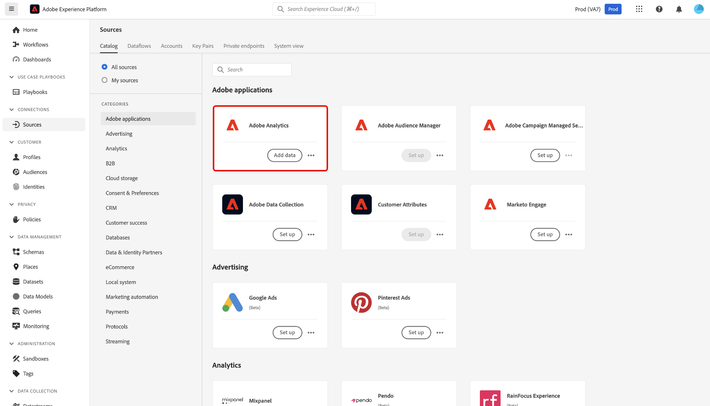

# 在UI中建立Adobe Analytics來源連線

本教學課程提供在UI中建立Adobe Analytics來源連線的步驟，以便將Adobe Analytics報表套裝資料匯入Adobe Experience Platform。

## 快速入門

本教學課程需要您實際瞭解下列Experience Platform元件：

* [體驗資料模型(XDM)系統](../../../../../xdm/home.md)： Experience Platform用來組織客戶體驗資料的標準化架構。
* [即時客戶個人檔案](../../../../../profile/home.md)：根據來自多個來源的彙總資料，提供統一的即時客戶個人檔案。
* [沙箱](../../../../../sandboxes/home.md)： Experience Platform提供的虛擬沙箱可將單一Experience Platform執行個體分割成個別的虛擬環境，以利開發及改進數位體驗應用程式。

### 重要術語

請務必瞭解本檔案中使用的下列重要用語：

* **標準屬性**：標準屬性是Adobe預先定義的任何屬性。 它們對所有客戶都包含相同涵義，並且可在[!DNL Analytics]來源資料和[!DNL Analytics]結構描述欄位群組中使用。
* **自訂屬性**：自訂屬性是[!DNL Analytics]中自訂變數階層中的任何屬性。 自訂屬性用於Adobe Analytics實作，將特定資訊擷取至報表套裝，各報表套裝的屬性使用方式可能有所不同。 自訂屬性包括eVar、prop和清單。 如需有關eVar的詳細資訊，請參閱下列[[!DNL Analytics] 轉換變數](https://experienceleague.adobe.com/docs/analytics/admin/admin-tools/conversion-variables/conversion-var-admin.html)檔案。
* **自訂欄位群組中的任何屬性**：源自客戶建立的欄位群組的屬性都是使用者定義的，且不屬於標準或自訂屬性。
* **易記名稱**：易記名稱是[!DNL Analytics]實作中自訂變數的人工標籤。 如需易記名稱的詳細資訊，請參閱下列有關轉換變數](https://experienceleague.adobe.com/docs/analytics/admin/admin-tools/conversion-variables/conversion-var-admin.html)的[[!DNL Analytics] 檔案。

## 建立與Adobe Analytics的來源連線

>[!NOTE]
>
>在生產沙箱中建立Analytics來源資料流時，會建立兩個資料流：
>
>* 此資料流會將13個月的歷史報表套裝資料回填至Data Lake。 此資料流會在回填完成時結束。
>* 將即時資料傳送到資料湖和[!DNL Real-Time Customer Profile]的資料流流程。 此資料流會持續執行。

在Experience Platform UI中，從左側導覽選取&#x200B;**[!UICONTROL 來源]**&#x200B;以存取[!UICONTROL 來源]工作區。 [!UICONTROL 目錄]畫面會顯示您可以用來建立帳戶的各種來源。

您可以從熒幕左側的目錄中選取適當的類別。 您也可以使用搜尋列來縮小顯示的來源。

在&#x200B;**[!UICONTROL Adobe應用程式]**&#x200B;類別下，選取&#x200B;**[!UICONTROL Adobe Analytics]**，然後選取&#x200B;**[!UICONTROL 新增資料]**。

### 選取資料

>[!IMPORTANT]
>
>畫面上列出的報表套裝可能來自不同區域。 您有責任瞭解您資料的限制與義務，以及如何在Adobe Experience Platform中跨區域使用該資料。 請確定貴公司允許這樣做。

**[!UICONTROL Analytics來源新增資料]**&#x200B;步驟提供您一個[!DNL Analytics]報告套裝資料的清單，您就可以用它建立來源連線。

報表套裝是資料容器，構成[!DNL Analytics]報表的基礎。 一個組織可以有許多報表套裝，每個報表套裝都包含不同的資料集。

您可以從任何區域擷取報表套裝（美國、英國或新加坡），前提是這些報表套裝對應至與Experience Platform沙箱例項（正在其中建立來源連線）相同的組織。 報告套裝只能使用單一作用中資料流擷取。 已在您使用的沙箱或其他沙箱中擷取無法選取的報表套裝。

可以建立多個繫結連線，將多個報告套裝帶入同一個沙箱。 如果報表套裝中變數（例如eVar或事件）的結構描述不同，則應將其對應至自訂欄位群組中的特定欄位，並使用「資料準備」[避免資料衝突。 ](../../../../../data-prep/ui/mapping.md)報告套裝只能新增至單一沙箱。

>[!NOTE]
>
>只有在沒有資料衝突(例如兩個具有不同含義的自訂屬性（eVar、清單和prop）)時，才能為即時客戶個人檔案啟用多個報表套裝的資料。

若要建立[!DNL Analytics]來源連線，請選取報告套裝，然後選取[下一步] ]**以繼續。**[!UICONTROL 

&lt;!—Analytics報表套裝一次只能設定一個沙箱。 若要將相同的報告套裝匯入不同的沙箱，必須透過不同沙箱的設定刪除資料集流程並再次例項化。—>

### 對應

>[!IMPORTANT]
>
>「資料準備」轉換可能會增加整體資料流程的延遲。 新增的額外延遲因轉換邏輯的複雜度而異。

您必須先選取使用預設結構描述或自訂結構描述，才能將[!DNL Analytics]資料對應到目標XDM結構描述。

預設結構描述會代表您建立包含[!DNL Adobe Analytics ExperienceEvent Template]欄位群組的新結構描述。 若要使用預設結構描述，請選取&#x200B;**[!UICONTROL 預設結構描述]**。

使用自訂結構描述時，只要該結構描述具有[!DNL Adobe Analytics ExperienceEvent Template]欄位群組，您就可以為[!DNL Analytics]資料選擇任何可用的結構描述。 若要使用自訂結構描述，請選取&#x200B;**[!UICONTROL 自訂結構描述]**。

[!UICONTROL 對應]頁面提供介面，將來源欄位對應到適當的目標結構描述欄位。 從這裡，您可以將自訂變數對應到新的結構描述欄位群組，並套用資料準備支援的計算。 選取目標結構描述以開始對應程式。

>[!TIP]
>
>只有具有[!DNL Adobe Analytics ExperienceEvent Template]欄位群組的結構描述才會顯示在結構描述選取功能表中。 省略其他結構描述。 如果報表套裝資料沒有適用的結構描述，您必須建立新的結構描述。 如需建立結構描述的詳細步驟，請參閱[在UI](../../../../../xdm/ui/resources/schemas.md)中建立和編輯結構描述的指南。

[!UICONTROL 對應標準欄位]區段會顯示套用[!UICONTROL 標準對應]、[!UICONTROL 不符標準對應]和[!UICONTROL 自訂對應]的面板。 如需各個類別的特定資訊，請參閱下表：

| 對應標準欄位 | 說明 |
| --- | --- |
| [!UICONTROL 已套用標準對應] | 套用的[!UICONTROL 標準對應]面板會顯示對應屬性的總數。 標準對應是指來源[!DNL Analytics]資料中的所有屬性與[!DNL Analytics]欄位群組中的對應屬性之間的對應集。 這些專案已預先對應，無法編輯。 |
| [!UICONTROL 不符合的標準對應] | [!UICONTROL 不符合的標準對應]面板參考包含易記名稱衝突的對應屬性數目。 當您重複使用已有來自不同報表套裝之欄位描述項填入集的結構描述時，這些衝突就會出現。 即使在易記名稱衝突的情況下，您仍可繼續進行[!DNL Analytics]資料流。 |
| [!UICONTROL 自訂對應] | [!UICONTROL 自訂對應]面板會顯示對應自訂屬性的數量，包括eVar、prop和清單。 自訂對應是指來源[!DNL Analytics]資料中的自訂屬性與所選結構描述中包含的自訂欄位群組中的屬性之間的對應集。 |

若要預覽[!DNL Analytics] ExperienceEvent範本結構描述欄位群組，請在[!UICONTROL 套用的標準對應]面板中選取&#x200B;**[!UICONTROL 檢視]**。

[!UICONTROL Adobe Analytics ExperienceEvent範本結構描述欄位群組]頁面提供您一個介面，可用來檢查結構描述的結構。 完成後，選取&#x200B;**[!UICONTROL 關閉]**。

Experience Platform會自動偵測您的對應集是否有任何易記名稱衝突。 如果對應集沒有衝突，請選取[下一步] **[!UICONTROL 以繼續。]**

>[!TIP]
>
>如果您的來源報告套裝與您選取的結構描述之間有好記的名稱衝突，您仍可繼續使用[!DNL Analytics]資料流，同時確認不會變更欄位描述元。 或者，您可以選擇使用一組空白的描述項建立新結構描述。

#### 自訂對應

您可以使用資料準備函式來新增自訂屬性的自訂對應或計算欄位。 若要新增自訂對應，請選取&#x200B;**[!UICONTROL 自訂]**。

根據您的需求，您可以選取&#x200B;**[!UICONTROL 新增對應]**&#x200B;或&#x200B;**[!UICONTROL 新增計算欄位]**，然後繼續建立自訂屬性的自訂對應。 如需使用「資料準備」函式的完整步驟，請參閱[資料準備UI指南](../../../../../data-prep/ui/mapping.md)。

下列檔案提供進一步瞭解「資料準備」、計算欄位和對應函式的資源：

* [資料準備總覽](../../../../../data-prep/home.md)
* [資料準備對應函式](../../../../../data-prep/functions.md)
* [新增計算欄位](../../../../../data-prep/ui/mapping.md#calculated-fields)

<!-- 
To use Data Prep functions and add new mapping or calculated fields for custom attributes, select **[!UICONTROL View custom mappings]**.

Next, select **[!UICONTROL Add new mapping]**.

Depending on your needs, you can select either **[!UICONTROL Add new mapping]** or **[!UICONTROL Add calculated field]** from the options that appear. 

An empty mapping set appears. Select the mapping icon to add a source field.

You can use the interface to navigate through the source schema structure and identify the new source field that you want to use. Once you have selected the source field that you want to map, select **[!UICONTROL Select]**.

Next, select the mapping icon under [!UICONTROL Target Field] to map your selected source field to its appropriate target field.

Similar to the source schema, you can use the interface to navigate through the target schema structure and select the target field you want to map to. Once you have selected the appropriate target field, select **[!UICONTROL Select]**.

With your custom mapping set completed, select **[!UICONTROL Next]** to proceed.

 -->

## 篩選即時客戶設定檔 {#filtering-for-profile}

>[!CONTEXTUALHELP]
>id="platform_data_prep_analytics_filtering"
>title="建立篩選規則 "
>abstract="將資料傳送到即時客戶設定檔時定義列層級和欄層級的篩選規則。使用列層級篩選來套用條件並指示要&#x200B;**包含哪些資料以用於攝取設定檔**。使用欄層級篩選來選取您要&#x200B;**為攝取設定檔排除**&#x200B;的資料欄。篩選規則不適用於傳送到資料湖的資料。"

完成[!DNL Analytics]報表套裝資料的對映後，您可以套用篩選規則和條件，選擇性地將資料納入或排除內嵌至Real-Time Customer Profile。 僅支援篩選[!DNL Analytics]資料，且資料僅在輸入[!DNL Profile.]之前篩選。所有資料都會擷取到資料湖。

>[!BEGINSHADEBOX]

**針對即時客戶設定檔準備資料和篩選分析資料的其他資訊**

* 您可以將篩選功能用於傳送到個人資料的資料，但不能用於傳送到資料湖的資料。
* 您可以使用篩選即時資料，但無法篩選回填資料。
   * [!DNL Analytics]來源未將資料回填到設定檔中。
* 如果您在[!DNL Analytics]流程的初始設定期間使用「資料準備」設定，這些變更也會套用至13個月自動回填。
   * 不過，不適用於篩選，因為篩選僅保留給即時資料。
* 「資料準備」會套用至串流和批次擷取路徑。 如果您修改現有的「資料準備」設定，這些變更會套用至串流和批次擷取路徑上的新傳入資料。
   * 不過，無論資料是串流或批次資料，任何「資料準備」設定都不會套用至已擷取至Experience Platform的資料。
* 來自Analytics的標準屬性一律會自動對應。 因此，您無法將轉換套用至標準屬性。
   * 不過，您可以篩選掉標準屬性，只要Identity Service或設定檔中不需要這些屬性。
* 您不能使用欄層級篩選來篩選必填欄位和身分欄位。
* 雖然您可以篩選掉次要身分，尤其是AAID和AACustomID，但您無法篩選ECID。
* 發生轉換錯誤時，對應的欄會產生NULL。

>[!ENDSHADEBOX]

### 列層級篩選

>[!IMPORTANT]
>
>使用列層級篩選來套用條件並指示要&#x200B;**包含哪些資料以用於攝取設定檔**。使用資料行層級篩選來選取您要&#x200B;**排除以進行設定檔擷取**&#x200B;的資料資料行。

您可以在列層級和欄層級篩選[!DNL Profile]擷取的資料。 列層級篩選可讓您定義字串包含、等於、開頭或結尾等條件。 您也可以使用資料列層級篩選來使用`AND`以及`OR`聯結條件，並使用`NOT`否定條件。

若要在列層級篩選您的[!DNL Analytics]資料，請選取&#x200B;**[!UICONTROL 列篩選器]**。

使用左側邊欄瀏覽結構描述階層，並選取您選取的結構描述屬性，以進一步向下鑽研特定結構描述。

識別您要設定的屬性後，選取該屬性，並將其從左側邊欄拖曳至篩選面板。

若要設定不同的條件，請選取&#x200B;**[!UICONTROL 等於]**，然後從出現的下拉式視窗中選取條件。

可設定的條件清單包括：

* [!UICONTROL 等於]
* [!UICONTROL 不等於]
* [!UICONTROL 開頭為]
* [!UICONTROL 結尾為]
* [!UICONTROL 結尾不是]
* [!UICONTROL 包含]
* [!UICONTROL 不包含]
* [!UICONTROL 存在]
* [!UICONTROL 不存在]

接著，根據您選取的屬性輸入您要包含的值。 在下列範例中，已選取[!DNL Apple]和[!DNL Google]作為&#x200B;**[!UICONTROL Manufacturer]**&#x200B;屬性的一部分進行內嵌。

若要進一步指定篩選條件，請從結構描述新增另一個屬性，然後根據該屬性新增值。 在下列範例中，已新增&#x200B;**[!UICONTROL Model]**&#x200B;屬性，而且已篩選[!DNL iPhone 13]和[!DNL Google Pixel 6]等模型以供擷取。

若要新增容器，請選取篩選介面右上方的省略符號(`...`)，然後選取&#x200B;**[!UICONTROL 新增容器]**。

新增容器後，請選取&#x200B;**[!UICONTROL 包含]**，然後從出現的下拉式視窗中選取&#x200B;**[!UICONTROL 排除]**。

接下來，拖曳結構描述屬性並新增您想從篩選中排除的對應值，以完成相同的程式。 在下列範例中，[!DNL iPhone 12]、[!DNL iPhone 12 mini]和[!DNL Google Pixel 5]都是從&#x200B;**[!UICONTROL 模型]**&#x200B;屬性中排除而篩選出來的，橫向是從&#x200B;**[!UICONTROL 熒幕方向]**&#x200B;中排除的，而模型編號[!DNL A1633]是從&#x200B;**[!UICONTROL 模型編號]**&#x200B;中排除的。

完成後，選取&#x200B;**[!UICONTROL 下一步]**。

### 欄層級篩選

從標題選取&#x200B;**[!UICONTROL 欄篩選器]**&#x200B;以套用欄層級篩選。

頁面會更新為互動式架構樹狀結構，在欄層級顯示您的架構屬性。 從這裡，您可以選取要從[!DNL Profile]擷取中排除的資料欄。 或者，您可以展開欄並選取要排除的特定屬性。

依預設，所有[!DNL Analytics]都會移至[!DNL Profile]，此程式允許從[!DNL Profile]內嵌中排除XDM資料的分支。

完成後，選取&#x200B;**[!UICONTROL 下一步]**。

已選取

### 篩選次要身分

使用欄篩選器從設定檔擷取中排除次要身分。 若要篩選次要身分，請選取&#x200B;**[!UICONTROL 資料行篩選]**，然後選取&#x200B;**[!UICONTROL _身分]**。

此篩選器僅適用於將身分標示為次要身分時。 如果選取身分，但事件到達時其中一個身分標示為主要身分，則這些身分不會篩選掉。

### 提供資料流詳細資訊

**[!UICONTROL 資料流詳細資料]**&#x200B;步驟隨即顯示，您必須在此為資料流提供名稱和選擇性說明。 完成時選取&#x200B;**[!UICONTROL 下一步]**。

### 審核

[!UICONTROL 檢閱]步驟隨即顯示，可讓您在建立新的Analytics資料流之前先檢閱該資料流。 連線的詳細資訊會依類別分組，包括：

* [!UICONTROL 連線]：顯示連線的來源平台。
* [!UICONTROL 資料型別]：顯示選取的報表套裝及其對應的報表套裝ID。

## 監視資料流 {#monitor-your-dataflow}

資料流完成後，在來源目錄中選取&#x200B;**[!UICONTROL 資料流]**&#x200B;以監視資料的活動和狀態。

貴組織中現有的Analytics資料流清單隨即顯示。 從這裡，選取目標資料集以檢視其個別的擷取活動。

[!UICONTROL 資料集活動]頁面提供從Analytics傳送到Experience Platform的資料進度資訊。 介面會顯示量度，例如上個月的總記錄數、過去七天的總擷取記錄數，以及上個月的資料大小。

來源會將兩個資料集流程例項化。 一個流程代表回填資料，另一個流程代表即時資料。 回填資料未設定為擷取至即時客戶個人檔案，而是傳送至資料湖，以用於分析和資料科學的使用案例。

如需回填、即時資料及其各自延遲的詳細資訊，請閱讀[Analytics來源概觀](../../../../connectors/adobe-applications/analytics.md)。

>[!NOTE]
>
>資料集活動頁面不會顯示批次的相關資訊，因為Analytics來源聯結器完全由Adobe管理。 您可以檢視所擷取記錄周圍的量度，以監控資料流程。

## 刪除您的資料流 {#delete-dataflow}

若要刪除您的Analytics資料流，請從來源工作區的頂端標題中選取&#x200B;**[!UICONTROL 資料流]**。 使用資料流頁面來找出您要刪除的Analytics資料流，然後選取它旁邊的省略符號(`...`)。 接下來，使用下拉式功能表並選取&#x200B;**[!UICONTROL 刪除]**。

* 刪除即時Analytics資料流也會刪除其基礎資料集。
* 刪除回填Analytics資料流不會刪除基礎資料集，但會停止其對應報表套裝的回填程式。 如果您刪除回填資料流，擷取的資料可能仍會透過資料集檢視。

## 後續步驟和其他資源

建立連線後，系統會自動建立資料流以包含傳入的資料，並以您選取的結構描述填入資料集。 此外，還會進行資料回填，以及內嵌長達13個月的歷史資料。 初始內嵌完成時，[!DNL Analytics]個資料將會由下游Experience Platform服務（例如[!DNL Real-Time Customer Profile]和分段服務）使用。 如需更多詳細資訊，請參閱下列檔案：

* [[!DNL Real-Time Customer Profile] 概觀](../../../../../profile/home.md)
* [[!DNL Segmentation Service] 概觀](../../../../../segmentation/home.md)
* [[!DNL Data Science Workspace] 概觀](../../../../../data-science-workspace/home.md)
* [[!DNL Query Service] 概觀](../../../../../query-service/home.md)

以下影片旨在協助您瞭解如何使用Adobe Analytics Source聯結器擷取資料：

>[!WARNING]
>
> 下列影片中顯示的[!DNL Experience Platform] UI已過期。 請參閱上述檔案，瞭解最新的UI熒幕擷取畫面及功能。

>[!VIDEO](https://video.tv.adobe.com/v/29687?quality=12&learn=on)
