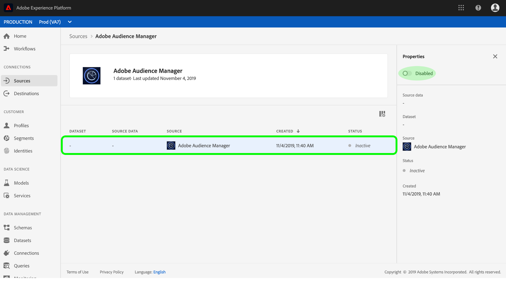

# 在UI中建立Adobe Audience Manager來源連接器

本教學課程會逐步帶您建立Adobe Audience Manager來源連接器，以便使用使用者介面將消費者體驗事件資料匯入平台的步驟。

## 使用Adobe Audience Manager建立來源連線

登入 [Adobe Experience Platform](https://platform.adobe.com) ，然後從左側導覽列選 **取Sources** ，以存取來源工作區。 「目 *錄* 」螢幕顯示各種源，您可以為其建立源連接，每個源顯示與其關聯的現有連接數。

在「 *Adobe應用程式* 」類別下，選取「 **Adobe Audience Manager** 」，以在螢幕右側顯示資訊列。 資訊列提供所選來源的簡短說明，以及檢視其檔案或連線來源的選項。

若要建立Adobe Audience Manager的新來源連接器，請按一下「新增 **資料」**。

對話方塊隨即顯示。按一下 **連接** ，建立連接。

如果已建立與Adobe Audience Manager的來源連線，則會顯 *示Audience Manager連接器的「來源* 」活動頁面。

如果您想要暫停傳入的Audience Manager資料，可以按一下資料流清單，並從右側的「屬性」欄切換 *其* 「狀態 ** 」。

## 後續步驟

當Audience Manager資料流處於作用中時，傳入的資料會自動收錄到即時客戶個人檔案中。 您現在可以利用此傳入資料，並使用「平台區隔服務」來建立觀眾區隔。 如需詳細資訊，請參閱下列檔案：

- [即時客戶個人檔案總覽](../../../../../profile/home.md)
- [區段服務概觀](../../../../../segmentation/home.md)