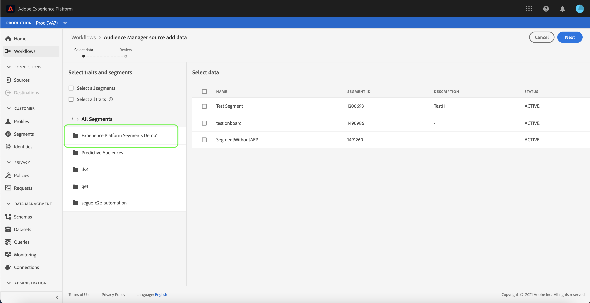

# 在UI中建立Adobe Audience Manager來源連線

本教學課程會逐步帶您了解為Adobe Audience Manager建立來源連接器的步驟，以便使用使用者介面將消費者體驗事件資料匯入Platform。

## 使用Adobe Audience Manager建立來源連線

在平台UI中，選取 **[!UICONTROL 來源]** 從左側導覽器存取 [!UICONTROL 來源] 工作區。 此 [!UICONTROL 目錄] 畫面會顯示您可以用來建立帳戶的各種來源。

您可以從畫面左側的目錄中選取適當的類別。 或者，您也可以使用搜尋列找到您要使用的特定來源。

在 [!UICONTROL Adobe應用程式]，選取 **[!UICONTROL Adobe Audience Manager]** 然後選取 **[!UICONTROL 設定]**.

### 選取特徵和區段

>[!NOTE]
>
>您無法從Audience Manager來源內嵌Experience Platform資料。 如果您有需要地區資料的Analytics使用案例，請使用 [Analytics來源連接器](../adobe-applications/analytics.md).

此 [!UICONTROL 選取特徵和區段] 步驟，提供您互動式介面來探索及選取您的特徵、區段和資料。

* 介面的左側面板包含 [!UICONTROL 選取特徵和區段] 選項，以及可供您使用之所有區段的階層目錄。
* 介面的右半部可讓您與選取的區段互動，並挑選您要使用的特定資料。

若要導覽可用區段，請從 [!UICONTROL 所有區段] 中。 選取資料夾可讓您周遊資料夾的階層，並提供要篩選的區段清單。

識別並選取您要使用的區段後，右側會出現新面板，顯示您選取的項目清單。 您可以繼續存取不同的資料夾，並為連線選取不同的區段。 選取更多區段會更新右側的面板。

或者，您也可以選取 **[!UICONTROL 選取所有區段]** 和 **[!UICONTROL 選取所有特徵]** 框。 選取所有區段會將Audience Manager區段帶入Platform，同時選取所有特徵會從Audience Manager啟用所有第一方特徵。

完成後，請選取 **[!UICONTROL 下一個]**

此 [!UICONTROL 檢閱] 步驟顯示，可讓您在選取的特徵和區段連線至Platform之前加以檢閱。 詳細資料會分組為下列類別：

* **[!UICONTROL 連線]**:顯示源平台和連接狀態。
* **[!UICONTROL 所選資料]**:顯示選取的區段數和已啟用的特徵數。

審核資料流後，請選擇 **[!UICONTROL 完成]** 並允許建立資料流的時間。

## 後續步驟

當Audience Manager資料流處於活動狀態時，傳入的資料會自動內嵌到即時客戶設定檔中。 您現在可以使用這個傳入資料，並使用Platform Segmentation Service建立受眾區段。 如需詳細資訊，請參閱下列檔案：

* [即時客戶個人檔案概觀](../../../../../profile/home.md)
* [區段服務概觀](../../../../../segmentation/home.md)
