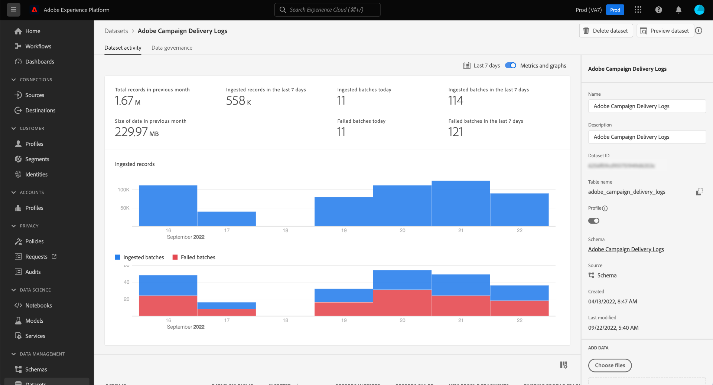

# 使用Platform UI建立Adobe Campaign Managed Cloud Services來源連線

本教學課程提供建立來源連線的步驟，以便將您的Adobe Campaign Managed Cloud Services資料引進Adobe Experience Platform。

## 快速入門

本指南需要您深入了解下列 Experience Platform 元件：

* [來源](../../../../home.md)：Platform可讓您從各種來源擷取資料，同時可以使用Platform服務來建構、加標籤及增強傳入資料。
* [[!DNL Experience Data Model (XDM)] 系統](../../../../../xdm/home.md)：Experience Platform組織客戶體驗資料的標準化架構。
   * [結構描述組合基本概念](../../../../../xdm/schema/composition.md)：瞭解XDM結構描述的基本建置區塊，包括結構描述組合中的關鍵原則和最佳實務。
   * [結構描述編輯器教學課程](../../../../../xdm/tutorials/create-schema-ui.md)：瞭解如何使用結構編輯器UI建立自訂結構描述。
* [沙箱](../../../../../sandboxes/home.md)：Platform提供虛擬沙箱，可將單一Platform執行個體分割成個別的虛擬環境，以利開發及改進數位體驗應用程式。

## 將Adobe Campaign Managed Cloud Services連線至平台

在Platform UI中選取 **[!UICONTROL 來源]** 從左側導覽存取 [!UICONTROL 來源] 工作區。 此 [!UICONTROL 目錄] 畫面會顯示各種來源，供您建立帳戶。

您可以從熒幕左側的目錄中選取適當的類別。 您也可以使用搜尋列來縮小顯示的來源。

在 **[!UICONTROL Adobe應用程式]** 類別，選取 **[!UICONTROL Adobe Campaign Managed Cloud Services]** 然後選取 **[!UICONTROL 新增資料]**.

### 選擇資料 {#select-data}

>[!CONTEXTUALHELP]
>id="platform_sources_campaign_instance"
>title="Adobe Campaign 環境執行個體"
>abstract="您要使用的 Adobe Campaign 環境的名稱。"
>text="Learn more in documentation"

>[!CONTEXTUALHELP]
>id="platform_sources_campaign_mapping"
>title="目標對應"
>abstract="目標對應指 Campaign 用於傳遞訊息的技術物件，並包含傳送傳遞所需的所有技術設定 (地址、電話號碼、選擇加入指標、額外的識別碼……)。"
>text="Learn more in documentation"

>[!CONTEXTUALHELP]
>id="platform_sources_campaign_schema"
>title="方案名稱"
>abstract="Adobe Campaign 資料庫中定義的實體的名稱。"
>text="Learn more in documentation"

此 [!UICONTROL 選取資料] 步驟隨即顯示，為您提供設定您的 [!UICONTROL Adobe Campaign執行個體]， [!UICONTROL 目標對應]、和 [!UICONTROL 結構描述名稱].

| 屬性 | 說明 |
| --- | --- |
| Adobe Campaign執行個體 | 您使用的Adobe Campaign環境例項名稱。 |
| 目標對應 | Campaign為了傳送訊息而使用的技術物件，包含傳送傳送訊息所需的所有技術設定。 |
| 方案名稱 | 您要帶到Platform的結構描述實體名稱。 選項包括傳送記錄和追蹤記錄。 |

當您提供Campaign執行個體、目標對應和方案名稱的值後，畫面會更新以顯示方案預覽和範例資料集。 完成後，選取 **[!UICONTROL 下一個]**.

### 使用現有的資料集

此 [!UICONTROL 資料流詳細資料] 頁面可讓您選取您要使用現有的資料集，或是為資料流設定新的資料集。

若要使用現有的資料集，請選取 **[!UICONTROL 現有資料集]**. 您可以使用來擷取現有的資料集 [!UICONTROL 進階搜尋] 選項，或捲動下拉式選單中的現有資料集清單來進行分類。

選取資料集後，為資料流命名並選填說明。

### 使用新資料集

若要使用新資料集，請選取「 」 **[!UICONTROL 新資料集]** 然後提供輸出資料集名稱和選用的說明。 接下來，使用 [!UICONTROL 進階搜尋] 選項或捲動下拉式選單中的現有方案清單。 完成後，選取 **[!UICONTROL 下一個]**.

### 啟用警示

您可以啟用警報以接收有關資料流狀態的通知。 從清單中選取警報，以訂閱並接收有關資料流狀態的通知。 如需警示的詳細資訊，請參閱以下指南： [使用UI訂閱來源警報](../../alerts.md).

當您完成提供詳細資訊給資料流時，請選取「 」 **[!UICONTROL 下一個]**.

### 將資料欄位對應至XDM結構描述

此 [!UICONTROL 對應] 步驟隨即顯示，為您提供介面，用於將來源結構描述中的來源欄位對應到目標結構描述中適當的目標XDM欄位。

Platform會根據您選取的目標結構或資料集，為自動對應的欄位提供智慧型建議。 您可以手動調整對應規則以符合您的使用案例。 您可以根據自己的需求，選擇直接對應欄位，或使用資料準備函式來轉換來源資料，以衍生計算或計算的值。 如需使用對應程式介面和計算欄位的完整步驟，請參閱 [資料準備UI指南](../../../../../data-prep/ui/mapping.md).

>[!IMPORTANT]
>
>將來源欄位對應到目標XDM欄位時，您必須確保將指定的主要身分欄位對應到其適當的目標XDM欄位。

成功對應來源資料後，請選取 **[!UICONTROL 下一個]**.

### 檢閱您的資料流

此 **[!UICONTROL 檢閱]** 步驟隨即顯示，可讓您在建立新資料流之前對其進行檢閱。 詳細資料會分組到以下類別中：

* **[!UICONTROL 連線]**：顯示來源型別、所選來源檔案的相關路徑，以及該來源檔案中的欄數。
* **[!UICONTROL 指派資料集並對映欄位]**：顯示要將來源資料擷取到哪個資料集中，包括資料集所堅持的結構描述。

檢閱資料流後，選取「 」 **[!UICONTROL 完成]** 並留出一些時間建立資料流。

### 監視您的資料集活動

建立資料流後，您可以監視透過該資料流擷取的資料，以檢視擷取率以及成功和失敗批次的相關資訊。

若要開始檢視您的資料集活動，請選取 **[!UICONTROL 資料流]** 在來源目錄中。

接著，從出現的資料流清單中選取目標資料集。

資料集活動頁面隨即顯示。 從這裡，您可以看到資料流效能的相關資訊，包括擷取率、成功的批次和失敗的批次。

此頁面也提供您更新資料流的中繼資料描述的介面，啟用部分擷取和錯誤診斷，以及向資料集新增資料。

## 後續步驟

依照本教學課程所述，您已成功建立資料流，將您的Campaign v8傳遞記錄檔和追蹤記錄檔資料帶入Platform。 傳入資料現在可供下游Platform服務使用，例如 [!DNL Real-Time Customer Profile] 和 [!DNL Data Science Workspace]. 如需更多詳細資訊，請參閱下列檔案：

* [[!DNL Real-Time Customer Profile] 概覽](../../../../../profile/home.md)
* [[!DNL Data Science Workspace] 概覽](../../../../../data-science-workspace/home.md)
