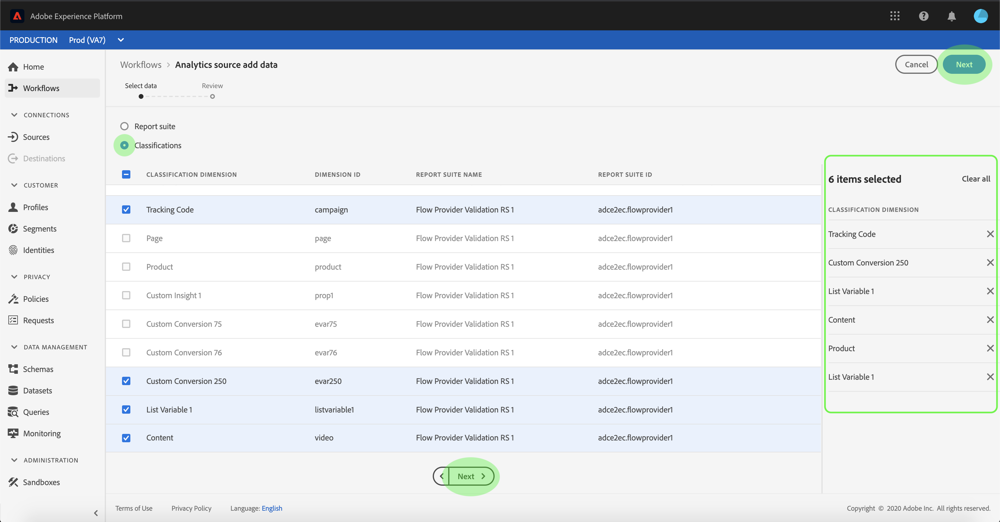
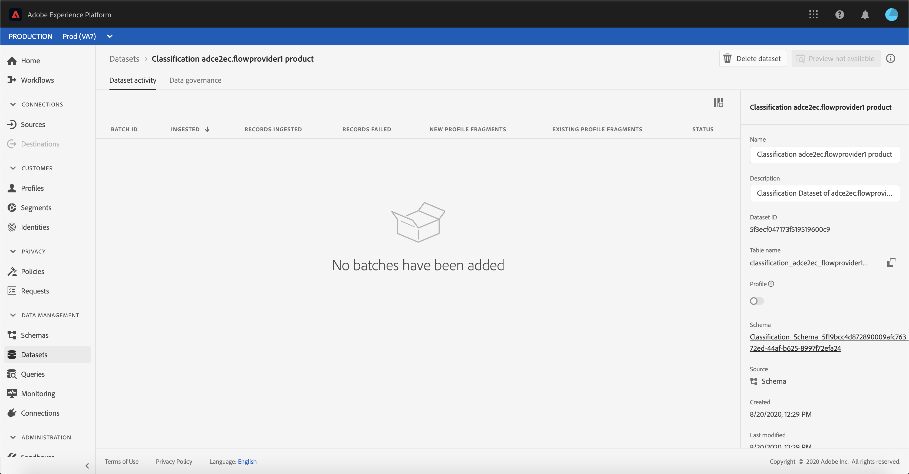

# 在UI中為分類資料建立Adobe Analytics源連接

本教程提供了在UI中建立Adobe Analytics分類資料源連接以將分類資料引入Adobe Experience Platform的步驟。

## 快速入門

本教程需要對Adobe Experience Platform的以下部分進行有效的理解：

* [[!DNL Experience Data Model (XDM)] 系統](../../../../../xdm/home.md):Experience Platform組織客戶體驗資料的標準化框架。
* [[!DNL Real-Time Customer Profile]](../../../../../profile/home.md):基於來自多個源的聚合資料提供統一、即時的用戶配置檔案。
* [[!DNL Sandboxes]](../../../../../sandboxes/home.md):Experience Platform提供虛擬沙箱，將單個平台實例分區為獨立的虛擬環境，以幫助開發和發展數字型驗應用程式。

分析分類資料連接器要求您的資料已遷移到新 [!DNL Classifications] Adobe Analytics的基礎設施。 要確認資料的遷移狀態，請與您的Adobe帳戶團隊聯繫。

## 選擇分類

登錄到 [Adobe Experience Platform](https://platform.adobe.com) ，然後選擇 **[!UICONTROL 源]** 的下界。 的 **[!UICONTROL 目錄]** 螢幕顯示可用源，以建立入站連接。 每個源卡都顯示一個選項，可以配置新帳戶或向現有帳戶添加資料。

可以從螢幕左側的目錄中選擇相應的類別。 或者，您可以使用搜索選項找到要使用的特定源。

在 **[!UICONTROL Adobe應用程式]** ，選擇 **[!UICONTROL Adobe Analytics]** 然後選擇 **[!UICONTROL 添加資料]** 開始使用分析分類資料。

的 **[!UICONTROL 分析源添加資料]** 的上界。 選擇 **[!UICONTROL 分類]** 從頂部標題查看 [!DNL Classifications] 資料集，包括有關其維度ID 、報告套件名稱和報告套件ID的資訊。

每頁最多顯示10個不同 [!DNL Classifications] 可以選擇的資料集。 選擇 **[!UICONTROL 下一個]** 的子菜單。 右側的面板顯示 [!DNL Classifications] 您選擇的資料集及其名稱。 此面板還允許您刪除 [!DNL Classifications] 您可能已錯誤選擇的資料集，或使用一個操作清除所有選擇。

最多可選擇30個不同的 [!DNL Classifications] 資料集 [!DNL Platform]。

一旦選擇了 [!DNL Classifications] 資料集，選擇 **[!UICONTROL 下一個]** 頁面右上角。

## 複查分類

的 **[!UICONTROL 審閱]** 步驟，允許您查看所選內容 [!DNL Classifications] 資料集。 詳細資訊按以下類別分組：

* **[!UICONTROL 連接]**:顯示源平台和連接的狀態。
* **[!UICONTROL 資料類型]**:顯示選定的數量 [!DNL Classifications]。
* **[!UICONTROL 計畫]**:顯示的同步頻率 [!DNL Classifications] 資料。

查看資料流後，按一下 **[!UICONTROL 完成]** 並為建立資料流留出一些時間。

## 監視分類資料流

建立資料流後，您可以監視通過它接收的資料。 從 **[!UICONTROL 目錄]** 螢幕，選擇 **[!UICONTROL 資料流]** 查看與您的 [!DNL Classifications] 帳戶。

的 **[!UICONTROL 資料流]** 的上界。 此頁上是資料流的清單，包括有關其名稱、源資料和資料流運行狀態的資訊。 右邊是 **[!UICONTROL 屬性]** 包含有關您的 [!DNL Classifications] 資料流。

選擇 **[!UICONTROL 目標資料集]** 你想進入。

的 **[!UICONTROL 資料集活動]** 頁顯示有關所選目標資料集的資訊，包括有關其批處理狀態、資料集ID和架構的詳細資訊。

>[!IMPORTANT]
>
>雖然對其他來源連接器而言，刪除資料集是可行的，但是目前 Analytics Classifications 資料連接器不支援此作業。 如果您誤刪了資料集，請聯絡 Adobe 客戶服務。

## 後續步驟

通過遵循本教程，您建立了一個分析分類資料連接器，該連接器 [!DNL Classifications] 資料 [!DNL Platform]。 有關詳細資訊，請參閱以下文檔 [!DNL Analytics] 和 [!DNL Classifications] 資料：

* [分析資料連接器概述](../../../../connectors/adobe-applications/analytics.md)
* [在UI中建立分析資料連接](./analytics.md)
* [關於分類](https://experienceleague.adobe.com/docs/analytics/components/classifications/c-classifications.html)
