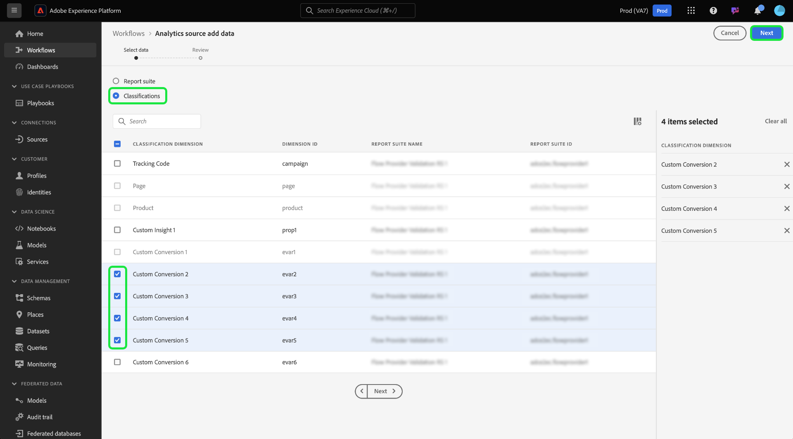

# 在UI中建立分類資料的Adobe Analytics來源連線

>[!TIP]
>
>依預設，Adobe Analytics分類資料會每週更新。 分類資料的資料擷取作業將在初次設定資料流七天後處理。 第一次載入會擷取整個資料，而隨後的每週擷取會執行增量資料。

閱讀本教學課程，瞭解如何透過使用者介面將Adobe Analytics分類資料內嵌至Adobe Experience Platform。

## 快速入門

本教學課程需要您實際瞭解下列Adobe Experience Platform元件：

* [[!DNL Experience Data Model (XDM)] 系統](../../../../../xdm/home.md)： Experience Platform用來組織客戶體驗資料的標準化架構。
* [[!DNL Real-Time Customer Profile]](../../../../../profile/home.md)：根據來自多個來源的彙總資料，提供統一的即時消費者設定檔。
* [[!DNL Sandboxes]](../../../../../sandboxes/home.md)： Experience Platform提供的虛擬沙箱可將單一Experience Platform執行個體分割成個別的虛擬環境，以利開發及改進數位體驗應用程式。

Analytics分類來源聯結器會要求您的資料先移轉至Adobe Analytics的新分類基礎結構才能使用。 若要確認資料的移轉狀態，請聯絡您的Adobe客戶團隊。

## 選取您的分類

在Experience Platform UI中，從左側導覽選取&#x200B;**[!UICONTROL 來源]**&#x200B;以存取[!UICONTROL 來源]工作區。 您可以從熒幕左側的目錄中選取適當的類別。 或者，您可以使用搜尋選項來尋找您要使用的特定來源。

在&#x200B;*Adobe應用程式*&#x200B;類別下，選取&#x200B;**[!UICONTROL Adobe Analytics]**，然後選取&#x200B;**[!UICONTROL 設定]**。

>[!TIP]
>
>如果沒有已驗證的帳戶，來源目錄中的來源會顯示&#x200B;**[!UICONTROL 設定]**&#x200B;選項。 帳戶通過驗證後，選項會變更為&#x200B;**[!UICONTROL 新增資料]**。

接著，選取「[!UICONTROL 分類]」，然後選取您要擷取至Experience Platform的分類資料集。

您最多可以選取30個不同的分類資料集，以匯入Experience Platform。 您選取的任何資料集都會顯示在右側邊欄中。 完成時，選取[!UICONTROL 下一步]以繼續。

## 檢閱您的分類

**[!UICONTROL 檢閱]**&#x200B;步驟隨即顯示，可讓您在建立所選分類資料集之前先檢閱該資料集。 詳細資料會分組到以下類別中：

* **[!UICONTROL 連線]**：顯示來源平台和連線的狀態。
* **[!UICONTROL 資料型別]**：顯示選取的分類數目。
* **[!UICONTROL 排程]**：顯示分類資料的同步處理頻率。 **注意**：分類資料每週都會更新。

檢閱您的資料流後，請按一下[完成] ****，並等待一些時間來建立資料流。

## 後續步驟

依照本教學課程指示，您已建立Analytics分類sata聯結器，將分類資料匯入Experience Platform。 請參閱下列檔案以取得有關[!DNL Analytics]和分類資料的詳細資訊：

* [Adobe Analytics來源聯結器總覽](../../../../connectors/adobe-applications/analytics.md)
* [在UI中建立報告套裝資料的Analytics來源連線](./analytics.md)
* [關於分類](https://experienceleague.adobe.com/docs/analytics/components/classifications/c-classifications.html)
