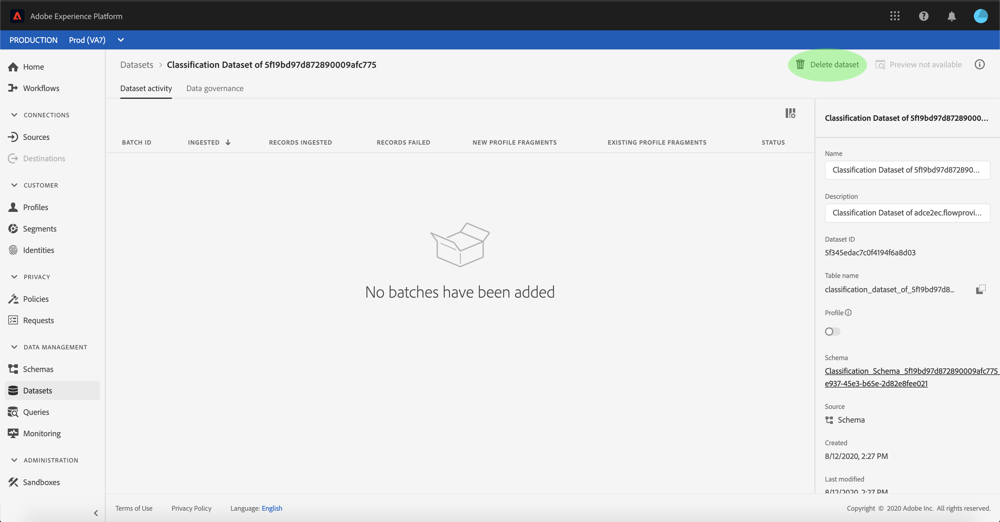

# 在UI中建立Adobe Analytics分類資料連接器

本教學課程提供在UI中建立Adobe Analytics分類資料連接器以將分類資料匯入Adobe Experience Platform的步驟。

## 快速入門

本教學課程需要對Adobe Experience Platform的下列元件有正確的認識：

* [[!DNL體驗資料模型(XDM)系統]](../../../../../xdm/home.md):Experience Platform組織客戶體驗資料的標準化架構。
* [[!DNL即時客戶基本資料]](../../../../../profile/home.md):根據來自多個來源的匯整資料，提供統一、即時的消費者個人檔案。
* [[!DNL沙盒]](../../../../../sandboxes/home.md):Experience Platform提供虛擬沙盒，可將單一Platform實例分割為不同的虛擬環境，以協助開發和發展數位體驗應用程式。

## 選取您的分類

登入 [Adobe Experience Platform](https://platform.adobe.com) ，然後從左側導覽列選 **[!UICONTROL 取Sources]** ，以存取來源工作區。 「目 **[!UICONTROL 錄]** 」螢幕顯示可用源，以建立入站連接。 每個來源卡會顯示一個選項，可設定新帳戶或將資料新增至現有帳戶。

您可以從畫面左側的目錄中選取適當的類別。 或者，您也可以使用搜尋選項找到您要使用的特定來源。

在「 **[!UICONTROL Adobe應用程式]** 」類別下，選取 **[!UICONTROL Adobe Analytics]** 卡片，然後選取「新增資料 **** 」以開始使用「Analytics分類資料」。

此時 **[!UICONTROL 會顯示Analytics來源新增資料]** 步驟。 從最 **[!UICONTROL 上方的頁首]** ，選取「分類」以查看資料集 [!DNL Classifications] 清單，包括有關其 **[!UICONTROL 維度ID、報表套裝名稱、]** Johnit Report Suite和 ******** Johnit Report Suite的資訊。

每個頁面最多會顯示十個您可 [!DNL Classifications] 以選擇的不同資料集。 選 **[!UICONTROL 取頁面底]** 部的「下一步」，以瀏覽更多選項。 右邊的面板顯示您選取的 [!DNL Classifications] 資料集總數及其名稱。 此面板還允許您通過一個操 [!DNL Classifications] 作來刪除可能錯誤選擇的任何資料集或清除所有選擇。

您最多可以選取30個不同 [!DNL Classifications] 的資料集 [!DNL Platform]。

在選取資料集 [!DNL Classifications] 後，請選 **[!UICONTROL 取頁面右上方的]** 「下一步」。

## 檢視您的分類

此時 **[!UICONTROL 會出現]** 「查看」步驟，允許您在建立選定的 [!DNL Classifications] 資料集之前對其進行查看。 詳細資訊會分組在下列類別中：

* **[!UICONTROL 連接]**:顯示源平台和連接狀態。
* **[!UICONTROL 資料類型]**:顯示選定的數量 [!DNL Classifications]。
* **[!UICONTROL 排程]**:顯示資料的同步 [!DNL Classifications] 頻率。

複查資料流後，按一下 **[!UICONTROL 完成]** ，並為建立資料流留出一些時間。

## 監視和刪除分類資料流

建立資料流後，您可以監視通過其獲取的資料。 從「目 **[!UICONTROL 錄]** 」螢幕中，選擇「數 **[!UICONTROL 據流]** 」以查看已建立的與帳戶關聯的流 [!DNL Classifications] 清單。

此時將 **[!UICONTROL 顯示]** 「資料流」螢幕。 此頁上是資料流清單，包括有關其名稱、源資料和資料流運行狀態的資訊。 右邊是「屬性」面 **[!UICONTROL 板]** ，其中包含與資料流相關的 [!DNL Classifications] 元資料。

選取您 **[!UICONTROL 要存取的]** Target資料集。

「數 **[!UICONTROL 據集活動]** 」頁顯示有關所選目標資料集的資訊，包括有關其批處理狀態、資料集ID和方案的詳細資訊。 選擇 **[!UICONTROL 刪除資料集]** ，以刪除。

出現確認刪除的對話框。 選擇「 **[!UICONTROL 刪除]** 」以完成。

## 後續步驟

在本教學課程之後，您已建立Analytics分類資料連接器，將資料引 [!DNL Classifications] 入其中 [!DNL Platform]。 請參閱下列檔案，以取得更多有關資料 [!DNL Analytics] 的資 [!DNL Classifications] 訊：

* [Analytics資料連接器概觀](../../../../connectors/adobe-applications/analytics.md)
* [在UI中建立Analytics資料連接器](./analytics.md)
* [關於分類](https://docs.adobe.com/content/help/zh-Hant/analytics/components/classifications/c-classifications.html#)