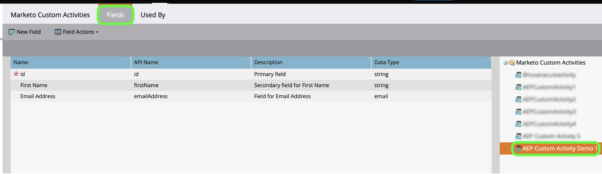

# 建立 [!DNL Marketo Engage] UI中自訂活動資料的來源連線和資料流

>[!NOTE]
>
>本教學課程提供如何設定和開啟 **自訂活動** 資料來源 [!DNL Marketo] Experience Platform。 關於如何 **標準活動** 資料，請閱讀 [[!DNL Marketo] UI指南](./marketo.md).

除 [標準活動](../../../../connectors/adobe-applications/mapping/marketo.md#activities)，您也可以使用 [!DNL Marketo] 將自訂活動資料帶入Adobe Experience Platform的來源。 本檔案提供如何使用建立自訂活動資料的來源連線和資料流的步驟 [!DNL Marketo] 來源。

## 快速入門

本教學課程需要妥善了解下列Adobe Experience Platform元件：

* [B2B命名空間和架構自動產生公用程式](../../../../connectors/adobe-applications/marketo/marketo-namespaces.md):B2B命名空間和架構自動產生公用程式可讓您使用 [!DNL Postman] 為B2B命名空間和結構自動產生值。 您必須先完成B2B命名空間和結構，才能建立 [!DNL Marketo] 源連接和資料流。
* [來源](../../../../home.md):Experience Platform可讓您從各種來源擷取資料，同時使用Platform服務來建構、加標籤及增強傳入資料。
* [Experience Data Model(XDM)](../../../../../xdm/home.md):Experience Platform組織客戶體驗資料的標準化架構。
   * [在UI中建立和編輯結構](../../../../../xdm/ui/resources/schemas.md):了解如何在UI中建立和編輯結構描述。
* [身分識別命名空間](../../../../../identity-service/namespaces.md):身分識別命名空間是 [!DNL Identity Service] 作為身份相關背景的指標。 完全限定的身分包括ID值和命名空間。
* [[!DNL Real-Time Customer Profile]](/help/profile/home.md):根據來自多個來源的匯總資料，提供統一的即時消費者設定檔。
* [沙箱](../../../../../sandboxes/home.md):Experience Platform提供可將單一Platform執行個體分割成個別虛擬環境的虛擬沙箱，以協助開發及改進數位體驗應用程式。

## 擷取自訂活動詳細資料

將自訂活動資料從 [!DNL Marketo] Experience Platform是擷取API名稱和自訂活動的顯示名稱。

使用登入帳戶 [[!DNL Marketo]](https://app-sjint.marketo.com/#MM0A1) 介面。 在左側導覽中，位於 [!DNL Database Management]，選取 **Marketo自訂活動**.

介面會更新為自訂活動的顯示，包括其個別顯示名稱和API名稱的資訊。 您也可以使用右側邊欄，從您的帳戶選取並檢視其他自訂活動。

選擇 **欄位** 從頂端標題檢視與自訂活動相關聯的欄位。 在此頁面中，您可以檢視自訂活動中欄位的名稱、API名稱、說明和資料類型。 有關個別欄位的詳細資訊將用於後續建立架構時的步驟。

## 為B2B活動結構中的自訂活動設定欄位群組

在 *[!UICONTROL 結構]* Experience PlatformUI的控制面板，請選取 **[!UICONTROL 瀏覽]** 然後選取 **[!UICONTROL B2B活動]** 從結構清單。

>[!TIP]
>
>使用搜尋列可加快您瀏覽結構清單的速度。

### 為自訂活動建立新欄位群組

接下來，將新欄位群組新增至 [!DNL B2B Activity] 綱要。 此欄位群組應與您要擷取的自訂活動對應，且應使用您先前擷取的自訂活動顯示名稱。

若要新增欄位群組，請選取 **[!UICONTROL +新增]** 旁邊 *[!UICONTROL 欄位群組]* 下方的面板 *[!UICONTROL 組合物]*.

此 *[!UICONTROL 新增欄位群組]* 的上界。 選擇 **[!UICONTROL 建立新欄位組]** 然後，為您先前步驟中擷取的自訂活動提供相同的顯示名稱，並為新欄位群組提供選用說明。 完成後，請選取 **[!UICONTROL 新增欄位群組]**.

建立後，自訂活動的新欄位群組會顯示在 [!UICONTROL 欄位群組] 目錄。

### 將新欄位新增至結構

接下來，將新欄位新增至您的架構。 此新欄位必須設為 `type: object` 和將包含自訂活動的個別欄位。

若要新增欄位，請選取加號(`+`)。 的條目 *[!UICONTROL 無標題欄位 |類型]* 框。 接下來，使用 *[!UICONTROL 欄位屬性]* 中。 將欄位名稱設為自訂活動的API名稱，並將顯示名稱設為自訂活動的顯示名稱。 然後，將類型設定為 `object` 並將欄位群組指派給您在上一步建立的自訂活動欄位群組。 完成後，請選取 **[!UICONTROL 套用]**.

新欄位會出現在您的架構中。

### 將子欄位新增至物件欄位 {#add-sub-fields-to-the-object-field}

準備結構的最後一個步驟是在您先前步驟建立的欄位內新增個別欄位。

## 建立資料流

架構設定完成後，您現在可以繼續為自訂活動資料建立資料流。

在平台UI中，選取 **[!UICONTROL 來源]** 從左側導覽列存取 [!UICONTROL 來源] 工作區。 此 [!UICONTROL 目錄] 畫面會顯示您可建立帳戶的各種來源。

您可以從畫面左側的目錄中選取適當的類別。 或者，您也可以使用搜尋列找到您要使用的特定來源。

在 [!UICONTROL Adobe應用程式] 類別，選擇 **[!UICONTROL Marketo Engage]**. 然後，選取 **[!UICONTROL 新增資料]** 建立新 [!DNL Marketo] 資料流。

### 選擇資料

選擇 **[!UICONTROL 活動]** 從 [!DNL Marketo] 然後選取「資料集」 **[!UICONTROL 下一個]**.

### 資料流詳細資訊

下一個， [提供資料流的資訊](./marketo.md#provide-dataflow-details)，包括資料集和資料流的名稱和說明、要使用的架構，以及 [!DNL Profile] 擷取、錯誤診斷和部分擷取。

### 映射

標準活動欄位的對應會自動填入，但自訂活動欄位必須手動對應至其對應的目標欄位。

若要開始對應自訂活動欄位，請選取 **[!UICONTROL 新欄位類型]** 然後選取 **[!UICONTROL 新增欄位]**.

瀏覽來源資料結構，並尋找您要擷取的自訂活動欄位。 完成後，請選取 **[!UICONTROL 選擇]**.

>[!TIP]
>
>為避免混淆並處理重複的欄位名稱，自訂活動欄位會加上API名稱前置詞。

若要新增目標欄位，請選取結構圖示  然後從目標結構中選取自訂活動欄位。

重複這些步驟，新增其餘的自訂活動對應欄位。 完成後，請選取 **[!UICONTROL 下一個]**.

### 請檢閱

此 *[!UICONTROL 檢閱]* 步驟顯示，允許您在建立新資料流之前對其進行查看。 詳細資料會分組為下列類別：

* **[!UICONTROL 連線]**:顯示源類型、所選源實體的相關路徑以及該源實體內的列數。
* **[!UICONTROL 指派資料集和對應欄位]**:顯示要擷取來源資料的資料集，包括資料集所遵守的結構。

審核資料流後，請選擇 **[!UICONTROL 儲存並內嵌]** 並允許建立資料流的時間。

>[!NOTE]
>
>擷取完成後，擷取的資料集將包含所有活動，包括您 [!DNL Marketo] 例項。 若要在Platform上選取自訂活動記錄，您必須使用 [查詢服務](../../../../../query-service/home.md) 並提供合適的謂語。

## 後續步驟

依照本教學課程，您已為 [!DNL Marketo] 自訂活動資料並建立資料流，將該資料帶入Platform。 有關 [!DNL Marketo] 源，請閱讀 [[!DNL Marketo] 來源概觀](../../../../connectors/adobe-applications/marketo/marketo.md).