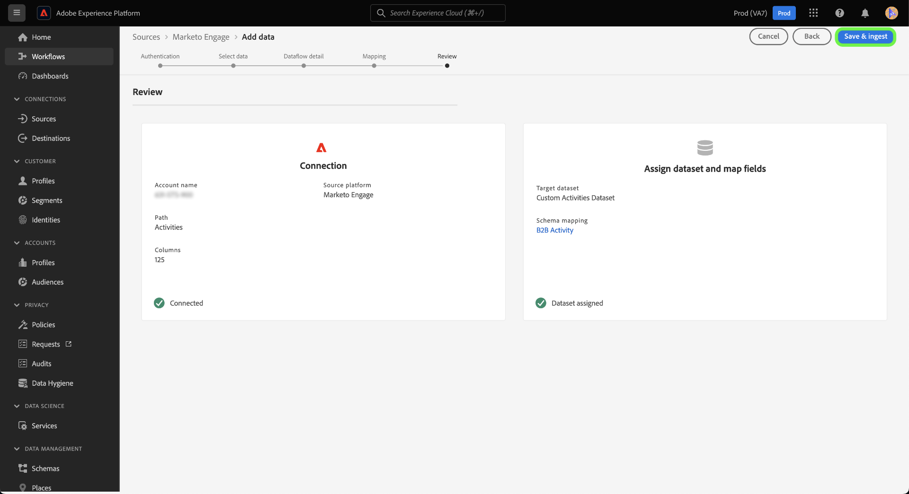

# 建立 [!DNL Marketo Engage] UI中自定義活動資料的源連接和資料流

>[!NOTE]
>
>本教程提供了有關如何設定和提供 **自定義活動** 資料 [!DNL Marketo] Experience Platform。 有關如何帶入 **標準活動** 資料，讀取 [[!DNL Marketo] UI指南](./marketo.md)。

除 [標準活動](../../../../connectors/adobe-applications/mapping/marketo.md#activities)，也可以使用 [!DNL Marketo] 將自定義活動資料帶到Adobe Experience Platform。 本文檔提供了有關如何使用 [!DNL Marketo] 源。

## 快速入門

本教程需要對Adobe Experience Platform的以下部分進行有效的理解：

* [B2B命名空間和模式自動生成實用程式](../../../../connectors/adobe-applications/marketo/marketo-namespaces.md):B2B命名空間和模式自動生成實用程式允許您使用 [!DNL Postman] 為B2B命名空間和架構自動生成值。 必須先完成B2B命名空間和架構，然後才能建立 [!DNL Marketo] 源連接和資料流。
* [源](../../../../home.md):Experience Platform允許從各種源接收資料，同時讓您能夠使用平台服務構建、標籤和增強傳入資料。
* [體驗資料模型(XDM)](../../../../../xdm/home.md):Experience Platform組織客戶體驗資料的標準化框架。
   * [在UI中建立和編輯架構](../../../../../xdm/ui/resources/schemas.md):瞭解如何在UI中建立和編輯架構。
* [標識命名空間](../../../../../identity-service/namespaces.md):標識命名空間是 [!DNL Identity Service] 作為身份相關背景的指標。 完全限定的標識包括ID值和命名空間。
* [[!DNL Real-Time Customer Profile]](/help/profile/home.md):基於來自多個源的聚合資料提供統一、即時的用戶配置檔案。
* [沙箱](../../../../../sandboxes/home.md):Experience Platform提供虛擬沙箱，將單個平台實例分區為獨立的虛擬環境，以幫助開發和發展數字型驗應用程式。

## 檢索自定義活動詳細資訊

將自定義活動資料從 [!DNL Marketo] toExperience Platform是檢索API名稱和自定義活動的顯示名稱。

使用 [[!DNL Marketo]](https://app-sjint.marketo.com/#MM0A1) 。 在左側導航中，在 [!DNL Database Management]選中 **Marketo定制活動**。

該介面將更新到自定義活動的顯示，包括有關其各自顯示名稱和API名稱的資訊。 您還可以使用右欄選擇並查看帳戶中的其他自定義活動。


選擇 **欄位** 的子菜單。 在此頁中，可以查看自定義活動中欄位的名稱、API名稱、說明和資料類型。 有關各個欄位的詳細資訊將在稍後的步驟中建立架構時使用。


## 在B2B活動架構中為自定義活動設定欄位組

在 *[!UICONTROL 架構]* Experience PlatformUI的儀表板，選擇 **[!UICONTROL 瀏覽]** ，然後選擇 **[!UICONTROL B2B活動]** 的子菜單。

>[!TIP]
>
>使用搜索欄可加快您在架構清單中的導航。


### 為自定義活動建立新欄位組

接下來，向 [!DNL B2B Activity] 架構。 此欄位組應與要接收的自定義活動相對應，並應使用您先前檢索到的自定義活動的顯示名稱。

要添加新欄位組，請選擇 **[!UICONTROL +添加]** 欄 *[!UICONTROL 欄位組]* 面板 *[!UICONTROL 組合]*。


的 *[!UICONTROL 添加欄位組]* 的上界。 選擇 **[!UICONTROL 建立新欄位組]** 然後，為您在前一步中檢索到的自定義活動提供相同的顯示名稱，並為新欄位組提供可選說明。 完成後，選擇 **[!UICONTROL 添加欄位組]**。


建立後，您的自定義活動新欄位組將出現在 [!UICONTROL 欄位組] 目錄。


### 向架構結構添加新欄位

接下來，將新欄位添加到您的架構中。 此新欄位必須設定為 `type: object` 並將包含自定義活動的各個欄位。

要添加新欄位，請選擇加號(`+`)。 條目 *[!UICONTROL 無標題欄位 |類型]* 的子菜單。 接下來，使用 *[!UICONTROL 欄位屬性]* 的子菜單。 將欄位名稱設定為自定義活動的API名稱，並將顯示名稱設定為自定義活動的顯示名稱。 然後，將類型設定為 `object` 並將欄位組分配給您在上一步中建立的自定義活動欄位組。 完成後，選擇 **[!UICONTROL 應用]**。


新欄位將出現在您的架構中。


### 將子欄位添加到對象欄位 {#add-sub-fields-to-the-object-field}

準備架構的最後一個步驟是在上一步建立的欄位中添加單個欄位。


## 建立資料流

架構設定完成後，您現在可以繼續為自定義活動資料建立資料流。

在平台UI中，選擇 **[!UICONTROL 源]** 從左導航欄訪問 [!UICONTROL 源] 工作區。 的 [!UICONTROL 目錄] 螢幕顯示可建立帳戶的各種源。

可以從螢幕左側的目錄中選擇相應的類別。 或者，您可以使用搜索欄找到要使用的特定源。

在 [!UICONTROL Adobe應用程式] 類別，選擇 **[!UICONTROL Marketo Engage]**。 然後，選擇 **[!UICONTROL 添加資料]** 新建 [!DNL Marketo] 資料流。


### 選擇資料

選擇 **[!UICONTROL 活動]** 從 [!DNL Marketo] 然後選擇 **[!UICONTROL 下一個]**。


### 資料流詳細資訊

下一個， [提供資料流的資訊](./marketo.md#provide-dataflow-details)，包括資料集和資料流的名稱和說明、將要使用的架構，以及 [!DNL Profile] 攝入、錯誤診斷和部分攝入。


### 映射

標準活動欄位的映射是自動填充的，但自定義活動欄位必須手動映射到其相應的目標欄位。

要開始映射自定義活動欄位，請選擇 **[!UICONTROL 新欄位類型]** ，然後選擇 **[!UICONTROL 添加新欄位]**。


瀏覽源資料結構並查找要攝取的自定義活動欄位。 完成後，選擇 **[!UICONTROL 選擇]**。

>[!TIP]
>
>為避免混淆和處理重複的欄位名，自定義活動欄位的前置詞為API名稱。


要添加目標欄位，請選擇架構表徵圖  然後從目標架構中選擇自定義活動欄位。


重複這些步驟以添加其餘的自定義活動映射欄位。 完成後，選擇 **[!UICONTROL 下一個]**。


### 請檢閱

的 *[!UICONTROL 審閱]* 步驟，允許您在建立新資料流之前查看它。 詳細資訊按以下類別分組：

* **[!UICONTROL 連接]**:顯示源類型、所選源實體的相關路徑以及該源實體中的列數。
* **[!UICONTROL 分配資料集和映射欄位]**:顯示源資料正被攝取到的資料集，包括該資料集所遵循的架構。

查看資料流後，選擇 **[!UICONTROL 保存和攝取]** 並為建立資料流留出一些時間。



### 將自定義活動添加到現有活動資料流 {#add-to-existing-dataflows}

要將自定義活動資料添加到現有資料流，請修改現有活動資料流的映射，其中包含要接收的自定義活動資料。 這允許您將自定義活動插入同一現有活動資料集。 有關如何更新現有資料流的映射的詳細資訊，請閱讀上的指南 [更新UI中的資料流](../../update-dataflows.md)。

### 使用 [!DNL Query Service] 篩選自定義活動 {#query-service-filter}

資料流完成後，您可以使用 [查詢服務](../../../../../query-service/home.md) 來篩選自定義活動資料的活動。

將自定義活動接收到平台時，自定義活動的API名稱將自動成為其 `eventType`。 使用 `eventType={API_NAME}` 以篩選自定義活動資料。

```sql
SELECT * FROM with_custom_activities_ds_today WHERE eventType='aepCustomActivityDemo1' 
```

使用 `IN` 用於篩選多個自定義活動的子句：

```sql
SELECT * FROM $datasetName WHERE eventType='{API_NAME}'
SELECT * FROM $datasetName WHERE eventType IN ('aepCustomActivityDemo1', 'aepCustomActivityDemo2')
```

下圖顯示了 [查詢編輯器](../../../../../query-service/ui/user-guide.md) 用於篩選自定義活動資料。


## 後續步驟

按照本教程，您已為 [!DNL Marketo] 自定義活動資料並建立了資料流，以將該資料帶到平台。 有關 [!DNL Marketo] 源，閱讀 [[!DNL Marketo] 源概述](../../../../connectors/adobe-applications/marketo/marketo.md)。
