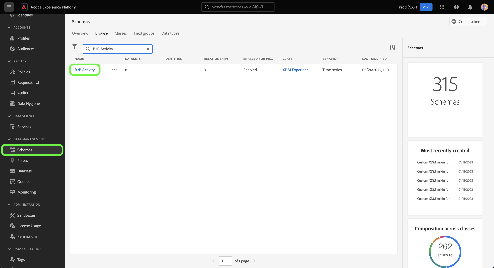

# 建立 [!DNL Marketo Engage] UI中自訂活動資料的來源連線和資料流

>[!NOTE]
>
>本教學課程提供如何設定和帶入 **自訂活動** 資料來源 [!DNL Marketo] 以Experience Platform。 如需如何帶來 **標準活動** 資料，讀取 [[!DNL Marketo] UI指南](./marketo.md).

除了 [標準活動](../../../../connectors/adobe-applications/mapping/marketo.md#activities)，您也可以使用 [!DNL Marketo] 將自訂活動資料帶入Adobe Experience Platform的來源。 本檔案提供如何使用，為自訂活動資料建立來源連線和資料流的步驟。 [!DNL Marketo] UI中的來源。

## 快速入門

本教學課程需要您實際瞭解下列Adobe Experience Platform元件：

* [B2B名稱空間和結構描述自動產生公用程式](../../../../connectors/adobe-applications/marketo/marketo-namespaces.md)：B2B名稱空間和結構描述自動產生公用程式可讓您使用 [!DNL Postman] 自動產生B2B名稱空間和結構描述的值。 您必須先完成B2B名稱空間和結構描述，才能建立 [!DNL Marketo] 來源連線和資料流。
* [來源](../../../../home.md)：Experience Platform可讓您從各種來源擷取資料，同時使用Platform服務來建構、加標籤及增強傳入資料。
* [體驗資料模型(XDM)](../../../../../xdm/home.md)：Experience Platform組織客戶體驗資料的標準化架構。
   * [在UI中建立和編輯方案](../../../../../xdm/ui/resources/schemas.md)：瞭解如何在UI中建立和編輯方案。
* [身分名稱空間](../../../../../identity-service/features/namespaces.md)：身分名稱空間是元件，屬於 [!DNL Identity Service] 作為身分相關內容的指示器。 完整身分包含ID值和名稱空間。
* [[!DNL Real-Time Customer Profile]](/help/profile/home.md)：根據來自多個來源的彙總資料，提供統一的即時消費者個人檔案。
* [沙箱](../../../../../sandboxes/home.md)：Experience Platform提供的虛擬沙箱可將單一Platform執行個體分割成個別的虛擬環境，以利開發及改進數位體驗應用程式。

## 擷取您的自訂活動詳細資料

從以下來源取得自訂活動資料的第一步 [!DNL Marketo] Experience Platform是擷取API名稱和自訂活動的顯示名稱。

使用登入您的帳戶 [[!DNL Marketo]](https://app-sjint.marketo.com/#MM0A1) 介面。 在左側導覽列中的 [!DNL Database Management]，選取 **Marketo自訂活動**.

介面會更新為自訂活動的顯示，包括有關其各自顯示名稱和API名稱的資訊。 您也可以使用滑鼠右邊欄來選取並檢視您帳戶中的其他自訂活動。


選取 **欄位** ，以檢視與自訂活動相關聯的欄位。 在此頁面中，您可以檢視自訂活動中欄位的名稱、API名稱、說明和資料型別。 有關個別欄位的詳細資訊將在建立結構描述時的後續步驟中使用。


## 在B2B活動結構中設定自訂活動的欄位群組

在 *[!UICONTROL 方案]* Experience PlatformUI的控制面板，選取 **[!UICONTROL 瀏覽]** 然後選取 **[!UICONTROL B2B活動]** 從結構描述清單中。

>[!TIP]
>
>使用搜尋列可加快您在方案清單中的導覽。



### 為自訂活動建立新的欄位群組

接下來，將新的欄位群組新增至 [!DNL B2B Activity] 綱要。 此欄位群組應該對應至您要擷取的自訂活動，且應該使用您先前擷取的自訂活動的顯示名稱。

若要新增欄位群組，請選取 **[!UICONTROL +新增]** 在 *[!UICONTROL 欄位群組]* 下的面板 *[!UICONTROL 組合]*.


此 *[!UICONTROL 新增欄位群組]* 視窗會出現。 選取 **[!UICONTROL 建立新欄位群組]** 然後為您在先前步驟中擷取的自訂活動提供相同的顯示名稱，並為新欄位群組提供選擇性說明。 完成後，選取 **[!UICONTROL 新增欄位群組]**.


建立後，您用於自訂活動的新欄位群組會出現在 [!UICONTROL 欄位群組] 目錄。


### 將新欄位新增至您的結構描述結構

接下來，將新欄位新增至您的結構描述。 此新欄位必須設為 `type: object` 和將包含自訂活動的個別欄位。

若要新增欄位，請選取加號(`+`)。 以下專案的專案： *[!UICONTROL 未命名的欄位 | 型別]* 隨即顯示。 接下來，使用設定欄位屬性 *[!UICONTROL 欄位屬性]* 面板。 將欄位名稱設為自訂活動的API名稱，並將顯示名稱設為自訂活動的顯示名稱。 然後，將型別設定為 `object` 並將欄位群組指派給您在上一步建立的自訂活動欄位群組。 完成後，選取 **[!UICONTROL 套用]**.


新欄位會顯示在您的結構描述中。


### 將子欄位新增至物件欄位 {#add-sub-fields-to-the-object-field}

準備結構描述的最後一步是在您在上一步建立的欄位中新增個別欄位。


## 建立資料流

結構描述設定完成後，您現在可以繼續為自訂活動資料建立資料流。

在Platform UI中選取 **[!UICONTROL 來源]** 從左側導覽列存取 [!UICONTROL 來源] 工作區。 此 [!UICONTROL 目錄] 畫面會顯示各種來源，供您建立帳戶。

您可以從熒幕左側的目錄中選取適當的類別。 或者，您可以使用搜尋列來尋找您要使用的特定來源。

在 [!UICONTROL Adobe應用程式] 類別，選取 **[!UICONTROL Marketo Engage]**. 然後，選取 **[!UICONTROL 新增資料]** 以建立新的 [!DNL Marketo] 資料流。


### 選取資料

選取 **[!UICONTROL 活動]** 從清單 [!DNL Marketo] 資料集，然後選取 **[!UICONTROL 下一個]**.


### 資料流詳細資料

下一個， [為您的資料流提供資訊](./marketo.md#provide-dataflow-details)，包括資料集和資料流的名稱和說明、您將使用的結構描述及其設定 [!DNL Profile] 擷取、錯誤診斷和部分擷取。


### 映射

系統會自動填入標準活動欄位的對應，但自訂活動欄位必須手動對應至其對應的目標欄位。

若要開始對應自訂活動欄位，請選取 **[!UICONTROL 新欄位型別]** 然後選取 **[!UICONTROL 新增欄位]**.


瀏覽來源資料結構，並尋找您要內嵌的自訂活動欄位。 完成後，選取 **[!UICONTROL 選取]**.

>[!TIP]
>
>為避免混淆並處理重複的欄位名稱，自訂活動欄位將以API名稱為前置詞。


若要新增目標欄位，請選取結構描述圖示  然後從目標結構描述中選取自訂活動欄位。


重複步驟以新增其餘的自訂活動對應欄位。 完成後，選取 **[!UICONTROL 下一個]**.


### 檢閱

此 *[!UICONTROL 檢閱]* 步驟隨即顯示，可讓您在建立新資料流之前對其進行檢閱。 詳細資料會分組到以下類別中：

* **[!UICONTROL 連線]**：顯示來源型別、所選來源實體的相關路徑，以及該來源實體中的欄數量。
* **[!UICONTROL 指派資料集並對映欄位]**：顯示要將來源資料擷取到哪個資料集中，包括資料集所堅持的結構描述。

檢閱資料流後，選取「 」 **[!UICONTROL 儲存並擷取]** 並留出一些時間建立資料流。


### 將自訂活動新增至現有活動資料流 {#add-to-existing-dataflows}

若要將自訂活動資料新增至現有資料流，請修改現有活動資料流的對應，並使用您要擷取的自訂活動資料。 這可讓您將自訂活動擷取至相同的現有活動資料集中。 如需如何更新現有資料流對應的詳細資訊，請閱讀以下指南： [更新UI中的資料流](../../update-dataflows.md).

### 使用 [!DNL Query Service] 篩選自訂活動的活動 {#query-service-filter}

資料流完成後，您可使用 [查詢服務](../../../../../query-service/home.md) 以篩選自訂活動資料的活動。

將自訂活動內嵌到Platform中時，自訂活動的API名稱會自動變成 `eventType`. 使用 `eventType={API_NAME}` 以篩選自訂活動資料。

```sql
SELECT * FROM with_custom_activities_ds_today WHERE eventType='aepCustomActivityDemo1' 
```

使用 `IN` 用於篩選多個自訂活動的子句：

```sql
SELECT * FROM $datasetName WHERE eventType='{API_NAME}'
SELECT * FROM $datasetName WHERE eventType IN ('aepCustomActivityDemo1', 'aepCustomActivityDemo2')
```

下圖顯示了 [查詢編輯器](../../../../../query-service/ui/user-guide.md) 篩選自訂活動資料。


## 後續步驟

依照本教學課程，您已為設定平台結構描述 [!DNL Marketo] 自訂活動資料並建立資料流，將該資料匯入Platform。 如需有關以下專案的一般資訊： [!DNL Marketo] 來源，閱讀 [[!DNL Marketo] 來源概觀](../../../../connectors/adobe-applications/marketo/marketo.md).
