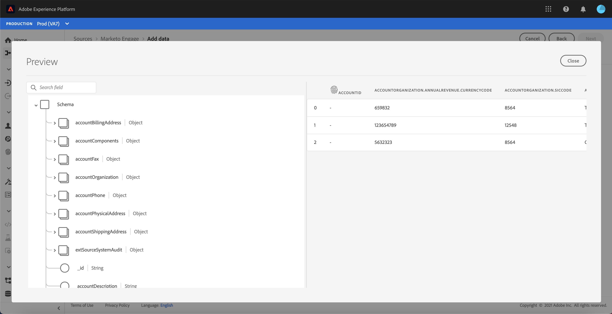

# （測試版）在UI中建立[!DNL Marketo Engage]源連接器

>[!IMPORTANT]
>
>[!DNL Marketo Engage]源當前處於測試版。 功能和檔案會有所變更。 此外，在測試版程式期間使用連接器時，您必須確定您使用的是非生產沙箱。 如需沙箱的詳細資訊，請參閱[沙箱檔案](https://experienceleague.adobe.com/docs/experience-platform/sandbox/home.html?lang=en#understanding-sandboxes)。

本教學課程提供在UI中建立[!DNL Marketo Engage]（以下稱為「[!DNL Marketo]」）來源連接器，將消費者資料匯入Adobe Experience Platform的步驟。

## 快速入門

本教學課程需要妥善了解下列Adobe Experience Platform元件：

* [來源](../../../../home.md):Experience Platform可讓您從各種來源擷取資料，同時使用Platform服務來建構、加標籤及增強傳入資料。
* [Experience Data Model(XDM)](../../../../../xdm/home.md):Experience Platform組織客戶體驗資料的標準化架構。
   * [在UI中建立和編輯結構](../../../../../xdm/ui/resources/schemas.md):了解如何在UI中建立和編輯結構描述。
* [身分識別命名空間](../../../../../identity-service/namespaces.md):身分識別命名空間是 [!DNL Identity Service] 的元件，用作身分識別相關內容的指標。完全限定的身分包括ID值和命名空間。
* [[!DNL Real-time Customer Profile]](/help/profile/home.md):根據來自多個來源的匯總資料，提供統一的即時消費者設定檔。
* [沙箱](../../../../../sandboxes/home.md):Experience Platform提供可將單一Platform執行個體分割成個別虛擬環境的虛擬沙箱，以協助開發及改進數位體驗應用程式。

### 收集所需憑據

若要在Platform上存取您的[!DNL Marketo]帳戶，您必須提供下列值：

| 憑據 | 說明 |
| ---------- | ----------- |
| `munchkinId` | Munchkin ID是特定[!DNL Marketo]例項的唯一識別碼。 |
| `clientId` | [!DNL Marketo]實例的唯一客戶端ID。 |
| `clientSecret` | [!DNL Marketo]實例的唯一客戶端密碼。 |

有關獲取這些值的詳細資訊，請參閱[[!DNL Marketo] authentication guide](../../../../connectors/adobe-applications/marketo/marketo-auth.md)。

收集完所需憑證後，您就可以依照下一節中的步驟操作。

## 連接您的[!DNL Marketo]帳戶

在平台UI中，從左側導覽列選取&#x200B;**[!UICONTROL Sources]**&#x200B;以存取[!UICONTROL Sources]工作區。 [!UICONTROL 目錄]螢幕顯示了各種源，您可以用這些源建立帳戶。

您可以從畫面左側的目錄中選取適當的類別。 或者，您也可以使用搜尋列找到您要使用的特定來源。

在[!UICONTROL Adobe應用程式]類別下，選擇&#x200B;**[!UICONTROL Marketo Engage]**。 然後，選擇&#x200B;**[!UICONTROL 添加資料]**&#x200B;以建立新的[!DNL Marketo]資料流。

此時將顯示&#x200B;**[!UICONTROL 連接到Marketo Engage]**&#x200B;頁。 在此頁面中，您可以使用新帳戶或存取現有帳戶。

### 新帳戶

如果要建立新帳戶，請選擇&#x200B;**[!UICONTROL 新帳戶]**。 在顯示的輸入表單中，提供帳戶名稱、可選說明和您的[!DNL Marketo]驗證憑證。 完成後，選擇&#x200B;**[!UICONTROL 連接到源]**，然後允許一些時間建立新連接。

### 現有帳戶

要使用現有帳戶建立資料流，請選擇&#x200B;**[!UICONTROL 現有帳戶]**，然後選擇要使用的[!DNL Marketo]帳戶。 選擇&#x200B;**[!UICONTROL Next]**&#x200B;以繼續。

## 選取資料集

建立[!DNL Marketo]帳戶後，下一步提供介面，供您探索[!DNL Marketo]資料集。

介面的左半部是目錄瀏覽器，顯示10個[!DNL Marketo]資料集。 若要建立功能完整的[!DNL Marketo]來源連線，必須擷取9個不同的資料集。 如果您也使用[!DNL Marketo]帳戶型行銷(ABM)功能，則還必須建立第10個資料流來內嵌[!UICONTROL 命名帳戶]資料集。

>[!NOTE]
>
>為了簡單起見，以下教學課程以[!UICONTROL 命名帳戶]為例，但下列步驟適用於10個[!DNL Marketo]資料集中的任何一個。

選取您要先擷取的資料集，然後選取&#x200B;**[!UICONTROL Next]**。

## 將[!DNL Marketo]結構對應至平台

此時會出現[!UICONTROL 對應]步驟，提供介面以將[!DNL Marketo]結構對應至Platform。

選擇要內嵌入的傳入資料的資料集。 您可以使用現有資料集或建立新資料集。

### 使用現有資料集

若要將資料內嵌至現有資料集，請選取「**[!UICONTROL 現有資料集]**」，然後選取資料集圖示。

此時會出現「**[!UICONTROL 選取資料集]**」對話方塊。 找到具有您要使用的適當結構的資料集，選擇該資料集，然後選擇&#x200B;**[!UICONTROL Confirm]**。

### 使用新資料集

若要將資料內嵌至新資料集，請選取「**[!UICONTROL 新資料集]**」，然後在提供的欄位中輸入資料集的名稱和說明。

您可以在&#x200B;**[!UICONTROL 選擇架構]**&#x200B;搜索欄中輸入架構名稱以搜索架構。 您也可以選取下拉式圖示，以查看現有結構的清單。 或者，您也可以選取&#x200B;**[!UICONTROL 進階搜尋]**&#x200B;來存取現有結構的頁面，包括其各自的詳細資訊。

切換&#x200B;**[!UICONTROL 設定檔資料集]**&#x200B;按鈕，為[!DNL Profile]啟用目標資料集，讓您建立實體屬性和行為的整體檢視。 所有[!DNL Profile]啟用的資料集的資料將包含在[!DNL Profile]中，並在保存資料流時應用更改。

選取架構後，向下捲動以檢視對應對話方塊，開始將[!DNL Marketo]資料集欄位對應至其適當的目標XDM欄位。

### 將[!DNL Marketo]資料集來源欄位對應至目標XDM欄位

每個[!DNL Marketo]資料集都有各自的特定對應規則可遵循。 如需如何將[!DNL Marketo]資料集對應至XDM的詳細資訊，請參閱下列內容：

* [活動](../../../../connectors/adobe-applications/mapping/marketo.md#activities)
* [計劃](../../../../connectors/adobe-applications/mapping/marketo.md#programs)
* [方案成員資格](../../../../connectors/adobe-applications/mapping/marketo.md#program-memberships)
* [公司](../../../../connectors/adobe-applications/mapping/marketo.md#companies)
* [靜態清單](../../../../connectors/adobe-applications/mapping/marketo.md#static-lists)
* [靜態清單成員資格](../../../../connectors/adobe-applications/mapping/marketo.md#static-list-memberships)
* [已命名帳戶](../../../../connectors/adobe-applications/mapping/marketo.md#named-accounts)
* [機會](../../../../connectors/adobe-applications/mapping/marketo.md#opportunities)
* [機會聯繫人角色](../../../../connectors/adobe-applications/mapping/marketo.md#opportunity-contact-roles)
* [人員](../../../../connectors/adobe-applications/mapping/marketo.md#persons)

選取「**[!UICONTROL 預覽資料]**」 ，以根據您選取的資料集查看對應結果。

[!UICONTROL 預覽]彈出式視窗提供一個介面，讓您探索所選資料集中最多100列範例資料的對應結果。

將源欄位映射到相應的目標欄位後，請選擇&#x200B;**[!UICONTROL Close]**。

## 提供資料流詳細資訊

此時將顯示[!UICONTROL 資料流詳細資訊]步驟，允許您提供有關新資料流的名稱和簡要說明。

啟用&#x200B;**[!UICONTROL 錯誤診斷]**&#x200B;切換，允許為新擷取的批次產生詳細的錯誤訊息，您可使用API下載。 如需詳細資訊，請參閱[擷取資料擷取錯誤診斷](../../../../../ingestion/quality/error-diagnostics.md)的教學課程。

[!DNL Marketo]連接器使用批次內嵌來內嵌所有歷史記錄，並使用串流內嵌來進行即時更新。 這可讓連接器在擷取任何錯誤記錄時繼續串流。 啟用&#x200B;**[!UICONTROL 部分獲取]**&#x200B;切換，然後將[!UICONTROL 錯誤閾值%]設定為最大值，以防止資料流失敗。

**[!UICONTROL 部分]** 內嵌功能提供內嵌包含錯誤且達特定臨界值之資料的功能。如需詳細資訊，請參閱[部分批次內嵌概述](../../../../../ingestion/batch-ingestion/partial.md)。

提供資料流詳細資訊並將錯誤閾值設定為max後，請選擇&#x200B;**[!UICONTROL Next]**。

## 查看資料流

此時將顯示&#x200B;**[!UICONTROL 查看]**&#x200B;步驟，允許您在建立新資料流之前查看該資料流。 詳細資料會分組為下列類別：

* **[!UICONTROL 連線]**:顯示源類型、所選源實體的相關路徑以及該源實體內的列數。
* **[!UICONTROL 指派資料集和對應欄位]**:顯示要擷取來源資料的資料集，包括資料集所遵守的結構。

審核資料流後，請選擇&#x200B;**[!UICONTROL 完成]**&#x200B;並允許建立資料流的一些時間。

## 監視資料流

建立資料流後，您可以監視正在通過資料流進行內嵌的資料，以查看有關內嵌率、成功和錯誤的資訊。 有關如何監視資料流的詳細資訊，請參閱UI](../../../../../dataflows/ui/monitor-sources.md)中有關[監視資料流的教程。

## 刪除屬性

資料集中的自訂屬性無法回溯隱藏或移除。 如果要隱藏或移除現有資料集中的自訂屬性，則必須建立沒有此自訂屬性的新資料集、新的XDM架構，並為您建立的新資料集配置新的資料流。 您還必須禁用或刪除包含資料集的原始資料流，該資料集包含要隱藏或刪除的自定義屬性。

## 刪除資料流

您可以刪除不再需要或使用&#x200B;**[!UICONTROL Dataflows]工作區中可用的[!UICONTROL Delete]**&#x200B;函式建立錯誤的資料流。 有關如何刪除資料流的詳細資訊，請參閱有關在UI](../../delete.md)中刪除資料流的教程。[

## 後續步驟

按照本教程，您已成功建立資料流以導入[!DNL Marketo]資料。 下游Platform服務（例如[!DNL Real-time Customer Profile]和[!DNL Data Science Workspace]）現在可以使用傳入的資料。 如需詳細資訊，請參閱下列檔案：

* [[!DNL Real-time Customer Profile] 概觀](/help/profile/home.md)
* [[!DNL Data Science Workspace] 概觀](/help/data-science-workspace/home.md)
