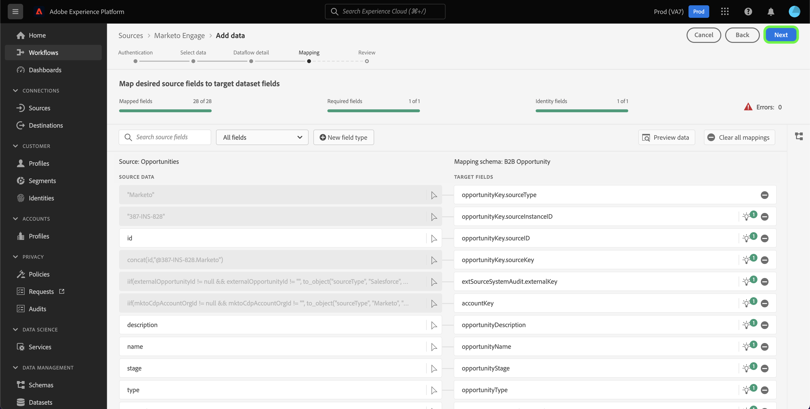
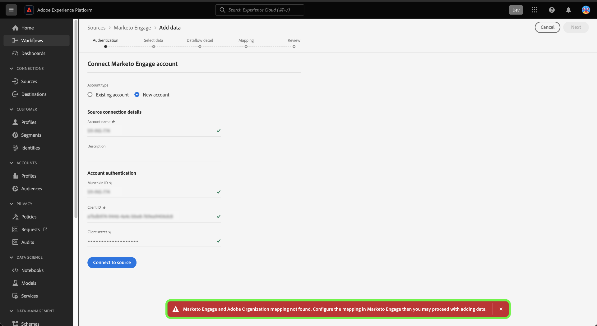

# 建立 [!DNL Marketo Engage] 源連接和UI中的資料流

>[!IMPORTANT]
>
>在建立 [!DNL Marketo Engage] 源連接和資料流，必須首先確保 [已映射Adobe組織ID](https://experienceleague.adobe.com/docs/marketo/using/product-docs/core-marketo-concepts/miscellaneous/set-up-adobe-organization-mapping.html?lang=en) 在 [!DNL Marketo]。 此外，您還必須確保您已完成 [自動填充 [!DNL Marketo] B2B命名空間和架構](../../../../connectors/adobe-applications/marketo/marketo-namespaces.md) 建立源連接和資料流之前。

本教程提供建立 [!DNL Marketo Engage] (以下簡稱：[!DNL Marketo]&quot;)UI中的源連接器，將B2B資料帶入Adobe Experience Platform。

## 快速入門

本教程需要對Adobe Experience Platform的以下部分進行有效的理解：

* [B2B命名空間和模式自動生成實用程式](../../../../connectors/adobe-applications/marketo/marketo-namespaces.md):B2B命名空間和模式自動生成實用程式允許您使用 [!DNL Postman] 為B2B命名空間和架構自動生成值。 必須先完成B2B命名空間和架構，然後才能建立 [!DNL Marketo] 源連接和資料流。
* [源](../../../../home.md):Experience Platform允許從各種源接收資料，同時讓您能夠使用平台服務構建、標籤和增強傳入資料。
* [體驗資料模型(XDM)](../../../../../xdm/home.md):Experience Platform組織客戶體驗資料的標準化框架。
   * [在UI中建立和編輯架構](../../../../../xdm/ui/resources/schemas.md):瞭解如何在UI中建立和編輯架構。
* [標識命名空間](../../../../../identity-service/namespaces.md):標識命名空間是 [!DNL Identity Service] 作為身份相關背景的指標。 完全限定的標識包括ID值和命名空間。
* [[!DNL Real-Time Customer Profile]](/help/profile/home.md):基於來自多個源的聚合資料提供統一、即時的用戶配置檔案。
* [沙箱](../../../../../sandboxes/home.md):Experience Platform提供虛擬沙箱，將單個平台實例分區為獨立的虛擬環境，以幫助開發和發展數字型驗應用程式。

### 收集所需憑據

為了訪問 [!DNL Marketo] 帳戶，必須提供以下值：

| 憑據 | 說明 |
| ---------- | ----------- |
| `munchkinId` | Munchkin ID是特定的唯一標識符 [!DNL Marketo] 實例。 |
| `clientId` | 您的唯一客戶端ID [!DNL Marketo] 實例。 |
| `clientSecret` | 您的唯一客戶端機密 [!DNL Marketo] 實例。 |

有關獲取這些值的詳細資訊，請參閱 [[!DNL Marketo] 認證指南](../../../../connectors/adobe-applications/marketo/marketo-auth.md)。

收集了所需的憑據後，可以執行下一節中的步驟。

## 連接 [!DNL Marketo] 帳戶

在平台UI中，選擇 **[!UICONTROL 源]** 從左導航欄訪問 [!UICONTROL 源] 工作區。 的 [!UICONTROL 目錄] 螢幕顯示可建立帳戶的各種源。

可以從螢幕左側的目錄中選擇相應的類別。 或者，您可以使用搜索欄找到要使用的特定源。

在 [!UICONTROL Adobe應用程式] 類別，選擇 **[!UICONTROL Marketo Engage]**。 然後，選擇 **[!UICONTROL 添加資料]** 新建 [!DNL Marketo] 資料流。

的 **[!UICONTROL 連接Marketo Engage帳戶]** 的子菜單。 在此頁上，您可以使用新帳戶或訪問現有帳戶。

### 現有帳戶

要使用現有帳戶建立資料流，請選擇 **[!UICONTROL 現有帳戶]** ，然後選擇 [!DNL Marketo] 要使用的帳戶。 選擇 **[!UICONTROL 下一個]** 繼續。

### 新帳戶

如果要建立新帳戶，請選擇 **[!UICONTROL 新帳戶]**。 在顯示的輸入表單上，提供帳戶名、可選說明和 [!DNL Marketo] 身份驗證憑據。 完成後，選擇 **[!UICONTROL 連接到源]** 然後再給新連接建立一段時間。

## 選取資料集

在建立 [!DNL Marketo] 帳戶，下一步為您提供了一個介面 [!DNL Marketo] 資料集。

介面的左半部分是目錄瀏覽器，顯示 [!DNL Marketo] 資料集。 功能齊全 [!DNL Marketo] 源連接需要接收9個不同的資料集。 如果您還使用 [!DNL Marketo] 基於帳戶的市場營銷(ABM)功能，則還必須建立第10個資料流以接收 [!UICONTROL 命名帳戶] 資料集。

>[!NOTE]
>
>為簡潔起見，以下教程使用 [!UICONTROL 機會] 例如，但下面介紹的步驟適用於10個 [!DNL Marketo] 資料集。

選擇要先攝取的資料集，然後選擇 **[!UICONTROL 下一個]**。

## 提供資料流詳細資訊 {#provide-dataflow-details}

的 [!UICONTROL 資料流詳細資訊] 頁允許您選擇是使用現有資料集還是使用新資料集。 在此過程中，您還可以配置 [!UICONTROL 配置檔案資料集]。 [!UICONTROL 錯誤診斷]。 [!UICONTROL 部分攝取], [!UICONTROL 警報]。

>[!BEGINTABS]

>[!TAB 使用現有資料集]

要將資料插入現有資料集，請選擇 **[!UICONTROL 現有資料集]**。 可以使用 [!UICONTROL 高級搜索] 選項，或通過在下拉菜單中滾動現有資料集清單來執行此操作。 選擇資料集後，請提供資料流的名稱和說明。

>[!TAB 使用新資料集]

要插入新資料集，請選擇 **[!UICONTROL 新資料集]** 然後提供輸出資料集名稱和可選說明。 接下來，選擇要映射到的方案 [!UICONTROL 高級搜索] 選項，或通過在下拉菜單中滾動現有架構清單來執行。 選擇架構後，請提供資料流的名稱和說明。

>[!ENDTABS]

### 啟用 [!DNL Profile] 錯誤診斷

接下來，選擇 **[!UICONTROL 配置檔案資料集]** 切換為 [!DNL Profile]。 這允許您建立實體屬性和行為的整體視圖。 所有資料 [!DNL Profile]-enabled資料集將包含在 [!DNL Profile] 並在保存資料流時應用更改。

[!UICONTROL 錯誤診斷] 為資料流中出現的任何錯誤記錄啟用詳細的錯誤消息生成，同時 [!UICONTROL 部分攝取] 允許您接收包含錯誤的資料，最高可達您手動定義的特定閾值。 查看 [部分批處理接收概述](../../../../../ingestion/batch-ingestion/partial.md) 的子菜單。

>[!IMPORTANT]
>
>的 [!DNL Marketo] 源使用批處理接收來接收所有歷史記錄，並使用流式接收來即時更新。 這允許源在接收任何錯誤記錄時繼續流式傳輸。 啟用 **[!UICONTROL 部分攝取]** 切換，然後設定 [!UICONTROL 錯誤閾值%] 以防止資料流失敗。

### 啟用警報

您可以啟用警報來接收有關資料流狀態的通知。 從清單中選擇要訂閱的警報以接收有關資料流狀態的通知。 有關警報的詳細資訊，請參閱上的指南 [使用UI訂閱源警報](../../alerts.md)。

完成向資料流提供詳細資訊後，選擇 **[!UICONTROL 下一個]**。

### 在插入公司資料時跳過未申請的帳戶

建立資料流以從公司資料集接收資料時，可以配置 [!UICONTROL 排除未申請的帳戶] 排除或包括未申請帳戶以防攝取。

當個人填寫表格時， [!DNL Marketo] 根據不包含其他資料的公司名稱建立虛擬帳戶記錄。 對於新資料流，預設情況下會啟用用於排除未聲明帳戶的切換。 對於現有資料流，可以啟用或禁用該功能，更改將應用於新接收的資料，而不是現有資料。

## 映射 [!DNL Marketo] 資料集源欄位到目標XDM欄位

的 [!UICONTROL 映射] 步驟，提供一個介面，用於將源欄位從源架構映射到目標架構中相應的目標XDM欄位。

每個 [!DNL Marketo] 資料集有其自己特定的映射規則要遵循。 有關如何映射的詳細資訊，請參閱以下 [!DNL Marketo] 資料集到XDM:

* [活動](../../../../connectors/adobe-applications/mapping/marketo.md#activities)
* [方案](../../../../connectors/adobe-applications/mapping/marketo.md#programs)
* [程式成員資格](../../../../connectors/adobe-applications/mapping/marketo.md#program-memberships)
* [公司](../../../../connectors/adobe-applications/mapping/marketo.md#companies)
* [靜態清單](../../../../connectors/adobe-applications/mapping/marketo.md#static-lists)
* [靜態清單成員資格](../../../../connectors/adobe-applications/mapping/marketo.md#static-list-memberships)
* [命名帳戶](../../../../connectors/adobe-applications/mapping/marketo.md#named-accounts)
* [機會](../../../../connectors/adobe-applications/mapping/marketo.md#opportunities)
* [機會聯繫人角色](../../../../connectors/adobe-applications/mapping/marketo.md#opportunity-contact-roles)
* [人](../../../../connectors/adobe-applications/mapping/marketo.md#persons)

根據您的需要，您可以選擇直接映射欄位，或使用資料準備函式轉換源資料以導出計算值或計算值。 有關使用映射介面的全面步驟，請參見 [資料準備UI指南](../../../../../data-prep/ui/mapping.md)。

映射集準備好後，選擇 **[!UICONTROL 下一個]** 並允許建立新資料流時間。

## 查看資料流

的 **[!UICONTROL 審閱]** 步驟，允許您在建立新資料流之前查看它。 詳細資訊按以下類別分組：

* **[!UICONTROL 連接]**:顯示源類型、所選源實體的相關路徑以及該源實體中的列數。
* **[!UICONTROL 分配資料集和映射欄位]**:顯示源資料正被攝取到的資料集，包括該資料集所遵循的架構。

查看資料流後，選擇 **[!UICONTROL 保存和攝取]** 並為建立資料流留出一些時間。

## 監視資料流

建立資料流後，您可以監視通過它攝取的資料，以查看有關攝取率、成功和錯誤的資訊。 有關如何監視資料流的詳細資訊，請參見上的教程 [監視UI中的資料流](../../../../../dataflows/ui/monitor-sources.md)。

## 刪除屬性

無法追溯隱藏或刪除資料集中的自定義屬性。 如果要從現有資料集中隱藏或刪除自定義屬性，則必須建立沒有此自定義屬性的新資料集、新的XDM架構，並為所建立的新資料集配置新的資料流。 您還必須禁用或刪除原始資料流，該原始資料流包含要隱藏或刪除的自定義屬性。

## 刪除資料流

您可以刪除不再需要或使用 **[!UICONTROL 刪除]** 函式 [!UICONTROL 資料流] 工作區。 有關如何刪除資料流的詳細資訊，請參見上的教程 [刪除UI中的資料流](../../delete.md)。

## 後續步驟

按照本教程，您已成功建立了要引入的資料流 [!DNL Marketo] 資料。 現在，下游平台服務(如 [!DNL Real-Time Customer Profile] 和 [!DNL Data Science Workspace]。 有關詳細資訊，請參閱以下文檔：

* [[!DNL Real-Time Customer Profile] 概覽](/help/profile/home.md)
* [[!DNL Data Science Workspace] 概覽](/help/data-science-workspace/home.md)

## 附錄 {#appendix}

以下各節提供了在使用 [!DNL Marketo] 源。

### UI中的錯誤消息 {#error-messages}

當平台檢測到您的設定問題時，UI中將顯示以下錯誤消息：

#### [!DNL Munchkin ID] 未映射到相應的組織

如果您 [!DNL Munchkin ID] 未映射到您所使用的平台組織。 配置您的 [!DNL Munchkin ID] 而你的組織使用 [[!DNL Marketo] 介面](https://app-sjint.marketo.com/#MM0A1)。

#### 主標識缺失

如果缺少主標識，則資料流將無法保存和接收。 確保 [XDM架構中存在主標識](../../../../../xdm/tutorials/create-schema-ui.md)，然後嘗試配置資料流。

