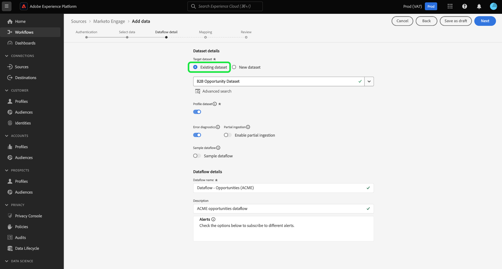

# （測試版）在UI中建立[!DNL Marketo Engage]來源連接器

>[!IMPORTANT]
>
>[!DNL Marketo Engage]來源目前處於測試階段。 功能和說明檔案會有所變更。 此外，在測試版程式期間使用連接器時，您必須確保使用非生產沙盒。 有關沙盒的更多資訊，請參閱[沙盒檔案](https://experienceleague.adobe.com/docs/experience-platform/sandbox/home.html?lang=en#understanding-sandboxes)。

本教學課程提供在UI中建立[!DNL Marketo Engage]（下稱為&quot;[!DNL Marketo]&quot;）來源連接器，將消費者資料匯入Adobe Experience Platform的步驟。

## 快速入門

本教學課程需要對Adobe Experience Platform的下列部分有正確的理解：

* [來源](../../../../home.md):Experience Platform可讓您從各種來源擷取資料，同時讓您能夠使用平台服務來建構、標示並增強傳入資料。
* [體驗資料模型(XDM)](../../../../../xdm/home.md):Experience Platform組織客戶體驗資料的標準化架構。
   * [在UI中建立和編輯結構](../../../../../xdm/ui/resources/schemas.md):瞭解如何在UI中建立和編輯結構描述。
* [身分名稱空間](../../../../../identity-service/namespaces.md):身分名稱空間是其 [!DNL Identity Service] 中的一個元件，用作身份相關上下文的指示器。完全限定身份包括ID值和命名空間。
* [[!DNL Real-time Customer Profile]](../../../../../profile/home.md):根據來自多個來源的匯整資料，提供統一、即時的消費者個人檔案。
* [沙盒](../../../../../sandboxes/home.md):Experience Platform提供虛擬沙盒，可將單一平台實例分割為獨立的虛擬環境，以協助開發和發展數位體驗應用程式。

### 收集必要的認證

若要存取平台上的[!DNL Marketo]帳戶，您必須提供下列值：

| 憑證 | 說明 |
| ---------- | ----------- |
| `munchkinId` | Munchkin ID是特定[!DNL Marketo]例項的唯一識別碼。 |
| `clientId` | [!DNL Marketo]實例的唯一客戶端ID。 |
| `clientSecret` | [!DNL Marketo]實例的唯一客戶機密碼。 |

有關獲取這些值的詳細資訊，請參閱[[!DNL Marketo] 身份驗證指南](../../../../connectors/adobe-applications/marketo/marketo-auth.md)。

收集完所需的認證後，您可以遵循下一節中的步驟。

## 連接您的[!DNL Marketo]帳戶

在平台UI中，從左側導覽列選擇&#x200B;**[!UICONTROL Sources]**&#x200B;以存取[!UICONTROL Sources]工作區。 [!UICONTROL Catalog]畫面會顯示各種來源，您可以用來建立帳戶。

您可以從畫面左側的目錄中選取適當的類別。 或者，您也可以使用搜尋列，找到您要使用的特定來源。

在[!UICONTROL Adobe applications]類別下，選擇&#x200B;**[!UICONTROL Marketo Engage]**。 然後，選擇&#x200B;**[!UICONTROL Add data]**&#x200B;以建立新的[!DNL Marketo]資料流。

此時將顯示&#x200B;**[!UICONTROL Connect to Marketo Engage]**&#x200B;頁。 在此頁面上，您可以使用新帳戶或存取現有帳戶。

### 新帳戶

如果要建立新帳戶，請選擇&#x200B;**[!UICONTROL New account]**。 在顯示的輸入表單上，提供帳戶名稱、可選說明和您的[!DNL Marketo]驗證憑證。 完成後，選擇&#x200B;**[!UICONTROL Connect to source]** ，然後允許一些時間建立新連接。

### 現有帳戶

要建立具有現有帳戶的資料流，請選擇&#x200B;**[!UICONTROL Existing account]** ，然後選擇要使用的[!DNL Marketo]帳戶。 選擇&#x200B;**[!UICONTROL Next]**&#x200B;繼續。

## 選取資料集

在建立[!DNL Marketo]帳戶後，下一步驟會提供介面，供您探索[!DNL Marketo]資料集。

介面的左半部分是目錄瀏覽器，顯示10個[!DNL Marketo]資料集。 完整功能的[!DNL Marketo]源連接需要提取9個不同的資料集。 如果您也使用[!DNL Marketo's]帳戶型行銷(ABM)功能，則還必須建立第10個資料流，才能收錄[!UICONTROL Named Accounts]資料集。

>[!NOTE]
>
>為簡略起見，以下教程以[!UICONTROL Named Acccounts]為例，但以下概述的步驟適用於10個[!DNL Marketo]資料集中的任何一個。

先選取您要收錄的資料集，然後選取&#x200B;**[!UICONTROL Next]**。

## 將資料欄位對應至XDM架構

出現[!UICONTROL Mapping]步驟，提供將[!DNL Marketo]資料集映射至Platform資料集的介面。

選擇要接收傳入資料的資料集。 您可以使用現有資料集或建立新資料集。

### 使用現有資料集

若要將資料內嵌至現有資料集，請選取&#x200B;**[!UICONTROL Use existing dataset]**，然後選取資料集圖示。

出現&#x200B;**[!UICONTROL Select dataset]**&#x200B;對話框。 尋找具有您要使用的適當架構的資料集，選取它，然後選取&#x200B;**[!UICONTROL Confirm]**。

### 使用新資料集

若要將資料內嵌至新資料集，請選取&#x200B;**[!UICONTROL Create new dataset]**，並在提供的欄位中輸入資料集的名稱和說明。

您可以在&#x200B;**[!UICONTROL Select schema]**&#x200B;搜索欄中輸入方案名稱，以搜索方案。 您也可以選擇下拉式圖示，查看現有結構的清單。 或者，您可以選擇&#x200B;**[!UICONTROL Advanced search]**&#x200B;以訪問現有方案的頁，包括其各自的詳細資訊。

切換&#x200B;**[!UICONTROL Profile dataset]**&#x200B;按鈕，以啟用[!DNL Profile]的目標資料集，讓您建立實體屬性和行為的整體檢視。 所有[!DNL Profile]啟用資料集的資料將包含在[!DNL Profile]中，並在保存資料流時應用更改。

選擇方案後，向下滾動以查看映射對話框，以開始將[!DNL Marketo]資料集欄位映射到相應的目標XDM欄位。

### 將[!DNL Marketo]資料集來源欄位對應至目標XDM欄位

每個[!DNL Marketo]資料集都有其專屬的對應規則要遵循。 有關如何將[!DNL Marketo]資料集映射到XDM的詳細資訊，請參見以下內容：

* [活動](../../../../connectors/adobe-applications/mapping/marketo.md#activities)
* [計劃](../../../../connectors/adobe-applications/mapping/marketo.md#programs)
* [方案會籍](../../../../connectors/adobe-applications/mapping/marketo.md#program-memberships)
* [公司](../../../../connectors/adobe-applications/mapping/marketo.md#companies)
* [靜態清單](../../../../connectors/adobe-applications/mapping/marketo.md#static-lists)
* [靜態清單成員資格](../../../../connectors/adobe-applications/mapping/marketo.md#static-list-memberships)
* [命名帳戶](../../../../connectors/adobe-applications/mapping/marketo.md#named-accounts)
* [機會](../../../../connectors/adobe-applications/mapping/marketo.md#opportunities)
* [業務機會聯繫人角色](../../../../connectors/adobe-applications/mapping/marketo.md#opportunity-contact-roles)
* [人物](../../../../connectors/adobe-applications/mapping/marketo.md#persons)

選擇&#x200B;**[!UICONTROL Preview data]**&#x200B;以根據所選資料集查看映射結果。

[!UICONTROL Preview]快顯功能提供介面，讓您從選取的資料集探索最多100列範例資料的對應結果。

將源欄位映射到相應的目標欄位後，請選擇&#x200B;**[!UICONTROL Close]**。

## 提供資料流詳細資訊

出現[!UICONTROL Dataflow detail]步驟，允許您提供有關新資料流的名稱和簡要說明。

啟用&#x200B;**[!UICONTROL Error diagnostics]**&#x200B;切換，允許針對新接收的批次產生詳細的錯誤訊息，您可使用API下載。

[!DNL Marketo]連接器使用批次擷取來擷取所有歷史記錄，並使用串流擷取來即時更新。 這允許連接器在接收任何錯誤記錄的同時繼續流。 啟用&#x200B;**[!UICONTROL Partial ingestion]**&#x200B;切換，然後將[!UICONTROL Error threshold %]設定為最大值以防止資料流失敗。

**[!UICONTROL Partial ingestion]** 提供可收錄包含錯誤達特定臨界值的資料的功能。如需詳細資訊，請參閱[部分批次擷取概觀](../../../../../ingestion/batch-ingestion/partial.md)。

提供資料流詳細資訊並將錯誤閾值設定為max後，請選擇&#x200B;**[!UICONTROL Next]**。

## 查看資料流

出現&#x200B;**[!UICONTROL Review]**&#x200B;步驟，允許您在建立新資料流之前對其進行查看。 詳細資訊會分組在下列類別中：

* **[!UICONTROL Connection]**:顯示源檔案的類型、所選源檔案的相關路徑，以及該源檔案中的列數。
* **[!UICONTROL Assign dataset & map fields]**:顯示源資料被吸收到的資料集，包括資料集所附的模式。

複查資料流後，請選擇&#x200B;**[!UICONTROL Finish]**&#x200B;並為建立資料流留出一些時間。

## 監控資料流

建立資料流後，您可以監視通過其獲取的資料，以查看有關提取率、成功和錯誤的資訊。 有關如何監視資料流的詳細資訊，請參見UI](../../../../../dataflows/ui/monitor-sources.md)中有關[監視資料流的教程。

## 刪除屬性

資料集中的自訂屬性無法回溯隱藏或移除。 如果要隱藏或刪除現有資料集中的自定義屬性，則必須建立一個沒有此自定義屬性的新資料集、新的XDM模式，並為建立的新資料集配置新的資料流。 您還必須禁用或刪除由包含要隱藏或刪除的自定義屬性的資料集組成的原始資料流。

## 刪除資料流

您可以刪除不再需要或使用[!UICONTROL Dataflows]工作區中的&#x200B;**[!UICONTROL Delete]**&#x200B;函式錯誤建立的資料流。 有關如何刪除資料流的詳細資訊，請參見UI](../../delete.md)中有關[刪除資料流的教程。

## 後續步驟

按照本教程，您已成功建立了一個資料流以導入[!DNL Marketo]資料。 現在，下游平台服務（如[!DNL Real-time Customer Profile]和[!DNL Data Science Workspace]）可以使用傳入的資料。 如需詳細資訊，請參閱下列檔案：

* [[!DNL Real-time Customer Profile] 概觀](../../../../profile/home.md)
* [[!DNL Data Science Workspace] 概觀](../../../../data-science-workspace/home.md)
