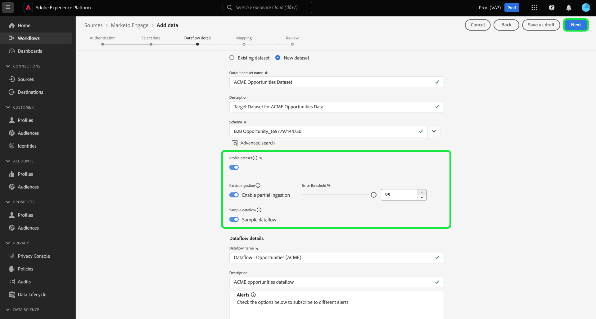

# 在UI中建立[!DNL Marketo Engage]來源連線和資料流

>[!IMPORTANT]
>
>建立[!DNL Marketo Engage]來源連線和資料流之前，您必須先確定已在[!DNL Marketo]中對應您的Adobe組織識別碼](https://experienceleague.adobe.com/docs/marketo/using/product-docs/core-marketo-concepts/miscellaneous/set-up-adobe-organization-mapping.html)。 [此外，您也必須確定在建立來源連線和資料流之前，已完成[自動填入 [!DNL Marketo] B2B名稱空間和結構描述](../../../../connectors/adobe-applications/marketo/marketo-namespaces.md)。

本教學課程提供在UI中建立[!DNL Marketo Engage] （以下稱為「[!DNL Marketo]」）來源聯結器的步驟，以將B2B資料引進Adobe Experience Platform。

## 快速入門

本教學課程需要您實際瞭解下列Adobe Experience Platform元件：

* [B2B名稱空間與結構描述自動產生公用程式](../../../../connectors/adobe-applications/marketo/marketo-namespaces.md)： B2B名稱空間與結構描述自動產生公用程式可讓您使用[!DNL Postman]自動產生B2B名稱空間與結構描述的值。 您必須先完成B2B名稱空間和結構描述，才能建立[!DNL Marketo]來源連線和資料流。
* [來源](../../../../home.md)：Experience Platform允許從各種來源擷取資料，同時讓您能夠使用Platform服務來建構、加標籤以及增強傳入的資料。
* [體驗資料模型(XDM)](../../../../../xdm/home.md)：Experience Platform用來組織客戶體驗資料的標準化架構。
   * [在UI中建立和編輯結構描述](../../../../../xdm/ui/resources/schemas.md)：瞭解如何在UI中建立和編輯結構描述。
* [身分識別名稱空間](../../../../../identity-service/features/namespaces.md)：身分識別名稱空間是[!DNL Identity Service]的元件，用來做為身分識別相關內容的指標。 完整身分包含ID值和名稱空間。
* [[!DNL Real-Time Customer Profile]](/help/profile/home.md)：根據來自多個來源的彙總資料，提供統一的即時消費者設定檔。
* [沙箱](../../../../../sandboxes/home.md)：Experience Platform提供的虛擬沙箱可將單一Platform執行個體分割成個別的虛擬環境，以利開發及改進數位體驗應用程式。

### 收集必要的認證

若要在Experience Platform上存取您的[!DNL Marketo]帳戶，您必須提供下列值：

| 認證 | 說明 |
| ---- | ---- |
| `munchkinId` | Munchkin ID是特定[!DNL Marketo]執行個體的唯一識別碼。 |
| `clientId` | [!DNL Marketo]執行個體的唯一使用者端識別碼。 |
| `clientSecret` | [!DNL Marketo]執行個體的唯一使用者端密碼。 |

如需取得這些值的詳細資訊，請參閱[[!DNL Marketo] 驗證指南](../../../../connectors/adobe-applications/marketo/marketo-auth.md)。

收集完所需的認證後，您可以依照下一節中的步驟操作。

## 連線您的[!DNL Marketo]帳戶

在Platform UI中，從左側導覽選取&#x200B;**[!UICONTROL 來源]**&#x200B;以存取[!UICONTROL 來源]工作區。 您可以從熒幕左側的目錄中選取適當的類別。 或者，您可以使用搜尋選項來尋找您要使用的特定來源。

在&#x200B;*Adobe應用程式*&#x200B;類別下，選取&#x200B;**[!UICONTROL Marketo Engage]**，然後選取&#x200B;**[!UICONTROL 新增資料]**。

>[!TIP]
>
>當指定的來源尚未具有已驗證的帳戶時，來源目錄中的來源會顯示&#x200B;**[!UICONTROL 設定]**&#x200B;選項。 一旦驗證帳戶存在，此選項就會變更為&#x200B;**[!UICONTROL 新增資料]**。

**[!UICONTROL 連線Marketo Engage帳戶]**&#x200B;頁面隨即顯示。 在此頁面中，您可以使用新帳戶或存取現有帳戶。

>[!BEGINTABS]

>[!TAB 建立新帳戶]

若要建立新帳戶，請選取&#x200B;**[!UICONTROL 新帳戶]**，並提供名稱、選擇性說明和您的認證。

完成時，請選取&#x200B;**[!UICONTROL 連線到來源]**，然後等待一段時間以建立新連線。

>[!TAB 使用現有的帳戶]

若要使用現有帳戶，請選取&#x200B;**[!UICONTROL 現有帳戶]**，然後從現有帳戶目錄中選取您要使用的帳戶。

選取&#x200B;**[!UICONTROL 下一步]**&#x200B;以繼續。

>[!ENDTABS]

## 選取資料集

建立[!DNL Marketo]帳戶後，下一步會提供介面供您探索[!DNL Marketo]資料集。

介面的左半部分是目錄瀏覽器，顯示10 [!DNL Marketo]個資料集。 功能齊全的[!DNL Marketo]來源連線需要擷取9個不同的資料集。 如果您也使用[!DNL Marketo]帳戶型行銷(ABM)功能，則還必須建立第10個資料流以擷取[!UICONTROL 具名帳戶]資料集。

>[!NOTE]
>
>為了簡單起見，下列教學課程使用[!UICONTROL 機會]作為範例，但以下概述的步驟適用於10個[!DNL Marketo]資料集中的任一個。

選取您要擷取的資料集。 這會更新介面，以顯示資料集的預覽。 完成後，選取&#x200B;**[!UICONTROL 下一步]**。

## 提供資料集和資料流詳細資料 {#provide-dataset-and-dataflow-details}

接下來，您必須提供有關資料集和資料流的資訊。

### 資料集詳細資料 {#dataset-details}

資料集是資料集合的儲存和管理結構，通常是包含方案 (欄) 和欄位 (列) 的表格。 成功擷取到Experience Platform的資料會以資料集的形式儲存在資料湖中。 在此步驟中，您可以建立新資料集或使用現有資料集。

>[!BEGINTABS]

>[!TAB 使用新的資料集]

若要使用新的資料集，請選取&#x200B;**[!UICONTROL 新的資料集]**，然後為您的資料集提供名稱和選擇性描述。 您也必須選取您的資料集所要遵守的Experience Data Model (XDM)結構。

>[!TAB 使用現有的資料集]

如果您已有現有的資料集，請選取「**[!UICONTROL 現有的資料集]**」，然後使用「**[!UICONTROL 進階搜尋]**」選項來檢視貴組織中所有資料集的視窗，包括其個別詳細資訊，例如是否啟用這些資料集以擷取至即時客戶設定檔。

>[!ENDTABS]

### 資料流設定 {#dataflow-configurations}

>[!IMPORTANT]
>
>[!DNL Marketo]來源使用批次擷取來擷取所有歷史記錄，並使用串流擷取來即時更新。 這可讓來源在擷取任何錯誤記錄時繼續串流。 啟用&#x200B;**[!UICONTROL 部分擷取]**&#x200B;切換，然後將[!UICONTROL 錯誤臨界值%]設定為最大值，以防止資料流失敗。

如果您的資料集已啟用即時客戶個人檔案，那麼在此步驟中，您可以切換&#x200B;**[!UICONTROL 個人檔案資料集]**&#x200B;以啟用您的資料以進行個人檔案擷取。 您也可以使用此步驟來啟用&#x200B;**[!UICONTROL 錯誤診斷]**&#x200B;和&#x200B;**[!UICONTROL 部分擷取]**。

* **[!UICONTROL 錯誤診斷]**：選取&#x200B;**[!UICONTROL 錯誤診斷]**&#x200B;以指示來源產生錯誤診斷，以便您稍後在監視資料集活動和資料流狀態時參考。
* **[!UICONTROL 部分擷取]**： [部分批次擷取](../../../../../ingestion/batch-ingestion/partial.md)能夠擷取包含錯誤的資料，最多可設定特定臨界值。 此功能可讓您將所有精確資料成功擷取到Experience Platform，同時所有不正確的資料會個別批次處理，並提供無效原因的資訊。

在此步驟中，您可以啟用&#x200B;**[!UICONTROL 範例資料流]**&#x200B;以限制資料擷取，並避免擷取所有歷史資料（包括個人身分）所產生的額外成本。

>[!BEGINSHADEBOX]

**使用範例資料流的快速指南**

範例資料流是您可以為[!DNL Marketo]資料流設定的設定，以限制擷取率，然後嘗試Experience Platform功能而不需要擷取大量資料。

* 啟用範例資料流，可在回填工作期間擷取最多10萬筆記錄（從最大的記錄ID）或最多10天的活動，以限制歷史資料。
* 針對所有B2B實體使用範例資料流設定時，您必須考慮到某些相關記錄可能會遺失，因為系統不會擷取來源資料的整個歷史記錄。

>[!ENDSHADEBOX]

此外，如果您正在從公司資料集中擷取資料，可以啟用&#x200B;**[!UICONTROL 排除無人認領的帳戶]**&#x200B;以排除無人認領的帳戶不進行擷取。

當個人填寫表單時，[!DNL Marketo]會根據不含其他資料的公司名稱建立虛擬帳戶記錄。 對於新的資料流，預設會啟用排除無人認領帳戶的切換按鈕。 對於現有的資料流，您可以啟用或停用此功能，而變更會套用至新擷取的資料，而非現有的資料。

## 將您的[!DNL Marketo]資料集來源欄位對應到目標XDM欄位

[!UICONTROL 對應]步驟出現，為您提供介面，用於將來源結構描述中的來源欄位對應到目標結構描述中適當的目標XDM欄位。

每個[!DNL Marketo]資料集都有各自特定的對應規則要遵循。 如需如何將[!DNL Marketo]資料集對應至XDM的詳細資訊，請參閱下列內容：

* [活動](../../../../connectors/adobe-applications/mapping/marketo.md#activities)
* [方案](../../../../connectors/adobe-applications/mapping/marketo.md#programs)
* [計畫成員資格](../../../../connectors/adobe-applications/mapping/marketo.md#program-memberships)
* [公司](../../../../connectors/adobe-applications/mapping/marketo.md#companies)
* [靜態清單](../../../../connectors/adobe-applications/mapping/marketo.md#static-lists)
* [靜態清單成員資格](../../../../connectors/adobe-applications/mapping/marketo.md#static-list-memberships)
* [具名帳戶](../../../../connectors/adobe-applications/mapping/marketo.md#named-accounts)
* [機會](../../../../connectors/adobe-applications/mapping/marketo.md#opportunities)
* [機會聯絡人角色](../../../../connectors/adobe-applications/mapping/marketo.md#opportunity-contact-roles)
* [人員](../../../../connectors/adobe-applications/mapping/marketo.md#persons)

您可以根據自己的需求，選擇直接對應欄位，或使用資料準備函式來轉換來源資料，以衍生計算或計算的值。 如需使用對應介面的完整步驟，請參閱[資料準備UI指南](../../../../../data-prep/ui/mapping.md)。

對應集準備就緒後，請選取&#x200B;**[!UICONTROL 下一步]**，並等待一段時間以建立新的資料流。

## 檢閱您的資料流

**[!UICONTROL 檢閱]**&#x200B;步驟隨即顯示，可讓您在建立新資料流之前先檢閱該資料流。 詳細資料會分組到以下類別中：

* **[!UICONTROL 連線]**：顯示來源型別、所選來源實體的相關路徑，以及該來源實體中的資料行數量。
* **[!UICONTROL 指派資料集與對應欄位]**：顯示要將來源資料擷取到哪個資料集，包括資料集所堅持的結構描述。

檢閱您的資料流後，請選取「**[!UICONTROL 儲存並擷取]**」，並等待一些時間來建立資料流。

## 監視資料流

建立資料流後，您可以監視透過該資料流擷取的資料，以檢視擷取率、成功和錯誤的資訊。 如需如何監視資料流的詳細資訊，請參閱有關UI](../../../../../dataflows/ui/monitor-sources.md)中[監視資料流的教學課程。

## 刪除您的屬性

資料集中的自訂屬性無法回溯隱藏或移除。 如果您想從現有資料集中隱藏或移除自訂屬性，則必須建立不含此自訂屬性的新資料集、新的XDM結構，並為您建立的新資料集設定新的資料流。 您也必須停用或刪除包含資料集的原始資料流，該資料流具有您要隱藏或移除的自訂屬性。

## 刪除您的資料流

您可以刪除不再需要的資料流，或使用[!UICONTROL 資料流]工作區中可用的&#x200B;**[!UICONTROL 刪除]**&#x200B;功能建立錯誤的資料流。 如需有關如何刪除資料流程的詳細資訊，請參閱有關[在UI](../../delete.md)中刪除資料流程的教學課程。

## 後續步驟

依照此教學課程中的指示，您已成功建立資料流，以將B2B資料從您的[!DNL Marketo Engage]來源擷取至Experience Platform。

## 附錄 {#appendix}

以下各節提供使用[!DNL Marketo]來源時可能會遵循的其他准則。

### ui中的錯誤訊息 {#error-messages}

當Platform偵測到您的設定發生問題時，UI中會顯示下列錯誤訊息：

#### [!DNL Munchkin ID]未對應到適當的組織

若您的[!DNL Munchkin ID]未對應至您正在使用的平台組織，則會拒絕驗證。 使用[[!DNL Marketo] 介面](https://app-sjint.marketo.com/#MM0A1)設定[!DNL Munchkin ID]與組織之間的對應。

#### 缺少主要身分

如果缺少主要身分，資料流將無法儲存和擷取。 在嘗試設定資料流之前，請確定XDM結構描述](../../../../../xdm/tutorials/create-schema-ui.md)中有[主要身分。

