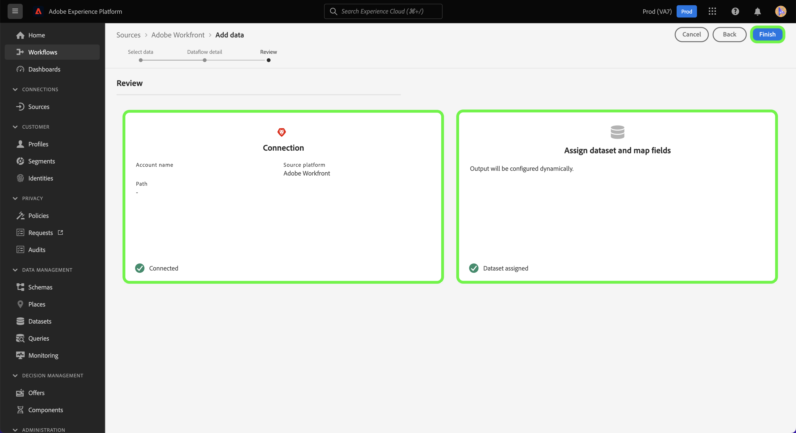

# （測試版）在UI中建立Adobe Workfront來源連線

>[!NOTE]
>
>Adobe Workfront來源為測試版。 請參閱 [來源概觀](../../../../home.md#terms-and-conditions) 以取得使用測試版標籤來源的詳細資訊。

本教學課程提供建立Adobe Workfront來源連線的步驟，以便使用使用者介面將Workfront資料匯入Adobe Experience Platform。

## 快速入門

>[!IMPORTANT]
>
>您必須設定為Adobe Admin Console中的管理員，才能存取Workfront來源。

本教學課程需要妥善了解下列Experience Platform元件：

* [Experience Data Model(XDM)系統](../../../../../xdm/home.md):Experience Platform組織客戶體驗資料的標準化架構。
* [即時客戶個人檔案](../../../../../profile/home.md):根據來自多個來源的匯總資料，提供統一的即時消費者設定檔。
* [沙箱](../../../../../sandboxes/home.md):Experience Platform提供可將單一Platform執行個體分割成個別虛擬環境的虛擬沙箱，以協助開發及改進數位體驗應用程式。

## 在UI中建立Workfront來源連線

在平台UI中，選取 **[!UICONTROL 來源]** 從左側導覽器存取 [!UICONTROL 來源] 工作區。 此 [!UICONTROL 目錄] 畫面會顯示可用來建立帳戶的各種來源。

您可以從畫面左側的目錄中選取適當的類別。 您也可以使用搜尋列來縮小顯示的來源。

在 **[!UICONTROL Adobe應用程式]** 類別，選擇 **[!UICONTROL Adobe Workfront]** 然後選取 **[!UICONTROL 新增資料]**.

## 選擇資料

此 [!UICONTROL 選擇資料] 步驟。 您必須在此處提供Workfront子網域和Datalane的值。 您的Workfront子網域是與用來存取Workfront例項的URL相同，例如 `https://acme.workfront.com/`，而您的datalane代表您要使用的workfront環境。

新增子網域和資料欄後，請選取 **[!UICONTROL 下一個]**.

## 提供資料流詳細資訊

資料流詳細資訊步驟允許您為資料流提供名稱和可選說明。 在此步驟中，您還可以訂閱警報以接收有關資料流狀態的通知。 如需警報的詳細資訊，請造訪 [在源UI中訂閱警報](../../alerts.md).

提供資料流詳細資訊並配置所需的警報設定後，請選擇 **[!UICONTROL 下一個]**.

## 請檢閱

此 **[!UICONTROL 檢閱]** 步驟顯示，允許您在建立新資料流之前對其進行查看。 詳細資料會分組為下列類別：

* **[!UICONTROL 連線]**:顯示源類型、所選源檔案的相關路徑以及該源檔案中的列數。
* **[!UICONTROL 指派資料集和對應欄位]**:顯示要擷取來源資料的資料集，包括資料集所遵守的結構。

審核資料流後，請選擇 **[!UICONTROL 完成]** 並允許建立資料流的時間。

## 附錄

以下各節提供關於Workfront來源的其他資訊。

### Workfront變更事件結構

Platform中的Workfront資料會以時間序列記錄資料呈現，其中資料中的每一列都有發生事件的時間戳記，以及與該事件相關的屬性。

在設定期間，會建立名為「來自流量的Workfront變更事件」的結構。

| 結構欄位 | 說明 |
| --- | --- |
| `timestamp` | 所選事件發生的時間。 時間戳記以GTM時區表示。 |
| `_workfront.objectType` | 對象類型。 可用值可以包括 `project`, `task`, `portfolio`，以及其他項目，視已變更或建立的物件而定。 |
| `_workfront.objectID` | 與對象類型對應的ID。 |
| `_workfront.created` | 此值已設為 `1` 如果事件代表物件建立。 |
| `_workfront.deleted` | 此值已設為 `1` 如果刪除對象。 |
| `_worfkront.updated` | 此值已設為 `1` 如果已更新物件。 |
| `_workfront.completed` | 此值已設為 `1` 如果對象標籤為已完成。 |
| `_workfront.parentObjectType` | （可選）與對象的父級對應的對象類型。 |
| `_workfront.parentID` | 父對象的ID。 |
| `_workfront.customData` | 事件期間填入的所有自訂表單欄位和值的對應。 |

>[!IMPORTANT]
>
>只會填入已變更或已在事件中建立的屬性。 例如，如果您只變更物件名稱，則填入的欄位只有：<ul><li>`timestamp`</li><li>`_workfront.update (=1)`</li><li>`_workfront.objectType`</li><li>`_workfront.objectID`</li><li>`_workfront.objectName`</li></ul>

## 後續步驟

依照本教學課程，您現在已建立資料流，將資料從Workfront帶入Experience Platform。 您現在可以使用 [查詢服務](../../../../../query-service/home.md) 以對您的資料執行進一步分析。 如需Workfront的詳細資訊，請參閱 [Workfront概述](../../../../connectors/adobe-applications/workfront.md).
