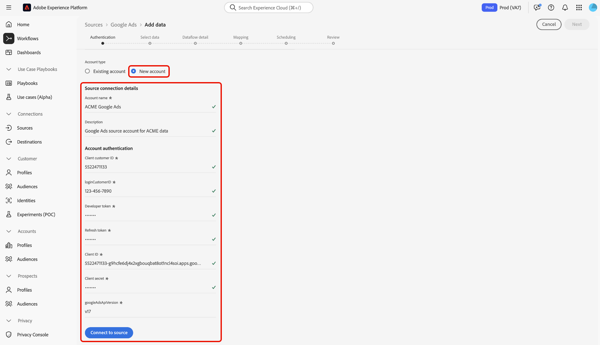

# 使用UI連線[!DNL Google Ads]至Experience Platform

>[!WARNING]
>
>[!DNL Google Ads]來源目前在UI中無法使用。 您可以使用API[&#128279;](../../../api/create/advertising/ads.md)繼續將您的[!DNL Google Ads]資料內嵌至Experience Platform 。

>[!NOTE]
>
>[!DNL Google Ads]來源是測試版。 如需使用Beta版標籤來源的相關資訊，請參閱[來源概觀](../../../../home.md#terms-and-conditions)。

閱讀本指南，瞭解如何使用Experience Platform UI中的來源工作區將您的[!DNL Google Ads]帳戶連結至Adobe Experience Platform。

## 快速入門

本教學課程需要您實際瞭解下列Experience Platform元件：

* [[!DNL Experience Data Model (XDM)] 系統](../../../../../xdm/home.md)： Experience Platform用來組織客戶體驗資料的標準化架構。
   * [結構描述組合的基本概念](../../../../../xdm/schema/composition.md)：瞭解XDM結構描述的基本建置區塊，包括結構描述組合中的關鍵原則和最佳實務。
   * [結構描述編輯器教學課程](../../../../../xdm/tutorials/create-schema-ui.md)：瞭解如何使用結構描述編輯器使用者介面建立自訂結構描述。
* [[!DNL Real-Time Customer Profile]](../../../../../profile/home.md)：根據來自多個來源的彙總資料，提供統一的即時消費者設定檔。

如果您已經有有效的[!DNL Google Ads]連線，您可以略過本檔案的其餘部分，並繼續進行有關[設定資料流](../../dataflow/advertising.md)的教學課程

### 收集必要的認證

如需驗證的詳細資訊，請閱讀[[!DNL Google Ads] 來源概觀](../../../../connectors/advertising/ads.md)。

## 連線您的Google Ads帳戶

在Experience Platform UI中，從左側導覽選取&#x200B;**[!UICONTROL 來源]**&#x200B;以存取&#x200B;*[!UICONTROL 來源]*&#x200B;工作區。 您可以在&#x200B;*[!UICONTROL 類別]*&#x200B;面板中選取適當的類別。 或者，您可以使用搜尋列導覽至您要使用的特定來源。

若要使用[!DNL Google Ads]，請選取&#x200B;*[!UICONTROL Advertising]*&#x200B;下的&#x200B;**[!UICONTROL Google Ads]**&#x200B;來源卡，然後選取&#x200B;**[!UICONTROL 新增資料]**。

。

### 現有帳戶

若要使用現有帳戶，請選取&#x200B;**[!UICONTROL 現有帳戶]**，然後從介面的帳戶清單中選取您要使用的帳戶。

選取您的帳戶後，選取[下一步] **[!UICONTROL 以繼續執行下一步。]**

。

### 新帳戶

如果您沒有現有的帳戶，則必須提供與您來源對應的必要驗證認證，以建立新的帳戶。

若要建立新帳戶，請選取&#x200B;**[!UICONTROL 新帳戶]**，然後提供帳戶名稱，並選擇性地提供帳戶詳細資訊的說明。 接下來，提供適當的驗證值，以針對Experience Platform驗證您的來源：

* **使用者端客戶識別碼**：使用者端客戶識別碼是與您要使用[!DNL Google Ads] API管理的[!DNL Google Ads]使用者端帳戶對應的帳號。 此ID遵循`123-456-7890`的範本。
* **登入客戶ID**：登入客戶ID是與您的[!DNL Google Ads]管理員帳戶對應的帳號，用於從特定的作業客戶擷取報表資料。 如需登入客戶ID的詳細資訊，請閱讀[[!DNL Google Ads] API檔案](https://developers.google.com/search-ads/reporting/concepts/login-customer-id)。
* **開發人員權杖**：開發人員權杖可讓您存取[!DNL Google Ads] API。 您可以使用相同的開發人員Token來針對所有[!DNL Google Ads]帳戶提出要求。 [登入您的管理員帳戶](https://ads.google.com/home/tools/manager-accounts/)，然後導覽至API中心頁面，以擷取您的開發人員權杖。
* **重新整理權杖**：重新整理權杖是[!DNL OAuth2]驗證的一部分。 此權杖可讓您在存取權杖過期後重新產生存取權杖。
* **使用者端識別碼**：使用者端識別碼與使用者端密碼搭配使用，是[!DNL OAuth2]驗證的一部分。 使用者端ID和使用者端密碼可讓您的應用程式透過向[!DNL Google]識別您的應用程式來代表您的帳戶運作。
* **使用者端密碼**：使用者端密碼會與使用者端識別碼搭配使用，作為[!DNL OAuth2]驗證的一部分。 使用者端ID和使用者端密碼可讓您的應用程式透過向[!DNL Google]識別您的應用程式來代表您的帳戶運作。
* **[!DNL Google Ads]API版本**： [!DNL Google Ads]支援的目前API版本。 雖然最新版本為`v18`，但Experience Platform上支援的最新版本為`v17`。

輸入認證之後，請選取&#x200B;**[!UICONTROL 連線至來源]**，並等待一段時間來處理連線。 完成後，選取&#x200B;**[!UICONTROL 下一步]**。

。

## 選取資料 {#select-data}

透過[!DNL Google Ads]，您必須在工作流程的資料選擇階段提供要擷取的屬性清單。 若要擷取這些屬性，您必須使用[[!DNL Google Ads Query Builder]](https://developers.google.com/google-ads/api/fields/v17/overview_query_builder)。

在[!DNL Google Ads Query Builder]中，導覽至您要使用的資源型別，然後使用屬性選取器來選取您的屬性、區段和量度。

您選取的屬性會填入[!DNL Google Ads Query Language]面板。 確定您使用[!DNL Standard]模式，然後選取&#x200B;**[!DNL Enter or edit a query]**。

接著，選取&#x200B;**[!DNL Validate Query]**&#x200B;以驗證您的[!DNL Google Ads]查詢。

如果成功，[!DNL Google Ads Query Builder]會傳回一則訊息，指出您的查詢有效。 接著，從查詢中僅複製&#x200B;**屬性**。

導覽回到Experience Platform UI中來源工作流程的資料選擇階段，然後將屬性貼到&#x200B;*[!UICONTROL 清單屬性]*&#x200B;面板中。

選取&#x200B;**[!UICONTROL 預覽]**&#x200B;以預覽資料，然後選取&#x200B;**[!UICONTROL 下一步]**&#x200B;以繼續。

## 建立資料流以擷取廣告資料

依照本教學課程中的指示，您已建立與Google Ads帳戶的連線。 您現在可以繼續進行下一個教學課程，並[設定資料流以將廣告資料帶入Experience Platform](../../dataflow/advertising.md)。
