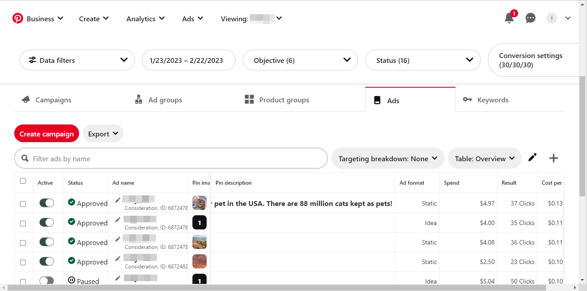

# 在使用者介面中建立[!DNL Pinterest Ads]來源連線

>[!NOTE]
>
>[!DNL Pinterest Ads]來源是測試版。 閱讀[來源概觀](../../../../home.md#terms-and-conditions)，以取得使用測試版標籤之來源的詳細資訊。

本教學課程提供使用Adobe Experience Platform使用者介面建立[!DNL Pinterest Ads]來源聯結器的步驟。

## 快速入門 {#getting-started}

本教學課程需要您實際瞭解下列Experience Platform元件：

* [[!DNL Experience Data Model (XDM)] 系統](../../../../../xdm/home.md)： Experience Platform用來組織客戶體驗資料的標準化架構。
   * [結構描述組合的基本概念](../../../../../xdm/schema/composition.md)：瞭解XDM結構描述的基本建置區塊，包括結構描述組合中的關鍵原則和最佳實務。
   * [結構描述編輯器教學課程](../../../../../xdm/tutorials/create-schema-ui.md)：瞭解如何使用結構描述編輯器使用者介面建立自訂結構描述。
* [[!DNL Real-Time Customer Profile]](../../../../../profile/home.md)：根據來自多個來源的彙總資料，提供統一的即時消費者設定檔。

## 先決條件 {#prerequisites}

為了將[!DNL Pinterest Ads]連線到Experience Platform，您必須提供下列連線屬性的值：

* [!DNL Pinterest]存取權杖。
* [!DNL Pinterest]廣告帳戶識別碼。
* [!DNL Pinterest]行銷活動、廣告群組或廣告ID的其中之一（視需要）。

如需這些連線屬性的詳細資訊，請閱讀[[!DNL Pinterest Ads] 總覽](../../../../connectors/advertising/pinterest-ads.md#prerequisites)。

### 建立Platform結構描述 {#create-platform-schema}

您也必須確保先建立要用於[!DNL Pinterst Ads]來源的Platform結構描述。 閱讀有關[建立Platform結構描述](../../../../../xdm/schema/composition.md)的教學課程，以瞭解如何建立結構描述的完整步驟。


如需[!DNL Pinterest]行銷活動、廣告群組和廣告API支援的欄位清單，請參閱[[!DNL Pinterest] 欄位](#pinterest-fields)區段。

## 連線您的[!DNL Pinterest Ads]帳戶 {#connect-account}

在Platform UI中，從左側導覽列選取&#x200B;**[!UICONTROL 來源]**&#x200B;以存取[!UICONTROL 來源]工作區。 [!UICONTROL 目錄]畫面會顯示您可以用來建立帳戶的各種來源。

您可以從熒幕左側的目錄中選取適當的類別。 或者，您可以使用搜尋選項來尋找您要使用的特定來源。

在&#x200B;*Advertising*&#x200B;類別下，選取&#x200B;**[!UICONTROL Pinterest Ads]**，然後選取&#x200B;**[!UICONTROL 新增資料]**。


**[!UICONTROL 連線Pinterest Ads帳戶]**&#x200B;頁面隨即顯示。 您可以在此頁面使用新的證明資料或現有的證明資料。

### 現有帳戶 {#existing-account}

若要使用現有帳戶，請選取您要用來建立新資料流的[!DNL Pinterest Ads]帳戶，然後選取[下一步] ]**以繼續。**[!UICONTROL 


### 新帳戶 {#new-account}

如果您正在建立新帳戶，請選取&#x200B;**[!UICONTROL 新帳戶]**，然後提供名稱、選擇性說明和您的認證。 完成時，請選取&#x200B;**[!UICONTROL 連線到來源]**，然後等待一段時間以建立新連線。


## 選取資料 {#select-data}

**[!UICONTROL 選取資料]**&#x200B;步驟隨即顯示，提供介面供您輸入資訊，這些資訊會傳遞至API，以將您想要的資料帶入Platform。

| 欄位 | 說明 |
| --- | --- |
| [!UICONTROL ad_account_id] | 您的[!DNL Pinterest Ads]廣告帳戶識別碼。 如果您需要任何指引，請參閱[[!DNL Pinterest] 在廣告管理員](https://help.pinterest.com/en/business/article/find-ids-in-ads-manager)中尋找ID指南。 |
| [!UICONTROL 物件型別] | 根據您要從哪個[!DNL Pinterest]個Analytics API取得資訊，選取&#x200B;**行銷活動**、**廣告群組**&#x200B;或&#x200B;**廣告**&#x200B;其中之一。 |
| [!UICONTROL object_ids] | 所選物件的ID。 導覽至&#x200B;**Pinterest商業中心** > **廣告帳戶摘要** > **行銷活動** / **廣告群組** / **廣告**&#x200B;的[!DNL Pinterest]頁面，並複製每個名稱下方提及的必要ID。 |

>[!TIP]
>
>您可以傳遞逗號分隔值以提供多個`object_ids`。 您可以在單一請求中傳遞的ID數量上限為100。 如果傳遞的值不正確，Platform會顯示下列訊息： `The request could not be processed. Error from flow provider: Unknown error while processing request.`

提供值之後，請選取&#x200B;**[!UICONTROL 選取]**。 如果提供的值有效，將會填入介面的正確部分（預覽資料）。


## 後續步驟 {#next-steps}

依照本教學課程中的指示，您已建立與[!DNL Pinterest Ads]帳戶的連線。 您現在可以繼續進行下一個教學課程，並[設定資料流以將廣告資料帶入Platform](../../dataflow/advertising.md)。

## 其他資源 {#additional-resources}

以下各節提供在使用[!DNL Pinterest Ads]來源時可以參考的其他資源。

## 正在排程 {#scheduling}

排程[!DNL Pinterest Ads]資料流進行內嵌時，您必須選取下列其中一個頻率和間隔設定：

| 頻率 | 間隔 |
| --- | --- |
| `Day` | 1 |
| `Hour` | 24 |

如需排程[!DNL Pinterest Ads]資料流的詳細資訊，請閱讀 [!DNL Pinterest Ads] 總覽](../../../../connectors/advertising/pinterest-ads.md#guardrails)的[護欄區段。

提供排程的值之後，請選取&#x200B;**[!UICONTROL 下一步]**。


### 驗證 {#validation}

若要驗證您已正確設定來源，而且正在擷取[!DNL Pinterest Ads]資料，請遵循下列步驟：

在Platform UI中，選取目錄頁面上[!DNL Pinterest Ads]卡片功能表旁的&#x200B;**[!UICONTROL 檢視資料流程]**。 然後，您可以選取[!UICONTROL 預覽資料集]以驗證所擷取的資料。


您可以根據[!DNL Pinterest] UI上顯示的計數來驗證資料

>[!BEGINTABS]

>[!TAB 行銷活動]


>[!TAB 廣告群組]


>[!TAB 廣告]



>[!ENDTABS]


### [!DNL Pinterest]欄位 {#pinterest-fields}

[!DNL Pinterest]行銷活動、廣告群組和廣告API支援的欄位如下：

+++ 檢視裝載

```json
{
  "items": [
    {
      "name": "AD_GROUP_ID",
      "category": "ADS",
      "definition": "Unique ID for your ad group",
      "display_name": "Ad group ID"
    },
    {
      "name": "AD_ID",
      "category": "ADS",
      "definition": "Unique ID for your ad",
      "display_name": "Ad ID"
    },
    {
      "name": "CAMPAIGN_BOOKING_REFERENCE",
      "category": "ADS",
      "definition": "Campaign booking reference number",
      "display_name": "Campaign booking reference"
    },
    {
      "name": "CAMPAIGN_DAILY_SPEND_CAP",
      "category": "ADS",
      "definition": "The maximum amount you're willing to spend in one day",
      "display_name": "Daily budget"
    },
    {
      "name": "CAMPAIGN_ID",
      "category": "ADS",
      "definition": "Unique ID for your campaign",
      "display_name": "Campaign ID"
    },
    {
      "name": "CAMPAIGN_LIFETIME_SPEND_CAP",
      "category": "ADS",
      "definition": "The maximum amount you're willing to spend over the lifetime of your campaign",
      "display_name": "Lifetime budget"
    },
    {
      "name": "CAMPAIGN_NAME",
      "category": "ADS",
      "definition": "Name, objective and ID of your campaign",
      "display_name": "Campaign name"
    },
    {
      "name": "CHECKOUT_ROAS",
      "category": "ADS",
      "definition": "Average return on ad spend for checkout events. This metric may include conversions that are modeled.",
      "display_name": "ROAS (Checkout)"
    },
    {
      "name": "CLICKTHROUGH_1",
      "category": "ADS",
      "definition": "The total number of clicks on your Pin to content on or off of Pinterest",
      "display_name": "Paid Pin clicks"
    },
    {
      "name": "CLICKTHROUGH_1_GROSS",
      "category": "ADS",
      "definition": "Unfiltered number of times someone clicks your ad (paid)",
      "display_name": "Gross Pin clicks"
    },
    {
      "name": "CLICKTHROUGH_2",
      "category": "ADS",
      "definition": "Total number of Pin clicks from ads saved to another person's board",
      "display_name": "Earned Pin clicks"
    },
    {
      "name": "CPC_IN_MICRO_DOLLAR",
      "category": "ADS",
      "definition": "The cost per click in micro dollars"
    },
    {
      "name": "CPM_IN_DOLLAR",
      "category": "ADS",
      "definition": "Average cost per 1k paid impressions",
      "display_name": "CPM"
    },
    {
      "name": "CPM_IN_MICRO_DOLLAR",
      "category": "ADS",
      "definition": "Cost per thousand first-order impressions in micro dollars"
    },
    {
      "name": "CPW_IN_DOLLAR",
      "category": "ADS",
      "definition": "The cost per web session in dollars"
    },
    {
      "name": "CPW_IN_MICRO_DOLLAR",
      "category": "ADS",
      "definition": "The cost per web session in micro dollars"
    },
    {
      "name": "CTR",
      "category": "ADS",
      "definition": "Paid Pin clicks divided by paid impressions",
      "display_name": "Paid CTR"
    },
    {
      "name": "CTR_2",
      "category": "ADS",
      "definition": "Earned Pin clicks divided by earned impressions",
      "display_name": "Earned CTR"
    },
    {
      "name": "ECPCV_IN_DOLLAR",
      "category": "ADS",
      "definition": "Average cost per video view that was watched to completion",
      "display_name": "CPCV (100%)"
    },
    {
      "name": "ECPCV_P95_IN_DOLLAR",
      "category": "ADS",
      "definition": "Average cost per video that was watched until 95% of its length",
      "display_name": "CPCV (95%)"
    },
    {
      "name": "ECPC_IN_DOLLAR",
      "category": "ADS",
      "definition": "Average cost per click",
      "display_name": "CPC"
    },
    {
      "name": "ECPC_IN_MICRO_DOLLAR",
      "category": "ADS",
      "definition": "Effective CPC (including first-order and downstream clicks) in micro dollars"
    },
    {
      "name": "ECPE_IN_DOLLAR",
      "category": "ADS",
      "definition": "Cost per engagement",
      "display_name": "CPE"
    },
    {
      "name": "ECPM_IN_MICRO_DOLLAR",
      "category": "ADS",
      "definition": "Effective CPM (including first-order and downstream impressions) in micro dollars"
    },
    {
      "name": "ECPV_IN_DOLLAR",
      "category": "ADS",
      "definition": "Average cost per video view",
      "display_name": "CPV"
    },
    {
      "name": "ECTR",
      "category": "ADS",
      "definition": "Total Pin clicks divided by total impressions",
      "display_name": "CTR"
    },
    {
      "name": "EENGAGEMENT_RATE",
      "category": "ADS",
      "definition": "Total engagements divided by total impressions",
      "display_name": "Engagement rate"
    },
    {
      "name": "ENGAGEMENT",
      "category": "ORGANIC",
      "definition": "The total number of engagements on your Pins. This includes saves, Pin clicks, outbound clicks, carousel card swipes, secondary creative (collections) clicks and Idea Pin forward/backward swipes.",
      "display_name": "Engagement"
    },
    {
      "name": "ENGAGEMENT_1",
      "category": "ADS",
      "definition": "Paid actions taken as a result of your ads",
      "display_name": "Paid engagements"
    },
    {
      "name": "ENGAGEMENT_2",
      "category": "ADS",
      "definition": "Earned actions from ads saved to boards",
      "display_name": "Earned engagements"
    },
    {
      "name": "ENGAGEMENT_RATE",
      "category": "ADS",
      "definition": "Paid engagements divided by paid impressions"
    },
    {
      "name": "ENGAGEMENT_RATE",
      "category": "ORGANIC",
      "definition": "The total engagements with your Pins divided by the total number of times your Pins were seen. Engagements include saves, Pin clicks, and outbound clicks.",
      "display_name": "Engagement rate"
    },
    {
      "name": "IDEA_PIN_PAGE_BACKWARD_1",
      "category": "ADS",
      "definition": "The number of times someone goes back to a previous page within an Idea Pin you promoted"
    },
    {
      "name": "IDEA_PIN_PAGE_BACKWARD_2",
      "category": "ADS",
      "definition": "The number of times someone goes back to a previous page within your Idea Pin on someone else's board"
    },
    {
      "name": "IDEA_PIN_PAGE_FORWARD_1",
      "category": "ADS",
      "definition": "The number of times someone advances to a new page within an Idea Pin you promoted"
    },
    {
      "name": "IDEA_PIN_PAGE_FORWARD_2",
      "category": "ADS",
      "definition": "The number of times someone advances to a new page within your Idea Pin on someone else's board"
    },
    {
      "name": "IDEA_PIN_PRODUCT_TAG_VISIT_1",
      "category": "ADS",
      "definition": "The number of times someone taps on a product tagged within an Idea Pin you promoted"
    },
    {
      "name": "IDEA_PIN_PRODUCT_TAG_VISIT_2",
      "category": "ADS",
      "definition": "The number of times someone taps on a product tagged within an Idea ad saved to another person's board"
    },
    {
      "name": "IMPRESSION",
      "category": "ORGANIC",
      "definition": "The number of times your Pins were on screen.",
      "display_name": "Impressions"
    },
    {
      "name": "IMPRESSION_1",
      "category": "ADS",
      "definition": "The number of times your ad was seen",
      "display_name": "Paid impressions"
    },
    {
      "name": "IMPRESSION_1_GROSS",
      "category": "ADS",
      "definition": "Unfiltered number of times your ad was on screen (paid)",
      "display_name": "Gross impressions"
    },
    {
      "name": "IMPRESSION_2",
      "category": "ADS",
      "definition": "Total number of times your ad was viewed after being saved to another person's board",
      "display_name": "Earned impressions"
    },
    {
      "name": "INAPP_CHECKOUT_COST_PER_ACTION",
      "category": "ADS",
      "definition": "Average cost per in-app checkout event",
      "display_name": "In-app CPA (Checkout)"
    },
    {
      "name": "OUTBOUND_CLICK",
      "category": "ORGANIC",
      "definition": "The number of times people perform actions that lead them to a destination off Pinterest.",
      "display_name": "Outbound clicks"
    },
    {
      "name": "OUTBOUND_CLICK_1",
      "category": "ADS",
      "definition": "The total number of clicks to the destination URL associated with your ad",
      "display_name": "Paid outbound clicks"
    },
    {
      "name": "OUTBOUND_CLICK_2",
      "category": "ADS",
      "definition": "The total number of clicks to the destination URL associated with your ad saved to another person's board",
      "display_name": "Earned outbound clicks"
    },
    {
      "name": "OUTBOUND_CLICK_RATE",
      "category": "ORGANIC",
      "definition": "The total number of clicks to the destination URL associated with your Pin divided by the total number of times your Pins were on screen.",
      "display_name": "Outbound click rate"
    },
    {
      "name": "PAGE_VISIT_COST_PER_ACTION",
      "category": "ADS",
      "definition": "Average cost per page visit event. This metric may include conversions that are modeled.",
      "display_name": "CPA (Page visit)"
    },
    {
      "name": "PAGE_VISIT_ROAS",
      "category": "ADS",
      "definition": "Average return on ad spend for page visit events. This metric may include conversions that are modeled.",
      "display_name": "ROAS (Page visit)"
    },
    {
      "name": "PAID_IMPRESSION",
      "category": "ADS",
      "definition": "The number of impressions that you paid for",
      "display_name": "Paid Impressions"
    },
    {
      "name": "PINTEREST_CHECKOUT_COST_PER_ACTION",
      "category": "ADS",
      "definition": "Average cost per Pinterest checkout event",
      "display_name": "Pinterest CPA (Checkout)"
    },
    {
      "name": "PINTEREST_CHECKOUT_ROAS",
      "category": "ADS",
      "definition": "Average return on ad spend for Pinterest checkout events",
      "display_name": "Pinterest ROAS (Checkout)"
    },
    {
      "name": "PIN_CLICK",
      "category": "ORGANIC",
      "definition": "The total number of clicks on your Pin so it opens in closeup.",
      "display_name": "Pin click"
    },
    {
      "name": "PIN_CLICK_RATE",
      "category": "ORGANIC",
      "definition": "The total number of clicks from your Pin to content on or off Pinterest, divided by the total number of times your Pins were on screen.",
      "display_name": "Pin click rate"
    },
    {
      "name": "PIN_ID",
      "category": "ADS",
      "definition": "Thumbnail of your ad's image or video",
      "display_name": "Organic pin ID"
    },
    {
      "name": "PIN_PROMOTION_ID",
      "category": "ADS",
      "definition": "Unique ID for your ad",
      "display_name": "Ad ID"
    },
    {
      "name": "QUARTILE_95_PERCENT_VIEW",
      "category": "ORGANIC",
      "definition": "The number of times your video was viewed to 95% of its length.",
      "display_name": "Played to 95%"
    },
    {
      "name": "REPIN_1",
      "category": "ADS",
      "definition": "Total number of saves for your ad",
      "display_name": "Paid saves"
    },
    {
      "name": "REPIN_2",
      "category": "ADS",
      "definition": "Number of times your ad was saved from another person's board",
      "display_name": "Earned saves"
    },
    {
      "name": "REPIN_RATE",
      "category": "ADS",
      "definition": "Paid saves divided by paid impressions",
      "display_name": "Paid save rate"
    },
    {
      "name": "SAVE",
      "category": "ORGANIC",
      "definition": "The number of times people saved your Pin to a board.",
      "display_name": "Saves"
    },
    {
      "name": "SAVE_RATE",
      "category": "ORGANIC",
      "definition": "The total saves of your Pins divided by the total number of times your Pins were on screen.",
      "display_name": "Save rate"
    },
    {
      "name": "SPEND_IN_DOLLAR",
      "category": "ADS",
      "definition": "Total amount you've spent during the reporting time period",
      "display_name": "Spend"
    },
    {
      "name": "SPEND_IN_MICRO_DOLLAR",
      "category": "ADS",
      "definition": "The money you spend for promoted Pins, in micro dollars",
      "display_name": "Spend in account currency"
    },
    {
      "name": "SPEND_IN_MICRO_US_DOLLAR",
      "category": "ADS",
      "definition": "The money you spend for promoted Pins, in micro USD",
      "display_name": "Spend in micro USD"
    },
    {
      "name": "SPEND_IN_US_DOLLAR",
      "category": "ADS",
      "definition": "Total amount you've spent during the reporting time period (in USD)",
      "display_name": "Spend In USD"
    },
    {
      "name": "TOTAL_CHECKOUT",
      "category": "ADS",
      "definition": "Total number of checkout events that resulted from interactions with your ad. This metric may include conversions that are modeled.",
      "display_name": "Conversions (Checkout)"
    },
    {
      "name": "TOTAL_CHECKOUT_VALUE_IN_MICRO_DOLLAR",
      "category": "ADS",
      "definition": "Total value of checkout events resulting from interactions with your ad. This metric may include conversions that are modeled.",
      "display_name": "Order value (Checkout)"
    },
    {
      "name": "TOTAL_CLICKTHROUGH",
      "category": "ADS",
      "definition": "The total number of clicks on your Pin to content on or off of Pinterest (paid and earned)",
      "display_name": "Pin clicks"
    },
    {
      "name": "TOTAL_CLICK_ADD_TO_CART",
      "category": "ADS",
      "definition": "The number of add to cart events resulting from clicks on your ad. This metric may include conversions that are modeled.",
      "display_name": "Click-through conversions (Add to cart)"
    },
    {
      "name": "TOTAL_CLICK_CHECKOUT",
      "category": "ADS",
      "definition": "Total number of checkout events resulting from clicks on your ad. This metric may include conversions that are modeled.",
      "display_name": "Click-through conversions (Checkout)"
    },
    {
      "name": "TOTAL_CLICK_CHECKOUT_VALUE_IN_MICRO_DOLLAR",
      "category": "ADS",
      "definition": "Total value of checkout events resulting from clicks on your ad. This metric may include conversions that are modeled.",
      "display_name": "Click-through order value (Checkout)"
    },
    {
      "name": "TOTAL_CLICK_LEAD",
      "category": "ADS",
      "definition": "Total number of lead events resulting from clicks on your ad. This metric may include conversions that are modeled.",
      "display_name": "Click-through conversions (Lead)"
    },
    {
      "name": "TOTAL_CLICK_SIGNUP",
      "category": "ADS",
      "definition": "Number of signup events resulting from clicks on your ad. This metric may include conversions that are modeled.",
      "display_name": "Click-through conversions (Signup)"
    },
    {
      "name": "TOTAL_CLICK_SIGNUP_VALUE_IN_MICRO_DOLLAR",
      "category": "ADS",
      "definition": "Total value of signup events resulting from clicks on your ad. This metric may include conversions that are modeled.",
      "display_name": "Click-through value (Signup)"
    },
    {
      "name": "TOTAL_CONVERSIONS",
      "category": "ADS",
      "definition": "Total number of conversions for all event types using the Pinterest Tag integration after an ad interaction. This metric may include conversions that are modeled.",
      "display_name": "Conversions"
    },
    {
      "name": "TOTAL_CUSTOM",
      "category": "ADS",
      "definition": "Total number of custom events resulting from interactions with your ad. This metric may include conversions that are modeled.",
      "display_name": "Conversions (Custom)"
    },
    {
      "name": "TOTAL_ENGAGEMENT",
      "category": "ADS",
      "definition": "The total number of engagements on your ads, including clicks, saves, carousel swipes, and collections secondary saves",
      "display_name": "Engagements"
    },
    {
      "name": "TOTAL_ENGAGEMENT_CHECKOUT",
      "category": "ADS",
      "definition": "Total number of checkout events resulting from engagements with your ad. Engagements includes saves, closeups, carousel swipes, collection secondary closeups, and collection secondary saves. This metric may include conversions that are modeled.",
      "display_name": "Engagement conversions (Checkout)"
    },
    {
      "name": "TOTAL_ENGAGEMENT_CHECKOUT_VALUE_IN_MICRO_DOLLAR",
      "category": "ADS",
      "definition": "Total value of checkout events resulting from engagements with your ad. Engagements includes saves, closeups, carousel swipes, collection secondary closeups, and collection secondary saves. This metric may include conversions that are modeled.",
      "display_name": "Engagement order value (Checkout)"
    },
    {
      "name": "TOTAL_ENGAGEMENT_LEAD",
      "category": "ADS",
      "definition": "Total number of lead events resulting from engagement with your ad. Engagements includes saves, closeups, carousel swipes, collection secondary closeups, and collection secondary saves. This metric may include conversions that are modeled.",
      "display_name": "Engagement conversions (Lead)"
    },
    {
      "name": "TOTAL_ENGAGEMENT_SIGNUP",
      "category": "ADS",
      "definition": "Total number of signup events resulting from engagements with your ad. Engagements includes saves, closeups, carousel swipes, collection secondary closeups, and collection secondary saves. This metric may include conversions that are modeled.",
      "display_name": "Engagement conversions (Signup)"
    },
    {
      "name": "TOTAL_ENGAGEMENT_SIGNUP_VALUE_IN_MICRO_DOLLAR",
      "category": "ADS",
      "definition": "Total value of signup events resulting from engagements with your ad. Engagements includes saves, closeups, carousel swipes, collection secondary closeups, and collection secondary saves. This metric may include conversions that are modeled.",
      "display_name": "Engagement value (Signup)"
    },
    {
      "name": "TOTAL_IDEA_PIN_PAGE_BACKWARD",
      "category": "ADS",
      "definition": "The total number of times someone goes back to a previous page within an Idea Pin, including paid and earned",
      "display_name": "Total Idea Pin page backward"
    },
    {
      "name": "TOTAL_IDEA_PIN_PAGE_FORWARD",
      "category": "ADS",
      "definition": "The total number of times someone advances to a new page within an Idea Pin, including paid and earned",
      "display_name": "Total Idea Pin page forward"
    },
    {
      "name": "TOTAL_IDEA_PIN_PRODUCT_TAG_VISIT",
      "category": "ADS",
      "definition": "The number of times someone taps on a product tagged within an Idea Pin, paid and earned.",
      "display_name": "Total Idea Pin product tag visits"
    },
    {
      "name": "TOTAL_IMPRESSION_FREQUENCY",
      "category": "ADS",
      "definition": "The average number of times each user saw your ad.",
      "display_name": "Frequency"
    },
    {
      "name": "TOTAL_IMPRESSION_USER",
      "category": "ADS",
      "definition": "Total number of unique users who saw your ads",
      "display_name": "Reach"
    },
    {
      "name": "TOTAL_LEAD",
      "category": "ADS",
      "definition": "Total number of lead events resulting from interactions with your ad. This metric may include conversions that are modeled.",
      "display_name": "Conversions (Lead)"
    },
    {
      "name": "TOTAL_OFFLINE_CHECKOUT",
      "category": "ADS",
      "definition": "Total number of offline checkout events resulting from clicks on your ad",
      "display_name": "Offline conversions (Checkout)"
    },
    {
      "name": "TOTAL_PAGE_VISIT",
      "category": "ADS",
      "definition": "Total number of page visit events resulting from interactions with your ad. This metric may include conversions that are modeled.",
      "display_name": "Conversions (Page visit)"
    },
    {
      "name": "TOTAL_PINTEREST_CHECKOUT",
      "category": "ADS",
      "definition": "Total number of Pinterest checkout events resulting from clicks on your ad",
      "display_name": "Pinterest conversions (Checkout)"
    },
    {
      "name": "TOTAL_PINTEREST_CHECKOUT_VALUE_IN_MICRO_DOLLAR",
      "category": "ADS",
      "definition": "Total value of Pinterest checkout events resulting from interactions with your ad",
      "display_name": "Pinterest order value (Checkout)"
    },
    {
      "name": "TOTAL_REPIN_RATE",
      "category": "ADS",
      "definition": "Total saves divided by total impressions",
      "display_name": "Total save rate"
    },
    {
      "name": "TOTAL_SIGNUP",
      "category": "ADS",
      "definition": "Total number of signup events resulting from interactions with your ad. This metric may include conversions that are modeled.",
      "display_name": "Conversions (Signup)"
    },
    {
      "name": "TOTAL_SIGNUP_VALUE_IN_MICRO_DOLLAR",
      "category": "ADS",
      "definition": "Total value of signup events resulting from interactions with your ad. This metric may include conversions that are modeled.",
      "display_name": "Value (Signup)"
    },
    {
      "name": "TOTAL_VIDEO_3SEC_VIEWS",
      "category": "ADS",
      "definition": "Total number of times your video ad played continuously for at least 3 seconds while 50% visible (paid and earned)",
      "display_name": "Total 3-Second Video Views"
    },
    {
      "name": "TOTAL_VIDEO_AVG_WATCHTIME_IN_SECOND",
      "category": "ADS",
      "definition": "Averaged across all videos that begin playback, including seeks and loops. Start time triggered when video begins playback.",
      "display_name": "Average Watch Time In Seconds"
    },
    {
      "name": "TOTAL_VIDEO_MRC_VIEWS",
      "category": "ADS",
      "definition": "Total number of times your video ad played continuously for at least 2 seconds while 50% visible (paid and earned)",
      "display_name": "Video views"
    },
    {
      "name": "TOTAL_VIDEO_P0_COMBINED",
      "category": "ADS",
      "definition": "Total number of times your video ad started playing (paid and earned)",
      "display_name": "Total video starts"
    },
    {
      "name": "TOTAL_VIDEO_P100_COMPLETE",
      "category": "ADS",
      "definition": "Total number of times your video ad played 100% of its length, including views that skipped ahead to this point (paid and earned)",
      "display_name": "Total video played at 100%"
    },
    {
      "name": "TOTAL_VIDEO_P25_COMBINED",
      "category": "ADS",
      "definition": "Total number of times your video ad played 25% of its length, including views that skipped ahead to this point (paid and earned)",
      "display_name": "Total video played at 25%"
    },
    {
      "name": "TOTAL_VIDEO_P50_COMBINED",
      "category": "ADS",
      "definition": "Total number of times your video ad played 50% of its length, including views that skipped ahead to this point (paid and earned)",
      "display_name": "Total video played at 50%"
    },
    {
      "name": "TOTAL_VIDEO_P75_COMBINED",
      "category": "ADS",
      "definition": "Total number of times your video ad played 75% of its length, including views that skipped ahead to this point (paid and earned)",
      "display_name": "Total video played at 75%"
    },
    {
      "name": "TOTAL_VIDEO_P95_COMBINED",
      "category": "ADS",
      "definition": "Total number of times your video ad played 95% of its length, including views that skipped ahead to this point (paid and earned)",
      "display_name": "Total video played at 95%"
    },
    {
      "name": "TOTAL_VIEW_ADD_TO_CART",
      "category": "ADS",
      "definition": "Total number of add to cart events resulting from views of your ad. This metric may include conversions that are modeled.",
      "display_name": "View-through conversions (Add to cart)"
    },
    {
      "name": "TOTAL_VIEW_CHECKOUT",
      "category": "ADS",
      "definition": "Total number of checkout events resulting from views of your ad. This metric may include conversions that are modeled.",
      "display_name": "View-through conversions (Checkout)"
    },
    {
      "name": "TOTAL_VIEW_CHECKOUT_VALUE_IN_MICRO_DOLLAR",
      "category": "ADS",
      "definition": "Total value of checkout events resulting from views of your ad. This metric may include conversions that are modeled.",
      "display_name": "View-through order value (Checkout)"
    },
    {
      "name": "TOTAL_VIEW_LEAD",
      "category": "ADS",
      "definition": "Total number of lead events resulting from views of your ad. This metric may include conversions that are modeled.",
      "display_name": "View-through conversions (Lead)"
    },
    {
      "name": "TOTAL_VIEW_SIGNUP",
      "category": "ADS",
      "definition": "Number of signup events resulting from views of your ad. This metric may include conversions that are modeled.",
      "display_name": "View-through conversions (Signup)"
    },
    {
      "name": "TOTAL_VIEW_SIGNUP_VALUE_IN_MICRO_DOLLAR",
      "category": "ADS",
      "definition": "Total value of signup events resulting from views of your ad. This metric may include conversions that are modeled.",
      "display_name": "View-through value (Signup)"
    },
    {
      "name": "TOTAL_WEB_CHECKOUT",
      "category": "ADS",
      "definition": "Total number of web checkout events resulting from clicks on your ad. This metric may include conversions that are modeled.",
      "display_name": "Web conversions (Checkout)"
    },
    {
      "name": "TOTAL_WEB_CHECKOUT_VALUE_IN_MICRO_DOLLAR",
      "category": "ADS",
      "definition": "Total value of web checkout events resulting from interactions with your ad. This metric may include conversions that are modeled.",
      "display_name": "Web order value (Checkout)"
    },
    {
      "name": "TOTAL_WEB_CLICK_CHECKOUT",
      "category": "ADS",
      "definition": "Total number of web checkout events resulting from clicks on your ad. This metric may include conversions that are modeled.",
      "display_name": "Web click-through conversions (Checkout)"
    },
    {
      "name": "TOTAL_WEB_CLICK_CHECKOUT_VALUE_IN_MICRO_DOLLAR",
      "category": "ADS",
      "definition": "Total value of web checkout events resulting from clicks on your ad. This metric may include conversions that are modeled.",
      "display_name": "Web click-through order value (Checkout)"
    },
    {
      "name": "TOTAL_WEB_ENGAGEMENT_CHECKOUT",
      "category": "ADS",
      "definition": "Total number of web checkout events resulting from engagements with your ad (save, closeup or carousel swipe). This metric may include conversions that are modeled.",
      "display_name": "Web engagement conversions (Checkout)"
    },
    {
      "name": "TOTAL_WEB_ENGAGEMENT_CHECKOUT_VALUE_IN_MICRO_DOLLAR",
      "category": "ADS",
      "definition": "Total value of web checkout events resulting from engagements with your ad (save, closeup or carousel swipe). This metric may include conversions that are modeled.",
      "display_name": "Web engagement order value (Checkout)"
    },
    {
      "name": "TOTAL_WEB_SESSIONS",
      "category": "ADS",
      "definition": "Total number of sessions loaded in a browser",
      "display_name": "Web sessions"
    },
    {
      "name": "TOTAL_WEB_VIEW_CHECKOUT",
      "category": "ADS",
      "definition": "Total number of web checkout events resulting from views of your ad. This metric may include conversions that are modeled.",
      "display_name": "Web view-through conversions (Checkout)"
    },
    {
      "name": "TOTAL_WEB_VIEW_CHECKOUT_VALUE_IN_MICRO_DOLLAR",
      "category": "ADS",
      "definition": "Total value of web checkout events resulting from views of your ad. This metric may include conversions that are modeled.",
      "display_name": "Web view-through order value (Checkout)"
    },
    {
      "name": "VIDEO_10S_VIEW",
      "category": "ORGANIC",
      "definition": "The number of times your video was viewed for at least 10 seconds.",
      "display_name": "10-second plays"
    },
    {
      "name": "VIDEO_3SEC_VIEWS_2",
      "category": "ADS",
      "definition": "The number of times your video ad played continuously for 3 seconds while 50% in view after being saved to another person's board",
      "display_name": "Earned 3-Second Video Views"
    },
    {
      "name": "VIDEO_AVG_WATCH_TIME",
      "category": "ORGANIC",
      "definition": "The average time someone spent playing the video and static image cards included in your pin.",
      "display_name": "Average video play time"
    },
    {
      "name": "VIDEO_LENGTH",
      "category": "ADS",
      "definition": "Runtime of your video ad",
      "display_name": "Video length"
    },
    {
      "name": "VIDEO_MRC_VIEW",
      "category": "ORGANIC",
      "definition": "The amount of views for at least 2 seconds with 50% of video in view.",
      "display_name": "Video views"
    },
    {
      "name": "VIDEO_MRC_VIEWS_2",
      "category": "ADS",
      "definition": "The number of times your video ad played continuously for 2 seconds while 50% in view after being saved to another person's board",
      "display_name": "Earned video views"
    },
    {
      "name": "VIDEO_P0_COMBINED_2",
      "category": "ADS",
      "definition": "Total number of times your video ad started playing after it was saved to another person's board",
      "display_name": "Earned video starts"
    },
    {
      "name": "VIDEO_P100_COMPLETE_2",
      "category": "ADS",
      "definition": "Total number of times your video ad reached 100% of its length after it was saved to another person's board, including views that skipped ahead to this point",
      "display_name": "Earned video played at 100%"
    },
    {
      "name": "VIDEO_P25_COMBINED_2",
      "category": "ADS",
      "definition": "Total number of times your video ad reached 25% of its length after it was saved to another person's board, including views that skipped ahead to this point",
      "display_name": "Earned video played at 25%"
    },
    {
      "name": "VIDEO_P50_COMBINED_2",
      "category": "ADS",
      "definition": "Total number of times your video ad reached 50% of its length after it was saved to another person's board, including views that skipped ahead to this point",
      "display_name": "Earned video played at 50%"
    },
    {
      "name": "VIDEO_P75_COMBINED_2",
      "category": "ADS",
      "definition": "Total number of times your video ad reached 75% of its length after it was saved to another person's board, including views that skipped ahead to this point",
      "display_name": "Earned video played at 75%"
    },
    {
      "name": "VIDEO_P95_COMBINED_2",
      "category": "ADS",
      "definition": "Total number of times your video ad reached 95% of its length after it was saved to another person's board, including views that skipped ahead to this point",
      "display_name": "Earned video played at 95%"
    },
    {
      "name": "VIDEO_START",
      "category": "ORGANIC",
      "definition": "Total number of video starts."
    },
    {
      "name": "VIDEO_V50_WATCH_TIME",
      "category": "ORGANIC",
      "definition": "The total play time for your video in minutes.",
      "display_name": "Total play time (minutes)"
    },
    {
      "name": "WEB_CHECKOUT_COST_PER_ACTION",
      "category": "ADS",
      "definition": "Average cost per web checkout event. This metric may include conversions that are modeled.",
      "display_name": "Web CPA (Checkout)"
    },
    {
      "name": "WEB_CHECKOUT_ROAS",
      "category": "ADS",
      "definition": "Average return on ad spend for web checkout events. This metric may include conversions that are modeled.",
      "display_name": "Web ROAS (Checkout)"
    },
    {
      "name": "WEB_SESSIONS_1",
      "category": "ADS",
      "definition": "Number of paid sessions loaded in a browser",
      "display_name": "Paid web sessions"
    },
    {
      "name": "WEB_SESSIONS_2",
      "category": "ADS",
      "definition": "Number of earned sessions loaded in a browser",
      "display_name": "Earned web sessions"
    }
  ]
}
```

+++
