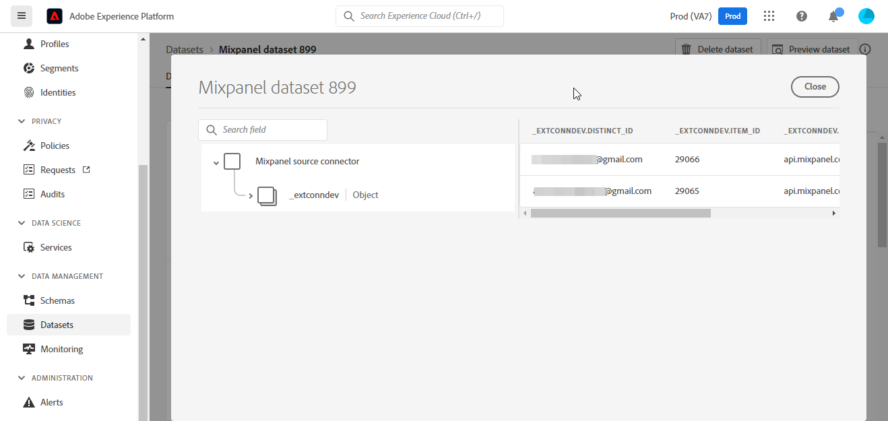
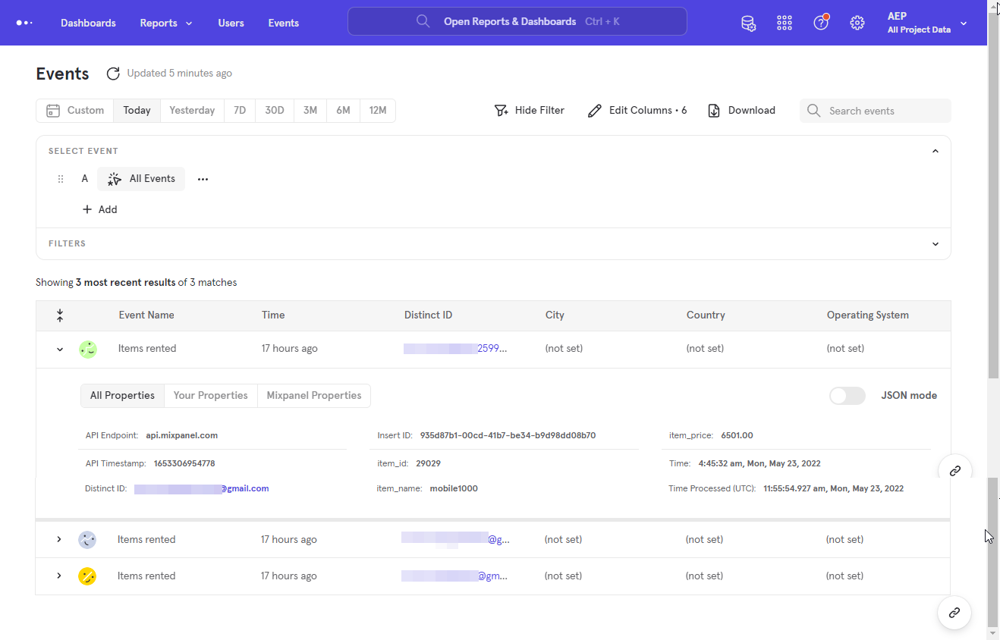

# 建立 [!DNL Mixpanel] ui中的來源連線

本教學課程提供建立 [!DNL Mixpanel] 使用Adobe Experience Platform平台使用者介面的來源連線。

## 快速入門

本教學課程需要您實際瞭解下列Experience Platform元件：

* [[!DNL Experience Data Model (XDM)] 系統](../../../../../xdm/home.md)：作為依據的標準化架構 [!DNL Experience Platform] 組織客戶體驗資料。
   * [結構描述組合基本概念](../../../../../xdm/schema/composition.md)：瞭解XDM結構描述的基本建置區塊，包括結構描述組合中的關鍵原則和最佳實務。
   * [結構描述編輯器教學課程](../../../../../xdm/tutorials/create-schema-ui.md)：瞭解如何使用結構編輯器UI建立自訂結構描述。
* [[!DNL Real-Time Customer Profile]](../../../../../profile/home.md)：根據來自多個來源的彙總資料，提供統一的即時消費者個人檔案。

### 收集必要的認證

為了連線 [!DNL Mixpanel] 至Platform，您必須提供下列連線屬性的值：

| 認證 | 說明 | 範例 |
| --- | --- | --- |
| 使用者名稱 | 與您的帳戶對應的服務帳戶使用者名稱 [!DNL Mixpanel] 帳戶。 請參閱 [[!DNL Mixpanel] 服務帳戶檔案](https://developer.mixpanel.com/reference/service-accounts#authenticating-with-a-service-account) 以取得詳細資訊。 | `Test8.6d4ee7.mp-service-account` |
| 密碼 | 與您的帳戶對應的服務帳戶密碼 [!DNL Mixpanel] 帳戶。 | `dLlidiKHpCZtJhQDyN2RECKudMeTItX1` |
| 專案 ID | 您的 [!DNL Mixpanel] 專案ID。 建立來源連線需要此ID。 請參閱 [[!DNL Mixpanel] 專案設定檔案](https://help.mixpanel.com/hc/en-us/articles/115004490503-Project-Settings) 和 [[!DNL Mixpanel] 建立和管理專案的指南](https://help.mixpanel.com/hc/en-us/articles/115004505106-Create-and-Manage-Projects) 以取得詳細資訊。 | `2384945` |
| 時區 | 與您的時區對應的時區 [!DNL Mixpanel] 專案。 需要時區才能建立來源連線。 請參閱 [Mixpanel專案設定檔案](https://help.mixpanel.com/hc/en-us/articles/115004490503-Project-Settings) 以取得詳細資訊。 | `Pacific Standard Time` |

如需驗證 [!DNL Mixpanel] 來源，請參閱 [[!DNL Mixpanel] 來源概觀](../../../../connectors/analytics/mixpanel.md).

## 連線您的 [!DNL Mixpanel] 帳戶

在Platform UI中選取 **[!UICONTROL 來源]** 從左側導覽列存取 [!UICONTROL 來源] 工作區。 此 [!UICONTROL 目錄] 畫面會顯示各種來源，供您建立帳戶。

您可以從熒幕左側的目錄中選取適當的類別。 或者，您可以使用搜尋選項來尋找您要使用的特定來源。

在 *Analytics* 類別，選取 [!DNL Mixpanel]，然後選取 **[!UICONTROL 新增資料]**.

此 **[!UICONTROL 連線Mixpanel帳戶]** 頁面便會顯示。 您可以在此頁面使用新的證明資料或現有的證明資料。

### 現有帳戶

若要使用現有帳戶，請選取 [!DNL Mixpanel] 要用來建立新資料流的帳戶，然後選取 **[!UICONTROL 下一個]** 以繼續進行。

### 新帳戶

如果您要建立新帳戶，請選取 **[!UICONTROL 新帳戶]**，然後提供名稱、選擇性說明和您的認證。 完成後，選取 **[!UICONTROL 連線到來源]** 然後等待一段時間以建立新連線。

## 選取您的專案 ID 和時區 {#project-id-and-timezone}

>[!CONTEXTUALHELP]
>id="platform_sources_mixpanel_timezone"
>title="設定 Mixpanel 擷取的時區"
>abstract="該時區必須和您的 Mixpanel 設定檔時區設定相同，因為平台會使用指定的專案時區從 Mixpanel 擷取相關資料。將事件記錄到 Mixpanel 資料存放區之前，Mixpanel 會調整其時區以和您的專案時區協調一致。"
>additional-url="https://experienceleague.adobe.com/docs/experience-platform/sources/ui-tutorials/create/analytics/mixpanel.html#project-id-and-timezone" text="如需了解詳細資訊，請參閱文件"

來源通過驗證後，請提供您的專案ID和時區，然後選取 **[!UICONTROL 選取]**.

擷取之前您指定的時區 [!DNL Mixpanel] 資料至Platform必須與您的 [!DNL Mixpanel] 設定檔時區設定。 資料時區的所有變更只會套用至新事件，而舊事件將保留在您先前指定的時區。 [!DNL Mixpanel] 採用日光節約時間，並適當調整您的擷取時間戳記。 如需時區如何影響資料的詳細資訊，請參閱 [!DNL Mixpanel] 指南： [管理專案的時區](https://help.mixpanel.com/hc/en-us/articles/115004547203-Manage-Timezones-for-Projects-in-Mixpanel).

幾分鐘後，正確的介面會更新為預覽面板，可讓您在建立資料流之前檢查您的結構描述。 完成後，選取 **[!UICONTROL 下一個]**.

## 後續步驟

依照本教學課程中的指示，您已建立與的連線， [!DNL Mixpanel] 帳戶。 您現在可以繼續進行下一個教學課程及 [設定資料流以將分析資料匯入Platform](../../dataflow/analytics.md).

## 其他資源 {#additional-resources}

以下各節提供您在使用時，可參考的其他資源 [!DNL Mixpanel] 來源。

### 驗證 {#validation}

以下概述驗證您已成功連線至您的主機時可採取的步驟。 [!DNL Mixpanel] 來源及 [!DNL Mixpanel] 事件正在擷取至Platform。

在Platform UI中選取 **[!UICONTROL 資料集]** 從左側導覽列存取 [!UICONTROL 資料集] 工作區。 此 [!UICONTROL 資料集活動] 畫面會顯示執行的詳細資訊。

接著，選取您要檢視之資料流程的資料流程執行ID，以檢視有關該資料流程執行的特定詳細資訊。

最後，選取 **[!UICONTROL 預覽資料集]** 以顯示所擷取的資料。

您可以根據 [!DNL Mixpanel] > [!DNL Events] 頁面。 請參閱 [[!DNL Mixpanel] 事件相關檔案](https://help.mixpanel.com/hc/en-us/articles/4402837164948-Events-formerly-Live-View-) 以取得詳細資訊。

### Mixpanel結構描述

下表列出必須為設定的支援對應 [!DNL Mixpanel].

>[!TIP]
>
>另請參閱 [事件匯出API >下載](https://developer.mixpanel.com/reference/raw-event-export) 以取得有關API的詳細資訊。

| 來源 | 類型 |
|---|---|
| `distinct_id` | 字串 |
| `event_name` | 字串 |
| `import` | 布林值 |
| `insert_id` | 字串 |
| `item_id` | 字串 |
| `item_name` | 字串 |
| `item_price` | 字串 |
| `mp_api_endpoint` | 字串 |
| `mp_api_timestamp_ms` | 整數 |
| `mp_processing_time_ms` | 整數 |
| `time` | 整數 |

### 限制 {#limits}

* 您每小時最多有100個同時查詢和60個查詢，如 [匯出API速率限制](https://help.mixpanel.com/hc/en-us/articles/115004602563-Rate-Limits-for-API-Endpoints).
